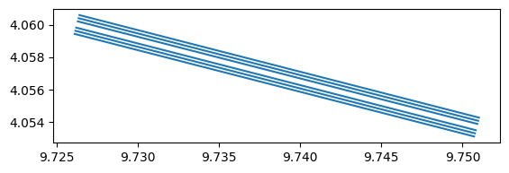

# Convert CML data


<!-- WARNING: THIS FILE WAS AUTOGENERATED! DO NOT EDIT! -->

``` python
cml = open_cml_sample()
```

## Convert sublinks to GeoDataFrame

When a CML has multiple sublinks, they share the same geometry. To
visualize them distinctly on a map, we offset each sublink
**perpendicularly** to the link direction using the normal vector of the
line. Sublinks alternate on each side of the original link, spreading
outward.

<div>

> **Warning**
>
> The perpendicular offset is applied in degrees of longitude/latitude.
> Near the equator, 1° of longitude ≈ 1° of latitude ≈ 111 km, so the
> default offset of `2e-4°` ≈ 20 m. At higher latitudes, degrees of
> longitude shrink (by a factor of `cos(latitude)`), so the same offset
> in degrees will correspond to a different physical distance.

</div>

``` python
cml_df = cml_df.dropna(subset=["site_0_lat", "site_0_lon", "site_1_lat", "site_1_lon", "frequency"], how="any")
cml_df.head(2)
```

<div>
<style scoped>
    .dataframe tbody tr th:only-of-type {
        vertical-align: middle;
    }
&#10;    .dataframe tbody tr th {
        vertical-align: top;
    }
&#10;    .dataframe thead th {
        text-align: right;
    }
</style>

<table class="dataframe" data-quarto-postprocess="true" data-border="1">
<thead>
<tr style="text-align: right;">
<th data-quarto-table-cell-role="th"></th>
<th data-quarto-table-cell-role="th">cml_id</th>
<th data-quarto-table-cell-role="th">sublink_id</th>
<th data-quarto-table-cell-role="th">frequency</th>
<th data-quarto-table-cell-role="th">site_0_lat</th>
<th data-quarto-table-cell-role="th">site_0_lon</th>
<th data-quarto-table-cell-role="th">site_1_lat</th>
<th data-quarto-table-cell-role="th">site_1_lon</th>
<th data-quarto-table-cell-role="th">transmitter</th>
<th data-quarto-table-cell-role="th">length</th>
</tr>
</thead>
<tbody>
<tr>
<td data-quarto-table-cell-role="th">0</td>
<td>4.056847N-9.738556E</td>
<td>0_0</td>
<td>12765.0</td>
<td>4.060028</td>
<td>9.726194</td>
<td>4.053667</td>
<td>9.750917</td>
<td>0.0</td>
<td>2834.0</td>
</tr>
<tr>
<td data-quarto-table-cell-role="th">1</td>
<td>4.056847N-9.738556E</td>
<td>0_1</td>
<td>13031.0</td>
<td>4.060028</td>
<td>9.726194</td>
<td>4.053667</td>
<td>9.750917</td>
<td>1.0</td>
<td>2834.0</td>
</tr>
</tbody>
</table>

</div>

We define the direction vector **v** for each sublink as the difference
in coordinates:
**v** = (*Δ*lon, *Δ*lat) = (lon<sub>1</sub> − lon<sub>0</sub>, lat<sub>1</sub> − lat<sub>0</sub>)

As you move away from the equator, the distance represented by one
degree of longitude shrinks. To make our direction vector **v**
meaningful in a local Cartesian-like space, we need to scale the
longitudinal component (*Δ*lon) by the cosine of the latitude:

*Δ*lon<sub>scaled</sub> = *Δ*lon ⋅ cos (*ϕ*)

where *ϕ* is the latitude (converted to radians in your code). This
ensures that a “step” in the x-direction is physically comparable to a
“step” in the y-direction, regardless of where the link is located on
Earth.

To make the sublinks visually distinct, we calculate a normal vector
(**n**) that is perpendicular to the link’s direction vector (**v**).

If our direction vector is
**v** = (*v*<sub>*x*</sub>, *v*<sub>*y*</sub>), we can find a
perpendicular vector by swapping the components and negating one:
**n** = (−*v*<sub>*y*</sub>, *v*<sub>*x*</sub>)

You can check that this is perpendicular because the dot product
**v** ⋅ **n** = *v*<sub>*x*</sub>(−*v*<sub>*y*</sub>) + *v*<sub>*y*</sub>(*v*<sub>*x*</sub>) = 0.

However, this normal vector **n** might have any length. To control the
offset distance precisely, we need a unit normal vector (**n̂**) with a
length of 1:
$$\mathbf{\hat{n}} = \frac{\mathbf{n}}{||\mathbf{n}||} = \frac{(-v_y, v_x)}{\sqrt{(-v_y)^2 + v_x^2}}$$

Because we calculated the normal vector **n** in a Cartesian-like space
where the x-axis was compressed by cos (*ϕ*), its longitudinal component
*n*<sub>*x*</sub> is currently in those scaled units. To use this as a
coordinate offset in degrees of longitude, we must “unscale” it:

$$n\_{x, \text{degrees}} = \frac{n\_{x, \text{scaled}}}{\cos(\phi)}$$

This brings the vector component back to the original degree units so it
can be added directly to the latitude and longitude coordinates.

To calculate the offset for each sublink, we will determine a magnitude
based on the sublink’s position relative to the main link:

1.  **Relative Numbering**: Each sublink is assigned an index *i*.
2.  **Alternating Direction**: We assign a sign *s* ∈ {−1, 1} to ensure
    sublinks are distributed on both sides of the main link path:
    *s* = (*i* (mod  2)) ⋅ 2 − 1
3.  **Magnitude**: The total offset *M* is calculated by multiplying the
    base offset *O* (approx. 20m) by the pairing factor ⌊*i*/2⌋ and the
    alternating sign:
    *M* = *O* ⋅ ⌊*i*/2⌋ ⋅ *s*

This creates a spreading effect where sublinks are placed at increasing
distances from the center, alternating in direction for better
visualization. The center of the link is left empty to be able to plot
the link.

Finally, we shift the coordinates of both the start point
(*P*<sub>0</sub>) and the end point (*P*<sub>1</sub>) of the sublink by
the calculated magnitude (*M*) along the unit normal vector (**n̂**) to
obtain the new geometry coordinates:

*P*<sub>0, new</sub> = *P*<sub>0</sub> + *M* ⋅ **n̂**
*P*<sub>1, new</sub> = *P*<sub>1</sub> + *M* ⋅ **n̂**

<div>

> **Warning**
>
> The offset is applied only to the coordinates of the lines that form
> the GeoDataFrame geometry, not to the original site coordinate columns
> stored in the metadata. This distinction is crucial to preserve the
> original data, ensuring that you can easily perform backward
> conversion from a GeoDataFrame back to the original xarray format
> later.

</div>

------------------------------------------------------------------------

<a
href="https://github.com/rainsmore/raincell/blob/main/raincell/data/convert.py#L16"
target="_blank" style="float:right; font-size:smaller">source</a>

### convert_sublinks_to_gdf

``` python

def convert_sublinks_to_gdf(
    cml:xarray.core.dataarray.DataArray | xarray.core.dataset.Dataset, # CML data
    only_meta:bool=True, # The GeoDataFrame will only contain metadata
    offset:float=0.0002, # Perpendicular offset in degrees (2e-4 ~ 20m in the equator) in order to avoid overlap in visualization
)->GeoDataFrame:

```

*Convert CML to a GeoDataFrame assuming EPSG:4326 projection*

``` python
convert_sublinks_to_gdf(cml).plot()
```



``` python
convert_sublinks_to_gdf(cml, only_meta=False).head(2)
```

<div>
<style scoped>
    .dataframe tbody tr th:only-of-type {
        vertical-align: middle;
    }
&#10;    .dataframe tbody tr th {
        vertical-align: top;
    }
&#10;    .dataframe thead th {
        text-align: right;
    }
</style>

<table class="dataframe" data-quarto-postprocess="true" data-border="1">
<thead>
<tr style="text-align: right;">
<th data-quarto-table-cell-role="th"></th>
<th data-quarto-table-cell-role="th">cml_id</th>
<th data-quarto-table-cell-role="th">sublink_id</th>
<th data-quarto-table-cell-role="th">time</th>
<th data-quarto-table-cell-role="th">frequency</th>
<th data-quarto-table-cell-role="th">site_0_lat</th>
<th data-quarto-table-cell-role="th">site_0_lon</th>
<th data-quarto-table-cell-role="th">site_1_lat</th>
<th data-quarto-table-cell-role="th">site_1_lon</th>
<th data-quarto-table-cell-role="th">transmitter</th>
<th data-quarto-table-cell-role="th">length</th>
<th data-quarto-table-cell-role="th">geometry</th>
<th data-quarto-table-cell-role="th">rsl_avg</th>
<th data-quarto-table-cell-role="th">tsl_avg</th>
<th data-quarto-table-cell-role="th">rsl_min</th>
<th data-quarto-table-cell-role="th">tsl_min</th>
<th data-quarto-table-cell-role="th">rsl_max</th>
<th data-quarto-table-cell-role="th">tsl_max</th>
</tr>
</thead>
<tbody>
<tr>
<td data-quarto-table-cell-role="th">0</td>
<td>4.056847N-9.738556E</td>
<td>0_0</td>
<td>2019-07-01 00:05:00</td>
<td>12765.0</td>
<td>4.060028</td>
<td>9.726194</td>
<td>4.053667</td>
<td>9.750917</td>
<td>0.0</td>
<td>2834.0</td>
<td>LINESTRING (9.72614 4.05983, 9.75087 4.05347)</td>
<td>-43.3</td>
<td>13.0</td>
<td>-43.4</td>
<td>13.0</td>
<td>-43.1</td>
<td>13.0</td>
</tr>
<tr>
<td data-quarto-table-cell-role="th">1</td>
<td>4.056847N-9.738556E</td>
<td>0_0</td>
<td>2019-07-01 00:20:00</td>
<td>12765.0</td>
<td>4.060028</td>
<td>9.726194</td>
<td>4.053667</td>
<td>9.750917</td>
<td>0.0</td>
<td>2834.0</td>
<td>LINESTRING (9.72614 4.05983, 9.75087 4.05347)</td>
<td>-43.2</td>
<td>13.0</td>
<td>-43.3</td>
<td>13.0</td>
<td>-43.1</td>
<td>13.0</td>
</tr>
</tbody>
</table>

</div>
