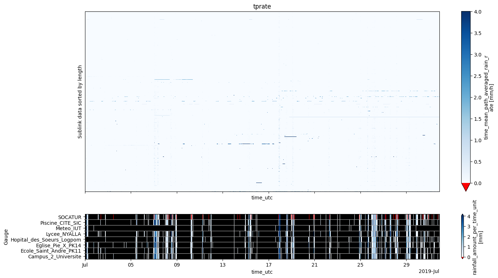

# raincell


<!-- WARNING: THIS FILE WAS AUTOGENERATED! DO NOT EDIT! -->

> Tip: If you are reading this in the
> [GitHub’s](https://github.com/rainsmore/raincell) readme or at
> [pypi](https://pypi.org/project/raincell/), we recommend consulting
> the much more nicely formatted
> [documentation](https://rainsmore.github.io/raincell/) instead.

## Install

You can install the package from
[pypi](https://pypi.org/project/raincell/)

``` sh
$ pip install raincell
```

If you need the latest version of the package, which may be pre-release,
you can install it from the GitHub repository. First, configure an SSH
key on your GitHub account, then run the following command:

``` sh
$ pip install git+ssh://git@github.com/rainsmore/raincell.git
```

<!--
or from [conda][conda] (not available yet)
&#10;```sh
$ conda install -c rainsmore raincell
```
&#10;[conda]: https://anaconda.org/rainsmore/raincell
-->

## Contributing

All help is welcome, so if you would like to contribute (bug reports,
documentation, etc.), please check our contribution
[guide](https://github.com/rainsmore/raincell/blob/main/CONTRIBUTING.md).
This guide also explains our approach to notebook development.

## Getting started

If this is the first time you are using the Raincell library, we highly
recommend following the tutorial in this section. You can either work
through the online documentation or download this
[file](https://github.com/rainsmore/raincell/blob/main/nbs/index.ipynb)
as a notebook and work through it locally. The tutorial will guide you
step by step through the process of converting raw Commercial Microwave
Link (CML) data into precipitation rate estimates.

<div>

> **Tip**
>
> If you are already familiar with the library, you can skip to the
> [Next steps](#sec-next-steps) section. However, we recommend checking
> it from time to time, as new basic functionalities will appear here.

</div>

``` python
from raincell import open_cml_sample, open_gauge_sample
```

Lets start by opening commercial microwave link (CML) sample data over
the city of Douala with 15 min and max sampling of the Network
Management System (NMS).

``` python
cml = open_cml_sample()
cml
```

<div><svg style="position: absolute; width: 0; height: 0; overflow: hidden">
<defs>
<symbol id="icon-database" viewBox="0 0 32 32">
<path d="M16 0c-8.837 0-16 2.239-16 5v4c0 2.761 7.163 5 16 5s16-2.239 16-5v-4c0-2.761-7.163-5-16-5z"></path>
<path d="M16 17c-8.837 0-16-2.239-16-5v6c0 2.761 7.163 5 16 5s16-2.239 16-5v-6c0 2.761-7.163 5-16 5z"></path>
<path d="M16 26c-8.837 0-16-2.239-16-5v6c0 2.761 7.163 5 16 5s16-2.239 16-5v-6c0 2.761-7.163 5-16 5z"></path>
</symbol>
<symbol id="icon-file-text2" viewBox="0 0 32 32">
<path d="M28.681 7.159c-0.694-0.947-1.662-2.053-2.724-3.116s-2.169-2.030-3.116-2.724c-1.612-1.182-2.393-1.319-2.841-1.319h-15.5c-1.378 0-2.5 1.121-2.5 2.5v27c0 1.378 1.122 2.5 2.5 2.5h23c1.378 0 2.5-1.122 2.5-2.5v-19.5c0-0.448-0.137-1.23-1.319-2.841zM24.543 5.457c0.959 0.959 1.712 1.825 2.268 2.543h-4.811v-4.811c0.718 0.556 1.584 1.309 2.543 2.268zM28 29.5c0 0.271-0.229 0.5-0.5 0.5h-23c-0.271 0-0.5-0.229-0.5-0.5v-27c0-0.271 0.229-0.5 0.5-0.5 0 0 15.499-0 15.5 0v7c0 0.552 0.448 1 1 1h7v19.5z"></path>
<path d="M23 26h-14c-0.552 0-1-0.448-1-1s0.448-1 1-1h14c0.552 0 1 0.448 1 1s-0.448 1-1 1z"></path>
<path d="M23 22h-14c-0.552 0-1-0.448-1-1s0.448-1 1-1h14c0.552 0 1 0.448 1 1s-0.448 1-1 1z"></path>
<path d="M23 18h-14c-0.552 0-1-0.448-1-1s0.448-1 1-1h14c0.552 0 1 0.448 1 1s-0.448 1-1 1z"></path>
</symbol>
</defs>
</svg>
<style>/* CSS stylesheet for displaying xarray objects in notebooks */
&#10;:root {
  --xr-font-color0: var(
    --jp-content-font-color0,
    var(--pst-color-text-base rgba(0, 0, 0, 1))
  );
  --xr-font-color2: var(
    --jp-content-font-color2,
    var(--pst-color-text-base, rgba(0, 0, 0, 0.54))
  );
  --xr-font-color3: var(
    --jp-content-font-color3,
    var(--pst-color-text-base, rgba(0, 0, 0, 0.38))
  );
  --xr-border-color: var(
    --jp-border-color2,
    hsl(from var(--pst-color-on-background, white) h s calc(l - 10))
  );
  --xr-disabled-color: var(
    --jp-layout-color3,
    hsl(from var(--pst-color-on-background, white) h s calc(l - 40))
  );
  --xr-background-color: var(
    --jp-layout-color0,
    var(--pst-color-on-background, white)
  );
  --xr-background-color-row-even: var(
    --jp-layout-color1,
    hsl(from var(--pst-color-on-background, white) h s calc(l - 5))
  );
  --xr-background-color-row-odd: var(
    --jp-layout-color2,
    hsl(from var(--pst-color-on-background, white) h s calc(l - 15))
  );
}
&#10;html[theme="dark"],
html[data-theme="dark"],
body[data-theme="dark"],
body.vscode-dark {
  --xr-font-color0: var(
    --jp-content-font-color0,
    var(--pst-color-text-base, rgba(255, 255, 255, 1))
  );
  --xr-font-color2: var(
    --jp-content-font-color2,
    var(--pst-color-text-base, rgba(255, 255, 255, 0.54))
  );
  --xr-font-color3: var(
    --jp-content-font-color3,
    var(--pst-color-text-base, rgba(255, 255, 255, 0.38))
  );
  --xr-border-color: var(
    --jp-border-color2,
    hsl(from var(--pst-color-on-background, #111111) h s calc(l + 10))
  );
  --xr-disabled-color: var(
    --jp-layout-color3,
    hsl(from var(--pst-color-on-background, #111111) h s calc(l + 40))
  );
  --xr-background-color: var(
    --jp-layout-color0,
    var(--pst-color-on-background, #111111)
  );
  --xr-background-color-row-even: var(
    --jp-layout-color1,
    hsl(from var(--pst-color-on-background, #111111) h s calc(l + 5))
  );
  --xr-background-color-row-odd: var(
    --jp-layout-color2,
    hsl(from var(--pst-color-on-background, #111111) h s calc(l + 15))
  );
}
&#10;.xr-wrap {
  display: block !important;
  min-width: 300px;
  max-width: 700px;
  line-height: 1.6;
  padding-bottom: 4px;
}
&#10;.xr-text-repr-fallback {
  /* fallback to plain text repr when CSS is not injected (untrusted notebook) */
  display: none;
}
&#10;.xr-header {
  padding-top: 6px;
  padding-bottom: 6px;
}
&#10;.xr-header {
  border-bottom: solid 1px var(--xr-border-color);
  margin-bottom: 4px;
}
&#10;.xr-header > div,
.xr-header > ul {
  display: inline;
  margin-top: 0;
  margin-bottom: 0;
}
&#10;.xr-obj-type,
.xr-obj-name {
  margin-left: 2px;
  margin-right: 10px;
}
&#10;.xr-obj-type,
.xr-group-box-contents > label {
  color: var(--xr-font-color2);
  display: block;
}
&#10;.xr-sections {
  padding-left: 0 !important;
  display: grid;
  grid-template-columns: 150px auto auto 1fr 0 20px 0 20px;
  margin-block-start: 0;
  margin-block-end: 0;
}
&#10;.xr-section-item {
  display: contents;
}
&#10;.xr-section-item > input,
.xr-group-box-contents > input,
.xr-array-wrap > input {
  display: block;
  opacity: 0;
  height: 0;
  margin: 0;
}
&#10;.xr-section-item > input + label,
.xr-var-item > input + label {
  color: var(--xr-disabled-color);
}
&#10;.xr-section-item > input:enabled + label,
.xr-var-item > input:enabled + label,
.xr-array-wrap > input:enabled + label,
.xr-group-box-contents > input:enabled + label {
  cursor: pointer;
  color: var(--xr-font-color2);
}
&#10;.xr-section-item > input:focus-visible + label,
.xr-var-item > input:focus-visible + label,
.xr-array-wrap > input:focus-visible + label,
.xr-group-box-contents > input:focus-visible + label {
  outline: auto;
}
&#10;.xr-section-item > input:enabled + label:hover,
.xr-var-item > input:enabled + label:hover,
.xr-array-wrap > input:enabled + label:hover,
.xr-group-box-contents > input:enabled + label:hover {
  color: var(--xr-font-color0);
}
&#10;.xr-section-summary {
  grid-column: 1;
  color: var(--xr-font-color2);
  font-weight: 500;
  white-space: nowrap;
}
&#10;.xr-section-summary > em {
  font-weight: normal;
}
&#10;.xr-span-grid {
  grid-column-end: -1;
}
&#10;.xr-section-summary > span {
  display: inline-block;
  padding-left: 0.3em;
}
&#10;.xr-group-box-contents > input:checked + label > span {
  display: inline-block;
  padding-left: 0.6em;
}
&#10;.xr-section-summary-in:disabled + label {
  color: var(--xr-font-color2);
}
&#10;.xr-section-summary-in + label:before {
  display: inline-block;
  content: "►";
  font-size: 11px;
  width: 15px;
  text-align: center;
}
&#10;.xr-section-summary-in:disabled + label:before {
  color: var(--xr-disabled-color);
}
&#10;.xr-section-summary-in:checked + label:before {
  content: "▼";
}
&#10;.xr-section-summary-in:checked + label > span {
  display: none;
}
&#10;.xr-section-summary,
.xr-section-inline-details,
.xr-group-box-contents > label {
  padding-top: 4px;
}
&#10;.xr-section-inline-details {
  grid-column: 2 / -1;
}
&#10;.xr-section-details {
  grid-column: 1 / -1;
  margin-top: 4px;
  margin-bottom: 5px;
}
&#10;.xr-section-summary-in ~ .xr-section-details {
  display: none;
}
&#10;.xr-section-summary-in:checked ~ .xr-section-details {
  display: contents;
}
&#10;.xr-children {
  display: inline-grid;
  grid-template-columns: 100%;
  grid-column: 1 / -1;
  padding-top: 4px;
}
&#10;.xr-group-box {
  display: inline-grid;
  grid-template-columns: 0px 30px auto;
}
&#10;.xr-group-box-vline {
  grid-column-start: 1;
  border-right: 0.2em solid;
  border-color: var(--xr-border-color);
  width: 0px;
}
&#10;.xr-group-box-hline {
  grid-column-start: 2;
  grid-row-start: 1;
  height: 1em;
  width: 26px;
  border-bottom: 0.2em solid;
  border-color: var(--xr-border-color);
}
&#10;.xr-group-box-contents {
  grid-column-start: 3;
  padding-bottom: 4px;
}
&#10;.xr-group-box-contents > label::before {
  content: "📂";
  padding-right: 0.3em;
}
&#10;.xr-group-box-contents > input:checked + label::before {
  content: "📁";
}
&#10;.xr-group-box-contents > input:checked + label {
  padding-bottom: 0px;
}
&#10;.xr-group-box-contents > input:checked ~ .xr-sections {
  display: none;
}
&#10;.xr-group-box-contents > input + label > span {
  display: none;
}
&#10;.xr-group-box-ellipsis {
  font-size: 1.4em;
  font-weight: 900;
  color: var(--xr-font-color2);
  letter-spacing: 0.15em;
  cursor: default;
}
&#10;.xr-array-wrap {
  grid-column: 1 / -1;
  display: grid;
  grid-template-columns: 20px auto;
}
&#10;.xr-array-wrap > label {
  grid-column: 1;
  vertical-align: top;
}
&#10;.xr-preview {
  color: var(--xr-font-color3);
}
&#10;.xr-array-preview,
.xr-array-data {
  padding: 0 5px !important;
  grid-column: 2;
}
&#10;.xr-array-data,
.xr-array-in:checked ~ .xr-array-preview {
  display: none;
}
&#10;.xr-array-in:checked ~ .xr-array-data,
.xr-array-preview {
  display: inline-block;
}
&#10;.xr-dim-list {
  display: inline-block !important;
  list-style: none;
  padding: 0 !important;
  margin: 0;
}
&#10;.xr-dim-list li {
  display: inline-block;
  padding: 0;
  margin: 0;
}
&#10;.xr-dim-list:before {
  content: "(";
}
&#10;.xr-dim-list:after {
  content: ")";
}
&#10;.xr-dim-list li:not(:last-child):after {
  content: ",";
  padding-right: 5px;
}
&#10;.xr-has-index {
  font-weight: bold;
}
&#10;.xr-var-list,
.xr-var-item {
  display: contents;
}
&#10;.xr-var-item > div,
.xr-var-item label,
.xr-var-item > .xr-var-name span {
  background-color: var(--xr-background-color-row-even);
  border-color: var(--xr-background-color-row-odd);
  margin-bottom: 0;
  padding-top: 2px;
}
&#10;.xr-var-item > .xr-var-name:hover span {
  padding-right: 5px;
}
&#10;.xr-var-list > li:nth-child(odd) > div,
.xr-var-list > li:nth-child(odd) > label,
.xr-var-list > li:nth-child(odd) > .xr-var-name span {
  background-color: var(--xr-background-color-row-odd);
  border-color: var(--xr-background-color-row-even);
}
&#10;.xr-var-name {
  grid-column: 1;
}
&#10;.xr-var-dims {
  grid-column: 2;
}
&#10;.xr-var-dtype {
  grid-column: 3;
  text-align: right;
  color: var(--xr-font-color2);
}
&#10;.xr-var-preview {
  grid-column: 4;
}
&#10;.xr-index-preview {
  grid-column: 2 / 5;
  color: var(--xr-font-color2);
}
&#10;.xr-var-name,
.xr-var-dims,
.xr-var-dtype,
.xr-preview,
.xr-attrs dt {
  white-space: nowrap;
  overflow: hidden;
  text-overflow: ellipsis;
  padding-right: 10px;
}
&#10;.xr-var-name:hover,
.xr-var-dims:hover,
.xr-var-dtype:hover,
.xr-attrs dt:hover {
  overflow: visible;
  width: auto;
  z-index: 1;
}
&#10;.xr-var-attrs,
.xr-var-data,
.xr-index-data {
  display: none;
  border-top: 2px dotted var(--xr-background-color);
  padding-bottom: 20px !important;
  padding-top: 10px !important;
}
&#10;.xr-var-attrs-in + label,
.xr-var-data-in + label,
.xr-index-data-in + label {
  padding: 0 1px;
}
&#10;.xr-var-attrs-in:checked ~ .xr-var-attrs,
.xr-var-data-in:checked ~ .xr-var-data,
.xr-index-data-in:checked ~ .xr-index-data {
  display: block;
}
&#10;.xr-var-data > table {
  float: right;
}
&#10;.xr-var-data > pre,
.xr-index-data > pre,
.xr-var-data > table > tbody > tr {
  background-color: transparent !important;
}
&#10;.xr-var-name span,
.xr-var-data,
.xr-index-name div,
.xr-index-data,
.xr-attrs {
  padding-left: 25px !important;
}
&#10;.xr-attrs,
.xr-var-attrs,
.xr-var-data,
.xr-index-data {
  grid-column: 1 / -1;
}
&#10;dl.xr-attrs {
  padding: 0;
  margin: 0;
  display: grid;
  grid-template-columns: 125px auto;
}
&#10;.xr-attrs dt,
.xr-attrs dd {
  padding: 0;
  margin: 0;
  float: left;
  padding-right: 10px;
  width: auto;
}
&#10;.xr-attrs dt {
  font-weight: normal;
  grid-column: 1;
}
&#10;.xr-attrs dt:hover span {
  display: inline-block;
  background: var(--xr-background-color);
  padding-right: 10px;
}
&#10;.xr-attrs dd {
  grid-column: 2;
  white-space: pre-wrap;
  word-break: break-all;
}
&#10;.xr-icon-database,
.xr-icon-file-text2,
.xr-no-icon {
  display: inline-block;
  vertical-align: middle;
  width: 1em;
  height: 1.5em !important;
  stroke-width: 0;
  stroke: currentColor;
  fill: currentColor;
}
&#10;.xr-var-attrs-in:checked + label > .xr-icon-file-text2,
.xr-var-data-in:checked + label > .xr-icon-database,
.xr-index-data-in:checked + label > .xr-icon-database {
  color: var(--xr-font-color0);
  filter: drop-shadow(1px 1px 5px var(--xr-font-color2));
  stroke-width: 0.8px;
}
</style><pre class='xr-text-repr-fallback'>&lt;xarray.Dataset&gt; Size: 108MB
Dimensions:      (cml_id: 126, sublink_id: 6, time: 2964)
Coordinates: (10)
Data variables:
    rsl_avg      (cml_id, sublink_id, time) float64 18MB -48.0 -48.0 ... nan nan
    tsl_avg      (cml_id, sublink_id, time) float64 18MB 10.0 10.0 ... nan nan
    rsl_min      (cml_id, sublink_id, time) float64 18MB -48.8 -48.3 ... nan nan
    tsl_min      (cml_id, sublink_id, time) float64 18MB 10.0 10.0 ... nan nan
    rsl_max      (cml_id, sublink_id, time) float64 18MB -47.6 -47.8 ... nan nan
    tsl_max      (cml_id, sublink_id, time) float64 18MB 10.0 10.0 ... nan nan
Attributes:
    title:                 East side Douala CML links sample data
    file author(s):        Orange Cameroun and IRD Rainsmore Group
    institution:           Orange Cameroun and IRD Rainsmore Group
    date:                  2025-11-07
    source:                Modified Orange Cameroun CML data for example purp...
    naming convention:     COST ACTION OPENSENSE V2
    license restrictions:  CC BY-NC-ND 4.0</pre><div class='xr-wrap' style='display:none'><div class='xr-header'><div class='xr-obj-type'>xarray.Dataset</div></div><ul class='xr-sections'><li class='xr-section-item'><input id='section-891f301f-04c3-4daa-842a-2fab50a5ed1c' class='xr-section-summary-in' type='checkbox' disabled /><label for='section-891f301f-04c3-4daa-842a-2fab50a5ed1c' class='xr-section-summary'>Dimensions:</label><div class='xr-section-inline-details'><ul class='xr-dim-list'><li><span class='xr-has-index'>cml_id</span>: 126</li><li><span class='xr-has-index'>sublink_id</span>: 6</li><li><span class='xr-has-index'>time</span>: 2964</li></ul></div></li><li class='xr-section-item'><input id='section-944f70a7-59bb-4ec4-b8fd-d26dd632914b' class='xr-section-summary-in' type='checkbox' /><label for='section-944f70a7-59bb-4ec4-b8fd-d26dd632914b' class='xr-section-summary' title='Expand/collapse section'>Coordinates: <span>(10)</span></label><div class='xr-section-inline-details'></div><div class='xr-section-details'><ul class='xr-var-list'><li class='xr-var-item'><div class='xr-var-name'><span class='xr-has-index'>cml_id</span></div><div class='xr-var-dims'>(cml_id)</div><div class='xr-var-dtype'>&lt;U19</div><div class='xr-var-preview xr-preview'>&#x27;3.984686N-9.789517E&#x27; ... &#x27;4.095...</div><input id='attrs-1eaeb088-4664-4a64-acb4-4c2dd42b38cd' class='xr-var-attrs-in' type='checkbox' ><label for='attrs-1eaeb088-4664-4a64-acb4-4c2dd42b38cd' title='Show/Hide attributes'><svg class='icon xr-icon-file-text2'><use xlink:href='#icon-file-text2'></use></svg></label><input id='data-b5886900-ecd3-49e1-8f87-948f0ef9464b' class='xr-var-data-in' type='checkbox'><label for='data-b5886900-ecd3-49e1-8f87-948f0ef9464b' title='Show/Hide data repr'><svg class='icon xr-icon-database'><use xlink:href='#icon-database'></use></svg></label><div class='xr-var-attrs'><dl class='xr-attrs'><dt><span>long_name :</span></dt><dd>commercial_microwave_link_identifier</dd></dl></div><div class='xr-var-data'><pre>array([&#x27;3.984686N-9.789517E&#x27;, &#x27;3.985691N-9.801648E&#x27;, &#x27;3.996996N-9.761328E&#x27;,
       &#x27;4.002892N-9.746861E&#x27;, &#x27;4.007006N-9.767519E&#x27;, &#x27;4.008236N-9.788792E&#x27;,
       &#x27;4.013028N-9.703569E&#x27;, &#x27;4.013180N-9.765819E&#x27;, &#x27;4.014916N-9.732514E&#x27;,
       &#x27;4.015776N-9.756458E&#x27;, &#x27;4.016656N-9.736544E&#x27;, &#x27;4.016736N-9.764944E&#x27;,
       &#x27;4.016944N-9.753305E&#x27;, &#x27;4.016962N-9.726686E&#x27;, &#x27;4.017736N-9.748042E&#x27;,
       &#x27;4.018721N-9.762325E&#x27;, &#x27;4.018764N-9.746583E&#x27;, &#x27;4.019750N-9.767776E&#x27;,
       &#x27;4.019930N-9.759403E&#x27;, &#x27;4.020440N-9.708914E&#x27;, &#x27;4.021256N-9.746180E&#x27;,
       &#x27;4.021528N-9.798792E&#x27;, &#x27;4.024043N-9.680260E&#x27;, &#x27;4.024381N-9.733274E&#x27;,
       &#x27;4.024750N-9.697977E&#x27;, &#x27;4.025125N-9.770912E&#x27;, &#x27;4.025270N-9.739593E&#x27;,
       &#x27;4.025625N-9.735889E&#x27;, &#x27;4.025880N-9.703252E&#x27;, &#x27;4.026149N-9.695650E&#x27;,
       &#x27;4.028700N-9.729934E&#x27;, &#x27;4.028708N-9.703542E&#x27;, &#x27;4.029412N-9.691581E&#x27;,
       &#x27;4.030556N-9.705569E&#x27;, &#x27;4.030907N-9.694160E&#x27;, &#x27;4.031399N-9.698080E&#x27;,
       &#x27;4.032132N-9.730055E&#x27;, &#x27;4.032560N-9.713835E&#x27;, &#x27;4.033181N-9.761500E&#x27;,
       &#x27;4.033883N-9.691732E&#x27;, &#x27;4.034149N-9.772296E&#x27;, &#x27;4.034701N-9.729347E&#x27;,
       &#x27;4.035134N-9.697875E&#x27;, &#x27;4.035679N-9.685969E&#x27;, &#x27;4.037778N-9.767028E&#x27;,
       &#x27;4.038505N-9.704950E&#x27;, &#x27;4.039270N-9.722472E&#x27;, &#x27;4.039580N-9.737019E&#x27;,
       &#x27;4.040098N-9.700828E&#x27;, &#x27;4.040792N-9.776750E&#x27;, &#x27;4.041057N-9.688122E&#x27;,
       &#x27;4.041068N-9.758319E&#x27;, &#x27;4.041256N-9.730708E&#x27;, &#x27;4.041347N-9.773597E&#x27;,
       &#x27;4.042298N-9.740333E&#x27;, &#x27;4.042502N-9.716614E&#x27;, &#x27;4.042568N-9.698128E&#x27;,
       &#x27;4.042817N-9.705986E&#x27;, &#x27;4.043833N-9.687306E&#x27;, &#x27;4.043927N-9.704314E&#x27;,
       &#x27;4.044597N-9.727069E&#x27;, &#x27;4.044736N-9.710024E&#x27;, &#x27;4.047503N-9.718511E&#x27;,
       &#x27;4.048013N-9.705195E&#x27;, &#x27;4.048153N-9.698625E&#x27;, &#x27;4.048916N-9.707667E&#x27;,
       &#x27;4.049925N-9.774582E&#x27;, &#x27;4.050150N-9.740475E&#x27;, &#x27;4.050347N-9.703473E&#x27;,
       &#x27;4.050528N-9.753875E&#x27;, &#x27;4.052083N-9.788583E&#x27;, &#x27;4.054458N-9.763403E&#x27;,
       &#x27;4.055917N-9.752681E&#x27;, &#x27;4.056070N-9.768000E&#x27;, &#x27;4.056121N-9.742152E&#x27;,
       &#x27;4.056639N-9.747222E&#x27;, &#x27;4.056847N-9.738556E&#x27;, &#x27;4.056959N-9.742472E&#x27;,
       &#x27;4.057459N-9.765805E&#x27;, &#x27;4.058236N-9.768889E&#x27;, &#x27;4.058746N-9.717759E&#x27;,
       &#x27;4.058868N-9.752014E&#x27;, &#x27;4.059014N-9.759348E&#x27;, &#x27;4.059486N-9.711928E&#x27;,
       &#x27;4.059995N-9.755237E&#x27;, &#x27;4.060816N-9.773042E&#x27;, &#x27;4.061585N-9.744609E&#x27;,
       &#x27;4.062778N-9.705333E&#x27;, &#x27;4.062903N-9.717026E&#x27;, &#x27;4.064425N-9.761904E&#x27;,
       &#x27;4.065399N-9.711476E&#x27;, &#x27;4.066549N-9.795621E&#x27;, &#x27;4.067820N-9.720067E&#x27;,
       &#x27;4.068528N-9.726056E&#x27;, &#x27;4.069079N-9.713870E&#x27;, &#x27;4.071390N-9.727304E&#x27;,
       &#x27;4.072442N-9.739396E&#x27;, &#x27;4.072503N-9.771625E&#x27;, &#x27;4.074162N-9.717861E&#x27;,
       &#x27;4.074764N-9.753625E&#x27;, &#x27;4.075098N-9.719528E&#x27;, &#x27;4.075836N-9.783931E&#x27;,
       &#x27;4.076554N-9.759058E&#x27;, &#x27;4.078069N-9.720598E&#x27;, &#x27;4.078309N-9.751204E&#x27;,
       &#x27;4.079211N-9.793847E&#x27;, &#x27;4.079299N-9.747812E&#x27;, &#x27;4.079652N-9.763472E&#x27;,
       &#x27;4.080070N-9.789737E&#x27;, &#x27;4.080399N-9.753111E&#x27;, &#x27;4.081654N-9.761180E&#x27;,
       &#x27;4.082815N-9.790491E&#x27;, &#x27;4.083040N-9.782281E&#x27;, &#x27;4.083986N-9.756718E&#x27;,
       &#x27;4.084496N-9.740917E&#x27;, &#x27;4.084732N-9.745625E&#x27;, &#x27;4.085795N-9.784833E&#x27;,
       &#x27;4.086056N-9.752500E&#x27;, &#x27;4.086283N-9.759477E&#x27;, &#x27;4.086545N-9.797375E&#x27;,
       &#x27;4.088385N-9.755778E&#x27;, &#x27;4.089034N-9.734926E&#x27;, &#x27;4.089819N-9.752833E&#x27;,
       &#x27;4.090565N-9.765189E&#x27;, &#x27;4.091611N-9.732743E&#x27;, &#x27;4.095631N-9.742507E&#x27;],
      dtype=&#x27;&lt;U19&#x27;)</pre></div></li><li class='xr-var-item'><div class='xr-var-name'><span>site_0_lat</span></div><div class='xr-var-dims'>(cml_id)</div><div class='xr-var-dtype'>float64</div><div class='xr-var-preview xr-preview'>3.993 3.993 3.997 ... 4.092 4.094</div><input id='attrs-f5444fb9-91c4-4bab-bedf-9ba2a28d1f5f' class='xr-var-attrs-in' type='checkbox' ><label for='attrs-f5444fb9-91c4-4bab-bedf-9ba2a28d1f5f' title='Show/Hide attributes'><svg class='icon xr-icon-file-text2'><use xlink:href='#icon-file-text2'></use></svg></label><input id='data-efaffe19-9299-49a3-aaaa-0b58f78c1faa' class='xr-var-data-in' type='checkbox'><label for='data-efaffe19-9299-49a3-aaaa-0b58f78c1faa' title='Show/Hide data repr'><svg class='icon xr-icon-database'><use xlink:href='#icon-database'></use></svg></label><div class='xr-var-attrs'><dl class='xr-attrs'><dt><span>units :</span></dt><dd>degrees_in_WGS84_projection</dd><dt><span>long_name :</span></dt><dd>site_0_latitude</dd></dl></div><div class='xr-var-data'><pre>array([3.992722, 3.992722, 3.997361, 4.002553, 4.003512, 4.004194,
       4.01775 , 4.029   , 4.009639, 4.029   , 4.015972, 4.029   ,
       4.015972, 4.023444, 4.015972, 4.029   , 4.014417, 4.029   ,
       4.015972, 4.029381, 4.0194  , 4.023167, 4.022056, 4.015972,
       4.029381, 4.029   , 4.022139, 4.015972, 4.029381, 4.029381,
       4.040819, 4.029083, 4.029381, 4.029083, 4.029381, 4.029381,
       4.040819, 4.032   , 4.029   , 4.032433, 4.033028, 4.040819,
       4.029381, 4.033886, 4.029   , 4.040083, 4.040819, 4.040819,
       4.040886, 4.042306, 4.041417, 4.03875 , 4.040819, 4.029   ,
       4.040819, 4.056559, 4.040886, 4.04244 , 4.041417, 4.043194,
       4.041694, 4.040886, 4.04642 , 4.044694, 4.049556, 4.051333,
       4.050192, 4.052028, 4.052444, 4.053667, 4.053694, 4.053667,
       4.053667, 4.0585  , 4.058056, 4.053667, 4.060028, 4.053667,
       4.0585  , 4.053667, 4.06425 , 4.053667, 4.053667, 4.060333,
       4.053667, 4.0585  , 4.059611, 4.059583, 4.06425 , 4.066322,
       4.063917, 4.065848, 4.06425 , 4.065667, 4.071278, 4.071389,
       4.072222, 4.071639, 4.06425 , 4.074778, 4.070306, 4.0817  ,
       4.074778, 4.079889, 4.081867, 4.0817  , 4.085936, 4.085936,
       4.0817  , 4.085936, 4.081441, 4.0817  , 4.0817  , 4.074778,
       4.085936, 4.085936, 4.0817  , 4.074778, 4.085936, 4.0817  ,
       4.085936, 4.08679 , 4.074778, 4.08663 , 4.091944, 4.09393 ])</pre></div></li><li class='xr-var-item'><div class='xr-var-name'><span>site_0_lon</span></div><div class='xr-var-dims'>(cml_id)</div><div class='xr-var-dtype'>float64</div><div class='xr-var-preview xr-preview'>9.787 9.787 9.764 ... 9.729 9.742</div><input id='attrs-f4cd20c4-785b-416c-a024-86b1535af454' class='xr-var-attrs-in' type='checkbox' ><label for='attrs-f4cd20c4-785b-416c-a024-86b1535af454' title='Show/Hide attributes'><svg class='icon xr-icon-file-text2'><use xlink:href='#icon-file-text2'></use></svg></label><input id='data-aadfee66-69df-41c6-af3c-99a2c1ab4b54' class='xr-var-data-in' type='checkbox'><label for='data-aadfee66-69df-41c6-af3c-99a2c1ab4b54' title='Show/Hide data repr'><svg class='icon xr-icon-database'><use xlink:href='#icon-database'></use></svg></label><div class='xr-var-attrs'><dl class='xr-attrs'><dt><span>units :</span></dt><dd>degrees_in_WGS84_projection</dd><dt><span>long_name :</span></dt><dd>site_0_longitude</dd></dl></div><div class='xr-var-data'><pre>array([9.787167, 9.787167, 9.763806, 9.745083, 9.76732 , 9.799472,
       9.705944, 9.767833, 9.741417, 9.767833, 9.738528, 9.767833,
       9.738528, 9.727083, 9.738528, 9.767833, 9.744694, 9.767833,
       9.738528, 9.696744, 9.743889, 9.792   , 9.67025 , 9.738528,
       9.696744, 9.767833, 9.737194, 9.738528, 9.696744, 9.696744,
       9.733028, 9.701944, 9.696744, 9.701944, 9.696744, 9.696744,
       9.733028, 9.71564 , 9.767833, 9.691575, 9.774333, 9.733028,
       9.696744, 9.683883, 9.767833, 9.706106, 9.733028, 9.733028,
       9.699006, 9.774   , 9.686417, 9.762056, 9.733028, 9.767833,
       9.733028, 9.702978, 9.699006, 9.704083, 9.686417, 9.707889,
       9.728389, 9.699006, 9.71598 , 9.703528, 9.698333, 9.706861,
       9.771911, 9.741306, 9.702389, 9.750917, 9.779361, 9.750917,
       9.750917, 9.768444, 9.738694, 9.750917, 9.726194, 9.750917,
       9.768444, 9.750917, 9.714664, 9.750917, 9.750917, 9.708444,
       9.750917, 9.768444, 9.743528, 9.704333, 9.714664, 9.759558,
       9.710083, 9.79152 , 9.714664, 9.722972, 9.714869, 9.729139,
       9.736111, 9.76925 , 9.714664, 9.761667, 9.719639, 9.786083,
       9.761667, 9.719417, 9.756825, 9.786083, 9.752944, 9.752944,
       9.786083, 9.752944, 9.765535, 9.786083, 9.786083, 9.761667,
       9.752944, 9.752944, 9.786083, 9.761667, 9.752944, 9.786083,
       9.752944, 9.73381 , 9.761667, 9.76601 , 9.729444, 9.74168 ])</pre></div></li><li class='xr-var-item'><div class='xr-var-name'><span>site_1_lat</span></div><div class='xr-var-dims'>(cml_id)</div><div class='xr-var-dtype'>float64</div><div class='xr-var-preview xr-preview'>3.977 3.979 3.997 ... 4.091 4.097</div><input id='attrs-f782d51f-bf08-4e05-a12f-fef8ee801aff' class='xr-var-attrs-in' type='checkbox' ><label for='attrs-f782d51f-bf08-4e05-a12f-fef8ee801aff' title='Show/Hide attributes'><svg class='icon xr-icon-file-text2'><use xlink:href='#icon-file-text2'></use></svg></label><input id='data-82ac76b9-1352-4a30-aea2-faab2d7bf625' class='xr-var-data-in' type='checkbox'><label for='data-82ac76b9-1352-4a30-aea2-faab2d7bf625' title='Show/Hide data repr'><svg class='icon xr-icon-database'><use xlink:href='#icon-database'></use></svg></label><div class='xr-var-attrs'><dl class='xr-attrs'><dt><span>units :</span></dt><dd>degrees in WGS84 projection</dd><dt><span>long_name :</span></dt><dd>site_1_latitude</dd></dl></div><div class='xr-var-data'><pre>array([3.97665 , 3.97866 , 3.99663 , 4.003231, 4.0105  , 4.012278,
       4.008306, 3.997361, 4.020194, 4.002553, 4.01734 , 4.004472,
       4.017917, 4.01048 , 4.0195  , 4.008442, 4.023111, 4.0105  ,
       4.023889, 4.0115  , 4.023111, 4.019889, 4.02603 , 4.03279 ,
       4.02012 , 4.02125 , 4.0284  , 4.035278, 4.02238 , 4.022917,
       4.01658 , 4.028333, 4.029444, 4.032028, 4.032433, 4.033417,
       4.023444, 4.03312 , 4.037361, 4.035333, 4.03527 , 4.028583,
       4.040886, 4.037472, 4.046556, 4.036926, 4.037722, 4.038342,
       4.03931 , 4.039278, 4.040697, 4.043386, 4.041694, 4.053694,
       4.043778, 4.028444, 4.04425 , 4.043194, 4.04625 , 4.044661,
       4.0475  , 4.048586, 4.048586, 4.051333, 4.04675 , 4.0465  ,
       4.049658, 4.048272, 4.04825 , 4.047389, 4.050472, 4.05525 ,
       4.058167, 4.053639, 4.054186, 4.059611, 4.053667, 4.06025 ,
       4.056417, 4.062806, 4.053242, 4.064069, 4.064361, 4.058638,
       4.066322, 4.063131, 4.06356 , 4.065972, 4.061556, 4.062528,
       4.06688 , 4.06725 , 4.07139 , 4.071389, 4.06688 , 4.07139 ,
       4.072661, 4.073367, 4.084075, 4.07475 , 4.079889, 4.069972,
       4.07833 , 4.07625 , 4.07475 , 4.076722, 4.072661, 4.073367,
       4.07844 , 4.074861, 4.081867, 4.08393 , 4.08438 , 4.093194,
       4.083056, 4.083528, 4.089889, 4.097333, 4.08663 , 4.091389,
       4.090833, 4.091278, 4.104861, 4.0945  , 4.091278, 4.097333])</pre></div></li><li class='xr-var-item'><div class='xr-var-name'><span>site_1_lon</span></div><div class='xr-var-dims'>(cml_id)</div><div class='xr-var-dtype'>float64</div><div class='xr-var-preview xr-preview'>9.792 9.816 9.759 ... 9.736 9.743</div><input id='attrs-cc8488da-e36c-4057-9d04-e270eb0af135' class='xr-var-attrs-in' type='checkbox' ><label for='attrs-cc8488da-e36c-4057-9d04-e270eb0af135' title='Show/Hide attributes'><svg class='icon xr-icon-file-text2'><use xlink:href='#icon-file-text2'></use></svg></label><input id='data-ade5a714-af25-4ad9-9815-5ca88149f421' class='xr-var-data-in' type='checkbox'><label for='data-ade5a714-af25-4ad9-9815-5ca88149f421' title='Show/Hide data repr'><svg class='icon xr-icon-database'><use xlink:href='#icon-database'></use></svg></label><div class='xr-var-attrs'><dl class='xr-attrs'><dt><span>units :</span></dt><dd>degrees in WGS84 projection</dd><dt><span>long_name :</span></dt><dd>site_1_longitude</dd></dl></div><div class='xr-var-data'><pre>array([9.791866, 9.81613 , 9.75885 , 9.748639, 9.767719, 9.778111,
       9.701194, 9.763806, 9.723611, 9.745083, 9.73456 , 9.762056,
       9.768083, 9.72629 , 9.757556, 9.756817, 9.748472, 9.767719,
       9.780278, 9.721083, 9.748472, 9.805583, 9.69027 , 9.72802 ,
       9.69921 , 9.77399 , 9.741992, 9.73325 , 9.70976 , 9.694556,
       9.72684 , 9.705139, 9.686417, 9.709194, 9.691575, 9.699417,
       9.727083, 9.71203 , 9.755167, 9.691889, 9.77026 , 9.725667,
       9.699006, 9.688056, 9.766222, 9.703794, 9.711917, 9.741011,
       9.70265 , 9.7795  , 9.689827, 9.754583, 9.728389, 9.779361,
       9.747639, 9.73025 , 9.69725 , 9.707889, 9.688194, 9.700739,
       9.72575 , 9.721043, 9.721043, 9.706861, 9.698917, 9.708472,
       9.777253, 9.739644, 9.704556, 9.756833, 9.797806, 9.775889,
       9.754444, 9.767556, 9.745611, 9.743528, 9.750917, 9.734028,
       9.763167, 9.786861, 9.720853, 9.75311 , 9.767778, 9.715412,
       9.759558, 9.777639, 9.74569 , 9.706333, 9.719389, 9.76425 ,
       9.71287 , 9.799722, 9.72547 , 9.729139, 9.71287 , 9.72547 ,
       9.742681, 9.774   , 9.721058, 9.745583, 9.719417, 9.781778,
       9.75645 , 9.721778, 9.745583, 9.801611, 9.742681, 9.774   ,
       9.79339 , 9.753278, 9.756825, 9.7949  , 9.77848 , 9.751769,
       9.728889, 9.738306, 9.783583, 9.743333, 9.76601 , 9.808667,
       9.758611, 9.736042, 9.744   , 9.764367, 9.736042, 9.743333])</pre></div></li><li class='xr-var-item'><div class='xr-var-name'><span>length</span></div><div class='xr-var-dims'>(cml_id)</div><div class='xr-var-dtype'>float64</div><div class='xr-var-preview xr-preview'>1.852e+03 3.573e+03 ... 736.0 419.0</div><input id='attrs-e225e561-987c-486a-ac7d-88aac2ae1a09' class='xr-var-attrs-in' type='checkbox' ><label for='attrs-e225e561-987c-486a-ac7d-88aac2ae1a09' title='Show/Hide attributes'><svg class='icon xr-icon-file-text2'><use xlink:href='#icon-file-text2'></use></svg></label><input id='data-609e3bf1-7330-453e-8cd4-787472b4186e' class='xr-var-data-in' type='checkbox'><label for='data-609e3bf1-7330-453e-8cd4-787472b4186e' title='Show/Hide data repr'><svg class='icon xr-icon-database'><use xlink:href='#icon-database'></use></svg></label><div class='xr-var-attrs'><dl class='xr-attrs'><dt><span>units :</span></dt><dd>m</dd><dt><span>long_name :</span></dt><dd>distance_between_pair_of_antennas</dd></dl></div><div class='xr-var-data'><pre>array([1852., 3573.,  556.,  402.,  774., 2535., 1170., 3527., 2296.,
       3865.,  466., 2787., 3289., 1436., 2149., 2582., 1049., 2046.,
       4718., 3349.,  654., 1551., 2266., 2195., 1060., 1096.,  874.,
       2214., 1640.,  755., 2767.,  364., 1147.,  868.,  666.,  536.,
       2032.,  420., 1683.,  323.,  516., 1581., 1297.,  610., 1950.,
        433., 2369.,  928.,  441.,  697.,  387.,  975.,  524., 3016.,
       1655., 4340.,  420.,  431.,  570.,  810.,  706., 2591.,  611.,
        822.,  317.,  564.,  596.,  454.,  522.,  956., 2079., 2778.,
        633.,  546.,  879., 1051., 2834., 2012.,  630., 4117., 1398.,
       1176., 2214.,  796., 1697., 1142.,  498.,  741.,  603.,  669.,
        451.,  924., 1436.,  932.,  535.,  407.,  731.,  561., 2304.,
       1786., 1060., 1382.,  700.,  480., 1476., 1810., 1858., 2720.,
        888., 1225.,  968., 1010.,  895., 2314., 2690., 1647.,  947.,
       3219., 1453., 2727.,  830.,  555., 3862.,  889.,  736.,  419.])</pre></div></li><li class='xr-var-item'><div class='xr-var-name'><span class='xr-has-index'>sublink_id</span></div><div class='xr-var-dims'>(sublink_id)</div><div class='xr-var-dtype'>&lt;U3</div><div class='xr-var-preview xr-preview'>&#x27;0_0&#x27; &#x27;0_1&#x27; &#x27;1_0&#x27; &#x27;1_1&#x27; &#x27;2_0&#x27; &#x27;2_1&#x27;</div><input id='attrs-534b7ef9-7e46-4bbc-91e8-5b8d62f9aa09' class='xr-var-attrs-in' type='checkbox' ><label for='attrs-534b7ef9-7e46-4bbc-91e8-5b8d62f9aa09' title='Show/Hide attributes'><svg class='icon xr-icon-file-text2'><use xlink:href='#icon-file-text2'></use></svg></label><input id='data-18684dfe-8481-4192-91d3-53e73aa31e54' class='xr-var-data-in' type='checkbox'><label for='data-18684dfe-8481-4192-91d3-53e73aa31e54' title='Show/Hide data repr'><svg class='icon xr-icon-database'><use xlink:href='#icon-database'></use></svg></label><div class='xr-var-attrs'><dl class='xr-attrs'><dt><span>long_name :</span></dt><dd>sublink_identifier</dd></dl></div><div class='xr-var-data'><pre>array([&#x27;0_0&#x27;, &#x27;0_1&#x27;, &#x27;1_0&#x27;, &#x27;1_1&#x27;, &#x27;2_0&#x27;, &#x27;2_1&#x27;], dtype=&#x27;&lt;U3&#x27;)</pre></div></li><li class='xr-var-item'><div class='xr-var-name'><span>frequency</span></div><div class='xr-var-dims'>(cml_id, sublink_id)</div><div class='xr-var-dtype'>float64</div><div class='xr-var-preview xr-preview'>1.505e+04 1.456e+04 nan ... nan nan</div><input id='attrs-e4a02705-4672-484a-aaec-e814bd5d3504' class='xr-var-attrs-in' type='checkbox' ><label for='attrs-e4a02705-4672-484a-aaec-e814bd5d3504' title='Show/Hide attributes'><svg class='icon xr-icon-file-text2'><use xlink:href='#icon-file-text2'></use></svg></label><input id='data-ebc5d91d-1ce7-4dfa-8fdd-09e59262d80f' class='xr-var-data-in' type='checkbox'><label for='data-ebc5d91d-1ce7-4dfa-8fdd-09e59262d80f' title='Show/Hide data repr'><svg class='icon xr-icon-database'><use xlink:href='#icon-database'></use></svg></label><div class='xr-var-attrs'><dl class='xr-attrs'><dt><span>units :</span></dt><dd>MHz</dd><dt><span>long_name :</span></dt><dd>sublink_frequency</dd></dl></div><div class='xr-var-data'><pre>array([[15047., 14557.,    nan,    nan,    nan,    nan],
       [12765., 13031.,    nan,    nan,    nan,    nan],
       [18765., 17755.,    nan,    nan,    nan,    nan],
       [14907., 14417.,    nan,    nan,    nan,    nan],
       [17728., 18738.,    nan,    nan,    nan,    nan],
       [14417., 14907.,    nan,    nan,    nan,    nan],
       [14935., 14445.,    nan,    nan,    nan,    nan],
       [14529., 15019.,    nan,    nan,    nan,    nan],
       [14935., 14445.,    nan,    nan,    nan,    nan],
       [14473., 14963.,    nan,    nan,    nan,    nan],
       [17755., 18765.,    nan,    nan,    nan,    nan],
       [ 8335.,  8454.,    nan,    nan,    nan,    nan],
       [14935., 14445.,    nan,    nan,    nan,    nan],
       [15019., 14529.,    nan,    nan,    nan,    nan],
       [14991., 14501.,    nan,    nan,    nan,    nan],
       [14501., 14991.,    nan,    nan,    nan,    nan],
       [14557., 15047.,    nan,    nan,    nan,    nan],
       [14557., 15047.,    nan,    nan,    nan,    nan],
       [15103., 14613.,    nan,    nan,    nan,    nan],
       [14417., 14907.,    nan,    nan,    nan,    nan],
...
       [14445., 14935.,    nan,    nan,    nan,    nan],
       [14529., 15019.,    nan,    nan,    nan,    nan],
       [17838., 18848.,    nan,    nan,    nan,    nan],
       [ 8468.,  8349.,    nan,    nan,    nan,    nan],
       [14417., 14907.,    nan,    nan,    nan,    nan],
       [14935., 14445.,    nan,    nan,    nan,    nan],
       [14991., 14501.,    nan,    nan,    nan,    nan],
       [14417., 14907.,    nan,    nan,    nan,    nan],
       [ 8426.,  8307.,    nan,    nan,    nan,    nan],
       [14557., 15047.,    nan,    nan,    nan,    nan],
       [14963., 14473.,    nan,    nan,    nan,    nan],
       [ 8468.,  8349.,    nan,    nan,    nan,    nan],
       [14557., 15047.,    nan,    nan,    nan,    nan],
       [14991., 14501.,    nan,    nan,    nan,    nan],
       [14585., 15075.,    nan,    nan,    nan,    nan],
       [17728., 18738.,    nan,    nan,    nan,    nan],
       [14529., 15019.,    nan,    nan,    nan,    nan],
       [14991., 14501.,    nan,    nan,    nan,    nan],
       [14585., 15075.,    nan,    nan,    nan,    nan],
       [14501., 14991.,    nan,    nan,    nan,    nan]])</pre></div></li><li class='xr-var-item'><div class='xr-var-name'><span>transmitter</span></div><div class='xr-var-dims'>(cml_id, sublink_id)</div><div class='xr-var-dtype'>float64</div><div class='xr-var-preview xr-preview'>0.0 1.0 nan nan ... nan nan nan nan</div><input id='attrs-6d007918-9337-4acf-b4fc-60a602660b22' class='xr-var-attrs-in' type='checkbox' ><label for='attrs-6d007918-9337-4acf-b4fc-60a602660b22' title='Show/Hide attributes'><svg class='icon xr-icon-file-text2'><use xlink:href='#icon-file-text2'></use></svg></label><input id='data-6d2de0a7-e1d0-4834-8d28-0442f542440f' class='xr-var-data-in' type='checkbox'><label for='data-6d2de0a7-e1d0-4834-8d28-0442f542440f' title='Show/Hide data repr'><svg class='icon xr-icon-database'><use xlink:href='#icon-database'></use></svg></label><div class='xr-var-attrs'><dl class='xr-attrs'><dt><span>long_name :</span></dt><dd>transmitter_site_identifier</dd></dl></div><div class='xr-var-data'><pre>array([[ 0.,  1., nan, nan, nan, nan],
       [ 0.,  1., nan, nan, nan, nan],
       [ 0.,  1., nan, nan, nan, nan],
       [ 0.,  1., nan, nan, nan, nan],
       [ 0.,  1., nan, nan, nan, nan],
       [ 0.,  1., nan, nan, nan, nan],
       [ 0.,  1., nan, nan, nan, nan],
       [ 0.,  1., nan, nan, nan, nan],
       [ 0.,  1., nan, nan, nan, nan],
       [ 0.,  1., nan, nan, nan, nan],
       [ 0.,  1., nan, nan, nan, nan],
       [ 0.,  1., nan, nan, nan, nan],
       [ 0.,  1., nan, nan, nan, nan],
       [ 0.,  1., nan, nan, nan, nan],
       [ 0.,  1., nan, nan, nan, nan],
       [ 0.,  1., nan, nan, nan, nan],
       [ 0.,  1., nan, nan, nan, nan],
       [ 0.,  1., nan, nan, nan, nan],
       [ 0.,  1., nan, nan, nan, nan],
       [ 0.,  1., nan, nan, nan, nan],
...
       [ 0.,  1., nan, nan, nan, nan],
       [ 0.,  1., nan, nan, nan, nan],
       [ 0.,  1., nan, nan, nan, nan],
       [ 0.,  1., nan, nan, nan, nan],
       [ 0.,  1., nan, nan, nan, nan],
       [ 0.,  1., nan, nan, nan, nan],
       [ 0.,  1., nan, nan, nan, nan],
       [ 0.,  1., nan, nan, nan, nan],
       [ 0.,  1., nan, nan, nan, nan],
       [ 0.,  1., nan, nan, nan, nan],
       [ 0.,  1., nan, nan, nan, nan],
       [ 0.,  1., nan, nan, nan, nan],
       [ 0.,  1., nan, nan, nan, nan],
       [ 0.,  1., nan, nan, nan, nan],
       [ 0.,  1., nan, nan, nan, nan],
       [ 0.,  1., nan, nan, nan, nan],
       [ 0.,  1., nan, nan, nan, nan],
       [ 0.,  1., nan, nan, nan, nan],
       [ 0.,  1., nan, nan, nan, nan],
       [ 0.,  1., nan, nan, nan, nan]])</pre></div></li><li class='xr-var-item'><div class='xr-var-name'><span class='xr-has-index'>time</span></div><div class='xr-var-dims'>(time)</div><div class='xr-var-dtype'>datetime64[ns]</div><div class='xr-var-preview xr-preview'>2019-07-01T00:05:00 ... 2019-07-...</div><input id='attrs-244d40f1-f658-4e28-ae17-fbd4a93b17d3' class='xr-var-attrs-in' type='checkbox' ><label for='attrs-244d40f1-f658-4e28-ae17-fbd4a93b17d3' title='Show/Hide attributes'><svg class='icon xr-icon-file-text2'><use xlink:href='#icon-file-text2'></use></svg></label><input id='data-e6ca9ed1-6c3a-4202-8c9b-c9d11a876791' class='xr-var-data-in' type='checkbox'><label for='data-e6ca9ed1-6c3a-4202-8c9b-c9d11a876791' title='Show/Hide data repr'><svg class='icon xr-icon-database'><use xlink:href='#icon-database'></use></svg></label><div class='xr-var-attrs'><dl class='xr-attrs'><dt><span>long_name :</span></dt><dd>time_utc</dd></dl></div><div class='xr-var-data'><pre>array([&#x27;2019-07-01T00:05:00.000000000&#x27;, &#x27;2019-07-01T00:20:00.000000000&#x27;,
       &#x27;2019-07-01T00:35:00.000000000&#x27;, ..., &#x27;2019-07-31T23:20:00.000000000&#x27;,
       &#x27;2019-07-31T23:35:00.000000000&#x27;, &#x27;2019-07-31T23:50:00.000000000&#x27;],
      shape=(2964,), dtype=&#x27;datetime64[ns]&#x27;)</pre></div></li></ul></div></li><li class='xr-section-item'><input id='section-eea8dabc-2e72-4f94-8d69-86317e7ca5a0' class='xr-section-summary-in' type='checkbox' checked /><label for='section-eea8dabc-2e72-4f94-8d69-86317e7ca5a0' class='xr-section-summary' title='Expand/collapse section'>Data variables: <span>(6)</span></label><div class='xr-section-inline-details'></div><div class='xr-section-details'><ul class='xr-var-list'><li class='xr-var-item'><div class='xr-var-name'><span>rsl_avg</span></div><div class='xr-var-dims'>(cml_id, sublink_id, time)</div><div class='xr-var-dtype'>float64</div><div class='xr-var-preview xr-preview'>-48.0 -48.0 -48.1 ... nan nan nan</div><input id='attrs-1b6deb68-8a93-48fb-98fc-6f8e055a84ec' class='xr-var-attrs-in' type='checkbox' ><label for='attrs-1b6deb68-8a93-48fb-98fc-6f8e055a84ec' title='Show/Hide attributes'><svg class='icon xr-icon-file-text2'><use xlink:href='#icon-file-text2'></use></svg></label><input id='data-1dd91ef6-7b82-439e-93dc-5e1e0cd29718' class='xr-var-data-in' type='checkbox'><label for='data-1dd91ef6-7b82-439e-93dc-5e1e0cd29718' title='Show/Hide data repr'><svg class='icon xr-icon-database'><use xlink:href='#icon-database'></use></svg></label><div class='xr-var-attrs'><dl class='xr-attrs'><dt><span>units :</span></dt><dd>dBm</dd><dt><span>long_name :</span></dt><dd>averaged_received_signal_level_over_time_window</dd></dl></div><div class='xr-var-data'><pre>array([[[-48. , -48. , -48.1, ..., -48.1, -48.1, -48.1],
        [-46.5, -46.6, -46.4, ..., -46.4, -46.4, -46.4],
        [  nan,   nan,   nan, ...,   nan,   nan,   nan],
        [  nan,   nan,   nan, ...,   nan,   nan,   nan],
        [  nan,   nan,   nan, ...,   nan,   nan,   nan],
        [  nan,   nan,   nan, ...,   nan,   nan,   nan]],
&#10;       [[-43.6, -43.6, -43.7, ..., -40.6, -40.6, -40.6],
        [-43.9, -44.1, -44.1, ..., -95.9, -95.9, -95.9],
        [  nan,   nan,   nan, ...,   nan,   nan,   nan],
        [  nan,   nan,   nan, ...,   nan,   nan,   nan],
        [  nan,   nan,   nan, ...,   nan,   nan,   nan],
        [  nan,   nan,   nan, ...,   nan,   nan,   nan]],
&#10;       [[-38.5, -38.5, -38.5, ..., -38.6, -38.6, -38.6],
        [-37.8, -37.8, -37.7, ..., -37.8, -37.8, -37.8],
        [  nan,   nan,   nan, ...,   nan,   nan,   nan],
        [  nan,   nan,   nan, ...,   nan,   nan,   nan],
        [  nan,   nan,   nan, ...,   nan,   nan,   nan],
        [  nan,   nan,   nan, ...,   nan,   nan,   nan]],
...
        [-41.6, -41.5, -41.5, ..., -41.6, -41.6, -41.6],
        [  nan,   nan,   nan, ...,   nan,   nan,   nan],
        [  nan,   nan,   nan, ...,   nan,   nan,   nan],
        [  nan,   nan,   nan, ...,   nan,   nan,   nan],
        [  nan,   nan,   nan, ...,   nan,   nan,   nan]],
&#10;       [[-52.9, -52.9, -52.9, ..., -53.4, -53.4, -53.3],
        [-52.8, -52.8, -52.8, ..., -53.3, -53.3, -53.2],
        [  nan,   nan,   nan, ...,   nan,   nan,   nan],
        [  nan,   nan,   nan, ...,   nan,   nan,   nan],
        [  nan,   nan,   nan, ...,   nan,   nan,   nan],
        [  nan,   nan,   nan, ...,   nan,   nan,   nan]],
&#10;       [[-45.9, -45.9, -45.9, ..., -46.5, -46.4, -46.4],
        [-45.5, -45.5, -45.6, ..., -46.2, -46.2, -46.1],
        [  nan,   nan,   nan, ...,   nan,   nan,   nan],
        [  nan,   nan,   nan, ...,   nan,   nan,   nan],
        [  nan,   nan,   nan, ...,   nan,   nan,   nan],
        [  nan,   nan,   nan, ...,   nan,   nan,   nan]]],
      shape=(126, 6, 2964))</pre></div></li><li class='xr-var-item'><div class='xr-var-name'><span>tsl_avg</span></div><div class='xr-var-dims'>(cml_id, sublink_id, time)</div><div class='xr-var-dtype'>float64</div><div class='xr-var-preview xr-preview'>10.0 10.0 10.0 10.0 ... nan nan nan</div><input id='attrs-e7dd860f-ebb2-4ea2-af76-ac22f55ffca4' class='xr-var-attrs-in' type='checkbox' ><label for='attrs-e7dd860f-ebb2-4ea2-af76-ac22f55ffca4' title='Show/Hide attributes'><svg class='icon xr-icon-file-text2'><use xlink:href='#icon-file-text2'></use></svg></label><input id='data-efd50d74-3213-4317-b2ab-89242d85cb96' class='xr-var-data-in' type='checkbox'><label for='data-efd50d74-3213-4317-b2ab-89242d85cb96' title='Show/Hide data repr'><svg class='icon xr-icon-database'><use xlink:href='#icon-database'></use></svg></label><div class='xr-var-attrs'><dl class='xr-attrs'><dt><span>units :</span></dt><dd>dBm</dd><dt><span>long_name :</span></dt><dd>averaged_transmitted_signal_level_over_time_window</dd></dl></div><div class='xr-var-data'><pre>array([[[10., 10., 10., ..., 10., 10., 10.],
        [10., 10., 10., ..., 10., 10., 10.],
        [nan, nan, nan, ..., nan, nan, nan],
        [nan, nan, nan, ..., nan, nan, nan],
        [nan, nan, nan, ..., nan, nan, nan],
        [nan, nan, nan, ..., nan, nan, nan]],
&#10;       [[19., 19., 19., ..., 19., 19., 19.],
        [19., 19., 19., ..., 19., 19., 19.],
        [nan, nan, nan, ..., nan, nan, nan],
        [nan, nan, nan, ..., nan, nan, nan],
        [nan, nan, nan, ..., nan, nan, nan],
        [nan, nan, nan, ..., nan, nan, nan]],
&#10;       [[ 8.,  8.,  8., ...,  8.,  8.,  8.],
        [ 8.,  8.,  8., ...,  8.,  8.,  8.],
        [nan, nan, nan, ..., nan, nan, nan],
        [nan, nan, nan, ..., nan, nan, nan],
        [nan, nan, nan, ..., nan, nan, nan],
        [nan, nan, nan, ..., nan, nan, nan]],
...
       [[ 8.,  8.,  8., ...,  8.,  8.,  8.],
        [ 8.,  8.,  8., ...,  8.,  8.,  8.],
        [nan, nan, nan, ..., nan, nan, nan],
        [nan, nan, nan, ..., nan, nan, nan],
        [nan, nan, nan, ..., nan, nan, nan],
        [nan, nan, nan, ..., nan, nan, nan]],
&#10;       [[ 1.,  1.,  1., ...,  1.,  1.,  1.],
        [ 1.,  1.,  1., ...,  1.,  1.,  1.],
        [nan, nan, nan, ..., nan, nan, nan],
        [nan, nan, nan, ..., nan, nan, nan],
        [nan, nan, nan, ..., nan, nan, nan],
        [nan, nan, nan, ..., nan, nan, nan]],
&#10;       [[ 1.,  1.,  1., ...,  1.,  1.,  1.],
        [ 1.,  1.,  1., ...,  1.,  1.,  1.],
        [nan, nan, nan, ..., nan, nan, nan],
        [nan, nan, nan, ..., nan, nan, nan],
        [nan, nan, nan, ..., nan, nan, nan],
        [nan, nan, nan, ..., nan, nan, nan]]], shape=(126, 6, 2964))</pre></div></li><li class='xr-var-item'><div class='xr-var-name'><span>rsl_min</span></div><div class='xr-var-dims'>(cml_id, sublink_id, time)</div><div class='xr-var-dtype'>float64</div><div class='xr-var-preview xr-preview'>-48.8 -48.3 -48.3 ... nan nan nan</div><input id='attrs-cab86ee8-4eca-4926-b0dc-8be6c259224c' class='xr-var-attrs-in' type='checkbox' ><label for='attrs-cab86ee8-4eca-4926-b0dc-8be6c259224c' title='Show/Hide attributes'><svg class='icon xr-icon-file-text2'><use xlink:href='#icon-file-text2'></use></svg></label><input id='data-7b170a4f-ec7a-49ae-a4d5-03d920edb6b7' class='xr-var-data-in' type='checkbox'><label for='data-7b170a4f-ec7a-49ae-a4d5-03d920edb6b7' title='Show/Hide data repr'><svg class='icon xr-icon-database'><use xlink:href='#icon-database'></use></svg></label><div class='xr-var-attrs'><dl class='xr-attrs'><dt><span>units :</span></dt><dd>dBm</dd><dt><span>long_name :</span></dt><dd>minimum_received_signal_level_over_time_window</dd></dl></div><div class='xr-var-data'><pre>array([[[-48.8, -48.3, -48.3, ..., -48.3, -48.3, -48.3],
        [-47.2, -46.8, -46.7, ..., -46.7, -46.5, -46.7],
        [  nan,   nan,   nan, ...,   nan,   nan,   nan],
        [  nan,   nan,   nan, ...,   nan,   nan,   nan],
        [  nan,   nan,   nan, ...,   nan,   nan,   nan],
        [  nan,   nan,   nan, ...,   nan,   nan,   nan]],
&#10;       [[-43.8, -44.1, -44.2, ..., -41.8, -41.8, -41.8],
        [-44.9, -44.7, -44.7, ..., -95.9, -95.9, -95.9],
        [  nan,   nan,   nan, ...,   nan,   nan,   nan],
        [  nan,   nan,   nan, ...,   nan,   nan,   nan],
        [  nan,   nan,   nan, ...,   nan,   nan,   nan],
        [  nan,   nan,   nan, ...,   nan,   nan,   nan]],
&#10;       [[-38.6, -38.6, -38.7, ..., -39. , -38.8, -38.8],
        [-37.9, -37.9, -37.8, ..., -38.2, -37.9, -37.9],
        [  nan,   nan,   nan, ...,   nan,   nan,   nan],
        [  nan,   nan,   nan, ...,   nan,   nan,   nan],
        [  nan,   nan,   nan, ...,   nan,   nan,   nan],
        [  nan,   nan,   nan, ...,   nan,   nan,   nan]],
...
        [-41.7, -41.6, -41.6, ..., -41.7, -41.7, -41.7],
        [  nan,   nan,   nan, ...,   nan,   nan,   nan],
        [  nan,   nan,   nan, ...,   nan,   nan,   nan],
        [  nan,   nan,   nan, ...,   nan,   nan,   nan],
        [  nan,   nan,   nan, ...,   nan,   nan,   nan]],
&#10;       [[-53. , -53. , -53. , ..., -53.6, -53.6, -53.5],
        [-52.9, -52.9, -52.9, ..., -53.6, -53.6, -53.3],
        [  nan,   nan,   nan, ...,   nan,   nan,   nan],
        [  nan,   nan,   nan, ...,   nan,   nan,   nan],
        [  nan,   nan,   nan, ...,   nan,   nan,   nan],
        [  nan,   nan,   nan, ...,   nan,   nan,   nan]],
&#10;       [[-46. , -46. , -46. , ..., -46.8, -46.7, -46.7],
        [-45.6, -45.6, -45.6, ..., -46.4, -46.4, -46.3],
        [  nan,   nan,   nan, ...,   nan,   nan,   nan],
        [  nan,   nan,   nan, ...,   nan,   nan,   nan],
        [  nan,   nan,   nan, ...,   nan,   nan,   nan],
        [  nan,   nan,   nan, ...,   nan,   nan,   nan]]],
      shape=(126, 6, 2964))</pre></div></li><li class='xr-var-item'><div class='xr-var-name'><span>tsl_min</span></div><div class='xr-var-dims'>(cml_id, sublink_id, time)</div><div class='xr-var-dtype'>float64</div><div class='xr-var-preview xr-preview'>10.0 10.0 10.0 10.0 ... nan nan nan</div><input id='attrs-c2d5c582-b359-4bba-8fa2-fe46fcaff24a' class='xr-var-attrs-in' type='checkbox' ><label for='attrs-c2d5c582-b359-4bba-8fa2-fe46fcaff24a' title='Show/Hide attributes'><svg class='icon xr-icon-file-text2'><use xlink:href='#icon-file-text2'></use></svg></label><input id='data-099dc3d9-5427-4c73-9b81-30590c55c69e' class='xr-var-data-in' type='checkbox'><label for='data-099dc3d9-5427-4c73-9b81-30590c55c69e' title='Show/Hide data repr'><svg class='icon xr-icon-database'><use xlink:href='#icon-database'></use></svg></label><div class='xr-var-attrs'><dl class='xr-attrs'><dt><span>units :</span></dt><dd>dBm</dd><dt><span>long_name :</span></dt><dd>minimum_transmitted_signal_level_over_time_window</dd></dl></div><div class='xr-var-data'><pre>array([[[10., 10., 10., ..., 10., 10., 10.],
        [10., 10., 10., ..., 10., 10., 10.],
        [nan, nan, nan, ..., nan, nan, nan],
        [nan, nan, nan, ..., nan, nan, nan],
        [nan, nan, nan, ..., nan, nan, nan],
        [nan, nan, nan, ..., nan, nan, nan]],
&#10;       [[19., 19., 19., ..., 19., 19., 19.],
        [19., 19., 19., ..., 19., 19., 19.],
        [nan, nan, nan, ..., nan, nan, nan],
        [nan, nan, nan, ..., nan, nan, nan],
        [nan, nan, nan, ..., nan, nan, nan],
        [nan, nan, nan, ..., nan, nan, nan]],
&#10;       [[ 8.,  8.,  8., ...,  8.,  8.,  8.],
        [ 8.,  8.,  8., ...,  8.,  8.,  8.],
        [nan, nan, nan, ..., nan, nan, nan],
        [nan, nan, nan, ..., nan, nan, nan],
        [nan, nan, nan, ..., nan, nan, nan],
        [nan, nan, nan, ..., nan, nan, nan]],
...
       [[ 8.,  8.,  8., ...,  8.,  8.,  8.],
        [ 8.,  8.,  8., ...,  8.,  8.,  8.],
        [nan, nan, nan, ..., nan, nan, nan],
        [nan, nan, nan, ..., nan, nan, nan],
        [nan, nan, nan, ..., nan, nan, nan],
        [nan, nan, nan, ..., nan, nan, nan]],
&#10;       [[ 1.,  1.,  1., ...,  1.,  1.,  1.],
        [ 1.,  1.,  1., ...,  1.,  1.,  1.],
        [nan, nan, nan, ..., nan, nan, nan],
        [nan, nan, nan, ..., nan, nan, nan],
        [nan, nan, nan, ..., nan, nan, nan],
        [nan, nan, nan, ..., nan, nan, nan]],
&#10;       [[ 1.,  1.,  1., ...,  1.,  1.,  1.],
        [ 1.,  1.,  1., ...,  1.,  1.,  1.],
        [nan, nan, nan, ..., nan, nan, nan],
        [nan, nan, nan, ..., nan, nan, nan],
        [nan, nan, nan, ..., nan, nan, nan],
        [nan, nan, nan, ..., nan, nan, nan]]], shape=(126, 6, 2964))</pre></div></li><li class='xr-var-item'><div class='xr-var-name'><span>rsl_max</span></div><div class='xr-var-dims'>(cml_id, sublink_id, time)</div><div class='xr-var-dtype'>float64</div><div class='xr-var-preview xr-preview'>-47.6 -47.8 -47.9 ... nan nan nan</div><input id='attrs-9e5930ef-d2d6-437c-aa02-6d1ef52261b8' class='xr-var-attrs-in' type='checkbox' ><label for='attrs-9e5930ef-d2d6-437c-aa02-6d1ef52261b8' title='Show/Hide attributes'><svg class='icon xr-icon-file-text2'><use xlink:href='#icon-file-text2'></use></svg></label><input id='data-1b608de0-f8ce-4987-adb5-e642e8c55092' class='xr-var-data-in' type='checkbox'><label for='data-1b608de0-f8ce-4987-adb5-e642e8c55092' title='Show/Hide data repr'><svg class='icon xr-icon-database'><use xlink:href='#icon-database'></use></svg></label><div class='xr-var-attrs'><dl class='xr-attrs'><dt><span>units :</span></dt><dd>dBm</dd><dt><span>long_name :</span></dt><dd>maximum_received_signal_level_over_time_window</dd></dl></div><div class='xr-var-data'><pre>array([[[-47.6, -47.8, -47.9, ..., -48. , -47.9, -48. ],
        [-46.2, -46.3, -46.3, ..., -46.2, -46.2, -46.2],
        [  nan,   nan,   nan, ...,   nan,   nan,   nan],
        [  nan,   nan,   nan, ...,   nan,   nan,   nan],
        [  nan,   nan,   nan, ...,   nan,   nan,   nan],
        [  nan,   nan,   nan, ...,   nan,   nan,   nan]],
&#10;       [[-43.3, -43.2, -43.2, ..., -39.7, -39.7, -39.7],
        [-42.9, -43.7, -43.7, ..., -95.8, -95.8, -95.8],
        [  nan,   nan,   nan, ...,   nan,   nan,   nan],
        [  nan,   nan,   nan, ...,   nan,   nan,   nan],
        [  nan,   nan,   nan, ...,   nan,   nan,   nan],
        [  nan,   nan,   nan, ...,   nan,   nan,   nan]],
&#10;       [[-38.4, -38.3, -38.4, ..., -38.4, -38.5, -38.5],
        [-37.7, -37.7, -37.6, ..., -37.5, -37.6, -37.6],
        [  nan,   nan,   nan, ...,   nan,   nan,   nan],
        [  nan,   nan,   nan, ...,   nan,   nan,   nan],
        [  nan,   nan,   nan, ...,   nan,   nan,   nan],
        [  nan,   nan,   nan, ...,   nan,   nan,   nan]],
...
        [-41.5, -41.5, -41.5, ..., -41.5, -41.5, -41.5],
        [  nan,   nan,   nan, ...,   nan,   nan,   nan],
        [  nan,   nan,   nan, ...,   nan,   nan,   nan],
        [  nan,   nan,   nan, ...,   nan,   nan,   nan],
        [  nan,   nan,   nan, ...,   nan,   nan,   nan]],
&#10;       [[-52.8, -52.8, -52.8, ..., -53.1, -53.1, -53.2],
        [-52.7, -52.7, -52.7, ..., -52.9, -52.9, -53. ],
        [  nan,   nan,   nan, ...,   nan,   nan,   nan],
        [  nan,   nan,   nan, ...,   nan,   nan,   nan],
        [  nan,   nan,   nan, ...,   nan,   nan,   nan],
        [  nan,   nan,   nan, ...,   nan,   nan,   nan]],
&#10;       [[-45.8, -45.8, -45.8, ..., -46.2, -46.1, -46.1],
        [-45.4, -45.4, -45.4, ..., -46. , -46. , -45.9],
        [  nan,   nan,   nan, ...,   nan,   nan,   nan],
        [  nan,   nan,   nan, ...,   nan,   nan,   nan],
        [  nan,   nan,   nan, ...,   nan,   nan,   nan],
        [  nan,   nan,   nan, ...,   nan,   nan,   nan]]],
      shape=(126, 6, 2964))</pre></div></li><li class='xr-var-item'><div class='xr-var-name'><span>tsl_max</span></div><div class='xr-var-dims'>(cml_id, sublink_id, time)</div><div class='xr-var-dtype'>float64</div><div class='xr-var-preview xr-preview'>10.0 10.0 10.0 10.0 ... nan nan nan</div><input id='attrs-ef7d424b-c92a-408b-b3e2-3d69c41f3717' class='xr-var-attrs-in' type='checkbox' ><label for='attrs-ef7d424b-c92a-408b-b3e2-3d69c41f3717' title='Show/Hide attributes'><svg class='icon xr-icon-file-text2'><use xlink:href='#icon-file-text2'></use></svg></label><input id='data-d09379d1-9b26-43dd-8d1c-e2541a177a0f' class='xr-var-data-in' type='checkbox'><label for='data-d09379d1-9b26-43dd-8d1c-e2541a177a0f' title='Show/Hide data repr'><svg class='icon xr-icon-database'><use xlink:href='#icon-database'></use></svg></label><div class='xr-var-attrs'><dl class='xr-attrs'><dt><span>units :</span></dt><dd>dBm</dd><dt><span>long_name :</span></dt><dd>maximum_transmitted_signal_level_over_time_window</dd></dl></div><div class='xr-var-data'><pre>array([[[10., 10., 10., ..., 10., 10., 10.],
        [10., 10., 10., ..., 10., 10., 10.],
        [nan, nan, nan, ..., nan, nan, nan],
        [nan, nan, nan, ..., nan, nan, nan],
        [nan, nan, nan, ..., nan, nan, nan],
        [nan, nan, nan, ..., nan, nan, nan]],
&#10;       [[19., 19., 19., ..., 19., 19., 19.],
        [19., 19., 19., ..., 19., 19., 19.],
        [nan, nan, nan, ..., nan, nan, nan],
        [nan, nan, nan, ..., nan, nan, nan],
        [nan, nan, nan, ..., nan, nan, nan],
        [nan, nan, nan, ..., nan, nan, nan]],
&#10;       [[ 8.,  8.,  8., ...,  8.,  8.,  8.],
        [ 8.,  8.,  8., ...,  8.,  8.,  8.],
        [nan, nan, nan, ..., nan, nan, nan],
        [nan, nan, nan, ..., nan, nan, nan],
        [nan, nan, nan, ..., nan, nan, nan],
        [nan, nan, nan, ..., nan, nan, nan]],
...
       [[ 8.,  8.,  8., ...,  8.,  8.,  8.],
        [ 8.,  8.,  8., ...,  8.,  8.,  8.],
        [nan, nan, nan, ..., nan, nan, nan],
        [nan, nan, nan, ..., nan, nan, nan],
        [nan, nan, nan, ..., nan, nan, nan],
        [nan, nan, nan, ..., nan, nan, nan]],
&#10;       [[ 1.,  1.,  1., ...,  1.,  1.,  1.],
        [ 1.,  1.,  1., ...,  1.,  1.,  1.],
        [nan, nan, nan, ..., nan, nan, nan],
        [nan, nan, nan, ..., nan, nan, nan],
        [nan, nan, nan, ..., nan, nan, nan],
        [nan, nan, nan, ..., nan, nan, nan]],
&#10;       [[ 1.,  1.,  1., ...,  1.,  1.,  1.],
        [ 1.,  1.,  1., ...,  1.,  1.,  1.],
        [nan, nan, nan, ..., nan, nan, nan],
        [nan, nan, nan, ..., nan, nan, nan],
        [nan, nan, nan, ..., nan, nan, nan],
        [nan, nan, nan, ..., nan, nan, nan]]], shape=(126, 6, 2964))</pre></div></li></ul></div></li><li class='xr-section-item'><input id='section-5d8e8f26-2cce-4222-b4de-cff826a6e37b' class='xr-section-summary-in' type='checkbox' checked /><label for='section-5d8e8f26-2cce-4222-b4de-cff826a6e37b' class='xr-section-summary' title='Expand/collapse section'>Attributes: <span>(7)</span></label><div class='xr-section-inline-details'></div><div class='xr-section-details'><dl class='xr-attrs'><dt><span>title :</span></dt><dd>East side Douala CML links sample data</dd><dt><span>file author(s) :</span></dt><dd>Orange Cameroun and IRD Rainsmore Group</dd><dt><span>institution :</span></dt><dd>Orange Cameroun and IRD Rainsmore Group</dd><dt><span>date :</span></dt><dd>2025-11-07</dd><dt><span>source :</span></dt><dd>Modified Orange Cameroun CML data for example purposes</dd><dt><span>naming convention :</span></dt><dd>COST ACTION OPENSENSE V2</dd><dt><span>license restrictions :</span></dt><dd>CC BY-NC-ND 4.0</dd></dl></div></li></ul></div></div>

We will also open gauges sample data for the same region and time
period.

``` python
gauge = open_gauge_sample()
gauge
```

<div><svg style="position: absolute; width: 0; height: 0; overflow: hidden">
<defs>
<symbol id="icon-database" viewBox="0 0 32 32">
<path d="M16 0c-8.837 0-16 2.239-16 5v4c0 2.761 7.163 5 16 5s16-2.239 16-5v-4c0-2.761-7.163-5-16-5z"></path>
<path d="M16 17c-8.837 0-16-2.239-16-5v6c0 2.761 7.163 5 16 5s16-2.239 16-5v-6c0 2.761-7.163 5-16 5z"></path>
<path d="M16 26c-8.837 0-16-2.239-16-5v6c0 2.761 7.163 5 16 5s16-2.239 16-5v-6c0 2.761-7.163 5-16 5z"></path>
</symbol>
<symbol id="icon-file-text2" viewBox="0 0 32 32">
<path d="M28.681 7.159c-0.694-0.947-1.662-2.053-2.724-3.116s-2.169-2.030-3.116-2.724c-1.612-1.182-2.393-1.319-2.841-1.319h-15.5c-1.378 0-2.5 1.121-2.5 2.5v27c0 1.378 1.122 2.5 2.5 2.5h23c1.378 0 2.5-1.122 2.5-2.5v-19.5c0-0.448-0.137-1.23-1.319-2.841zM24.543 5.457c0.959 0.959 1.712 1.825 2.268 2.543h-4.811v-4.811c0.718 0.556 1.584 1.309 2.543 2.268zM28 29.5c0 0.271-0.229 0.5-0.5 0.5h-23c-0.271 0-0.5-0.229-0.5-0.5v-27c0-0.271 0.229-0.5 0.5-0.5 0 0 15.499-0 15.5 0v7c0 0.552 0.448 1 1 1h7v19.5z"></path>
<path d="M23 26h-14c-0.552 0-1-0.448-1-1s0.448-1 1-1h14c0.552 0 1 0.448 1 1s-0.448 1-1 1z"></path>
<path d="M23 22h-14c-0.552 0-1-0.448-1-1s0.448-1 1-1h14c0.552 0 1 0.448 1 1s-0.448 1-1 1z"></path>
<path d="M23 18h-14c-0.552 0-1-0.448-1-1s0.448-1 1-1h14c0.552 0 1 0.448 1 1s-0.448 1-1 1z"></path>
</symbol>
</defs>
</svg>
<style>/* CSS stylesheet for displaying xarray objects in notebooks */
&#10;:root {
  --xr-font-color0: var(
    --jp-content-font-color0,
    var(--pst-color-text-base rgba(0, 0, 0, 1))
  );
  --xr-font-color2: var(
    --jp-content-font-color2,
    var(--pst-color-text-base, rgba(0, 0, 0, 0.54))
  );
  --xr-font-color3: var(
    --jp-content-font-color3,
    var(--pst-color-text-base, rgba(0, 0, 0, 0.38))
  );
  --xr-border-color: var(
    --jp-border-color2,
    hsl(from var(--pst-color-on-background, white) h s calc(l - 10))
  );
  --xr-disabled-color: var(
    --jp-layout-color3,
    hsl(from var(--pst-color-on-background, white) h s calc(l - 40))
  );
  --xr-background-color: var(
    --jp-layout-color0,
    var(--pst-color-on-background, white)
  );
  --xr-background-color-row-even: var(
    --jp-layout-color1,
    hsl(from var(--pst-color-on-background, white) h s calc(l - 5))
  );
  --xr-background-color-row-odd: var(
    --jp-layout-color2,
    hsl(from var(--pst-color-on-background, white) h s calc(l - 15))
  );
}
&#10;html[theme="dark"],
html[data-theme="dark"],
body[data-theme="dark"],
body.vscode-dark {
  --xr-font-color0: var(
    --jp-content-font-color0,
    var(--pst-color-text-base, rgba(255, 255, 255, 1))
  );
  --xr-font-color2: var(
    --jp-content-font-color2,
    var(--pst-color-text-base, rgba(255, 255, 255, 0.54))
  );
  --xr-font-color3: var(
    --jp-content-font-color3,
    var(--pst-color-text-base, rgba(255, 255, 255, 0.38))
  );
  --xr-border-color: var(
    --jp-border-color2,
    hsl(from var(--pst-color-on-background, #111111) h s calc(l + 10))
  );
  --xr-disabled-color: var(
    --jp-layout-color3,
    hsl(from var(--pst-color-on-background, #111111) h s calc(l + 40))
  );
  --xr-background-color: var(
    --jp-layout-color0,
    var(--pst-color-on-background, #111111)
  );
  --xr-background-color-row-even: var(
    --jp-layout-color1,
    hsl(from var(--pst-color-on-background, #111111) h s calc(l + 5))
  );
  --xr-background-color-row-odd: var(
    --jp-layout-color2,
    hsl(from var(--pst-color-on-background, #111111) h s calc(l + 15))
  );
}
&#10;.xr-wrap {
  display: block !important;
  min-width: 300px;
  max-width: 700px;
  line-height: 1.6;
  padding-bottom: 4px;
}
&#10;.xr-text-repr-fallback {
  /* fallback to plain text repr when CSS is not injected (untrusted notebook) */
  display: none;
}
&#10;.xr-header {
  padding-top: 6px;
  padding-bottom: 6px;
}
&#10;.xr-header {
  border-bottom: solid 1px var(--xr-border-color);
  margin-bottom: 4px;
}
&#10;.xr-header > div,
.xr-header > ul {
  display: inline;
  margin-top: 0;
  margin-bottom: 0;
}
&#10;.xr-obj-type,
.xr-obj-name {
  margin-left: 2px;
  margin-right: 10px;
}
&#10;.xr-obj-type,
.xr-group-box-contents > label {
  color: var(--xr-font-color2);
  display: block;
}
&#10;.xr-sections {
  padding-left: 0 !important;
  display: grid;
  grid-template-columns: 150px auto auto 1fr 0 20px 0 20px;
  margin-block-start: 0;
  margin-block-end: 0;
}
&#10;.xr-section-item {
  display: contents;
}
&#10;.xr-section-item > input,
.xr-group-box-contents > input,
.xr-array-wrap > input {
  display: block;
  opacity: 0;
  height: 0;
  margin: 0;
}
&#10;.xr-section-item > input + label,
.xr-var-item > input + label {
  color: var(--xr-disabled-color);
}
&#10;.xr-section-item > input:enabled + label,
.xr-var-item > input:enabled + label,
.xr-array-wrap > input:enabled + label,
.xr-group-box-contents > input:enabled + label {
  cursor: pointer;
  color: var(--xr-font-color2);
}
&#10;.xr-section-item > input:focus-visible + label,
.xr-var-item > input:focus-visible + label,
.xr-array-wrap > input:focus-visible + label,
.xr-group-box-contents > input:focus-visible + label {
  outline: auto;
}
&#10;.xr-section-item > input:enabled + label:hover,
.xr-var-item > input:enabled + label:hover,
.xr-array-wrap > input:enabled + label:hover,
.xr-group-box-contents > input:enabled + label:hover {
  color: var(--xr-font-color0);
}
&#10;.xr-section-summary {
  grid-column: 1;
  color: var(--xr-font-color2);
  font-weight: 500;
  white-space: nowrap;
}
&#10;.xr-section-summary > em {
  font-weight: normal;
}
&#10;.xr-span-grid {
  grid-column-end: -1;
}
&#10;.xr-section-summary > span {
  display: inline-block;
  padding-left: 0.3em;
}
&#10;.xr-group-box-contents > input:checked + label > span {
  display: inline-block;
  padding-left: 0.6em;
}
&#10;.xr-section-summary-in:disabled + label {
  color: var(--xr-font-color2);
}
&#10;.xr-section-summary-in + label:before {
  display: inline-block;
  content: "►";
  font-size: 11px;
  width: 15px;
  text-align: center;
}
&#10;.xr-section-summary-in:disabled + label:before {
  color: var(--xr-disabled-color);
}
&#10;.xr-section-summary-in:checked + label:before {
  content: "▼";
}
&#10;.xr-section-summary-in:checked + label > span {
  display: none;
}
&#10;.xr-section-summary,
.xr-section-inline-details,
.xr-group-box-contents > label {
  padding-top: 4px;
}
&#10;.xr-section-inline-details {
  grid-column: 2 / -1;
}
&#10;.xr-section-details {
  grid-column: 1 / -1;
  margin-top: 4px;
  margin-bottom: 5px;
}
&#10;.xr-section-summary-in ~ .xr-section-details {
  display: none;
}
&#10;.xr-section-summary-in:checked ~ .xr-section-details {
  display: contents;
}
&#10;.xr-children {
  display: inline-grid;
  grid-template-columns: 100%;
  grid-column: 1 / -1;
  padding-top: 4px;
}
&#10;.xr-group-box {
  display: inline-grid;
  grid-template-columns: 0px 30px auto;
}
&#10;.xr-group-box-vline {
  grid-column-start: 1;
  border-right: 0.2em solid;
  border-color: var(--xr-border-color);
  width: 0px;
}
&#10;.xr-group-box-hline {
  grid-column-start: 2;
  grid-row-start: 1;
  height: 1em;
  width: 26px;
  border-bottom: 0.2em solid;
  border-color: var(--xr-border-color);
}
&#10;.xr-group-box-contents {
  grid-column-start: 3;
  padding-bottom: 4px;
}
&#10;.xr-group-box-contents > label::before {
  content: "📂";
  padding-right: 0.3em;
}
&#10;.xr-group-box-contents > input:checked + label::before {
  content: "📁";
}
&#10;.xr-group-box-contents > input:checked + label {
  padding-bottom: 0px;
}
&#10;.xr-group-box-contents > input:checked ~ .xr-sections {
  display: none;
}
&#10;.xr-group-box-contents > input + label > span {
  display: none;
}
&#10;.xr-group-box-ellipsis {
  font-size: 1.4em;
  font-weight: 900;
  color: var(--xr-font-color2);
  letter-spacing: 0.15em;
  cursor: default;
}
&#10;.xr-array-wrap {
  grid-column: 1 / -1;
  display: grid;
  grid-template-columns: 20px auto;
}
&#10;.xr-array-wrap > label {
  grid-column: 1;
  vertical-align: top;
}
&#10;.xr-preview {
  color: var(--xr-font-color3);
}
&#10;.xr-array-preview,
.xr-array-data {
  padding: 0 5px !important;
  grid-column: 2;
}
&#10;.xr-array-data,
.xr-array-in:checked ~ .xr-array-preview {
  display: none;
}
&#10;.xr-array-in:checked ~ .xr-array-data,
.xr-array-preview {
  display: inline-block;
}
&#10;.xr-dim-list {
  display: inline-block !important;
  list-style: none;
  padding: 0 !important;
  margin: 0;
}
&#10;.xr-dim-list li {
  display: inline-block;
  padding: 0;
  margin: 0;
}
&#10;.xr-dim-list:before {
  content: "(";
}
&#10;.xr-dim-list:after {
  content: ")";
}
&#10;.xr-dim-list li:not(:last-child):after {
  content: ",";
  padding-right: 5px;
}
&#10;.xr-has-index {
  font-weight: bold;
}
&#10;.xr-var-list,
.xr-var-item {
  display: contents;
}
&#10;.xr-var-item > div,
.xr-var-item label,
.xr-var-item > .xr-var-name span {
  background-color: var(--xr-background-color-row-even);
  border-color: var(--xr-background-color-row-odd);
  margin-bottom: 0;
  padding-top: 2px;
}
&#10;.xr-var-item > .xr-var-name:hover span {
  padding-right: 5px;
}
&#10;.xr-var-list > li:nth-child(odd) > div,
.xr-var-list > li:nth-child(odd) > label,
.xr-var-list > li:nth-child(odd) > .xr-var-name span {
  background-color: var(--xr-background-color-row-odd);
  border-color: var(--xr-background-color-row-even);
}
&#10;.xr-var-name {
  grid-column: 1;
}
&#10;.xr-var-dims {
  grid-column: 2;
}
&#10;.xr-var-dtype {
  grid-column: 3;
  text-align: right;
  color: var(--xr-font-color2);
}
&#10;.xr-var-preview {
  grid-column: 4;
}
&#10;.xr-index-preview {
  grid-column: 2 / 5;
  color: var(--xr-font-color2);
}
&#10;.xr-var-name,
.xr-var-dims,
.xr-var-dtype,
.xr-preview,
.xr-attrs dt {
  white-space: nowrap;
  overflow: hidden;
  text-overflow: ellipsis;
  padding-right: 10px;
}
&#10;.xr-var-name:hover,
.xr-var-dims:hover,
.xr-var-dtype:hover,
.xr-attrs dt:hover {
  overflow: visible;
  width: auto;
  z-index: 1;
}
&#10;.xr-var-attrs,
.xr-var-data,
.xr-index-data {
  display: none;
  border-top: 2px dotted var(--xr-background-color);
  padding-bottom: 20px !important;
  padding-top: 10px !important;
}
&#10;.xr-var-attrs-in + label,
.xr-var-data-in + label,
.xr-index-data-in + label {
  padding: 0 1px;
}
&#10;.xr-var-attrs-in:checked ~ .xr-var-attrs,
.xr-var-data-in:checked ~ .xr-var-data,
.xr-index-data-in:checked ~ .xr-index-data {
  display: block;
}
&#10;.xr-var-data > table {
  float: right;
}
&#10;.xr-var-data > pre,
.xr-index-data > pre,
.xr-var-data > table > tbody > tr {
  background-color: transparent !important;
}
&#10;.xr-var-name span,
.xr-var-data,
.xr-index-name div,
.xr-index-data,
.xr-attrs {
  padding-left: 25px !important;
}
&#10;.xr-attrs,
.xr-var-attrs,
.xr-var-data,
.xr-index-data {
  grid-column: 1 / -1;
}
&#10;dl.xr-attrs {
  padding: 0;
  margin: 0;
  display: grid;
  grid-template-columns: 125px auto;
}
&#10;.xr-attrs dt,
.xr-attrs dd {
  padding: 0;
  margin: 0;
  float: left;
  padding-right: 10px;
  width: auto;
}
&#10;.xr-attrs dt {
  font-weight: normal;
  grid-column: 1;
}
&#10;.xr-attrs dt:hover span {
  display: inline-block;
  background: var(--xr-background-color);
  padding-right: 10px;
}
&#10;.xr-attrs dd {
  grid-column: 2;
  white-space: pre-wrap;
  word-break: break-all;
}
&#10;.xr-icon-database,
.xr-icon-file-text2,
.xr-no-icon {
  display: inline-block;
  vertical-align: middle;
  width: 1em;
  height: 1.5em !important;
  stroke-width: 0;
  stroke: currentColor;
  fill: currentColor;
}
&#10;.xr-var-attrs-in:checked + label > .xr-icon-file-text2,
.xr-var-data-in:checked + label > .xr-icon-database,
.xr-index-data-in:checked + label > .xr-icon-database {
  color: var(--xr-font-color0);
  filter: drop-shadow(1px 1px 5px var(--xr-font-color2));
  stroke-width: 0.8px;
}
</style><pre class='xr-text-repr-fallback'>&lt;xarray.Dataset&gt; Size: 93kB
Dimensions:          (id: 8, time: 2280)
Coordinates: (6)
Data variables:
    rainfall_amount  (id, time) float32 73kB 0.0 0.0 nan nan ... nan nan nan nan
Attributes:
    Equipement:  NetDL
    Type:        Pluviographe</pre><div class='xr-wrap' style='display:none'><div class='xr-header'><div class='xr-obj-type'>xarray.Dataset</div></div><ul class='xr-sections'><li class='xr-section-item'><input id='section-7ddcac76-ac84-452f-9b20-3a1cc511ab92' class='xr-section-summary-in' type='checkbox' disabled /><label for='section-7ddcac76-ac84-452f-9b20-3a1cc511ab92' class='xr-section-summary'>Dimensions:</label><div class='xr-section-inline-details'><ul class='xr-dim-list'><li><span class='xr-has-index'>id</span>: 8</li><li><span class='xr-has-index'>time</span>: 2280</li></ul></div></li><li class='xr-section-item'><input id='section-04121b31-827f-4b57-97db-30c46190a8ef' class='xr-section-summary-in' type='checkbox' /><label for='section-04121b31-827f-4b57-97db-30c46190a8ef' class='xr-section-summary' title='Expand/collapse section'>Coordinates: <span>(6)</span></label><div class='xr-section-inline-details'></div><div class='xr-section-details'><ul class='xr-var-list'><li class='xr-var-item'><div class='xr-var-name'><span class='xr-has-index'>id</span></div><div class='xr-var-dims'>(id)</div><div class='xr-var-dtype'>&lt;U25</div><div class='xr-var-preview xr-preview'>&#x27;Campus_2_Universite&#x27; ... &#x27;SOCATUR&#x27;</div><input id='attrs-3783373f-9ba7-4343-874a-29b624990160' class='xr-var-attrs-in' type='checkbox' ><label for='attrs-3783373f-9ba7-4343-874a-29b624990160' title='Show/Hide attributes'><svg class='icon xr-icon-file-text2'><use xlink:href='#icon-file-text2'></use></svg></label><input id='data-a2811dac-b53c-4c26-a70a-97f8368a3cb0' class='xr-var-data-in' type='checkbox'><label for='data-a2811dac-b53c-4c26-a70a-97f8368a3cb0' title='Show/Hide data repr'><svg class='icon xr-icon-database'><use xlink:href='#icon-database'></use></svg></label><div class='xr-var-attrs'><dl class='xr-attrs'><dt><span>long_name :</span></dt><dd>weather_station_identifier</dd></dl></div><div class='xr-var-data'><pre>array([&#x27;Campus_2_Universite&#x27;, &#x27;Ecole_Saint_Andre_PK11&#x27;, &#x27;Eglise_Pie_X_PK14&#x27;,
       &#x27;Hopital_des_Soeurs_Logpom&#x27;, &#x27;Lycee_NYALLA&#x27;, &#x27;Meteo_IUT&#x27;,
       &#x27;Piscine_CITE_SIC&#x27;, &#x27;SOCATUR&#x27;], dtype=&#x27;&lt;U25&#x27;)</pre></div></li><li class='xr-var-item'><div class='xr-var-name'><span>code</span></div><div class='xr-var-dims'>(id)</div><div class='xr-var-dtype'>int64</div><div class='xr-var-preview xr-preview'>1059095008 ... 1059095001</div><input id='attrs-04d26700-8a4f-4ead-b023-197cccc2b8e0' class='xr-var-attrs-in' type='checkbox' disabled><label for='attrs-04d26700-8a4f-4ead-b023-197cccc2b8e0' title='Show/Hide attributes'><svg class='icon xr-icon-file-text2'><use xlink:href='#icon-file-text2'></use></svg></label><input id='data-2315e53a-cf55-42d9-82c7-f56aa47cca7f' class='xr-var-data-in' type='checkbox'><label for='data-2315e53a-cf55-42d9-82c7-f56aa47cca7f' title='Show/Hide data repr'><svg class='icon xr-icon-database'><use xlink:href='#icon-database'></use></svg></label><div class='xr-var-attrs'><dl class='xr-attrs'></dl></div><div class='xr-var-data'><pre>array([1059095008, 1059095004, 1059095007, 1059095005, 1059095002,
       1059095006, 1059095003, 1059095001])</pre></div></li><li class='xr-var-item'><div class='xr-var-name'><span>lon</span></div><div class='xr-var-dims'>(id)</div><div class='xr-var-dtype'>float64</div><div class='xr-var-preview xr-preview'>9.742 9.782 9.795 ... 9.731 9.746</div><input id='attrs-b783542d-de2e-427d-92ef-39a31885881b' class='xr-var-attrs-in' type='checkbox' ><label for='attrs-b783542d-de2e-427d-92ef-39a31885881b' title='Show/Hide attributes'><svg class='icon xr-icon-file-text2'><use xlink:href='#icon-file-text2'></use></svg></label><input id='data-3e9930f4-83d5-4e32-80a1-51ebca8e2cab' class='xr-var-data-in' type='checkbox'><label for='data-3e9930f4-83d5-4e32-80a1-51ebca8e2cab' title='Show/Hide data repr'><svg class='icon xr-icon-database'><use xlink:href='#icon-database'></use></svg></label><div class='xr-var-attrs'><dl class='xr-attrs'><dt><span>units :</span></dt><dd>degrees_in_WGS84 projection</dd><dt><span>long_name :</span></dt><dd>longitude</dd></dl></div><div class='xr-var-data'><pre>array([9.74233361, 9.7816409 , 9.794725  , 9.767835  , 9.769916  ,
       9.745173  , 9.730603  , 9.745514  ])</pre></div></li><li class='xr-var-item'><div class='xr-var-name'><span>lat</span></div><div class='xr-var-dims'>(id)</div><div class='xr-var-dtype'>float64</div><div class='xr-var-preview xr-preview'>4.057 4.057 4.079 ... 4.052 4.047</div><input id='attrs-9b5bafb4-96d5-47fe-b241-c42c1f1f5ce4' class='xr-var-attrs-in' type='checkbox' ><label for='attrs-9b5bafb4-96d5-47fe-b241-c42c1f1f5ce4' title='Show/Hide attributes'><svg class='icon xr-icon-file-text2'><use xlink:href='#icon-file-text2'></use></svg></label><input id='data-3b7f4f50-c99d-4935-a7cd-e2f6ab7b70c9' class='xr-var-data-in' type='checkbox'><label for='data-3b7f4f50-c99d-4935-a7cd-e2f6ab7b70c9' title='Show/Hide data repr'><svg class='icon xr-icon-database'><use xlink:href='#icon-database'></use></svg></label><div class='xr-var-attrs'><dl class='xr-attrs'><dt><span>units :</span></dt><dd>degrees_in_WGS84 projection</dd><dt><span>long_name :</span></dt><dd>latitude</dd></dl></div><div class='xr-var-data'><pre>array([4.05663859, 4.05686995, 4.079149  , 4.078547  , 4.031468  ,
       4.056894  , 4.051833  , 4.047314  ])</pre></div></li><li class='xr-var-item'><div class='xr-var-name'><span>setup</span></div><div class='xr-var-dims'>(id)</div><div class='xr-var-dtype'>&lt;U10</div><div class='xr-var-preview xr-preview'>&#x27;Dalle_sol&#x27; &#x27;equerre&#x27; ... &#x27;equerre&#x27;</div><input id='attrs-c161a3c5-4998-49fc-b28e-61c32e722daf' class='xr-var-attrs-in' type='checkbox' disabled><label for='attrs-c161a3c5-4998-49fc-b28e-61c32e722daf' title='Show/Hide attributes'><svg class='icon xr-icon-file-text2'><use xlink:href='#icon-file-text2'></use></svg></label><input id='data-2cc602c2-22d4-4e90-8f6c-6efe49b74c0b' class='xr-var-data-in' type='checkbox'><label for='data-2cc602c2-22d4-4e90-8f6c-6efe49b74c0b' title='Show/Hide data repr'><svg class='icon xr-icon-database'><use xlink:href='#icon-database'></use></svg></label><div class='xr-var-attrs'><dl class='xr-attrs'></dl></div><div class='xr-var-data'><pre>array([&#x27;Dalle_sol&#x27;, &#x27;equerre&#x27;, &#x27;equerre&#x27;, &#x27;Dalle_sol&#x27;, &#x27;Dalle_sol&#x27;,
       &#x27;Dalle_sol&#x27;, &#x27;Dalle_toit&#x27;, &#x27;equerre&#x27;], dtype=&#x27;&lt;U10&#x27;)</pre></div></li><li class='xr-var-item'><div class='xr-var-name'><span class='xr-has-index'>time</span></div><div class='xr-var-dims'>(time)</div><div class='xr-var-dtype'>datetime64[ns]</div><div class='xr-var-preview xr-preview'>2019-07-01 ... 2019-07-31T20:50:00</div><input id='attrs-ca52b30e-b4d8-401d-b112-77f3a63fa4f8' class='xr-var-attrs-in' type='checkbox' ><label for='attrs-ca52b30e-b4d8-401d-b112-77f3a63fa4f8' title='Show/Hide attributes'><svg class='icon xr-icon-file-text2'><use xlink:href='#icon-file-text2'></use></svg></label><input id='data-920688e3-079c-4098-877a-53485368b0f0' class='xr-var-data-in' type='checkbox'><label for='data-920688e3-079c-4098-877a-53485368b0f0' title='Show/Hide data repr'><svg class='icon xr-icon-database'><use xlink:href='#icon-database'></use></svg></label><div class='xr-var-attrs'><dl class='xr-attrs'><dt><span>long_name :</span></dt><dd>time_utc</dd></dl></div><div class='xr-var-data'><pre>array([&#x27;2019-07-01T00:00:00.000000000&#x27;, &#x27;2019-07-01T00:05:00.000000000&#x27;,
       &#x27;2019-07-01T03:25:00.000000000&#x27;, ..., &#x27;2019-07-31T20:40:00.000000000&#x27;,
       &#x27;2019-07-31T20:45:00.000000000&#x27;, &#x27;2019-07-31T20:50:00.000000000&#x27;],
      shape=(2280,), dtype=&#x27;datetime64[ns]&#x27;)</pre></div></li></ul></div></li><li class='xr-section-item'><input id='section-8502f3f8-5e75-4fb9-91e7-958bc89dbee5' class='xr-section-summary-in' type='checkbox' checked /><label for='section-8502f3f8-5e75-4fb9-91e7-958bc89dbee5' class='xr-section-summary' title='Expand/collapse section'>Data variables: <span>(1)</span></label><div class='xr-section-inline-details'></div><div class='xr-section-details'><ul class='xr-var-list'><li class='xr-var-item'><div class='xr-var-name'><span>rainfall_amount</span></div><div class='xr-var-dims'>(id, time)</div><div class='xr-var-dtype'>float32</div><div class='xr-var-preview xr-preview'>0.0 0.0 nan nan ... nan nan nan nan</div><input id='attrs-73a4a0d9-87ab-4e12-b799-1679264af37b' class='xr-var-attrs-in' type='checkbox' ><label for='attrs-73a4a0d9-87ab-4e12-b799-1679264af37b' title='Show/Hide attributes'><svg class='icon xr-icon-file-text2'><use xlink:href='#icon-file-text2'></use></svg></label><input id='data-6fbc2f01-4016-4ab9-9586-0c3cc13c9c8f' class='xr-var-data-in' type='checkbox'><label for='data-6fbc2f01-4016-4ab9-9586-0c3cc13c9c8f' title='Show/Hide data repr'><svg class='icon xr-icon-database'><use xlink:href='#icon-database'></use></svg></label><div class='xr-var-attrs'><dl class='xr-attrs'><dt><span>long_name :</span></dt><dd>rainfall_amount_per_time_unit</dd><dt><span>units :</span></dt><dd>mm</dd></dl></div><div class='xr-var-data'><pre>array([[0. , 0. , nan, ..., nan, nan, nan],
       [0. , 0. , nan, ..., 0. , nan, nan],
       [0. , 0. , 0. , ..., 0. , 0.2, 0. ],
       ...,
       [0. , 0. , nan, ..., nan, nan, nan],
       [0. , 0. , nan, ..., nan, nan, nan],
       [0. , 0. , nan, ..., nan, nan, nan]],
      shape=(8, 2280), dtype=float32)</pre></div></li></ul></div></li><li class='xr-section-item'><input id='section-df76c707-13a8-4115-a171-560ac8086919' class='xr-section-summary-in' type='checkbox' checked /><label for='section-df76c707-13a8-4115-a171-560ac8086919' class='xr-section-summary' title='Expand/collapse section'>Attributes: <span>(2)</span></label><div class='xr-section-inline-details'></div><div class='xr-section-details'><dl class='xr-attrs'><dt><span>Equipement :</span></dt><dd>NetDL</dd><dt><span>Type :</span></dt><dd>Pluviographe</dd></dl></div></li></ul></div></div>

The gauge sample is taken at regular 5-minute intervals, but some
timesteps are missing. Let’s convert it to 15-minute intervals so that
it matches the CML data timestamps, while reducing the number of missing
intervals.

``` python
gauge = gauge.resample({"time": "15min"}).sum(min_count=1)
gauge
```

<div><svg style="position: absolute; width: 0; height: 0; overflow: hidden">
<defs>
<symbol id="icon-database" viewBox="0 0 32 32">
<path d="M16 0c-8.837 0-16 2.239-16 5v4c0 2.761 7.163 5 16 5s16-2.239 16-5v-4c0-2.761-7.163-5-16-5z"></path>
<path d="M16 17c-8.837 0-16-2.239-16-5v6c0 2.761 7.163 5 16 5s16-2.239 16-5v-6c0 2.761-7.163 5-16 5z"></path>
<path d="M16 26c-8.837 0-16-2.239-16-5v6c0 2.761 7.163 5 16 5s16-2.239 16-5v-6c0 2.761-7.163 5-16 5z"></path>
</symbol>
<symbol id="icon-file-text2" viewBox="0 0 32 32">
<path d="M28.681 7.159c-0.694-0.947-1.662-2.053-2.724-3.116s-2.169-2.030-3.116-2.724c-1.612-1.182-2.393-1.319-2.841-1.319h-15.5c-1.378 0-2.5 1.121-2.5 2.5v27c0 1.378 1.122 2.5 2.5 2.5h23c1.378 0 2.5-1.122 2.5-2.5v-19.5c0-0.448-0.137-1.23-1.319-2.841zM24.543 5.457c0.959 0.959 1.712 1.825 2.268 2.543h-4.811v-4.811c0.718 0.556 1.584 1.309 2.543 2.268zM28 29.5c0 0.271-0.229 0.5-0.5 0.5h-23c-0.271 0-0.5-0.229-0.5-0.5v-27c0-0.271 0.229-0.5 0.5-0.5 0 0 15.499-0 15.5 0v7c0 0.552 0.448 1 1 1h7v19.5z"></path>
<path d="M23 26h-14c-0.552 0-1-0.448-1-1s0.448-1 1-1h14c0.552 0 1 0.448 1 1s-0.448 1-1 1z"></path>
<path d="M23 22h-14c-0.552 0-1-0.448-1-1s0.448-1 1-1h14c0.552 0 1 0.448 1 1s-0.448 1-1 1z"></path>
<path d="M23 18h-14c-0.552 0-1-0.448-1-1s0.448-1 1-1h14c0.552 0 1 0.448 1 1s-0.448 1-1 1z"></path>
</symbol>
</defs>
</svg>
<style>/* CSS stylesheet for displaying xarray objects in notebooks */
&#10;:root {
  --xr-font-color0: var(
    --jp-content-font-color0,
    var(--pst-color-text-base rgba(0, 0, 0, 1))
  );
  --xr-font-color2: var(
    --jp-content-font-color2,
    var(--pst-color-text-base, rgba(0, 0, 0, 0.54))
  );
  --xr-font-color3: var(
    --jp-content-font-color3,
    var(--pst-color-text-base, rgba(0, 0, 0, 0.38))
  );
  --xr-border-color: var(
    --jp-border-color2,
    hsl(from var(--pst-color-on-background, white) h s calc(l - 10))
  );
  --xr-disabled-color: var(
    --jp-layout-color3,
    hsl(from var(--pst-color-on-background, white) h s calc(l - 40))
  );
  --xr-background-color: var(
    --jp-layout-color0,
    var(--pst-color-on-background, white)
  );
  --xr-background-color-row-even: var(
    --jp-layout-color1,
    hsl(from var(--pst-color-on-background, white) h s calc(l - 5))
  );
  --xr-background-color-row-odd: var(
    --jp-layout-color2,
    hsl(from var(--pst-color-on-background, white) h s calc(l - 15))
  );
}
&#10;html[theme="dark"],
html[data-theme="dark"],
body[data-theme="dark"],
body.vscode-dark {
  --xr-font-color0: var(
    --jp-content-font-color0,
    var(--pst-color-text-base, rgba(255, 255, 255, 1))
  );
  --xr-font-color2: var(
    --jp-content-font-color2,
    var(--pst-color-text-base, rgba(255, 255, 255, 0.54))
  );
  --xr-font-color3: var(
    --jp-content-font-color3,
    var(--pst-color-text-base, rgba(255, 255, 255, 0.38))
  );
  --xr-border-color: var(
    --jp-border-color2,
    hsl(from var(--pst-color-on-background, #111111) h s calc(l + 10))
  );
  --xr-disabled-color: var(
    --jp-layout-color3,
    hsl(from var(--pst-color-on-background, #111111) h s calc(l + 40))
  );
  --xr-background-color: var(
    --jp-layout-color0,
    var(--pst-color-on-background, #111111)
  );
  --xr-background-color-row-even: var(
    --jp-layout-color1,
    hsl(from var(--pst-color-on-background, #111111) h s calc(l + 5))
  );
  --xr-background-color-row-odd: var(
    --jp-layout-color2,
    hsl(from var(--pst-color-on-background, #111111) h s calc(l + 15))
  );
}
&#10;.xr-wrap {
  display: block !important;
  min-width: 300px;
  max-width: 700px;
  line-height: 1.6;
  padding-bottom: 4px;
}
&#10;.xr-text-repr-fallback {
  /* fallback to plain text repr when CSS is not injected (untrusted notebook) */
  display: none;
}
&#10;.xr-header {
  padding-top: 6px;
  padding-bottom: 6px;
}
&#10;.xr-header {
  border-bottom: solid 1px var(--xr-border-color);
  margin-bottom: 4px;
}
&#10;.xr-header > div,
.xr-header > ul {
  display: inline;
  margin-top: 0;
  margin-bottom: 0;
}
&#10;.xr-obj-type,
.xr-obj-name {
  margin-left: 2px;
  margin-right: 10px;
}
&#10;.xr-obj-type,
.xr-group-box-contents > label {
  color: var(--xr-font-color2);
  display: block;
}
&#10;.xr-sections {
  padding-left: 0 !important;
  display: grid;
  grid-template-columns: 150px auto auto 1fr 0 20px 0 20px;
  margin-block-start: 0;
  margin-block-end: 0;
}
&#10;.xr-section-item {
  display: contents;
}
&#10;.xr-section-item > input,
.xr-group-box-contents > input,
.xr-array-wrap > input {
  display: block;
  opacity: 0;
  height: 0;
  margin: 0;
}
&#10;.xr-section-item > input + label,
.xr-var-item > input + label {
  color: var(--xr-disabled-color);
}
&#10;.xr-section-item > input:enabled + label,
.xr-var-item > input:enabled + label,
.xr-array-wrap > input:enabled + label,
.xr-group-box-contents > input:enabled + label {
  cursor: pointer;
  color: var(--xr-font-color2);
}
&#10;.xr-section-item > input:focus-visible + label,
.xr-var-item > input:focus-visible + label,
.xr-array-wrap > input:focus-visible + label,
.xr-group-box-contents > input:focus-visible + label {
  outline: auto;
}
&#10;.xr-section-item > input:enabled + label:hover,
.xr-var-item > input:enabled + label:hover,
.xr-array-wrap > input:enabled + label:hover,
.xr-group-box-contents > input:enabled + label:hover {
  color: var(--xr-font-color0);
}
&#10;.xr-section-summary {
  grid-column: 1;
  color: var(--xr-font-color2);
  font-weight: 500;
  white-space: nowrap;
}
&#10;.xr-section-summary > em {
  font-weight: normal;
}
&#10;.xr-span-grid {
  grid-column-end: -1;
}
&#10;.xr-section-summary > span {
  display: inline-block;
  padding-left: 0.3em;
}
&#10;.xr-group-box-contents > input:checked + label > span {
  display: inline-block;
  padding-left: 0.6em;
}
&#10;.xr-section-summary-in:disabled + label {
  color: var(--xr-font-color2);
}
&#10;.xr-section-summary-in + label:before {
  display: inline-block;
  content: "►";
  font-size: 11px;
  width: 15px;
  text-align: center;
}
&#10;.xr-section-summary-in:disabled + label:before {
  color: var(--xr-disabled-color);
}
&#10;.xr-section-summary-in:checked + label:before {
  content: "▼";
}
&#10;.xr-section-summary-in:checked + label > span {
  display: none;
}
&#10;.xr-section-summary,
.xr-section-inline-details,
.xr-group-box-contents > label {
  padding-top: 4px;
}
&#10;.xr-section-inline-details {
  grid-column: 2 / -1;
}
&#10;.xr-section-details {
  grid-column: 1 / -1;
  margin-top: 4px;
  margin-bottom: 5px;
}
&#10;.xr-section-summary-in ~ .xr-section-details {
  display: none;
}
&#10;.xr-section-summary-in:checked ~ .xr-section-details {
  display: contents;
}
&#10;.xr-children {
  display: inline-grid;
  grid-template-columns: 100%;
  grid-column: 1 / -1;
  padding-top: 4px;
}
&#10;.xr-group-box {
  display: inline-grid;
  grid-template-columns: 0px 30px auto;
}
&#10;.xr-group-box-vline {
  grid-column-start: 1;
  border-right: 0.2em solid;
  border-color: var(--xr-border-color);
  width: 0px;
}
&#10;.xr-group-box-hline {
  grid-column-start: 2;
  grid-row-start: 1;
  height: 1em;
  width: 26px;
  border-bottom: 0.2em solid;
  border-color: var(--xr-border-color);
}
&#10;.xr-group-box-contents {
  grid-column-start: 3;
  padding-bottom: 4px;
}
&#10;.xr-group-box-contents > label::before {
  content: "📂";
  padding-right: 0.3em;
}
&#10;.xr-group-box-contents > input:checked + label::before {
  content: "📁";
}
&#10;.xr-group-box-contents > input:checked + label {
  padding-bottom: 0px;
}
&#10;.xr-group-box-contents > input:checked ~ .xr-sections {
  display: none;
}
&#10;.xr-group-box-contents > input + label > span {
  display: none;
}
&#10;.xr-group-box-ellipsis {
  font-size: 1.4em;
  font-weight: 900;
  color: var(--xr-font-color2);
  letter-spacing: 0.15em;
  cursor: default;
}
&#10;.xr-array-wrap {
  grid-column: 1 / -1;
  display: grid;
  grid-template-columns: 20px auto;
}
&#10;.xr-array-wrap > label {
  grid-column: 1;
  vertical-align: top;
}
&#10;.xr-preview {
  color: var(--xr-font-color3);
}
&#10;.xr-array-preview,
.xr-array-data {
  padding: 0 5px !important;
  grid-column: 2;
}
&#10;.xr-array-data,
.xr-array-in:checked ~ .xr-array-preview {
  display: none;
}
&#10;.xr-array-in:checked ~ .xr-array-data,
.xr-array-preview {
  display: inline-block;
}
&#10;.xr-dim-list {
  display: inline-block !important;
  list-style: none;
  padding: 0 !important;
  margin: 0;
}
&#10;.xr-dim-list li {
  display: inline-block;
  padding: 0;
  margin: 0;
}
&#10;.xr-dim-list:before {
  content: "(";
}
&#10;.xr-dim-list:after {
  content: ")";
}
&#10;.xr-dim-list li:not(:last-child):after {
  content: ",";
  padding-right: 5px;
}
&#10;.xr-has-index {
  font-weight: bold;
}
&#10;.xr-var-list,
.xr-var-item {
  display: contents;
}
&#10;.xr-var-item > div,
.xr-var-item label,
.xr-var-item > .xr-var-name span {
  background-color: var(--xr-background-color-row-even);
  border-color: var(--xr-background-color-row-odd);
  margin-bottom: 0;
  padding-top: 2px;
}
&#10;.xr-var-item > .xr-var-name:hover span {
  padding-right: 5px;
}
&#10;.xr-var-list > li:nth-child(odd) > div,
.xr-var-list > li:nth-child(odd) > label,
.xr-var-list > li:nth-child(odd) > .xr-var-name span {
  background-color: var(--xr-background-color-row-odd);
  border-color: var(--xr-background-color-row-even);
}
&#10;.xr-var-name {
  grid-column: 1;
}
&#10;.xr-var-dims {
  grid-column: 2;
}
&#10;.xr-var-dtype {
  grid-column: 3;
  text-align: right;
  color: var(--xr-font-color2);
}
&#10;.xr-var-preview {
  grid-column: 4;
}
&#10;.xr-index-preview {
  grid-column: 2 / 5;
  color: var(--xr-font-color2);
}
&#10;.xr-var-name,
.xr-var-dims,
.xr-var-dtype,
.xr-preview,
.xr-attrs dt {
  white-space: nowrap;
  overflow: hidden;
  text-overflow: ellipsis;
  padding-right: 10px;
}
&#10;.xr-var-name:hover,
.xr-var-dims:hover,
.xr-var-dtype:hover,
.xr-attrs dt:hover {
  overflow: visible;
  width: auto;
  z-index: 1;
}
&#10;.xr-var-attrs,
.xr-var-data,
.xr-index-data {
  display: none;
  border-top: 2px dotted var(--xr-background-color);
  padding-bottom: 20px !important;
  padding-top: 10px !important;
}
&#10;.xr-var-attrs-in + label,
.xr-var-data-in + label,
.xr-index-data-in + label {
  padding: 0 1px;
}
&#10;.xr-var-attrs-in:checked ~ .xr-var-attrs,
.xr-var-data-in:checked ~ .xr-var-data,
.xr-index-data-in:checked ~ .xr-index-data {
  display: block;
}
&#10;.xr-var-data > table {
  float: right;
}
&#10;.xr-var-data > pre,
.xr-index-data > pre,
.xr-var-data > table > tbody > tr {
  background-color: transparent !important;
}
&#10;.xr-var-name span,
.xr-var-data,
.xr-index-name div,
.xr-index-data,
.xr-attrs {
  padding-left: 25px !important;
}
&#10;.xr-attrs,
.xr-var-attrs,
.xr-var-data,
.xr-index-data {
  grid-column: 1 / -1;
}
&#10;dl.xr-attrs {
  padding: 0;
  margin: 0;
  display: grid;
  grid-template-columns: 125px auto;
}
&#10;.xr-attrs dt,
.xr-attrs dd {
  padding: 0;
  margin: 0;
  float: left;
  padding-right: 10px;
  width: auto;
}
&#10;.xr-attrs dt {
  font-weight: normal;
  grid-column: 1;
}
&#10;.xr-attrs dt:hover span {
  display: inline-block;
  background: var(--xr-background-color);
  padding-right: 10px;
}
&#10;.xr-attrs dd {
  grid-column: 2;
  white-space: pre-wrap;
  word-break: break-all;
}
&#10;.xr-icon-database,
.xr-icon-file-text2,
.xr-no-icon {
  display: inline-block;
  vertical-align: middle;
  width: 1em;
  height: 1.5em !important;
  stroke-width: 0;
  stroke: currentColor;
  fill: currentColor;
}
&#10;.xr-var-attrs-in:checked + label > .xr-icon-file-text2,
.xr-var-data-in:checked + label > .xr-icon-database,
.xr-index-data-in:checked + label > .xr-icon-database {
  color: var(--xr-font-color0);
  filter: drop-shadow(1px 1px 5px var(--xr-font-color2));
  stroke-width: 0.8px;
}
</style><pre class='xr-text-repr-fallback'>&lt;xarray.Dataset&gt; Size: 120kB
Dimensions:          (id: 8, time: 2964)
Coordinates: (6)
Data variables:
    rainfall_amount  (time, id) float32 95kB 0.0 0.0 0.0 nan ... nan nan nan nan
Attributes:
    Equipement:  NetDL
    Type:        Pluviographe</pre><div class='xr-wrap' style='display:none'><div class='xr-header'><div class='xr-obj-type'>xarray.Dataset</div></div><ul class='xr-sections'><li class='xr-section-item'><input id='section-b7b08d05-ce50-42e0-83ae-c1e840632ad3' class='xr-section-summary-in' type='checkbox' disabled /><label for='section-b7b08d05-ce50-42e0-83ae-c1e840632ad3' class='xr-section-summary'>Dimensions:</label><div class='xr-section-inline-details'><ul class='xr-dim-list'><li><span class='xr-has-index'>id</span>: 8</li><li><span class='xr-has-index'>time</span>: 2964</li></ul></div></li><li class='xr-section-item'><input id='section-e320c00e-3d88-43ff-a964-b1794ad5fcd0' class='xr-section-summary-in' type='checkbox' /><label for='section-e320c00e-3d88-43ff-a964-b1794ad5fcd0' class='xr-section-summary' title='Expand/collapse section'>Coordinates: <span>(6)</span></label><div class='xr-section-inline-details'></div><div class='xr-section-details'><ul class='xr-var-list'><li class='xr-var-item'><div class='xr-var-name'><span class='xr-has-index'>id</span></div><div class='xr-var-dims'>(id)</div><div class='xr-var-dtype'>&lt;U25</div><div class='xr-var-preview xr-preview'>&#x27;Campus_2_Universite&#x27; ... &#x27;SOCATUR&#x27;</div><input id='attrs-851e59d7-c08b-45b0-ae4a-2a6360c0874b' class='xr-var-attrs-in' type='checkbox' ><label for='attrs-851e59d7-c08b-45b0-ae4a-2a6360c0874b' title='Show/Hide attributes'><svg class='icon xr-icon-file-text2'><use xlink:href='#icon-file-text2'></use></svg></label><input id='data-90100f2f-dd0b-41e8-8a06-7ee98109d5a1' class='xr-var-data-in' type='checkbox'><label for='data-90100f2f-dd0b-41e8-8a06-7ee98109d5a1' title='Show/Hide data repr'><svg class='icon xr-icon-database'><use xlink:href='#icon-database'></use></svg></label><div class='xr-var-attrs'><dl class='xr-attrs'><dt><span>long_name :</span></dt><dd>weather_station_identifier</dd></dl></div><div class='xr-var-data'><pre>array([&#x27;Campus_2_Universite&#x27;, &#x27;Ecole_Saint_Andre_PK11&#x27;, &#x27;Eglise_Pie_X_PK14&#x27;,
       &#x27;Hopital_des_Soeurs_Logpom&#x27;, &#x27;Lycee_NYALLA&#x27;, &#x27;Meteo_IUT&#x27;,
       &#x27;Piscine_CITE_SIC&#x27;, &#x27;SOCATUR&#x27;], dtype=&#x27;&lt;U25&#x27;)</pre></div></li><li class='xr-var-item'><div class='xr-var-name'><span>code</span></div><div class='xr-var-dims'>(id)</div><div class='xr-var-dtype'>int64</div><div class='xr-var-preview xr-preview'>1059095008 ... 1059095001</div><input id='attrs-2f640c7b-14bb-479d-b505-4de40b9cd190' class='xr-var-attrs-in' type='checkbox' disabled><label for='attrs-2f640c7b-14bb-479d-b505-4de40b9cd190' title='Show/Hide attributes'><svg class='icon xr-icon-file-text2'><use xlink:href='#icon-file-text2'></use></svg></label><input id='data-4d2e2fbf-711a-4115-850c-0cbfb24d5c05' class='xr-var-data-in' type='checkbox'><label for='data-4d2e2fbf-711a-4115-850c-0cbfb24d5c05' title='Show/Hide data repr'><svg class='icon xr-icon-database'><use xlink:href='#icon-database'></use></svg></label><div class='xr-var-attrs'><dl class='xr-attrs'></dl></div><div class='xr-var-data'><pre>array([1059095008, 1059095004, 1059095007, 1059095005, 1059095002,
       1059095006, 1059095003, 1059095001])</pre></div></li><li class='xr-var-item'><div class='xr-var-name'><span>lon</span></div><div class='xr-var-dims'>(id)</div><div class='xr-var-dtype'>float64</div><div class='xr-var-preview xr-preview'>9.742 9.782 9.795 ... 9.731 9.746</div><input id='attrs-c2e1d416-fdbc-4e62-9591-04d4bd0e10d0' class='xr-var-attrs-in' type='checkbox' ><label for='attrs-c2e1d416-fdbc-4e62-9591-04d4bd0e10d0' title='Show/Hide attributes'><svg class='icon xr-icon-file-text2'><use xlink:href='#icon-file-text2'></use></svg></label><input id='data-edc50f3c-8015-45cd-9735-3c48ba58846a' class='xr-var-data-in' type='checkbox'><label for='data-edc50f3c-8015-45cd-9735-3c48ba58846a' title='Show/Hide data repr'><svg class='icon xr-icon-database'><use xlink:href='#icon-database'></use></svg></label><div class='xr-var-attrs'><dl class='xr-attrs'><dt><span>units :</span></dt><dd>degrees_in_WGS84 projection</dd><dt><span>long_name :</span></dt><dd>longitude</dd></dl></div><div class='xr-var-data'><pre>array([9.74233361, 9.7816409 , 9.794725  , 9.767835  , 9.769916  ,
       9.745173  , 9.730603  , 9.745514  ])</pre></div></li><li class='xr-var-item'><div class='xr-var-name'><span>lat</span></div><div class='xr-var-dims'>(id)</div><div class='xr-var-dtype'>float64</div><div class='xr-var-preview xr-preview'>4.057 4.057 4.079 ... 4.052 4.047</div><input id='attrs-1f170545-ab22-4e2a-b455-6e3747e9cfbf' class='xr-var-attrs-in' type='checkbox' ><label for='attrs-1f170545-ab22-4e2a-b455-6e3747e9cfbf' title='Show/Hide attributes'><svg class='icon xr-icon-file-text2'><use xlink:href='#icon-file-text2'></use></svg></label><input id='data-30b7793b-9f6b-44b2-8fb8-0d2d4b46d862' class='xr-var-data-in' type='checkbox'><label for='data-30b7793b-9f6b-44b2-8fb8-0d2d4b46d862' title='Show/Hide data repr'><svg class='icon xr-icon-database'><use xlink:href='#icon-database'></use></svg></label><div class='xr-var-attrs'><dl class='xr-attrs'><dt><span>units :</span></dt><dd>degrees_in_WGS84 projection</dd><dt><span>long_name :</span></dt><dd>latitude</dd></dl></div><div class='xr-var-data'><pre>array([4.05663859, 4.05686995, 4.079149  , 4.078547  , 4.031468  ,
       4.056894  , 4.051833  , 4.047314  ])</pre></div></li><li class='xr-var-item'><div class='xr-var-name'><span>setup</span></div><div class='xr-var-dims'>(id)</div><div class='xr-var-dtype'>&lt;U10</div><div class='xr-var-preview xr-preview'>&#x27;Dalle_sol&#x27; &#x27;equerre&#x27; ... &#x27;equerre&#x27;</div><input id='attrs-fcbb3fb4-9c78-41cf-a8bf-ef29b69a25a7' class='xr-var-attrs-in' type='checkbox' disabled><label for='attrs-fcbb3fb4-9c78-41cf-a8bf-ef29b69a25a7' title='Show/Hide attributes'><svg class='icon xr-icon-file-text2'><use xlink:href='#icon-file-text2'></use></svg></label><input id='data-922ab690-193b-4bf9-870c-fd9c3e56d48a' class='xr-var-data-in' type='checkbox'><label for='data-922ab690-193b-4bf9-870c-fd9c3e56d48a' title='Show/Hide data repr'><svg class='icon xr-icon-database'><use xlink:href='#icon-database'></use></svg></label><div class='xr-var-attrs'><dl class='xr-attrs'></dl></div><div class='xr-var-data'><pre>array([&#x27;Dalle_sol&#x27;, &#x27;equerre&#x27;, &#x27;equerre&#x27;, &#x27;Dalle_sol&#x27;, &#x27;Dalle_sol&#x27;,
       &#x27;Dalle_sol&#x27;, &#x27;Dalle_toit&#x27;, &#x27;equerre&#x27;], dtype=&#x27;&lt;U10&#x27;)</pre></div></li><li class='xr-var-item'><div class='xr-var-name'><span class='xr-has-index'>time</span></div><div class='xr-var-dims'>(time)</div><div class='xr-var-dtype'>datetime64[ns]</div><div class='xr-var-preview xr-preview'>2019-07-01 ... 2019-07-31T20:45:00</div><input id='attrs-508ae675-29d1-48d0-8ca3-27d6bb5e8b58' class='xr-var-attrs-in' type='checkbox' ><label for='attrs-508ae675-29d1-48d0-8ca3-27d6bb5e8b58' title='Show/Hide attributes'><svg class='icon xr-icon-file-text2'><use xlink:href='#icon-file-text2'></use></svg></label><input id='data-713b4bf8-c08e-4545-be4c-378e593b2b32' class='xr-var-data-in' type='checkbox'><label for='data-713b4bf8-c08e-4545-be4c-378e593b2b32' title='Show/Hide data repr'><svg class='icon xr-icon-database'><use xlink:href='#icon-database'></use></svg></label><div class='xr-var-attrs'><dl class='xr-attrs'><dt><span>long_name :</span></dt><dd>time_utc</dd></dl></div><div class='xr-var-data'><pre>array([&#x27;2019-07-01T00:00:00.000000000&#x27;, &#x27;2019-07-01T00:15:00.000000000&#x27;,
       &#x27;2019-07-01T00:30:00.000000000&#x27;, ..., &#x27;2019-07-31T20:15:00.000000000&#x27;,
       &#x27;2019-07-31T20:30:00.000000000&#x27;, &#x27;2019-07-31T20:45:00.000000000&#x27;],
      shape=(2964,), dtype=&#x27;datetime64[ns]&#x27;)</pre></div></li></ul></div></li><li class='xr-section-item'><input id='section-caf67007-aa33-4425-bf66-f79681b01fdd' class='xr-section-summary-in' type='checkbox' checked /><label for='section-caf67007-aa33-4425-bf66-f79681b01fdd' class='xr-section-summary' title='Expand/collapse section'>Data variables: <span>(1)</span></label><div class='xr-section-inline-details'></div><div class='xr-section-details'><ul class='xr-var-list'><li class='xr-var-item'><div class='xr-var-name'><span>rainfall_amount</span></div><div class='xr-var-dims'>(time, id)</div><div class='xr-var-dtype'>float32</div><div class='xr-var-preview xr-preview'>0.0 0.0 0.0 nan ... nan nan nan nan</div><input id='attrs-3d61e5f5-6a72-4c0d-b0b5-13a9ab14b8f5' class='xr-var-attrs-in' type='checkbox' ><label for='attrs-3d61e5f5-6a72-4c0d-b0b5-13a9ab14b8f5' title='Show/Hide attributes'><svg class='icon xr-icon-file-text2'><use xlink:href='#icon-file-text2'></use></svg></label><input id='data-3d023604-7a94-4eba-bf75-d9b11bd0fa5a' class='xr-var-data-in' type='checkbox'><label for='data-3d023604-7a94-4eba-bf75-d9b11bd0fa5a' title='Show/Hide data repr'><svg class='icon xr-icon-database'><use xlink:href='#icon-database'></use></svg></label><div class='xr-var-attrs'><dl class='xr-attrs'><dt><span>long_name :</span></dt><dd>rainfall_amount_per_time_unit</dd><dt><span>units :</span></dt><dd>mm</dd></dl></div><div class='xr-var-data'><pre>array([[0. , 0. , 0. , ..., 0. , 0. , 0. ],
       [nan, nan, nan, ..., nan, nan, nan],
       [nan, nan, nan, ..., nan, nan, nan],
       ...,
       [nan, nan, 0.2, ..., nan, 0. , 0.2],
       [nan, 0.2, 0.2, ..., nan, 0.2, nan],
       [nan, nan, 0.2, ..., nan, nan, nan]],
      shape=(2964, 8), dtype=float32)</pre></div></li></ul></div></li><li class='xr-section-item'><input id='section-30290a3e-e2d5-4eed-97f6-c38ba34a89c8' class='xr-section-summary-in' type='checkbox' checked /><label for='section-30290a3e-e2d5-4eed-97f6-c38ba34a89c8' class='xr-section-summary' title='Expand/collapse section'>Attributes: <span>(2)</span></label><div class='xr-section-inline-details'></div><div class='xr-section-details'><dl class='xr-attrs'><dt><span>Equipement :</span></dt><dd>NetDL</dd><dt><span>Type :</span></dt><dd>Pluviographe</dd></dl></div></li></ul></div></div>

In order to retrieve the precipitation rate we need to classify the data
as wet or dry.

``` python
from raincell import wetdry
```

``` python
wet = wetdry.schleiss_n_berne_2010_nms_adapted(cml)
wet
```

<div><svg style="position: absolute; width: 0; height: 0; overflow: hidden">
<defs>
<symbol id="icon-database" viewBox="0 0 32 32">
<path d="M16 0c-8.837 0-16 2.239-16 5v4c0 2.761 7.163 5 16 5s16-2.239 16-5v-4c0-2.761-7.163-5-16-5z"></path>
<path d="M16 17c-8.837 0-16-2.239-16-5v6c0 2.761 7.163 5 16 5s16-2.239 16-5v-6c0 2.761-7.163 5-16 5z"></path>
<path d="M16 26c-8.837 0-16-2.239-16-5v6c0 2.761 7.163 5 16 5s16-2.239 16-5v-6c0 2.761-7.163 5-16 5z"></path>
</symbol>
<symbol id="icon-file-text2" viewBox="0 0 32 32">
<path d="M28.681 7.159c-0.694-0.947-1.662-2.053-2.724-3.116s-2.169-2.030-3.116-2.724c-1.612-1.182-2.393-1.319-2.841-1.319h-15.5c-1.378 0-2.5 1.121-2.5 2.5v27c0 1.378 1.122 2.5 2.5 2.5h23c1.378 0 2.5-1.122 2.5-2.5v-19.5c0-0.448-0.137-1.23-1.319-2.841zM24.543 5.457c0.959 0.959 1.712 1.825 2.268 2.543h-4.811v-4.811c0.718 0.556 1.584 1.309 2.543 2.268zM28 29.5c0 0.271-0.229 0.5-0.5 0.5h-23c-0.271 0-0.5-0.229-0.5-0.5v-27c0-0.271 0.229-0.5 0.5-0.5 0 0 15.499-0 15.5 0v7c0 0.552 0.448 1 1 1h7v19.5z"></path>
<path d="M23 26h-14c-0.552 0-1-0.448-1-1s0.448-1 1-1h14c0.552 0 1 0.448 1 1s-0.448 1-1 1z"></path>
<path d="M23 22h-14c-0.552 0-1-0.448-1-1s0.448-1 1-1h14c0.552 0 1 0.448 1 1s-0.448 1-1 1z"></path>
<path d="M23 18h-14c-0.552 0-1-0.448-1-1s0.448-1 1-1h14c0.552 0 1 0.448 1 1s-0.448 1-1 1z"></path>
</symbol>
</defs>
</svg>
<style>/* CSS stylesheet for displaying xarray objects in notebooks */
&#10;:root {
  --xr-font-color0: var(
    --jp-content-font-color0,
    var(--pst-color-text-base rgba(0, 0, 0, 1))
  );
  --xr-font-color2: var(
    --jp-content-font-color2,
    var(--pst-color-text-base, rgba(0, 0, 0, 0.54))
  );
  --xr-font-color3: var(
    --jp-content-font-color3,
    var(--pst-color-text-base, rgba(0, 0, 0, 0.38))
  );
  --xr-border-color: var(
    --jp-border-color2,
    hsl(from var(--pst-color-on-background, white) h s calc(l - 10))
  );
  --xr-disabled-color: var(
    --jp-layout-color3,
    hsl(from var(--pst-color-on-background, white) h s calc(l - 40))
  );
  --xr-background-color: var(
    --jp-layout-color0,
    var(--pst-color-on-background, white)
  );
  --xr-background-color-row-even: var(
    --jp-layout-color1,
    hsl(from var(--pst-color-on-background, white) h s calc(l - 5))
  );
  --xr-background-color-row-odd: var(
    --jp-layout-color2,
    hsl(from var(--pst-color-on-background, white) h s calc(l - 15))
  );
}
&#10;html[theme="dark"],
html[data-theme="dark"],
body[data-theme="dark"],
body.vscode-dark {
  --xr-font-color0: var(
    --jp-content-font-color0,
    var(--pst-color-text-base, rgba(255, 255, 255, 1))
  );
  --xr-font-color2: var(
    --jp-content-font-color2,
    var(--pst-color-text-base, rgba(255, 255, 255, 0.54))
  );
  --xr-font-color3: var(
    --jp-content-font-color3,
    var(--pst-color-text-base, rgba(255, 255, 255, 0.38))
  );
  --xr-border-color: var(
    --jp-border-color2,
    hsl(from var(--pst-color-on-background, #111111) h s calc(l + 10))
  );
  --xr-disabled-color: var(
    --jp-layout-color3,
    hsl(from var(--pst-color-on-background, #111111) h s calc(l + 40))
  );
  --xr-background-color: var(
    --jp-layout-color0,
    var(--pst-color-on-background, #111111)
  );
  --xr-background-color-row-even: var(
    --jp-layout-color1,
    hsl(from var(--pst-color-on-background, #111111) h s calc(l + 5))
  );
  --xr-background-color-row-odd: var(
    --jp-layout-color2,
    hsl(from var(--pst-color-on-background, #111111) h s calc(l + 15))
  );
}
&#10;.xr-wrap {
  display: block !important;
  min-width: 300px;
  max-width: 700px;
  line-height: 1.6;
  padding-bottom: 4px;
}
&#10;.xr-text-repr-fallback {
  /* fallback to plain text repr when CSS is not injected (untrusted notebook) */
  display: none;
}
&#10;.xr-header {
  padding-top: 6px;
  padding-bottom: 6px;
}
&#10;.xr-header {
  border-bottom: solid 1px var(--xr-border-color);
  margin-bottom: 4px;
}
&#10;.xr-header > div,
.xr-header > ul {
  display: inline;
  margin-top: 0;
  margin-bottom: 0;
}
&#10;.xr-obj-type,
.xr-obj-name {
  margin-left: 2px;
  margin-right: 10px;
}
&#10;.xr-obj-type,
.xr-group-box-contents > label {
  color: var(--xr-font-color2);
  display: block;
}
&#10;.xr-sections {
  padding-left: 0 !important;
  display: grid;
  grid-template-columns: 150px auto auto 1fr 0 20px 0 20px;
  margin-block-start: 0;
  margin-block-end: 0;
}
&#10;.xr-section-item {
  display: contents;
}
&#10;.xr-section-item > input,
.xr-group-box-contents > input,
.xr-array-wrap > input {
  display: block;
  opacity: 0;
  height: 0;
  margin: 0;
}
&#10;.xr-section-item > input + label,
.xr-var-item > input + label {
  color: var(--xr-disabled-color);
}
&#10;.xr-section-item > input:enabled + label,
.xr-var-item > input:enabled + label,
.xr-array-wrap > input:enabled + label,
.xr-group-box-contents > input:enabled + label {
  cursor: pointer;
  color: var(--xr-font-color2);
}
&#10;.xr-section-item > input:focus-visible + label,
.xr-var-item > input:focus-visible + label,
.xr-array-wrap > input:focus-visible + label,
.xr-group-box-contents > input:focus-visible + label {
  outline: auto;
}
&#10;.xr-section-item > input:enabled + label:hover,
.xr-var-item > input:enabled + label:hover,
.xr-array-wrap > input:enabled + label:hover,
.xr-group-box-contents > input:enabled + label:hover {
  color: var(--xr-font-color0);
}
&#10;.xr-section-summary {
  grid-column: 1;
  color: var(--xr-font-color2);
  font-weight: 500;
  white-space: nowrap;
}
&#10;.xr-section-summary > em {
  font-weight: normal;
}
&#10;.xr-span-grid {
  grid-column-end: -1;
}
&#10;.xr-section-summary > span {
  display: inline-block;
  padding-left: 0.3em;
}
&#10;.xr-group-box-contents > input:checked + label > span {
  display: inline-block;
  padding-left: 0.6em;
}
&#10;.xr-section-summary-in:disabled + label {
  color: var(--xr-font-color2);
}
&#10;.xr-section-summary-in + label:before {
  display: inline-block;
  content: "►";
  font-size: 11px;
  width: 15px;
  text-align: center;
}
&#10;.xr-section-summary-in:disabled + label:before {
  color: var(--xr-disabled-color);
}
&#10;.xr-section-summary-in:checked + label:before {
  content: "▼";
}
&#10;.xr-section-summary-in:checked + label > span {
  display: none;
}
&#10;.xr-section-summary,
.xr-section-inline-details,
.xr-group-box-contents > label {
  padding-top: 4px;
}
&#10;.xr-section-inline-details {
  grid-column: 2 / -1;
}
&#10;.xr-section-details {
  grid-column: 1 / -1;
  margin-top: 4px;
  margin-bottom: 5px;
}
&#10;.xr-section-summary-in ~ .xr-section-details {
  display: none;
}
&#10;.xr-section-summary-in:checked ~ .xr-section-details {
  display: contents;
}
&#10;.xr-children {
  display: inline-grid;
  grid-template-columns: 100%;
  grid-column: 1 / -1;
  padding-top: 4px;
}
&#10;.xr-group-box {
  display: inline-grid;
  grid-template-columns: 0px 30px auto;
}
&#10;.xr-group-box-vline {
  grid-column-start: 1;
  border-right: 0.2em solid;
  border-color: var(--xr-border-color);
  width: 0px;
}
&#10;.xr-group-box-hline {
  grid-column-start: 2;
  grid-row-start: 1;
  height: 1em;
  width: 26px;
  border-bottom: 0.2em solid;
  border-color: var(--xr-border-color);
}
&#10;.xr-group-box-contents {
  grid-column-start: 3;
  padding-bottom: 4px;
}
&#10;.xr-group-box-contents > label::before {
  content: "📂";
  padding-right: 0.3em;
}
&#10;.xr-group-box-contents > input:checked + label::before {
  content: "📁";
}
&#10;.xr-group-box-contents > input:checked + label {
  padding-bottom: 0px;
}
&#10;.xr-group-box-contents > input:checked ~ .xr-sections {
  display: none;
}
&#10;.xr-group-box-contents > input + label > span {
  display: none;
}
&#10;.xr-group-box-ellipsis {
  font-size: 1.4em;
  font-weight: 900;
  color: var(--xr-font-color2);
  letter-spacing: 0.15em;
  cursor: default;
}
&#10;.xr-array-wrap {
  grid-column: 1 / -1;
  display: grid;
  grid-template-columns: 20px auto;
}
&#10;.xr-array-wrap > label {
  grid-column: 1;
  vertical-align: top;
}
&#10;.xr-preview {
  color: var(--xr-font-color3);
}
&#10;.xr-array-preview,
.xr-array-data {
  padding: 0 5px !important;
  grid-column: 2;
}
&#10;.xr-array-data,
.xr-array-in:checked ~ .xr-array-preview {
  display: none;
}
&#10;.xr-array-in:checked ~ .xr-array-data,
.xr-array-preview {
  display: inline-block;
}
&#10;.xr-dim-list {
  display: inline-block !important;
  list-style: none;
  padding: 0 !important;
  margin: 0;
}
&#10;.xr-dim-list li {
  display: inline-block;
  padding: 0;
  margin: 0;
}
&#10;.xr-dim-list:before {
  content: "(";
}
&#10;.xr-dim-list:after {
  content: ")";
}
&#10;.xr-dim-list li:not(:last-child):after {
  content: ",";
  padding-right: 5px;
}
&#10;.xr-has-index {
  font-weight: bold;
}
&#10;.xr-var-list,
.xr-var-item {
  display: contents;
}
&#10;.xr-var-item > div,
.xr-var-item label,
.xr-var-item > .xr-var-name span {
  background-color: var(--xr-background-color-row-even);
  border-color: var(--xr-background-color-row-odd);
  margin-bottom: 0;
  padding-top: 2px;
}
&#10;.xr-var-item > .xr-var-name:hover span {
  padding-right: 5px;
}
&#10;.xr-var-list > li:nth-child(odd) > div,
.xr-var-list > li:nth-child(odd) > label,
.xr-var-list > li:nth-child(odd) > .xr-var-name span {
  background-color: var(--xr-background-color-row-odd);
  border-color: var(--xr-background-color-row-even);
}
&#10;.xr-var-name {
  grid-column: 1;
}
&#10;.xr-var-dims {
  grid-column: 2;
}
&#10;.xr-var-dtype {
  grid-column: 3;
  text-align: right;
  color: var(--xr-font-color2);
}
&#10;.xr-var-preview {
  grid-column: 4;
}
&#10;.xr-index-preview {
  grid-column: 2 / 5;
  color: var(--xr-font-color2);
}
&#10;.xr-var-name,
.xr-var-dims,
.xr-var-dtype,
.xr-preview,
.xr-attrs dt {
  white-space: nowrap;
  overflow: hidden;
  text-overflow: ellipsis;
  padding-right: 10px;
}
&#10;.xr-var-name:hover,
.xr-var-dims:hover,
.xr-var-dtype:hover,
.xr-attrs dt:hover {
  overflow: visible;
  width: auto;
  z-index: 1;
}
&#10;.xr-var-attrs,
.xr-var-data,
.xr-index-data {
  display: none;
  border-top: 2px dotted var(--xr-background-color);
  padding-bottom: 20px !important;
  padding-top: 10px !important;
}
&#10;.xr-var-attrs-in + label,
.xr-var-data-in + label,
.xr-index-data-in + label {
  padding: 0 1px;
}
&#10;.xr-var-attrs-in:checked ~ .xr-var-attrs,
.xr-var-data-in:checked ~ .xr-var-data,
.xr-index-data-in:checked ~ .xr-index-data {
  display: block;
}
&#10;.xr-var-data > table {
  float: right;
}
&#10;.xr-var-data > pre,
.xr-index-data > pre,
.xr-var-data > table > tbody > tr {
  background-color: transparent !important;
}
&#10;.xr-var-name span,
.xr-var-data,
.xr-index-name div,
.xr-index-data,
.xr-attrs {
  padding-left: 25px !important;
}
&#10;.xr-attrs,
.xr-var-attrs,
.xr-var-data,
.xr-index-data {
  grid-column: 1 / -1;
}
&#10;dl.xr-attrs {
  padding: 0;
  margin: 0;
  display: grid;
  grid-template-columns: 125px auto;
}
&#10;.xr-attrs dt,
.xr-attrs dd {
  padding: 0;
  margin: 0;
  float: left;
  padding-right: 10px;
  width: auto;
}
&#10;.xr-attrs dt {
  font-weight: normal;
  grid-column: 1;
}
&#10;.xr-attrs dt:hover span {
  display: inline-block;
  background: var(--xr-background-color);
  padding-right: 10px;
}
&#10;.xr-attrs dd {
  grid-column: 2;
  white-space: pre-wrap;
  word-break: break-all;
}
&#10;.xr-icon-database,
.xr-icon-file-text2,
.xr-no-icon {
  display: inline-block;
  vertical-align: middle;
  width: 1em;
  height: 1.5em !important;
  stroke-width: 0;
  stroke: currentColor;
  fill: currentColor;
}
&#10;.xr-var-attrs-in:checked + label > .xr-icon-file-text2,
.xr-var-data-in:checked + label > .xr-icon-database,
.xr-index-data-in:checked + label > .xr-icon-database {
  color: var(--xr-font-color0);
  filter: drop-shadow(1px 1px 5px var(--xr-font-color2));
  stroke-width: 0.8px;
}
</style><pre class='xr-text-repr-fallback'>&lt;xarray.DataArray &#x27;wet&#x27; (cml_id: 126, sublink_id: 6, time: 2964)&gt; Size: 2MB
False False False False False False ... False False False False False False
Coordinates: (10)
Attributes:
    units:      dBm
    long_name:  wet_dry_classification
    method:     schleiss_n_berne_2010_adapted_to_nms_min_max_sampling</pre><div class='xr-wrap' style='display:none'><div class='xr-header'><div class='xr-obj-type'>xarray.DataArray</div><div class='xr-obj-name'>&#x27;wet&#x27;</div><ul class='xr-dim-list'><li><span class='xr-has-index'>cml_id</span>: 126</li><li><span class='xr-has-index'>sublink_id</span>: 6</li><li><span class='xr-has-index'>time</span>: 2964</li></ul></div><ul class='xr-sections'><li class='xr-section-item'><div class='xr-array-wrap'><input id='section-1d4f9d63-0606-4d45-bbfe-333f682d94a7' class='xr-array-in' type='checkbox' ><label for='section-1d4f9d63-0606-4d45-bbfe-333f682d94a7' title='Show/hide data repr'><svg class='icon xr-icon-database'><use xlink:href='#icon-database'></use></svg></label><div class='xr-array-preview xr-preview'><span>False False False False False False ... False False False False False</span></div><div class='xr-array-data'><pre>array([[[False, False, False, ..., False, False, False],
        [False, False, False, ..., False, False, False],
        [False, False, False, ..., False, False, False],
        [False, False, False, ..., False, False, False],
        [False, False, False, ..., False, False, False],
        [False, False, False, ..., False, False, False]],
&#10;       [[False, False, False, ..., False, False, False],
        [False, False, False, ...,  True,  True,  True],
        [False, False, False, ..., False, False, False],
        [False, False, False, ..., False, False, False],
        [False, False, False, ..., False, False, False],
        [False, False, False, ..., False, False, False]],
&#10;       [[False, False, False, ..., False, False, False],
        [False, False, False, ..., False, False, False],
        [False, False, False, ..., False, False, False],
        [False, False, False, ..., False, False, False],
        [False, False, False, ..., False, False, False],
        [False, False, False, ..., False, False, False]],
...
        [False, False, False, ..., False, False, False],
        [False, False, False, ..., False, False, False],
        [False, False, False, ..., False, False, False],
        [False, False, False, ..., False, False, False],
        [False, False, False, ..., False, False, False]],
&#10;       [[False, False, False, ..., False, False, False],
        [False, False, False, ..., False, False, False],
        [False, False, False, ..., False, False, False],
        [False, False, False, ..., False, False, False],
        [False, False, False, ..., False, False, False],
        [False, False, False, ..., False, False, False]],
&#10;       [[False, False, False, ..., False, False, False],
        [False, False, False, ..., False, False, False],
        [False, False, False, ..., False, False, False],
        [False, False, False, ..., False, False, False],
        [False, False, False, ..., False, False, False],
        [False, False, False, ..., False, False, False]]],
      shape=(126, 6, 2964))</pre></div></div></li><li class='xr-section-item'><input id='section-4f5bfc08-cc14-4da2-b27b-86ad72a7b466' class='xr-section-summary-in' type='checkbox' /><label for='section-4f5bfc08-cc14-4da2-b27b-86ad72a7b466' class='xr-section-summary' title='Expand/collapse section'>Coordinates: <span>(10)</span></label><div class='xr-section-inline-details'></div><div class='xr-section-details'><ul class='xr-var-list'><li class='xr-var-item'><div class='xr-var-name'><span class='xr-has-index'>cml_id</span></div><div class='xr-var-dims'>(cml_id)</div><div class='xr-var-dtype'>&lt;U19</div><div class='xr-var-preview xr-preview'>&#x27;3.984686N-9.789517E&#x27; ... &#x27;4.095...</div><input id='attrs-a73e3697-9ba7-4e27-8fd4-d09d0fe1f203' class='xr-var-attrs-in' type='checkbox' ><label for='attrs-a73e3697-9ba7-4e27-8fd4-d09d0fe1f203' title='Show/Hide attributes'><svg class='icon xr-icon-file-text2'><use xlink:href='#icon-file-text2'></use></svg></label><input id='data-43b1d14e-321e-4e8c-8d7c-c65ebf1c6054' class='xr-var-data-in' type='checkbox'><label for='data-43b1d14e-321e-4e8c-8d7c-c65ebf1c6054' title='Show/Hide data repr'><svg class='icon xr-icon-database'><use xlink:href='#icon-database'></use></svg></label><div class='xr-var-attrs'><dl class='xr-attrs'><dt><span>long_name :</span></dt><dd>commercial_microwave_link_identifier</dd></dl></div><div class='xr-var-data'><pre>array([&#x27;3.984686N-9.789517E&#x27;, &#x27;3.985691N-9.801648E&#x27;, &#x27;3.996996N-9.761328E&#x27;,
       &#x27;4.002892N-9.746861E&#x27;, &#x27;4.007006N-9.767519E&#x27;, &#x27;4.008236N-9.788792E&#x27;,
       &#x27;4.013028N-9.703569E&#x27;, &#x27;4.013180N-9.765819E&#x27;, &#x27;4.014916N-9.732514E&#x27;,
       &#x27;4.015776N-9.756458E&#x27;, &#x27;4.016656N-9.736544E&#x27;, &#x27;4.016736N-9.764944E&#x27;,
       &#x27;4.016944N-9.753305E&#x27;, &#x27;4.016962N-9.726686E&#x27;, &#x27;4.017736N-9.748042E&#x27;,
       &#x27;4.018721N-9.762325E&#x27;, &#x27;4.018764N-9.746583E&#x27;, &#x27;4.019750N-9.767776E&#x27;,
       &#x27;4.019930N-9.759403E&#x27;, &#x27;4.020440N-9.708914E&#x27;, &#x27;4.021256N-9.746180E&#x27;,
       &#x27;4.021528N-9.798792E&#x27;, &#x27;4.024043N-9.680260E&#x27;, &#x27;4.024381N-9.733274E&#x27;,
       &#x27;4.024750N-9.697977E&#x27;, &#x27;4.025125N-9.770912E&#x27;, &#x27;4.025270N-9.739593E&#x27;,
       &#x27;4.025625N-9.735889E&#x27;, &#x27;4.025880N-9.703252E&#x27;, &#x27;4.026149N-9.695650E&#x27;,
       &#x27;4.028700N-9.729934E&#x27;, &#x27;4.028708N-9.703542E&#x27;, &#x27;4.029412N-9.691581E&#x27;,
       &#x27;4.030556N-9.705569E&#x27;, &#x27;4.030907N-9.694160E&#x27;, &#x27;4.031399N-9.698080E&#x27;,
       &#x27;4.032132N-9.730055E&#x27;, &#x27;4.032560N-9.713835E&#x27;, &#x27;4.033181N-9.761500E&#x27;,
       &#x27;4.033883N-9.691732E&#x27;, &#x27;4.034149N-9.772296E&#x27;, &#x27;4.034701N-9.729347E&#x27;,
       &#x27;4.035134N-9.697875E&#x27;, &#x27;4.035679N-9.685969E&#x27;, &#x27;4.037778N-9.767028E&#x27;,
       &#x27;4.038505N-9.704950E&#x27;, &#x27;4.039270N-9.722472E&#x27;, &#x27;4.039580N-9.737019E&#x27;,
       &#x27;4.040098N-9.700828E&#x27;, &#x27;4.040792N-9.776750E&#x27;, &#x27;4.041057N-9.688122E&#x27;,
       &#x27;4.041068N-9.758319E&#x27;, &#x27;4.041256N-9.730708E&#x27;, &#x27;4.041347N-9.773597E&#x27;,
       &#x27;4.042298N-9.740333E&#x27;, &#x27;4.042502N-9.716614E&#x27;, &#x27;4.042568N-9.698128E&#x27;,
       &#x27;4.042817N-9.705986E&#x27;, &#x27;4.043833N-9.687306E&#x27;, &#x27;4.043927N-9.704314E&#x27;,
       &#x27;4.044597N-9.727069E&#x27;, &#x27;4.044736N-9.710024E&#x27;, &#x27;4.047503N-9.718511E&#x27;,
       &#x27;4.048013N-9.705195E&#x27;, &#x27;4.048153N-9.698625E&#x27;, &#x27;4.048916N-9.707667E&#x27;,
       &#x27;4.049925N-9.774582E&#x27;, &#x27;4.050150N-9.740475E&#x27;, &#x27;4.050347N-9.703473E&#x27;,
       &#x27;4.050528N-9.753875E&#x27;, &#x27;4.052083N-9.788583E&#x27;, &#x27;4.054458N-9.763403E&#x27;,
       &#x27;4.055917N-9.752681E&#x27;, &#x27;4.056070N-9.768000E&#x27;, &#x27;4.056121N-9.742152E&#x27;,
       &#x27;4.056639N-9.747222E&#x27;, &#x27;4.056847N-9.738556E&#x27;, &#x27;4.056959N-9.742472E&#x27;,
       &#x27;4.057459N-9.765805E&#x27;, &#x27;4.058236N-9.768889E&#x27;, &#x27;4.058746N-9.717759E&#x27;,
       &#x27;4.058868N-9.752014E&#x27;, &#x27;4.059014N-9.759348E&#x27;, &#x27;4.059486N-9.711928E&#x27;,
       &#x27;4.059995N-9.755237E&#x27;, &#x27;4.060816N-9.773042E&#x27;, &#x27;4.061585N-9.744609E&#x27;,
       &#x27;4.062778N-9.705333E&#x27;, &#x27;4.062903N-9.717026E&#x27;, &#x27;4.064425N-9.761904E&#x27;,
       &#x27;4.065399N-9.711476E&#x27;, &#x27;4.066549N-9.795621E&#x27;, &#x27;4.067820N-9.720067E&#x27;,
       &#x27;4.068528N-9.726056E&#x27;, &#x27;4.069079N-9.713870E&#x27;, &#x27;4.071390N-9.727304E&#x27;,
       &#x27;4.072442N-9.739396E&#x27;, &#x27;4.072503N-9.771625E&#x27;, &#x27;4.074162N-9.717861E&#x27;,
       &#x27;4.074764N-9.753625E&#x27;, &#x27;4.075098N-9.719528E&#x27;, &#x27;4.075836N-9.783931E&#x27;,
       &#x27;4.076554N-9.759058E&#x27;, &#x27;4.078069N-9.720598E&#x27;, &#x27;4.078309N-9.751204E&#x27;,
       &#x27;4.079211N-9.793847E&#x27;, &#x27;4.079299N-9.747812E&#x27;, &#x27;4.079652N-9.763472E&#x27;,
       &#x27;4.080070N-9.789737E&#x27;, &#x27;4.080399N-9.753111E&#x27;, &#x27;4.081654N-9.761180E&#x27;,
       &#x27;4.082815N-9.790491E&#x27;, &#x27;4.083040N-9.782281E&#x27;, &#x27;4.083986N-9.756718E&#x27;,
       &#x27;4.084496N-9.740917E&#x27;, &#x27;4.084732N-9.745625E&#x27;, &#x27;4.085795N-9.784833E&#x27;,
       &#x27;4.086056N-9.752500E&#x27;, &#x27;4.086283N-9.759477E&#x27;, &#x27;4.086545N-9.797375E&#x27;,
       &#x27;4.088385N-9.755778E&#x27;, &#x27;4.089034N-9.734926E&#x27;, &#x27;4.089819N-9.752833E&#x27;,
       &#x27;4.090565N-9.765189E&#x27;, &#x27;4.091611N-9.732743E&#x27;, &#x27;4.095631N-9.742507E&#x27;],
      dtype=&#x27;&lt;U19&#x27;)</pre></div></li><li class='xr-var-item'><div class='xr-var-name'><span>site_0_lat</span></div><div class='xr-var-dims'>(cml_id)</div><div class='xr-var-dtype'>float64</div><div class='xr-var-preview xr-preview'>3.993 3.993 3.997 ... 4.092 4.094</div><input id='attrs-00ee8da4-f4f8-4169-b740-35d9883da4af' class='xr-var-attrs-in' type='checkbox' ><label for='attrs-00ee8da4-f4f8-4169-b740-35d9883da4af' title='Show/Hide attributes'><svg class='icon xr-icon-file-text2'><use xlink:href='#icon-file-text2'></use></svg></label><input id='data-e0508dfb-139e-4078-b9f7-1d67a05ff5ff' class='xr-var-data-in' type='checkbox'><label for='data-e0508dfb-139e-4078-b9f7-1d67a05ff5ff' title='Show/Hide data repr'><svg class='icon xr-icon-database'><use xlink:href='#icon-database'></use></svg></label><div class='xr-var-attrs'><dl class='xr-attrs'><dt><span>units :</span></dt><dd>degrees_in_WGS84_projection</dd><dt><span>long_name :</span></dt><dd>site_0_latitude</dd></dl></div><div class='xr-var-data'><pre>array([3.992722, 3.992722, 3.997361, 4.002553, 4.003512, 4.004194,
       4.01775 , 4.029   , 4.009639, 4.029   , 4.015972, 4.029   ,
       4.015972, 4.023444, 4.015972, 4.029   , 4.014417, 4.029   ,
       4.015972, 4.029381, 4.0194  , 4.023167, 4.022056, 4.015972,
       4.029381, 4.029   , 4.022139, 4.015972, 4.029381, 4.029381,
       4.040819, 4.029083, 4.029381, 4.029083, 4.029381, 4.029381,
       4.040819, 4.032   , 4.029   , 4.032433, 4.033028, 4.040819,
       4.029381, 4.033886, 4.029   , 4.040083, 4.040819, 4.040819,
       4.040886, 4.042306, 4.041417, 4.03875 , 4.040819, 4.029   ,
       4.040819, 4.056559, 4.040886, 4.04244 , 4.041417, 4.043194,
       4.041694, 4.040886, 4.04642 , 4.044694, 4.049556, 4.051333,
       4.050192, 4.052028, 4.052444, 4.053667, 4.053694, 4.053667,
       4.053667, 4.0585  , 4.058056, 4.053667, 4.060028, 4.053667,
       4.0585  , 4.053667, 4.06425 , 4.053667, 4.053667, 4.060333,
       4.053667, 4.0585  , 4.059611, 4.059583, 4.06425 , 4.066322,
       4.063917, 4.065848, 4.06425 , 4.065667, 4.071278, 4.071389,
       4.072222, 4.071639, 4.06425 , 4.074778, 4.070306, 4.0817  ,
       4.074778, 4.079889, 4.081867, 4.0817  , 4.085936, 4.085936,
       4.0817  , 4.085936, 4.081441, 4.0817  , 4.0817  , 4.074778,
       4.085936, 4.085936, 4.0817  , 4.074778, 4.085936, 4.0817  ,
       4.085936, 4.08679 , 4.074778, 4.08663 , 4.091944, 4.09393 ])</pre></div></li><li class='xr-var-item'><div class='xr-var-name'><span>site_0_lon</span></div><div class='xr-var-dims'>(cml_id)</div><div class='xr-var-dtype'>float64</div><div class='xr-var-preview xr-preview'>9.787 9.787 9.764 ... 9.729 9.742</div><input id='attrs-5859bcf9-d42d-489b-a402-aa791c1999e6' class='xr-var-attrs-in' type='checkbox' ><label for='attrs-5859bcf9-d42d-489b-a402-aa791c1999e6' title='Show/Hide attributes'><svg class='icon xr-icon-file-text2'><use xlink:href='#icon-file-text2'></use></svg></label><input id='data-40ef6f26-14fb-46ae-bd26-04eee335008a' class='xr-var-data-in' type='checkbox'><label for='data-40ef6f26-14fb-46ae-bd26-04eee335008a' title='Show/Hide data repr'><svg class='icon xr-icon-database'><use xlink:href='#icon-database'></use></svg></label><div class='xr-var-attrs'><dl class='xr-attrs'><dt><span>units :</span></dt><dd>degrees_in_WGS84_projection</dd><dt><span>long_name :</span></dt><dd>site_0_longitude</dd></dl></div><div class='xr-var-data'><pre>array([9.787167, 9.787167, 9.763806, 9.745083, 9.76732 , 9.799472,
       9.705944, 9.767833, 9.741417, 9.767833, 9.738528, 9.767833,
       9.738528, 9.727083, 9.738528, 9.767833, 9.744694, 9.767833,
       9.738528, 9.696744, 9.743889, 9.792   , 9.67025 , 9.738528,
       9.696744, 9.767833, 9.737194, 9.738528, 9.696744, 9.696744,
       9.733028, 9.701944, 9.696744, 9.701944, 9.696744, 9.696744,
       9.733028, 9.71564 , 9.767833, 9.691575, 9.774333, 9.733028,
       9.696744, 9.683883, 9.767833, 9.706106, 9.733028, 9.733028,
       9.699006, 9.774   , 9.686417, 9.762056, 9.733028, 9.767833,
       9.733028, 9.702978, 9.699006, 9.704083, 9.686417, 9.707889,
       9.728389, 9.699006, 9.71598 , 9.703528, 9.698333, 9.706861,
       9.771911, 9.741306, 9.702389, 9.750917, 9.779361, 9.750917,
       9.750917, 9.768444, 9.738694, 9.750917, 9.726194, 9.750917,
       9.768444, 9.750917, 9.714664, 9.750917, 9.750917, 9.708444,
       9.750917, 9.768444, 9.743528, 9.704333, 9.714664, 9.759558,
       9.710083, 9.79152 , 9.714664, 9.722972, 9.714869, 9.729139,
       9.736111, 9.76925 , 9.714664, 9.761667, 9.719639, 9.786083,
       9.761667, 9.719417, 9.756825, 9.786083, 9.752944, 9.752944,
       9.786083, 9.752944, 9.765535, 9.786083, 9.786083, 9.761667,
       9.752944, 9.752944, 9.786083, 9.761667, 9.752944, 9.786083,
       9.752944, 9.73381 , 9.761667, 9.76601 , 9.729444, 9.74168 ])</pre></div></li><li class='xr-var-item'><div class='xr-var-name'><span>site_1_lat</span></div><div class='xr-var-dims'>(cml_id)</div><div class='xr-var-dtype'>float64</div><div class='xr-var-preview xr-preview'>3.977 3.979 3.997 ... 4.091 4.097</div><input id='attrs-14c98c28-5c6c-41fc-ae66-3f0ba49e4be9' class='xr-var-attrs-in' type='checkbox' ><label for='attrs-14c98c28-5c6c-41fc-ae66-3f0ba49e4be9' title='Show/Hide attributes'><svg class='icon xr-icon-file-text2'><use xlink:href='#icon-file-text2'></use></svg></label><input id='data-217b1a4d-2eca-4e6b-a386-6182c4cb83e2' class='xr-var-data-in' type='checkbox'><label for='data-217b1a4d-2eca-4e6b-a386-6182c4cb83e2' title='Show/Hide data repr'><svg class='icon xr-icon-database'><use xlink:href='#icon-database'></use></svg></label><div class='xr-var-attrs'><dl class='xr-attrs'><dt><span>units :</span></dt><dd>degrees in WGS84 projection</dd><dt><span>long_name :</span></dt><dd>site_1_latitude</dd></dl></div><div class='xr-var-data'><pre>array([3.97665 , 3.97866 , 3.99663 , 4.003231, 4.0105  , 4.012278,
       4.008306, 3.997361, 4.020194, 4.002553, 4.01734 , 4.004472,
       4.017917, 4.01048 , 4.0195  , 4.008442, 4.023111, 4.0105  ,
       4.023889, 4.0115  , 4.023111, 4.019889, 4.02603 , 4.03279 ,
       4.02012 , 4.02125 , 4.0284  , 4.035278, 4.02238 , 4.022917,
       4.01658 , 4.028333, 4.029444, 4.032028, 4.032433, 4.033417,
       4.023444, 4.03312 , 4.037361, 4.035333, 4.03527 , 4.028583,
       4.040886, 4.037472, 4.046556, 4.036926, 4.037722, 4.038342,
       4.03931 , 4.039278, 4.040697, 4.043386, 4.041694, 4.053694,
       4.043778, 4.028444, 4.04425 , 4.043194, 4.04625 , 4.044661,
       4.0475  , 4.048586, 4.048586, 4.051333, 4.04675 , 4.0465  ,
       4.049658, 4.048272, 4.04825 , 4.047389, 4.050472, 4.05525 ,
       4.058167, 4.053639, 4.054186, 4.059611, 4.053667, 4.06025 ,
       4.056417, 4.062806, 4.053242, 4.064069, 4.064361, 4.058638,
       4.066322, 4.063131, 4.06356 , 4.065972, 4.061556, 4.062528,
       4.06688 , 4.06725 , 4.07139 , 4.071389, 4.06688 , 4.07139 ,
       4.072661, 4.073367, 4.084075, 4.07475 , 4.079889, 4.069972,
       4.07833 , 4.07625 , 4.07475 , 4.076722, 4.072661, 4.073367,
       4.07844 , 4.074861, 4.081867, 4.08393 , 4.08438 , 4.093194,
       4.083056, 4.083528, 4.089889, 4.097333, 4.08663 , 4.091389,
       4.090833, 4.091278, 4.104861, 4.0945  , 4.091278, 4.097333])</pre></div></li><li class='xr-var-item'><div class='xr-var-name'><span>site_1_lon</span></div><div class='xr-var-dims'>(cml_id)</div><div class='xr-var-dtype'>float64</div><div class='xr-var-preview xr-preview'>9.792 9.816 9.759 ... 9.736 9.743</div><input id='attrs-f6d12f32-5d58-4442-a783-7bc7b19d5c5a' class='xr-var-attrs-in' type='checkbox' ><label for='attrs-f6d12f32-5d58-4442-a783-7bc7b19d5c5a' title='Show/Hide attributes'><svg class='icon xr-icon-file-text2'><use xlink:href='#icon-file-text2'></use></svg></label><input id='data-6c61df91-2045-427a-a640-61e0071303c1' class='xr-var-data-in' type='checkbox'><label for='data-6c61df91-2045-427a-a640-61e0071303c1' title='Show/Hide data repr'><svg class='icon xr-icon-database'><use xlink:href='#icon-database'></use></svg></label><div class='xr-var-attrs'><dl class='xr-attrs'><dt><span>units :</span></dt><dd>degrees in WGS84 projection</dd><dt><span>long_name :</span></dt><dd>site_1_longitude</dd></dl></div><div class='xr-var-data'><pre>array([9.791866, 9.81613 , 9.75885 , 9.748639, 9.767719, 9.778111,
       9.701194, 9.763806, 9.723611, 9.745083, 9.73456 , 9.762056,
       9.768083, 9.72629 , 9.757556, 9.756817, 9.748472, 9.767719,
       9.780278, 9.721083, 9.748472, 9.805583, 9.69027 , 9.72802 ,
       9.69921 , 9.77399 , 9.741992, 9.73325 , 9.70976 , 9.694556,
       9.72684 , 9.705139, 9.686417, 9.709194, 9.691575, 9.699417,
       9.727083, 9.71203 , 9.755167, 9.691889, 9.77026 , 9.725667,
       9.699006, 9.688056, 9.766222, 9.703794, 9.711917, 9.741011,
       9.70265 , 9.7795  , 9.689827, 9.754583, 9.728389, 9.779361,
       9.747639, 9.73025 , 9.69725 , 9.707889, 9.688194, 9.700739,
       9.72575 , 9.721043, 9.721043, 9.706861, 9.698917, 9.708472,
       9.777253, 9.739644, 9.704556, 9.756833, 9.797806, 9.775889,
       9.754444, 9.767556, 9.745611, 9.743528, 9.750917, 9.734028,
       9.763167, 9.786861, 9.720853, 9.75311 , 9.767778, 9.715412,
       9.759558, 9.777639, 9.74569 , 9.706333, 9.719389, 9.76425 ,
       9.71287 , 9.799722, 9.72547 , 9.729139, 9.71287 , 9.72547 ,
       9.742681, 9.774   , 9.721058, 9.745583, 9.719417, 9.781778,
       9.75645 , 9.721778, 9.745583, 9.801611, 9.742681, 9.774   ,
       9.79339 , 9.753278, 9.756825, 9.7949  , 9.77848 , 9.751769,
       9.728889, 9.738306, 9.783583, 9.743333, 9.76601 , 9.808667,
       9.758611, 9.736042, 9.744   , 9.764367, 9.736042, 9.743333])</pre></div></li><li class='xr-var-item'><div class='xr-var-name'><span>length</span></div><div class='xr-var-dims'>(cml_id)</div><div class='xr-var-dtype'>float64</div><div class='xr-var-preview xr-preview'>1.852e+03 3.573e+03 ... 736.0 419.0</div><input id='attrs-47981e82-5e8f-4fef-a9d2-fc3e35c83a0b' class='xr-var-attrs-in' type='checkbox' ><label for='attrs-47981e82-5e8f-4fef-a9d2-fc3e35c83a0b' title='Show/Hide attributes'><svg class='icon xr-icon-file-text2'><use xlink:href='#icon-file-text2'></use></svg></label><input id='data-61726e27-6107-4255-aecb-61ff96056c11' class='xr-var-data-in' type='checkbox'><label for='data-61726e27-6107-4255-aecb-61ff96056c11' title='Show/Hide data repr'><svg class='icon xr-icon-database'><use xlink:href='#icon-database'></use></svg></label><div class='xr-var-attrs'><dl class='xr-attrs'><dt><span>units :</span></dt><dd>m</dd><dt><span>long_name :</span></dt><dd>distance_between_pair_of_antennas</dd></dl></div><div class='xr-var-data'><pre>array([1852., 3573.,  556.,  402.,  774., 2535., 1170., 3527., 2296.,
       3865.,  466., 2787., 3289., 1436., 2149., 2582., 1049., 2046.,
       4718., 3349.,  654., 1551., 2266., 2195., 1060., 1096.,  874.,
       2214., 1640.,  755., 2767.,  364., 1147.,  868.,  666.,  536.,
       2032.,  420., 1683.,  323.,  516., 1581., 1297.,  610., 1950.,
        433., 2369.,  928.,  441.,  697.,  387.,  975.,  524., 3016.,
       1655., 4340.,  420.,  431.,  570.,  810.,  706., 2591.,  611.,
        822.,  317.,  564.,  596.,  454.,  522.,  956., 2079., 2778.,
        633.,  546.,  879., 1051., 2834., 2012.,  630., 4117., 1398.,
       1176., 2214.,  796., 1697., 1142.,  498.,  741.,  603.,  669.,
        451.,  924., 1436.,  932.,  535.,  407.,  731.,  561., 2304.,
       1786., 1060., 1382.,  700.,  480., 1476., 1810., 1858., 2720.,
        888., 1225.,  968., 1010.,  895., 2314., 2690., 1647.,  947.,
       3219., 1453., 2727.,  830.,  555., 3862.,  889.,  736.,  419.])</pre></div></li><li class='xr-var-item'><div class='xr-var-name'><span class='xr-has-index'>sublink_id</span></div><div class='xr-var-dims'>(sublink_id)</div><div class='xr-var-dtype'>&lt;U3</div><div class='xr-var-preview xr-preview'>&#x27;0_0&#x27; &#x27;0_1&#x27; &#x27;1_0&#x27; &#x27;1_1&#x27; &#x27;2_0&#x27; &#x27;2_1&#x27;</div><input id='attrs-52bc6558-c016-405f-883c-eafe8c38520a' class='xr-var-attrs-in' type='checkbox' ><label for='attrs-52bc6558-c016-405f-883c-eafe8c38520a' title='Show/Hide attributes'><svg class='icon xr-icon-file-text2'><use xlink:href='#icon-file-text2'></use></svg></label><input id='data-d0780df0-4ee6-42b0-aa29-ed29b71e7f7d' class='xr-var-data-in' type='checkbox'><label for='data-d0780df0-4ee6-42b0-aa29-ed29b71e7f7d' title='Show/Hide data repr'><svg class='icon xr-icon-database'><use xlink:href='#icon-database'></use></svg></label><div class='xr-var-attrs'><dl class='xr-attrs'><dt><span>long_name :</span></dt><dd>sublink_identifier</dd></dl></div><div class='xr-var-data'><pre>array([&#x27;0_0&#x27;, &#x27;0_1&#x27;, &#x27;1_0&#x27;, &#x27;1_1&#x27;, &#x27;2_0&#x27;, &#x27;2_1&#x27;], dtype=&#x27;&lt;U3&#x27;)</pre></div></li><li class='xr-var-item'><div class='xr-var-name'><span>frequency</span></div><div class='xr-var-dims'>(cml_id, sublink_id)</div><div class='xr-var-dtype'>float64</div><div class='xr-var-preview xr-preview'>1.505e+04 1.456e+04 nan ... nan nan</div><input id='attrs-c4a2ddd8-b8eb-4b2f-b8b5-cf920d104627' class='xr-var-attrs-in' type='checkbox' ><label for='attrs-c4a2ddd8-b8eb-4b2f-b8b5-cf920d104627' title='Show/Hide attributes'><svg class='icon xr-icon-file-text2'><use xlink:href='#icon-file-text2'></use></svg></label><input id='data-58a72dfe-8cc3-4ea5-86e4-9e92fdd2bd65' class='xr-var-data-in' type='checkbox'><label for='data-58a72dfe-8cc3-4ea5-86e4-9e92fdd2bd65' title='Show/Hide data repr'><svg class='icon xr-icon-database'><use xlink:href='#icon-database'></use></svg></label><div class='xr-var-attrs'><dl class='xr-attrs'><dt><span>units :</span></dt><dd>MHz</dd><dt><span>long_name :</span></dt><dd>sublink_frequency</dd></dl></div><div class='xr-var-data'><pre>array([[15047., 14557.,    nan,    nan,    nan,    nan],
       [12765., 13031.,    nan,    nan,    nan,    nan],
       [18765., 17755.,    nan,    nan,    nan,    nan],
       [14907., 14417.,    nan,    nan,    nan,    nan],
       [17728., 18738.,    nan,    nan,    nan,    nan],
       [14417., 14907.,    nan,    nan,    nan,    nan],
       [14935., 14445.,    nan,    nan,    nan,    nan],
       [14529., 15019.,    nan,    nan,    nan,    nan],
       [14935., 14445.,    nan,    nan,    nan,    nan],
       [14473., 14963.,    nan,    nan,    nan,    nan],
       [17755., 18765.,    nan,    nan,    nan,    nan],
       [ 8335.,  8454.,    nan,    nan,    nan,    nan],
       [14935., 14445.,    nan,    nan,    nan,    nan],
       [15019., 14529.,    nan,    nan,    nan,    nan],
       [14991., 14501.,    nan,    nan,    nan,    nan],
       [14501., 14991.,    nan,    nan,    nan,    nan],
       [14557., 15047.,    nan,    nan,    nan,    nan],
       [14557., 15047.,    nan,    nan,    nan,    nan],
       [15103., 14613.,    nan,    nan,    nan,    nan],
       [14417., 14907.,    nan,    nan,    nan,    nan],
...
       [14445., 14935.,    nan,    nan,    nan,    nan],
       [14529., 15019.,    nan,    nan,    nan,    nan],
       [17838., 18848.,    nan,    nan,    nan,    nan],
       [ 8468.,  8349.,    nan,    nan,    nan,    nan],
       [14417., 14907.,    nan,    nan,    nan,    nan],
       [14935., 14445.,    nan,    nan,    nan,    nan],
       [14991., 14501.,    nan,    nan,    nan,    nan],
       [14417., 14907.,    nan,    nan,    nan,    nan],
       [ 8426.,  8307.,    nan,    nan,    nan,    nan],
       [14557., 15047.,    nan,    nan,    nan,    nan],
       [14963., 14473.,    nan,    nan,    nan,    nan],
       [ 8468.,  8349.,    nan,    nan,    nan,    nan],
       [14557., 15047.,    nan,    nan,    nan,    nan],
       [14991., 14501.,    nan,    nan,    nan,    nan],
       [14585., 15075.,    nan,    nan,    nan,    nan],
       [17728., 18738.,    nan,    nan,    nan,    nan],
       [14529., 15019.,    nan,    nan,    nan,    nan],
       [14991., 14501.,    nan,    nan,    nan,    nan],
       [14585., 15075.,    nan,    nan,    nan,    nan],
       [14501., 14991.,    nan,    nan,    nan,    nan]])</pre></div></li><li class='xr-var-item'><div class='xr-var-name'><span>transmitter</span></div><div class='xr-var-dims'>(cml_id, sublink_id)</div><div class='xr-var-dtype'>float64</div><div class='xr-var-preview xr-preview'>0.0 1.0 nan nan ... nan nan nan nan</div><input id='attrs-77c60a59-a5e0-4560-9cf2-8da298e92db2' class='xr-var-attrs-in' type='checkbox' ><label for='attrs-77c60a59-a5e0-4560-9cf2-8da298e92db2' title='Show/Hide attributes'><svg class='icon xr-icon-file-text2'><use xlink:href='#icon-file-text2'></use></svg></label><input id='data-e3e5dcf6-ebb7-41cf-b5f6-0b6bfc80e017' class='xr-var-data-in' type='checkbox'><label for='data-e3e5dcf6-ebb7-41cf-b5f6-0b6bfc80e017' title='Show/Hide data repr'><svg class='icon xr-icon-database'><use xlink:href='#icon-database'></use></svg></label><div class='xr-var-attrs'><dl class='xr-attrs'><dt><span>long_name :</span></dt><dd>transmitter_site_identifier</dd></dl></div><div class='xr-var-data'><pre>array([[ 0.,  1., nan, nan, nan, nan],
       [ 0.,  1., nan, nan, nan, nan],
       [ 0.,  1., nan, nan, nan, nan],
       [ 0.,  1., nan, nan, nan, nan],
       [ 0.,  1., nan, nan, nan, nan],
       [ 0.,  1., nan, nan, nan, nan],
       [ 0.,  1., nan, nan, nan, nan],
       [ 0.,  1., nan, nan, nan, nan],
       [ 0.,  1., nan, nan, nan, nan],
       [ 0.,  1., nan, nan, nan, nan],
       [ 0.,  1., nan, nan, nan, nan],
       [ 0.,  1., nan, nan, nan, nan],
       [ 0.,  1., nan, nan, nan, nan],
       [ 0.,  1., nan, nan, nan, nan],
       [ 0.,  1., nan, nan, nan, nan],
       [ 0.,  1., nan, nan, nan, nan],
       [ 0.,  1., nan, nan, nan, nan],
       [ 0.,  1., nan, nan, nan, nan],
       [ 0.,  1., nan, nan, nan, nan],
       [ 0.,  1., nan, nan, nan, nan],
...
       [ 0.,  1., nan, nan, nan, nan],
       [ 0.,  1., nan, nan, nan, nan],
       [ 0.,  1., nan, nan, nan, nan],
       [ 0.,  1., nan, nan, nan, nan],
       [ 0.,  1., nan, nan, nan, nan],
       [ 0.,  1., nan, nan, nan, nan],
       [ 0.,  1., nan, nan, nan, nan],
       [ 0.,  1., nan, nan, nan, nan],
       [ 0.,  1., nan, nan, nan, nan],
       [ 0.,  1., nan, nan, nan, nan],
       [ 0.,  1., nan, nan, nan, nan],
       [ 0.,  1., nan, nan, nan, nan],
       [ 0.,  1., nan, nan, nan, nan],
       [ 0.,  1., nan, nan, nan, nan],
       [ 0.,  1., nan, nan, nan, nan],
       [ 0.,  1., nan, nan, nan, nan],
       [ 0.,  1., nan, nan, nan, nan],
       [ 0.,  1., nan, nan, nan, nan],
       [ 0.,  1., nan, nan, nan, nan],
       [ 0.,  1., nan, nan, nan, nan]])</pre></div></li><li class='xr-var-item'><div class='xr-var-name'><span class='xr-has-index'>time</span></div><div class='xr-var-dims'>(time)</div><div class='xr-var-dtype'>datetime64[ns]</div><div class='xr-var-preview xr-preview'>2019-07-01T00:05:00 ... 2019-07-...</div><input id='attrs-d95992e6-1efc-4eb6-83d2-530de26c3524' class='xr-var-attrs-in' type='checkbox' ><label for='attrs-d95992e6-1efc-4eb6-83d2-530de26c3524' title='Show/Hide attributes'><svg class='icon xr-icon-file-text2'><use xlink:href='#icon-file-text2'></use></svg></label><input id='data-4af68a94-d4aa-4da5-9b96-1f053992b776' class='xr-var-data-in' type='checkbox'><label for='data-4af68a94-d4aa-4da5-9b96-1f053992b776' title='Show/Hide data repr'><svg class='icon xr-icon-database'><use xlink:href='#icon-database'></use></svg></label><div class='xr-var-attrs'><dl class='xr-attrs'><dt><span>long_name :</span></dt><dd>time_utc</dd></dl></div><div class='xr-var-data'><pre>array([&#x27;2019-07-01T00:05:00.000000000&#x27;, &#x27;2019-07-01T00:20:00.000000000&#x27;,
       &#x27;2019-07-01T00:35:00.000000000&#x27;, ..., &#x27;2019-07-31T23:20:00.000000000&#x27;,
       &#x27;2019-07-31T23:35:00.000000000&#x27;, &#x27;2019-07-31T23:50:00.000000000&#x27;],
      shape=(2964,), dtype=&#x27;datetime64[ns]&#x27;)</pre></div></li></ul></div></li><li class='xr-section-item'><input id='section-c3c07df1-30af-4277-8682-46f87c77fa85' class='xr-section-summary-in' type='checkbox' checked /><label for='section-c3c07df1-30af-4277-8682-46f87c77fa85' class='xr-section-summary' title='Expand/collapse section'>Attributes: <span>(3)</span></label><div class='xr-section-inline-details'></div><div class='xr-section-details'><dl class='xr-attrs'><dt><span>units :</span></dt><dd>dBm</dd><dt><span>long_name :</span></dt><dd>wet_dry_classification</dd><dt><span>method :</span></dt><dd>schleiss_n_berne_2010_adapted_to_nms_min_max_sampling</dd></dl></div></li></ul></div></div>

Remember that if you are using and IDE such as jupyter or vscode you can
type `wetdry.` and then press **tab** to get the available methods. You
can also check the `Wet/Dry classification` section in the left bar of
the [doc](https://rainsmore.github.io/raincell/) for further details.

Next we need to compute the attenuations. As we are using min and max
sampling, and TSL doesn’t vary a lot we will use minimum and maximum
attenuations.

``` python
att = (cml["tsl_min"] - cml["rsl_min"]).to_dataset(name="att_min")
att["att_max"] = cml["tsl_max"] - cml["rsl_max"]
```

Now that attenuation is ready, lets compute the baseline. During dry
periods signal is stable so minimum and máximum attenuation should also
be stable. For this reason we will take the average of both signals to
compute the baseline.

``` python
from raincell import baseline
```

``` python
avg = (att["att_min"] + att["att_max"])/2
avg.name = ""
bl = baseline.get_bl_as_last_dry_step(avg, wet)
bl
```

<div><svg style="position: absolute; width: 0; height: 0; overflow: hidden">
<defs>
<symbol id="icon-database" viewBox="0 0 32 32">
<path d="M16 0c-8.837 0-16 2.239-16 5v4c0 2.761 7.163 5 16 5s16-2.239 16-5v-4c0-2.761-7.163-5-16-5z"></path>
<path d="M16 17c-8.837 0-16-2.239-16-5v6c0 2.761 7.163 5 16 5s16-2.239 16-5v-6c0 2.761-7.163 5-16 5z"></path>
<path d="M16 26c-8.837 0-16-2.239-16-5v6c0 2.761 7.163 5 16 5s16-2.239 16-5v-6c0 2.761-7.163 5-16 5z"></path>
</symbol>
<symbol id="icon-file-text2" viewBox="0 0 32 32">
<path d="M28.681 7.159c-0.694-0.947-1.662-2.053-2.724-3.116s-2.169-2.030-3.116-2.724c-1.612-1.182-2.393-1.319-2.841-1.319h-15.5c-1.378 0-2.5 1.121-2.5 2.5v27c0 1.378 1.122 2.5 2.5 2.5h23c1.378 0 2.5-1.122 2.5-2.5v-19.5c0-0.448-0.137-1.23-1.319-2.841zM24.543 5.457c0.959 0.959 1.712 1.825 2.268 2.543h-4.811v-4.811c0.718 0.556 1.584 1.309 2.543 2.268zM28 29.5c0 0.271-0.229 0.5-0.5 0.5h-23c-0.271 0-0.5-0.229-0.5-0.5v-27c0-0.271 0.229-0.5 0.5-0.5 0 0 15.499-0 15.5 0v7c0 0.552 0.448 1 1 1h7v19.5z"></path>
<path d="M23 26h-14c-0.552 0-1-0.448-1-1s0.448-1 1-1h14c0.552 0 1 0.448 1 1s-0.448 1-1 1z"></path>
<path d="M23 22h-14c-0.552 0-1-0.448-1-1s0.448-1 1-1h14c0.552 0 1 0.448 1 1s-0.448 1-1 1z"></path>
<path d="M23 18h-14c-0.552 0-1-0.448-1-1s0.448-1 1-1h14c0.552 0 1 0.448 1 1s-0.448 1-1 1z"></path>
</symbol>
</defs>
</svg>
<style>/* CSS stylesheet for displaying xarray objects in notebooks */
&#10;:root {
  --xr-font-color0: var(
    --jp-content-font-color0,
    var(--pst-color-text-base rgba(0, 0, 0, 1))
  );
  --xr-font-color2: var(
    --jp-content-font-color2,
    var(--pst-color-text-base, rgba(0, 0, 0, 0.54))
  );
  --xr-font-color3: var(
    --jp-content-font-color3,
    var(--pst-color-text-base, rgba(0, 0, 0, 0.38))
  );
  --xr-border-color: var(
    --jp-border-color2,
    hsl(from var(--pst-color-on-background, white) h s calc(l - 10))
  );
  --xr-disabled-color: var(
    --jp-layout-color3,
    hsl(from var(--pst-color-on-background, white) h s calc(l - 40))
  );
  --xr-background-color: var(
    --jp-layout-color0,
    var(--pst-color-on-background, white)
  );
  --xr-background-color-row-even: var(
    --jp-layout-color1,
    hsl(from var(--pst-color-on-background, white) h s calc(l - 5))
  );
  --xr-background-color-row-odd: var(
    --jp-layout-color2,
    hsl(from var(--pst-color-on-background, white) h s calc(l - 15))
  );
}
&#10;html[theme="dark"],
html[data-theme="dark"],
body[data-theme="dark"],
body.vscode-dark {
  --xr-font-color0: var(
    --jp-content-font-color0,
    var(--pst-color-text-base, rgba(255, 255, 255, 1))
  );
  --xr-font-color2: var(
    --jp-content-font-color2,
    var(--pst-color-text-base, rgba(255, 255, 255, 0.54))
  );
  --xr-font-color3: var(
    --jp-content-font-color3,
    var(--pst-color-text-base, rgba(255, 255, 255, 0.38))
  );
  --xr-border-color: var(
    --jp-border-color2,
    hsl(from var(--pst-color-on-background, #111111) h s calc(l + 10))
  );
  --xr-disabled-color: var(
    --jp-layout-color3,
    hsl(from var(--pst-color-on-background, #111111) h s calc(l + 40))
  );
  --xr-background-color: var(
    --jp-layout-color0,
    var(--pst-color-on-background, #111111)
  );
  --xr-background-color-row-even: var(
    --jp-layout-color1,
    hsl(from var(--pst-color-on-background, #111111) h s calc(l + 5))
  );
  --xr-background-color-row-odd: var(
    --jp-layout-color2,
    hsl(from var(--pst-color-on-background, #111111) h s calc(l + 15))
  );
}
&#10;.xr-wrap {
  display: block !important;
  min-width: 300px;
  max-width: 700px;
  line-height: 1.6;
  padding-bottom: 4px;
}
&#10;.xr-text-repr-fallback {
  /* fallback to plain text repr when CSS is not injected (untrusted notebook) */
  display: none;
}
&#10;.xr-header {
  padding-top: 6px;
  padding-bottom: 6px;
}
&#10;.xr-header {
  border-bottom: solid 1px var(--xr-border-color);
  margin-bottom: 4px;
}
&#10;.xr-header > div,
.xr-header > ul {
  display: inline;
  margin-top: 0;
  margin-bottom: 0;
}
&#10;.xr-obj-type,
.xr-obj-name {
  margin-left: 2px;
  margin-right: 10px;
}
&#10;.xr-obj-type,
.xr-group-box-contents > label {
  color: var(--xr-font-color2);
  display: block;
}
&#10;.xr-sections {
  padding-left: 0 !important;
  display: grid;
  grid-template-columns: 150px auto auto 1fr 0 20px 0 20px;
  margin-block-start: 0;
  margin-block-end: 0;
}
&#10;.xr-section-item {
  display: contents;
}
&#10;.xr-section-item > input,
.xr-group-box-contents > input,
.xr-array-wrap > input {
  display: block;
  opacity: 0;
  height: 0;
  margin: 0;
}
&#10;.xr-section-item > input + label,
.xr-var-item > input + label {
  color: var(--xr-disabled-color);
}
&#10;.xr-section-item > input:enabled + label,
.xr-var-item > input:enabled + label,
.xr-array-wrap > input:enabled + label,
.xr-group-box-contents > input:enabled + label {
  cursor: pointer;
  color: var(--xr-font-color2);
}
&#10;.xr-section-item > input:focus-visible + label,
.xr-var-item > input:focus-visible + label,
.xr-array-wrap > input:focus-visible + label,
.xr-group-box-contents > input:focus-visible + label {
  outline: auto;
}
&#10;.xr-section-item > input:enabled + label:hover,
.xr-var-item > input:enabled + label:hover,
.xr-array-wrap > input:enabled + label:hover,
.xr-group-box-contents > input:enabled + label:hover {
  color: var(--xr-font-color0);
}
&#10;.xr-section-summary {
  grid-column: 1;
  color: var(--xr-font-color2);
  font-weight: 500;
  white-space: nowrap;
}
&#10;.xr-section-summary > em {
  font-weight: normal;
}
&#10;.xr-span-grid {
  grid-column-end: -1;
}
&#10;.xr-section-summary > span {
  display: inline-block;
  padding-left: 0.3em;
}
&#10;.xr-group-box-contents > input:checked + label > span {
  display: inline-block;
  padding-left: 0.6em;
}
&#10;.xr-section-summary-in:disabled + label {
  color: var(--xr-font-color2);
}
&#10;.xr-section-summary-in + label:before {
  display: inline-block;
  content: "►";
  font-size: 11px;
  width: 15px;
  text-align: center;
}
&#10;.xr-section-summary-in:disabled + label:before {
  color: var(--xr-disabled-color);
}
&#10;.xr-section-summary-in:checked + label:before {
  content: "▼";
}
&#10;.xr-section-summary-in:checked + label > span {
  display: none;
}
&#10;.xr-section-summary,
.xr-section-inline-details,
.xr-group-box-contents > label {
  padding-top: 4px;
}
&#10;.xr-section-inline-details {
  grid-column: 2 / -1;
}
&#10;.xr-section-details {
  grid-column: 1 / -1;
  margin-top: 4px;
  margin-bottom: 5px;
}
&#10;.xr-section-summary-in ~ .xr-section-details {
  display: none;
}
&#10;.xr-section-summary-in:checked ~ .xr-section-details {
  display: contents;
}
&#10;.xr-children {
  display: inline-grid;
  grid-template-columns: 100%;
  grid-column: 1 / -1;
  padding-top: 4px;
}
&#10;.xr-group-box {
  display: inline-grid;
  grid-template-columns: 0px 30px auto;
}
&#10;.xr-group-box-vline {
  grid-column-start: 1;
  border-right: 0.2em solid;
  border-color: var(--xr-border-color);
  width: 0px;
}
&#10;.xr-group-box-hline {
  grid-column-start: 2;
  grid-row-start: 1;
  height: 1em;
  width: 26px;
  border-bottom: 0.2em solid;
  border-color: var(--xr-border-color);
}
&#10;.xr-group-box-contents {
  grid-column-start: 3;
  padding-bottom: 4px;
}
&#10;.xr-group-box-contents > label::before {
  content: "📂";
  padding-right: 0.3em;
}
&#10;.xr-group-box-contents > input:checked + label::before {
  content: "📁";
}
&#10;.xr-group-box-contents > input:checked + label {
  padding-bottom: 0px;
}
&#10;.xr-group-box-contents > input:checked ~ .xr-sections {
  display: none;
}
&#10;.xr-group-box-contents > input + label > span {
  display: none;
}
&#10;.xr-group-box-ellipsis {
  font-size: 1.4em;
  font-weight: 900;
  color: var(--xr-font-color2);
  letter-spacing: 0.15em;
  cursor: default;
}
&#10;.xr-array-wrap {
  grid-column: 1 / -1;
  display: grid;
  grid-template-columns: 20px auto;
}
&#10;.xr-array-wrap > label {
  grid-column: 1;
  vertical-align: top;
}
&#10;.xr-preview {
  color: var(--xr-font-color3);
}
&#10;.xr-array-preview,
.xr-array-data {
  padding: 0 5px !important;
  grid-column: 2;
}
&#10;.xr-array-data,
.xr-array-in:checked ~ .xr-array-preview {
  display: none;
}
&#10;.xr-array-in:checked ~ .xr-array-data,
.xr-array-preview {
  display: inline-block;
}
&#10;.xr-dim-list {
  display: inline-block !important;
  list-style: none;
  padding: 0 !important;
  margin: 0;
}
&#10;.xr-dim-list li {
  display: inline-block;
  padding: 0;
  margin: 0;
}
&#10;.xr-dim-list:before {
  content: "(";
}
&#10;.xr-dim-list:after {
  content: ")";
}
&#10;.xr-dim-list li:not(:last-child):after {
  content: ",";
  padding-right: 5px;
}
&#10;.xr-has-index {
  font-weight: bold;
}
&#10;.xr-var-list,
.xr-var-item {
  display: contents;
}
&#10;.xr-var-item > div,
.xr-var-item label,
.xr-var-item > .xr-var-name span {
  background-color: var(--xr-background-color-row-even);
  border-color: var(--xr-background-color-row-odd);
  margin-bottom: 0;
  padding-top: 2px;
}
&#10;.xr-var-item > .xr-var-name:hover span {
  padding-right: 5px;
}
&#10;.xr-var-list > li:nth-child(odd) > div,
.xr-var-list > li:nth-child(odd) > label,
.xr-var-list > li:nth-child(odd) > .xr-var-name span {
  background-color: var(--xr-background-color-row-odd);
  border-color: var(--xr-background-color-row-even);
}
&#10;.xr-var-name {
  grid-column: 1;
}
&#10;.xr-var-dims {
  grid-column: 2;
}
&#10;.xr-var-dtype {
  grid-column: 3;
  text-align: right;
  color: var(--xr-font-color2);
}
&#10;.xr-var-preview {
  grid-column: 4;
}
&#10;.xr-index-preview {
  grid-column: 2 / 5;
  color: var(--xr-font-color2);
}
&#10;.xr-var-name,
.xr-var-dims,
.xr-var-dtype,
.xr-preview,
.xr-attrs dt {
  white-space: nowrap;
  overflow: hidden;
  text-overflow: ellipsis;
  padding-right: 10px;
}
&#10;.xr-var-name:hover,
.xr-var-dims:hover,
.xr-var-dtype:hover,
.xr-attrs dt:hover {
  overflow: visible;
  width: auto;
  z-index: 1;
}
&#10;.xr-var-attrs,
.xr-var-data,
.xr-index-data {
  display: none;
  border-top: 2px dotted var(--xr-background-color);
  padding-bottom: 20px !important;
  padding-top: 10px !important;
}
&#10;.xr-var-attrs-in + label,
.xr-var-data-in + label,
.xr-index-data-in + label {
  padding: 0 1px;
}
&#10;.xr-var-attrs-in:checked ~ .xr-var-attrs,
.xr-var-data-in:checked ~ .xr-var-data,
.xr-index-data-in:checked ~ .xr-index-data {
  display: block;
}
&#10;.xr-var-data > table {
  float: right;
}
&#10;.xr-var-data > pre,
.xr-index-data > pre,
.xr-var-data > table > tbody > tr {
  background-color: transparent !important;
}
&#10;.xr-var-name span,
.xr-var-data,
.xr-index-name div,
.xr-index-data,
.xr-attrs {
  padding-left: 25px !important;
}
&#10;.xr-attrs,
.xr-var-attrs,
.xr-var-data,
.xr-index-data {
  grid-column: 1 / -1;
}
&#10;dl.xr-attrs {
  padding: 0;
  margin: 0;
  display: grid;
  grid-template-columns: 125px auto;
}
&#10;.xr-attrs dt,
.xr-attrs dd {
  padding: 0;
  margin: 0;
  float: left;
  padding-right: 10px;
  width: auto;
}
&#10;.xr-attrs dt {
  font-weight: normal;
  grid-column: 1;
}
&#10;.xr-attrs dt:hover span {
  display: inline-block;
  background: var(--xr-background-color);
  padding-right: 10px;
}
&#10;.xr-attrs dd {
  grid-column: 2;
  white-space: pre-wrap;
  word-break: break-all;
}
&#10;.xr-icon-database,
.xr-icon-file-text2,
.xr-no-icon {
  display: inline-block;
  vertical-align: middle;
  width: 1em;
  height: 1.5em !important;
  stroke-width: 0;
  stroke: currentColor;
  fill: currentColor;
}
&#10;.xr-var-attrs-in:checked + label > .xr-icon-file-text2,
.xr-var-data-in:checked + label > .xr-icon-database,
.xr-index-data-in:checked + label > .xr-icon-database {
  color: var(--xr-font-color0);
  filter: drop-shadow(1px 1px 5px var(--xr-font-color2));
  stroke-width: 0.8px;
}
</style><pre class='xr-text-repr-fallback'>&lt;xarray.DataArray &#x27;&#x27; (cml_id: 126, sublink_id: 6, time: 2964)&gt; Size: 18MB
58.2 58.05 58.1 58.2 58.15 58.1 58.05 58.05 ... nan nan nan nan nan nan nan nan
Coordinates: (10)
Attributes:
    units:      dBm
    long_name:  _baseline
    method:     get_bl_as_last_dry_step</pre><div class='xr-wrap' style='display:none'><div class='xr-header'><div class='xr-obj-type'>xarray.DataArray</div><div class='xr-obj-name'></div><ul class='xr-dim-list'><li><span class='xr-has-index'>cml_id</span>: 126</li><li><span class='xr-has-index'>sublink_id</span>: 6</li><li><span class='xr-has-index'>time</span>: 2964</li></ul></div><ul class='xr-sections'><li class='xr-section-item'><div class='xr-array-wrap'><input id='section-df98939d-1d25-42ef-ace4-c82bb52f7a07' class='xr-array-in' type='checkbox' ><label for='section-df98939d-1d25-42ef-ace4-c82bb52f7a07' title='Show/hide data repr'><svg class='icon xr-icon-database'><use xlink:href='#icon-database'></use></svg></label><div class='xr-array-preview xr-preview'><span>58.2 58.05 58.1 58.2 58.15 58.1 58.05 ... nan nan nan nan nan nan nan</span></div><div class='xr-array-data'><pre>array([[[ 58.2 ,  58.05,  58.1 , ...,  58.15,  58.1 ,  58.15],
        [ 56.7 ,  56.55,  56.5 , ...,  56.45,  56.35,  56.45],
        [   nan,    nan,    nan, ...,    nan,    nan,    nan],
        [   nan,    nan,    nan, ...,    nan,    nan,    nan],
        [   nan,    nan,    nan, ...,    nan,    nan,    nan],
        [   nan,    nan,    nan, ...,    nan,    nan,    nan]],
&#10;       [[ 62.55,  62.65,  62.7 , ...,  59.75,  59.75,  59.75],
        [ 62.9 ,  63.2 ,  63.2 , ..., 114.7 , 114.7 , 114.7 ],
        [   nan,    nan,    nan, ...,    nan,    nan,    nan],
        [   nan,    nan,    nan, ...,    nan,    nan,    nan],
        [   nan,    nan,    nan, ...,    nan,    nan,    nan],
        [   nan,    nan,    nan, ...,    nan,    nan,    nan]],
&#10;       [[ 46.5 ,  46.45,  46.55, ...,  46.7 ,  46.65,  46.65],
        [ 45.8 ,  45.8 ,  45.7 , ...,  45.85,  45.75,  45.75],
        [   nan,    nan,    nan, ...,    nan,    nan,    nan],
        [   nan,    nan,    nan, ...,    nan,    nan,    nan],
        [   nan,    nan,    nan, ...,    nan,    nan,    nan],
        [   nan,    nan,    nan, ...,    nan,    nan,    nan]],
...
        [ 49.6 ,  49.55,  49.55, ...,  49.6 ,  49.6 ,  49.6 ],
        [   nan,    nan,    nan, ...,    nan,    nan,    nan],
        [   nan,    nan,    nan, ...,    nan,    nan,    nan],
        [   nan,    nan,    nan, ...,    nan,    nan,    nan],
        [   nan,    nan,    nan, ...,    nan,    nan,    nan]],
&#10;       [[ 53.9 ,  53.9 ,  53.9 , ...,  54.35,  54.35,  54.35],
        [ 53.8 ,  53.8 ,  53.8 , ...,  54.25,  54.25,  54.15],
        [   nan,    nan,    nan, ...,    nan,    nan,    nan],
        [   nan,    nan,    nan, ...,    nan,    nan,    nan],
        [   nan,    nan,    nan, ...,    nan,    nan,    nan],
        [   nan,    nan,    nan, ...,    nan,    nan,    nan]],
&#10;       [[ 46.9 ,  46.9 ,  46.9 , ...,  47.5 ,  47.4 ,  47.4 ],
        [ 46.5 ,  46.5 ,  46.5 , ...,  47.2 ,  47.2 ,  47.1 ],
        [   nan,    nan,    nan, ...,    nan,    nan,    nan],
        [   nan,    nan,    nan, ...,    nan,    nan,    nan],
        [   nan,    nan,    nan, ...,    nan,    nan,    nan],
        [   nan,    nan,    nan, ...,    nan,    nan,    nan]]],
      shape=(126, 6, 2964))</pre></div></div></li><li class='xr-section-item'><input id='section-5748b9ab-d842-4b0c-8417-6e87229ca9a1' class='xr-section-summary-in' type='checkbox' /><label for='section-5748b9ab-d842-4b0c-8417-6e87229ca9a1' class='xr-section-summary' title='Expand/collapse section'>Coordinates: <span>(10)</span></label><div class='xr-section-inline-details'></div><div class='xr-section-details'><ul class='xr-var-list'><li class='xr-var-item'><div class='xr-var-name'><span class='xr-has-index'>cml_id</span></div><div class='xr-var-dims'>(cml_id)</div><div class='xr-var-dtype'>&lt;U19</div><div class='xr-var-preview xr-preview'>&#x27;3.984686N-9.789517E&#x27; ... &#x27;4.095...</div><input id='attrs-58375857-8905-4f45-aee0-02b2f7b66c2f' class='xr-var-attrs-in' type='checkbox' ><label for='attrs-58375857-8905-4f45-aee0-02b2f7b66c2f' title='Show/Hide attributes'><svg class='icon xr-icon-file-text2'><use xlink:href='#icon-file-text2'></use></svg></label><input id='data-c0af3c97-50fe-43f5-80c5-fd167ac1b33e' class='xr-var-data-in' type='checkbox'><label for='data-c0af3c97-50fe-43f5-80c5-fd167ac1b33e' title='Show/Hide data repr'><svg class='icon xr-icon-database'><use xlink:href='#icon-database'></use></svg></label><div class='xr-var-attrs'><dl class='xr-attrs'><dt><span>long_name :</span></dt><dd>commercial_microwave_link_identifier</dd></dl></div><div class='xr-var-data'><pre>array([&#x27;3.984686N-9.789517E&#x27;, &#x27;3.985691N-9.801648E&#x27;, &#x27;3.996996N-9.761328E&#x27;,
       &#x27;4.002892N-9.746861E&#x27;, &#x27;4.007006N-9.767519E&#x27;, &#x27;4.008236N-9.788792E&#x27;,
       &#x27;4.013028N-9.703569E&#x27;, &#x27;4.013180N-9.765819E&#x27;, &#x27;4.014916N-9.732514E&#x27;,
       &#x27;4.015776N-9.756458E&#x27;, &#x27;4.016656N-9.736544E&#x27;, &#x27;4.016736N-9.764944E&#x27;,
       &#x27;4.016944N-9.753305E&#x27;, &#x27;4.016962N-9.726686E&#x27;, &#x27;4.017736N-9.748042E&#x27;,
       &#x27;4.018721N-9.762325E&#x27;, &#x27;4.018764N-9.746583E&#x27;, &#x27;4.019750N-9.767776E&#x27;,
       &#x27;4.019930N-9.759403E&#x27;, &#x27;4.020440N-9.708914E&#x27;, &#x27;4.021256N-9.746180E&#x27;,
       &#x27;4.021528N-9.798792E&#x27;, &#x27;4.024043N-9.680260E&#x27;, &#x27;4.024381N-9.733274E&#x27;,
       &#x27;4.024750N-9.697977E&#x27;, &#x27;4.025125N-9.770912E&#x27;, &#x27;4.025270N-9.739593E&#x27;,
       &#x27;4.025625N-9.735889E&#x27;, &#x27;4.025880N-9.703252E&#x27;, &#x27;4.026149N-9.695650E&#x27;,
       &#x27;4.028700N-9.729934E&#x27;, &#x27;4.028708N-9.703542E&#x27;, &#x27;4.029412N-9.691581E&#x27;,
       &#x27;4.030556N-9.705569E&#x27;, &#x27;4.030907N-9.694160E&#x27;, &#x27;4.031399N-9.698080E&#x27;,
       &#x27;4.032132N-9.730055E&#x27;, &#x27;4.032560N-9.713835E&#x27;, &#x27;4.033181N-9.761500E&#x27;,
       &#x27;4.033883N-9.691732E&#x27;, &#x27;4.034149N-9.772296E&#x27;, &#x27;4.034701N-9.729347E&#x27;,
       &#x27;4.035134N-9.697875E&#x27;, &#x27;4.035679N-9.685969E&#x27;, &#x27;4.037778N-9.767028E&#x27;,
       &#x27;4.038505N-9.704950E&#x27;, &#x27;4.039270N-9.722472E&#x27;, &#x27;4.039580N-9.737019E&#x27;,
       &#x27;4.040098N-9.700828E&#x27;, &#x27;4.040792N-9.776750E&#x27;, &#x27;4.041057N-9.688122E&#x27;,
       &#x27;4.041068N-9.758319E&#x27;, &#x27;4.041256N-9.730708E&#x27;, &#x27;4.041347N-9.773597E&#x27;,
       &#x27;4.042298N-9.740333E&#x27;, &#x27;4.042502N-9.716614E&#x27;, &#x27;4.042568N-9.698128E&#x27;,
       &#x27;4.042817N-9.705986E&#x27;, &#x27;4.043833N-9.687306E&#x27;, &#x27;4.043927N-9.704314E&#x27;,
       &#x27;4.044597N-9.727069E&#x27;, &#x27;4.044736N-9.710024E&#x27;, &#x27;4.047503N-9.718511E&#x27;,
       &#x27;4.048013N-9.705195E&#x27;, &#x27;4.048153N-9.698625E&#x27;, &#x27;4.048916N-9.707667E&#x27;,
       &#x27;4.049925N-9.774582E&#x27;, &#x27;4.050150N-9.740475E&#x27;, &#x27;4.050347N-9.703473E&#x27;,
       &#x27;4.050528N-9.753875E&#x27;, &#x27;4.052083N-9.788583E&#x27;, &#x27;4.054458N-9.763403E&#x27;,
       &#x27;4.055917N-9.752681E&#x27;, &#x27;4.056070N-9.768000E&#x27;, &#x27;4.056121N-9.742152E&#x27;,
       &#x27;4.056639N-9.747222E&#x27;, &#x27;4.056847N-9.738556E&#x27;, &#x27;4.056959N-9.742472E&#x27;,
       &#x27;4.057459N-9.765805E&#x27;, &#x27;4.058236N-9.768889E&#x27;, &#x27;4.058746N-9.717759E&#x27;,
       &#x27;4.058868N-9.752014E&#x27;, &#x27;4.059014N-9.759348E&#x27;, &#x27;4.059486N-9.711928E&#x27;,
       &#x27;4.059995N-9.755237E&#x27;, &#x27;4.060816N-9.773042E&#x27;, &#x27;4.061585N-9.744609E&#x27;,
       &#x27;4.062778N-9.705333E&#x27;, &#x27;4.062903N-9.717026E&#x27;, &#x27;4.064425N-9.761904E&#x27;,
       &#x27;4.065399N-9.711476E&#x27;, &#x27;4.066549N-9.795621E&#x27;, &#x27;4.067820N-9.720067E&#x27;,
       &#x27;4.068528N-9.726056E&#x27;, &#x27;4.069079N-9.713870E&#x27;, &#x27;4.071390N-9.727304E&#x27;,
       &#x27;4.072442N-9.739396E&#x27;, &#x27;4.072503N-9.771625E&#x27;, &#x27;4.074162N-9.717861E&#x27;,
       &#x27;4.074764N-9.753625E&#x27;, &#x27;4.075098N-9.719528E&#x27;, &#x27;4.075836N-9.783931E&#x27;,
       &#x27;4.076554N-9.759058E&#x27;, &#x27;4.078069N-9.720598E&#x27;, &#x27;4.078309N-9.751204E&#x27;,
       &#x27;4.079211N-9.793847E&#x27;, &#x27;4.079299N-9.747812E&#x27;, &#x27;4.079652N-9.763472E&#x27;,
       &#x27;4.080070N-9.789737E&#x27;, &#x27;4.080399N-9.753111E&#x27;, &#x27;4.081654N-9.761180E&#x27;,
       &#x27;4.082815N-9.790491E&#x27;, &#x27;4.083040N-9.782281E&#x27;, &#x27;4.083986N-9.756718E&#x27;,
       &#x27;4.084496N-9.740917E&#x27;, &#x27;4.084732N-9.745625E&#x27;, &#x27;4.085795N-9.784833E&#x27;,
       &#x27;4.086056N-9.752500E&#x27;, &#x27;4.086283N-9.759477E&#x27;, &#x27;4.086545N-9.797375E&#x27;,
       &#x27;4.088385N-9.755778E&#x27;, &#x27;4.089034N-9.734926E&#x27;, &#x27;4.089819N-9.752833E&#x27;,
       &#x27;4.090565N-9.765189E&#x27;, &#x27;4.091611N-9.732743E&#x27;, &#x27;4.095631N-9.742507E&#x27;],
      dtype=&#x27;&lt;U19&#x27;)</pre></div></li><li class='xr-var-item'><div class='xr-var-name'><span>site_0_lat</span></div><div class='xr-var-dims'>(cml_id)</div><div class='xr-var-dtype'>float64</div><div class='xr-var-preview xr-preview'>3.993 3.993 3.997 ... 4.092 4.094</div><input id='attrs-96be3094-9610-4577-bcb3-35d72d98181d' class='xr-var-attrs-in' type='checkbox' ><label for='attrs-96be3094-9610-4577-bcb3-35d72d98181d' title='Show/Hide attributes'><svg class='icon xr-icon-file-text2'><use xlink:href='#icon-file-text2'></use></svg></label><input id='data-bb826e39-b7c7-429f-a975-4151c53233f4' class='xr-var-data-in' type='checkbox'><label for='data-bb826e39-b7c7-429f-a975-4151c53233f4' title='Show/Hide data repr'><svg class='icon xr-icon-database'><use xlink:href='#icon-database'></use></svg></label><div class='xr-var-attrs'><dl class='xr-attrs'><dt><span>units :</span></dt><dd>degrees_in_WGS84_projection</dd><dt><span>long_name :</span></dt><dd>site_0_latitude</dd></dl></div><div class='xr-var-data'><pre>array([3.992722, 3.992722, 3.997361, 4.002553, 4.003512, 4.004194,
       4.01775 , 4.029   , 4.009639, 4.029   , 4.015972, 4.029   ,
       4.015972, 4.023444, 4.015972, 4.029   , 4.014417, 4.029   ,
       4.015972, 4.029381, 4.0194  , 4.023167, 4.022056, 4.015972,
       4.029381, 4.029   , 4.022139, 4.015972, 4.029381, 4.029381,
       4.040819, 4.029083, 4.029381, 4.029083, 4.029381, 4.029381,
       4.040819, 4.032   , 4.029   , 4.032433, 4.033028, 4.040819,
       4.029381, 4.033886, 4.029   , 4.040083, 4.040819, 4.040819,
       4.040886, 4.042306, 4.041417, 4.03875 , 4.040819, 4.029   ,
       4.040819, 4.056559, 4.040886, 4.04244 , 4.041417, 4.043194,
       4.041694, 4.040886, 4.04642 , 4.044694, 4.049556, 4.051333,
       4.050192, 4.052028, 4.052444, 4.053667, 4.053694, 4.053667,
       4.053667, 4.0585  , 4.058056, 4.053667, 4.060028, 4.053667,
       4.0585  , 4.053667, 4.06425 , 4.053667, 4.053667, 4.060333,
       4.053667, 4.0585  , 4.059611, 4.059583, 4.06425 , 4.066322,
       4.063917, 4.065848, 4.06425 , 4.065667, 4.071278, 4.071389,
       4.072222, 4.071639, 4.06425 , 4.074778, 4.070306, 4.0817  ,
       4.074778, 4.079889, 4.081867, 4.0817  , 4.085936, 4.085936,
       4.0817  , 4.085936, 4.081441, 4.0817  , 4.0817  , 4.074778,
       4.085936, 4.085936, 4.0817  , 4.074778, 4.085936, 4.0817  ,
       4.085936, 4.08679 , 4.074778, 4.08663 , 4.091944, 4.09393 ])</pre></div></li><li class='xr-var-item'><div class='xr-var-name'><span>site_0_lon</span></div><div class='xr-var-dims'>(cml_id)</div><div class='xr-var-dtype'>float64</div><div class='xr-var-preview xr-preview'>9.787 9.787 9.764 ... 9.729 9.742</div><input id='attrs-71b0f9f5-376d-431a-90e4-eaf25c55cf37' class='xr-var-attrs-in' type='checkbox' ><label for='attrs-71b0f9f5-376d-431a-90e4-eaf25c55cf37' title='Show/Hide attributes'><svg class='icon xr-icon-file-text2'><use xlink:href='#icon-file-text2'></use></svg></label><input id='data-c748412e-c516-463e-a14c-bf927e899687' class='xr-var-data-in' type='checkbox'><label for='data-c748412e-c516-463e-a14c-bf927e899687' title='Show/Hide data repr'><svg class='icon xr-icon-database'><use xlink:href='#icon-database'></use></svg></label><div class='xr-var-attrs'><dl class='xr-attrs'><dt><span>units :</span></dt><dd>degrees_in_WGS84_projection</dd><dt><span>long_name :</span></dt><dd>site_0_longitude</dd></dl></div><div class='xr-var-data'><pre>array([9.787167, 9.787167, 9.763806, 9.745083, 9.76732 , 9.799472,
       9.705944, 9.767833, 9.741417, 9.767833, 9.738528, 9.767833,
       9.738528, 9.727083, 9.738528, 9.767833, 9.744694, 9.767833,
       9.738528, 9.696744, 9.743889, 9.792   , 9.67025 , 9.738528,
       9.696744, 9.767833, 9.737194, 9.738528, 9.696744, 9.696744,
       9.733028, 9.701944, 9.696744, 9.701944, 9.696744, 9.696744,
       9.733028, 9.71564 , 9.767833, 9.691575, 9.774333, 9.733028,
       9.696744, 9.683883, 9.767833, 9.706106, 9.733028, 9.733028,
       9.699006, 9.774   , 9.686417, 9.762056, 9.733028, 9.767833,
       9.733028, 9.702978, 9.699006, 9.704083, 9.686417, 9.707889,
       9.728389, 9.699006, 9.71598 , 9.703528, 9.698333, 9.706861,
       9.771911, 9.741306, 9.702389, 9.750917, 9.779361, 9.750917,
       9.750917, 9.768444, 9.738694, 9.750917, 9.726194, 9.750917,
       9.768444, 9.750917, 9.714664, 9.750917, 9.750917, 9.708444,
       9.750917, 9.768444, 9.743528, 9.704333, 9.714664, 9.759558,
       9.710083, 9.79152 , 9.714664, 9.722972, 9.714869, 9.729139,
       9.736111, 9.76925 , 9.714664, 9.761667, 9.719639, 9.786083,
       9.761667, 9.719417, 9.756825, 9.786083, 9.752944, 9.752944,
       9.786083, 9.752944, 9.765535, 9.786083, 9.786083, 9.761667,
       9.752944, 9.752944, 9.786083, 9.761667, 9.752944, 9.786083,
       9.752944, 9.73381 , 9.761667, 9.76601 , 9.729444, 9.74168 ])</pre></div></li><li class='xr-var-item'><div class='xr-var-name'><span>site_1_lat</span></div><div class='xr-var-dims'>(cml_id)</div><div class='xr-var-dtype'>float64</div><div class='xr-var-preview xr-preview'>3.977 3.979 3.997 ... 4.091 4.097</div><input id='attrs-65bf04cd-df47-46f6-8854-cfc666ac20c5' class='xr-var-attrs-in' type='checkbox' ><label for='attrs-65bf04cd-df47-46f6-8854-cfc666ac20c5' title='Show/Hide attributes'><svg class='icon xr-icon-file-text2'><use xlink:href='#icon-file-text2'></use></svg></label><input id='data-47e3121b-4a1c-467b-91b6-fccb986a4c2a' class='xr-var-data-in' type='checkbox'><label for='data-47e3121b-4a1c-467b-91b6-fccb986a4c2a' title='Show/Hide data repr'><svg class='icon xr-icon-database'><use xlink:href='#icon-database'></use></svg></label><div class='xr-var-attrs'><dl class='xr-attrs'><dt><span>units :</span></dt><dd>degrees in WGS84 projection</dd><dt><span>long_name :</span></dt><dd>site_1_latitude</dd></dl></div><div class='xr-var-data'><pre>array([3.97665 , 3.97866 , 3.99663 , 4.003231, 4.0105  , 4.012278,
       4.008306, 3.997361, 4.020194, 4.002553, 4.01734 , 4.004472,
       4.017917, 4.01048 , 4.0195  , 4.008442, 4.023111, 4.0105  ,
       4.023889, 4.0115  , 4.023111, 4.019889, 4.02603 , 4.03279 ,
       4.02012 , 4.02125 , 4.0284  , 4.035278, 4.02238 , 4.022917,
       4.01658 , 4.028333, 4.029444, 4.032028, 4.032433, 4.033417,
       4.023444, 4.03312 , 4.037361, 4.035333, 4.03527 , 4.028583,
       4.040886, 4.037472, 4.046556, 4.036926, 4.037722, 4.038342,
       4.03931 , 4.039278, 4.040697, 4.043386, 4.041694, 4.053694,
       4.043778, 4.028444, 4.04425 , 4.043194, 4.04625 , 4.044661,
       4.0475  , 4.048586, 4.048586, 4.051333, 4.04675 , 4.0465  ,
       4.049658, 4.048272, 4.04825 , 4.047389, 4.050472, 4.05525 ,
       4.058167, 4.053639, 4.054186, 4.059611, 4.053667, 4.06025 ,
       4.056417, 4.062806, 4.053242, 4.064069, 4.064361, 4.058638,
       4.066322, 4.063131, 4.06356 , 4.065972, 4.061556, 4.062528,
       4.06688 , 4.06725 , 4.07139 , 4.071389, 4.06688 , 4.07139 ,
       4.072661, 4.073367, 4.084075, 4.07475 , 4.079889, 4.069972,
       4.07833 , 4.07625 , 4.07475 , 4.076722, 4.072661, 4.073367,
       4.07844 , 4.074861, 4.081867, 4.08393 , 4.08438 , 4.093194,
       4.083056, 4.083528, 4.089889, 4.097333, 4.08663 , 4.091389,
       4.090833, 4.091278, 4.104861, 4.0945  , 4.091278, 4.097333])</pre></div></li><li class='xr-var-item'><div class='xr-var-name'><span>site_1_lon</span></div><div class='xr-var-dims'>(cml_id)</div><div class='xr-var-dtype'>float64</div><div class='xr-var-preview xr-preview'>9.792 9.816 9.759 ... 9.736 9.743</div><input id='attrs-2db1f379-f12e-4d6b-bf83-0d096b737b4d' class='xr-var-attrs-in' type='checkbox' ><label for='attrs-2db1f379-f12e-4d6b-bf83-0d096b737b4d' title='Show/Hide attributes'><svg class='icon xr-icon-file-text2'><use xlink:href='#icon-file-text2'></use></svg></label><input id='data-f45b51c5-3583-496d-9bdc-6e5f4fb5f1e5' class='xr-var-data-in' type='checkbox'><label for='data-f45b51c5-3583-496d-9bdc-6e5f4fb5f1e5' title='Show/Hide data repr'><svg class='icon xr-icon-database'><use xlink:href='#icon-database'></use></svg></label><div class='xr-var-attrs'><dl class='xr-attrs'><dt><span>units :</span></dt><dd>degrees in WGS84 projection</dd><dt><span>long_name :</span></dt><dd>site_1_longitude</dd></dl></div><div class='xr-var-data'><pre>array([9.791866, 9.81613 , 9.75885 , 9.748639, 9.767719, 9.778111,
       9.701194, 9.763806, 9.723611, 9.745083, 9.73456 , 9.762056,
       9.768083, 9.72629 , 9.757556, 9.756817, 9.748472, 9.767719,
       9.780278, 9.721083, 9.748472, 9.805583, 9.69027 , 9.72802 ,
       9.69921 , 9.77399 , 9.741992, 9.73325 , 9.70976 , 9.694556,
       9.72684 , 9.705139, 9.686417, 9.709194, 9.691575, 9.699417,
       9.727083, 9.71203 , 9.755167, 9.691889, 9.77026 , 9.725667,
       9.699006, 9.688056, 9.766222, 9.703794, 9.711917, 9.741011,
       9.70265 , 9.7795  , 9.689827, 9.754583, 9.728389, 9.779361,
       9.747639, 9.73025 , 9.69725 , 9.707889, 9.688194, 9.700739,
       9.72575 , 9.721043, 9.721043, 9.706861, 9.698917, 9.708472,
       9.777253, 9.739644, 9.704556, 9.756833, 9.797806, 9.775889,
       9.754444, 9.767556, 9.745611, 9.743528, 9.750917, 9.734028,
       9.763167, 9.786861, 9.720853, 9.75311 , 9.767778, 9.715412,
       9.759558, 9.777639, 9.74569 , 9.706333, 9.719389, 9.76425 ,
       9.71287 , 9.799722, 9.72547 , 9.729139, 9.71287 , 9.72547 ,
       9.742681, 9.774   , 9.721058, 9.745583, 9.719417, 9.781778,
       9.75645 , 9.721778, 9.745583, 9.801611, 9.742681, 9.774   ,
       9.79339 , 9.753278, 9.756825, 9.7949  , 9.77848 , 9.751769,
       9.728889, 9.738306, 9.783583, 9.743333, 9.76601 , 9.808667,
       9.758611, 9.736042, 9.744   , 9.764367, 9.736042, 9.743333])</pre></div></li><li class='xr-var-item'><div class='xr-var-name'><span>length</span></div><div class='xr-var-dims'>(cml_id)</div><div class='xr-var-dtype'>float64</div><div class='xr-var-preview xr-preview'>1.852e+03 3.573e+03 ... 736.0 419.0</div><input id='attrs-bf556011-1cd1-49d8-b946-1d45da8438b6' class='xr-var-attrs-in' type='checkbox' ><label for='attrs-bf556011-1cd1-49d8-b946-1d45da8438b6' title='Show/Hide attributes'><svg class='icon xr-icon-file-text2'><use xlink:href='#icon-file-text2'></use></svg></label><input id='data-2f0fa3ef-029e-4b98-87d8-b4ec6079a8d0' class='xr-var-data-in' type='checkbox'><label for='data-2f0fa3ef-029e-4b98-87d8-b4ec6079a8d0' title='Show/Hide data repr'><svg class='icon xr-icon-database'><use xlink:href='#icon-database'></use></svg></label><div class='xr-var-attrs'><dl class='xr-attrs'><dt><span>units :</span></dt><dd>m</dd><dt><span>long_name :</span></dt><dd>distance_between_pair_of_antennas</dd></dl></div><div class='xr-var-data'><pre>array([1852., 3573.,  556.,  402.,  774., 2535., 1170., 3527., 2296.,
       3865.,  466., 2787., 3289., 1436., 2149., 2582., 1049., 2046.,
       4718., 3349.,  654., 1551., 2266., 2195., 1060., 1096.,  874.,
       2214., 1640.,  755., 2767.,  364., 1147.,  868.,  666.,  536.,
       2032.,  420., 1683.,  323.,  516., 1581., 1297.,  610., 1950.,
        433., 2369.,  928.,  441.,  697.,  387.,  975.,  524., 3016.,
       1655., 4340.,  420.,  431.,  570.,  810.,  706., 2591.,  611.,
        822.,  317.,  564.,  596.,  454.,  522.,  956., 2079., 2778.,
        633.,  546.,  879., 1051., 2834., 2012.,  630., 4117., 1398.,
       1176., 2214.,  796., 1697., 1142.,  498.,  741.,  603.,  669.,
        451.,  924., 1436.,  932.,  535.,  407.,  731.,  561., 2304.,
       1786., 1060., 1382.,  700.,  480., 1476., 1810., 1858., 2720.,
        888., 1225.,  968., 1010.,  895., 2314., 2690., 1647.,  947.,
       3219., 1453., 2727.,  830.,  555., 3862.,  889.,  736.,  419.])</pre></div></li><li class='xr-var-item'><div class='xr-var-name'><span class='xr-has-index'>sublink_id</span></div><div class='xr-var-dims'>(sublink_id)</div><div class='xr-var-dtype'>&lt;U3</div><div class='xr-var-preview xr-preview'>&#x27;0_0&#x27; &#x27;0_1&#x27; &#x27;1_0&#x27; &#x27;1_1&#x27; &#x27;2_0&#x27; &#x27;2_1&#x27;</div><input id='attrs-e5874956-ef91-4378-9174-49b50977a5d2' class='xr-var-attrs-in' type='checkbox' ><label for='attrs-e5874956-ef91-4378-9174-49b50977a5d2' title='Show/Hide attributes'><svg class='icon xr-icon-file-text2'><use xlink:href='#icon-file-text2'></use></svg></label><input id='data-40a3c0a2-ca70-42d3-9f45-6e46eff0bdd1' class='xr-var-data-in' type='checkbox'><label for='data-40a3c0a2-ca70-42d3-9f45-6e46eff0bdd1' title='Show/Hide data repr'><svg class='icon xr-icon-database'><use xlink:href='#icon-database'></use></svg></label><div class='xr-var-attrs'><dl class='xr-attrs'><dt><span>long_name :</span></dt><dd>sublink_identifier</dd></dl></div><div class='xr-var-data'><pre>array([&#x27;0_0&#x27;, &#x27;0_1&#x27;, &#x27;1_0&#x27;, &#x27;1_1&#x27;, &#x27;2_0&#x27;, &#x27;2_1&#x27;], dtype=&#x27;&lt;U3&#x27;)</pre></div></li><li class='xr-var-item'><div class='xr-var-name'><span>frequency</span></div><div class='xr-var-dims'>(cml_id, sublink_id)</div><div class='xr-var-dtype'>float64</div><div class='xr-var-preview xr-preview'>1.505e+04 1.456e+04 nan ... nan nan</div><input id='attrs-648c8def-adbb-4e2e-8051-06baa946ba22' class='xr-var-attrs-in' type='checkbox' ><label for='attrs-648c8def-adbb-4e2e-8051-06baa946ba22' title='Show/Hide attributes'><svg class='icon xr-icon-file-text2'><use xlink:href='#icon-file-text2'></use></svg></label><input id='data-5ba35d12-bb8e-4cab-8526-8d8e339e4ed4' class='xr-var-data-in' type='checkbox'><label for='data-5ba35d12-bb8e-4cab-8526-8d8e339e4ed4' title='Show/Hide data repr'><svg class='icon xr-icon-database'><use xlink:href='#icon-database'></use></svg></label><div class='xr-var-attrs'><dl class='xr-attrs'><dt><span>units :</span></dt><dd>MHz</dd><dt><span>long_name :</span></dt><dd>sublink_frequency</dd></dl></div><div class='xr-var-data'><pre>array([[15047., 14557.,    nan,    nan,    nan,    nan],
       [12765., 13031.,    nan,    nan,    nan,    nan],
       [18765., 17755.,    nan,    nan,    nan,    nan],
       [14907., 14417.,    nan,    nan,    nan,    nan],
       [17728., 18738.,    nan,    nan,    nan,    nan],
       [14417., 14907.,    nan,    nan,    nan,    nan],
       [14935., 14445.,    nan,    nan,    nan,    nan],
       [14529., 15019.,    nan,    nan,    nan,    nan],
       [14935., 14445.,    nan,    nan,    nan,    nan],
       [14473., 14963.,    nan,    nan,    nan,    nan],
       [17755., 18765.,    nan,    nan,    nan,    nan],
       [ 8335.,  8454.,    nan,    nan,    nan,    nan],
       [14935., 14445.,    nan,    nan,    nan,    nan],
       [15019., 14529.,    nan,    nan,    nan,    nan],
       [14991., 14501.,    nan,    nan,    nan,    nan],
       [14501., 14991.,    nan,    nan,    nan,    nan],
       [14557., 15047.,    nan,    nan,    nan,    nan],
       [14557., 15047.,    nan,    nan,    nan,    nan],
       [15103., 14613.,    nan,    nan,    nan,    nan],
       [14417., 14907.,    nan,    nan,    nan,    nan],
...
       [14445., 14935.,    nan,    nan,    nan,    nan],
       [14529., 15019.,    nan,    nan,    nan,    nan],
       [17838., 18848.,    nan,    nan,    nan,    nan],
       [ 8468.,  8349.,    nan,    nan,    nan,    nan],
       [14417., 14907.,    nan,    nan,    nan,    nan],
       [14935., 14445.,    nan,    nan,    nan,    nan],
       [14991., 14501.,    nan,    nan,    nan,    nan],
       [14417., 14907.,    nan,    nan,    nan,    nan],
       [ 8426.,  8307.,    nan,    nan,    nan,    nan],
       [14557., 15047.,    nan,    nan,    nan,    nan],
       [14963., 14473.,    nan,    nan,    nan,    nan],
       [ 8468.,  8349.,    nan,    nan,    nan,    nan],
       [14557., 15047.,    nan,    nan,    nan,    nan],
       [14991., 14501.,    nan,    nan,    nan,    nan],
       [14585., 15075.,    nan,    nan,    nan,    nan],
       [17728., 18738.,    nan,    nan,    nan,    nan],
       [14529., 15019.,    nan,    nan,    nan,    nan],
       [14991., 14501.,    nan,    nan,    nan,    nan],
       [14585., 15075.,    nan,    nan,    nan,    nan],
       [14501., 14991.,    nan,    nan,    nan,    nan]])</pre></div></li><li class='xr-var-item'><div class='xr-var-name'><span>transmitter</span></div><div class='xr-var-dims'>(cml_id, sublink_id)</div><div class='xr-var-dtype'>float64</div><div class='xr-var-preview xr-preview'>0.0 1.0 nan nan ... nan nan nan nan</div><input id='attrs-129bae4d-5129-4665-9c1f-5414796e2ba1' class='xr-var-attrs-in' type='checkbox' ><label for='attrs-129bae4d-5129-4665-9c1f-5414796e2ba1' title='Show/Hide attributes'><svg class='icon xr-icon-file-text2'><use xlink:href='#icon-file-text2'></use></svg></label><input id='data-490a4606-7197-4cf0-ad9f-d4876bdff41c' class='xr-var-data-in' type='checkbox'><label for='data-490a4606-7197-4cf0-ad9f-d4876bdff41c' title='Show/Hide data repr'><svg class='icon xr-icon-database'><use xlink:href='#icon-database'></use></svg></label><div class='xr-var-attrs'><dl class='xr-attrs'><dt><span>long_name :</span></dt><dd>transmitter_site_identifier</dd></dl></div><div class='xr-var-data'><pre>array([[ 0.,  1., nan, nan, nan, nan],
       [ 0.,  1., nan, nan, nan, nan],
       [ 0.,  1., nan, nan, nan, nan],
       [ 0.,  1., nan, nan, nan, nan],
       [ 0.,  1., nan, nan, nan, nan],
       [ 0.,  1., nan, nan, nan, nan],
       [ 0.,  1., nan, nan, nan, nan],
       [ 0.,  1., nan, nan, nan, nan],
       [ 0.,  1., nan, nan, nan, nan],
       [ 0.,  1., nan, nan, nan, nan],
       [ 0.,  1., nan, nan, nan, nan],
       [ 0.,  1., nan, nan, nan, nan],
       [ 0.,  1., nan, nan, nan, nan],
       [ 0.,  1., nan, nan, nan, nan],
       [ 0.,  1., nan, nan, nan, nan],
       [ 0.,  1., nan, nan, nan, nan],
       [ 0.,  1., nan, nan, nan, nan],
       [ 0.,  1., nan, nan, nan, nan],
       [ 0.,  1., nan, nan, nan, nan],
       [ 0.,  1., nan, nan, nan, nan],
...
       [ 0.,  1., nan, nan, nan, nan],
       [ 0.,  1., nan, nan, nan, nan],
       [ 0.,  1., nan, nan, nan, nan],
       [ 0.,  1., nan, nan, nan, nan],
       [ 0.,  1., nan, nan, nan, nan],
       [ 0.,  1., nan, nan, nan, nan],
       [ 0.,  1., nan, nan, nan, nan],
       [ 0.,  1., nan, nan, nan, nan],
       [ 0.,  1., nan, nan, nan, nan],
       [ 0.,  1., nan, nan, nan, nan],
       [ 0.,  1., nan, nan, nan, nan],
       [ 0.,  1., nan, nan, nan, nan],
       [ 0.,  1., nan, nan, nan, nan],
       [ 0.,  1., nan, nan, nan, nan],
       [ 0.,  1., nan, nan, nan, nan],
       [ 0.,  1., nan, nan, nan, nan],
       [ 0.,  1., nan, nan, nan, nan],
       [ 0.,  1., nan, nan, nan, nan],
       [ 0.,  1., nan, nan, nan, nan],
       [ 0.,  1., nan, nan, nan, nan]])</pre></div></li><li class='xr-var-item'><div class='xr-var-name'><span class='xr-has-index'>time</span></div><div class='xr-var-dims'>(time)</div><div class='xr-var-dtype'>datetime64[ns]</div><div class='xr-var-preview xr-preview'>2019-07-01T00:05:00 ... 2019-07-...</div><input id='attrs-3612b6e6-25bb-43f9-a3fc-013b25649b2f' class='xr-var-attrs-in' type='checkbox' ><label for='attrs-3612b6e6-25bb-43f9-a3fc-013b25649b2f' title='Show/Hide attributes'><svg class='icon xr-icon-file-text2'><use xlink:href='#icon-file-text2'></use></svg></label><input id='data-623aa36c-3e63-4e28-9420-39d0f997c48b' class='xr-var-data-in' type='checkbox'><label for='data-623aa36c-3e63-4e28-9420-39d0f997c48b' title='Show/Hide data repr'><svg class='icon xr-icon-database'><use xlink:href='#icon-database'></use></svg></label><div class='xr-var-attrs'><dl class='xr-attrs'><dt><span>long_name :</span></dt><dd>time_utc</dd></dl></div><div class='xr-var-data'><pre>array([&#x27;2019-07-01T00:05:00.000000000&#x27;, &#x27;2019-07-01T00:20:00.000000000&#x27;,
       &#x27;2019-07-01T00:35:00.000000000&#x27;, ..., &#x27;2019-07-31T23:20:00.000000000&#x27;,
       &#x27;2019-07-31T23:35:00.000000000&#x27;, &#x27;2019-07-31T23:50:00.000000000&#x27;],
      shape=(2964,), dtype=&#x27;datetime64[ns]&#x27;)</pre></div></li></ul></div></li><li class='xr-section-item'><input id='section-6cf25a7c-99a2-461b-834d-a6bad71bcf34' class='xr-section-summary-in' type='checkbox' checked /><label for='section-6cf25a7c-99a2-461b-834d-a6bad71bcf34' class='xr-section-summary' title='Expand/collapse section'>Attributes: <span>(3)</span></label><div class='xr-section-inline-details'></div><div class='xr-section-details'><dl class='xr-attrs'><dt><span>units :</span></dt><dd>dBm</dd><dt><span>long_name :</span></dt><dd>_baseline</dd><dt><span>method :</span></dt><dd>get_bl_as_last_dry_step</dd></dl></div></li></ul></div></div>

By removing the baseline to the attenuations we can obtain the
attenuation due to rain.

``` python
att_rain = att - bl
att_rain
```

<div><svg style="position: absolute; width: 0; height: 0; overflow: hidden">
<defs>
<symbol id="icon-database" viewBox="0 0 32 32">
<path d="M16 0c-8.837 0-16 2.239-16 5v4c0 2.761 7.163 5 16 5s16-2.239 16-5v-4c0-2.761-7.163-5-16-5z"></path>
<path d="M16 17c-8.837 0-16-2.239-16-5v6c0 2.761 7.163 5 16 5s16-2.239 16-5v-6c0 2.761-7.163 5-16 5z"></path>
<path d="M16 26c-8.837 0-16-2.239-16-5v6c0 2.761 7.163 5 16 5s16-2.239 16-5v-6c0 2.761-7.163 5-16 5z"></path>
</symbol>
<symbol id="icon-file-text2" viewBox="0 0 32 32">
<path d="M28.681 7.159c-0.694-0.947-1.662-2.053-2.724-3.116s-2.169-2.030-3.116-2.724c-1.612-1.182-2.393-1.319-2.841-1.319h-15.5c-1.378 0-2.5 1.121-2.5 2.5v27c0 1.378 1.122 2.5 2.5 2.5h23c1.378 0 2.5-1.122 2.5-2.5v-19.5c0-0.448-0.137-1.23-1.319-2.841zM24.543 5.457c0.959 0.959 1.712 1.825 2.268 2.543h-4.811v-4.811c0.718 0.556 1.584 1.309 2.543 2.268zM28 29.5c0 0.271-0.229 0.5-0.5 0.5h-23c-0.271 0-0.5-0.229-0.5-0.5v-27c0-0.271 0.229-0.5 0.5-0.5 0 0 15.499-0 15.5 0v7c0 0.552 0.448 1 1 1h7v19.5z"></path>
<path d="M23 26h-14c-0.552 0-1-0.448-1-1s0.448-1 1-1h14c0.552 0 1 0.448 1 1s-0.448 1-1 1z"></path>
<path d="M23 22h-14c-0.552 0-1-0.448-1-1s0.448-1 1-1h14c0.552 0 1 0.448 1 1s-0.448 1-1 1z"></path>
<path d="M23 18h-14c-0.552 0-1-0.448-1-1s0.448-1 1-1h14c0.552 0 1 0.448 1 1s-0.448 1-1 1z"></path>
</symbol>
</defs>
</svg>
<style>/* CSS stylesheet for displaying xarray objects in notebooks */
&#10;:root {
  --xr-font-color0: var(
    --jp-content-font-color0,
    var(--pst-color-text-base rgba(0, 0, 0, 1))
  );
  --xr-font-color2: var(
    --jp-content-font-color2,
    var(--pst-color-text-base, rgba(0, 0, 0, 0.54))
  );
  --xr-font-color3: var(
    --jp-content-font-color3,
    var(--pst-color-text-base, rgba(0, 0, 0, 0.38))
  );
  --xr-border-color: var(
    --jp-border-color2,
    hsl(from var(--pst-color-on-background, white) h s calc(l - 10))
  );
  --xr-disabled-color: var(
    --jp-layout-color3,
    hsl(from var(--pst-color-on-background, white) h s calc(l - 40))
  );
  --xr-background-color: var(
    --jp-layout-color0,
    var(--pst-color-on-background, white)
  );
  --xr-background-color-row-even: var(
    --jp-layout-color1,
    hsl(from var(--pst-color-on-background, white) h s calc(l - 5))
  );
  --xr-background-color-row-odd: var(
    --jp-layout-color2,
    hsl(from var(--pst-color-on-background, white) h s calc(l - 15))
  );
}
&#10;html[theme="dark"],
html[data-theme="dark"],
body[data-theme="dark"],
body.vscode-dark {
  --xr-font-color0: var(
    --jp-content-font-color0,
    var(--pst-color-text-base, rgba(255, 255, 255, 1))
  );
  --xr-font-color2: var(
    --jp-content-font-color2,
    var(--pst-color-text-base, rgba(255, 255, 255, 0.54))
  );
  --xr-font-color3: var(
    --jp-content-font-color3,
    var(--pst-color-text-base, rgba(255, 255, 255, 0.38))
  );
  --xr-border-color: var(
    --jp-border-color2,
    hsl(from var(--pst-color-on-background, #111111) h s calc(l + 10))
  );
  --xr-disabled-color: var(
    --jp-layout-color3,
    hsl(from var(--pst-color-on-background, #111111) h s calc(l + 40))
  );
  --xr-background-color: var(
    --jp-layout-color0,
    var(--pst-color-on-background, #111111)
  );
  --xr-background-color-row-even: var(
    --jp-layout-color1,
    hsl(from var(--pst-color-on-background, #111111) h s calc(l + 5))
  );
  --xr-background-color-row-odd: var(
    --jp-layout-color2,
    hsl(from var(--pst-color-on-background, #111111) h s calc(l + 15))
  );
}
&#10;.xr-wrap {
  display: block !important;
  min-width: 300px;
  max-width: 700px;
  line-height: 1.6;
  padding-bottom: 4px;
}
&#10;.xr-text-repr-fallback {
  /* fallback to plain text repr when CSS is not injected (untrusted notebook) */
  display: none;
}
&#10;.xr-header {
  padding-top: 6px;
  padding-bottom: 6px;
}
&#10;.xr-header {
  border-bottom: solid 1px var(--xr-border-color);
  margin-bottom: 4px;
}
&#10;.xr-header > div,
.xr-header > ul {
  display: inline;
  margin-top: 0;
  margin-bottom: 0;
}
&#10;.xr-obj-type,
.xr-obj-name {
  margin-left: 2px;
  margin-right: 10px;
}
&#10;.xr-obj-type,
.xr-group-box-contents > label {
  color: var(--xr-font-color2);
  display: block;
}
&#10;.xr-sections {
  padding-left: 0 !important;
  display: grid;
  grid-template-columns: 150px auto auto 1fr 0 20px 0 20px;
  margin-block-start: 0;
  margin-block-end: 0;
}
&#10;.xr-section-item {
  display: contents;
}
&#10;.xr-section-item > input,
.xr-group-box-contents > input,
.xr-array-wrap > input {
  display: block;
  opacity: 0;
  height: 0;
  margin: 0;
}
&#10;.xr-section-item > input + label,
.xr-var-item > input + label {
  color: var(--xr-disabled-color);
}
&#10;.xr-section-item > input:enabled + label,
.xr-var-item > input:enabled + label,
.xr-array-wrap > input:enabled + label,
.xr-group-box-contents > input:enabled + label {
  cursor: pointer;
  color: var(--xr-font-color2);
}
&#10;.xr-section-item > input:focus-visible + label,
.xr-var-item > input:focus-visible + label,
.xr-array-wrap > input:focus-visible + label,
.xr-group-box-contents > input:focus-visible + label {
  outline: auto;
}
&#10;.xr-section-item > input:enabled + label:hover,
.xr-var-item > input:enabled + label:hover,
.xr-array-wrap > input:enabled + label:hover,
.xr-group-box-contents > input:enabled + label:hover {
  color: var(--xr-font-color0);
}
&#10;.xr-section-summary {
  grid-column: 1;
  color: var(--xr-font-color2);
  font-weight: 500;
  white-space: nowrap;
}
&#10;.xr-section-summary > em {
  font-weight: normal;
}
&#10;.xr-span-grid {
  grid-column-end: -1;
}
&#10;.xr-section-summary > span {
  display: inline-block;
  padding-left: 0.3em;
}
&#10;.xr-group-box-contents > input:checked + label > span {
  display: inline-block;
  padding-left: 0.6em;
}
&#10;.xr-section-summary-in:disabled + label {
  color: var(--xr-font-color2);
}
&#10;.xr-section-summary-in + label:before {
  display: inline-block;
  content: "►";
  font-size: 11px;
  width: 15px;
  text-align: center;
}
&#10;.xr-section-summary-in:disabled + label:before {
  color: var(--xr-disabled-color);
}
&#10;.xr-section-summary-in:checked + label:before {
  content: "▼";
}
&#10;.xr-section-summary-in:checked + label > span {
  display: none;
}
&#10;.xr-section-summary,
.xr-section-inline-details,
.xr-group-box-contents > label {
  padding-top: 4px;
}
&#10;.xr-section-inline-details {
  grid-column: 2 / -1;
}
&#10;.xr-section-details {
  grid-column: 1 / -1;
  margin-top: 4px;
  margin-bottom: 5px;
}
&#10;.xr-section-summary-in ~ .xr-section-details {
  display: none;
}
&#10;.xr-section-summary-in:checked ~ .xr-section-details {
  display: contents;
}
&#10;.xr-children {
  display: inline-grid;
  grid-template-columns: 100%;
  grid-column: 1 / -1;
  padding-top: 4px;
}
&#10;.xr-group-box {
  display: inline-grid;
  grid-template-columns: 0px 30px auto;
}
&#10;.xr-group-box-vline {
  grid-column-start: 1;
  border-right: 0.2em solid;
  border-color: var(--xr-border-color);
  width: 0px;
}
&#10;.xr-group-box-hline {
  grid-column-start: 2;
  grid-row-start: 1;
  height: 1em;
  width: 26px;
  border-bottom: 0.2em solid;
  border-color: var(--xr-border-color);
}
&#10;.xr-group-box-contents {
  grid-column-start: 3;
  padding-bottom: 4px;
}
&#10;.xr-group-box-contents > label::before {
  content: "📂";
  padding-right: 0.3em;
}
&#10;.xr-group-box-contents > input:checked + label::before {
  content: "📁";
}
&#10;.xr-group-box-contents > input:checked + label {
  padding-bottom: 0px;
}
&#10;.xr-group-box-contents > input:checked ~ .xr-sections {
  display: none;
}
&#10;.xr-group-box-contents > input + label > span {
  display: none;
}
&#10;.xr-group-box-ellipsis {
  font-size: 1.4em;
  font-weight: 900;
  color: var(--xr-font-color2);
  letter-spacing: 0.15em;
  cursor: default;
}
&#10;.xr-array-wrap {
  grid-column: 1 / -1;
  display: grid;
  grid-template-columns: 20px auto;
}
&#10;.xr-array-wrap > label {
  grid-column: 1;
  vertical-align: top;
}
&#10;.xr-preview {
  color: var(--xr-font-color3);
}
&#10;.xr-array-preview,
.xr-array-data {
  padding: 0 5px !important;
  grid-column: 2;
}
&#10;.xr-array-data,
.xr-array-in:checked ~ .xr-array-preview {
  display: none;
}
&#10;.xr-array-in:checked ~ .xr-array-data,
.xr-array-preview {
  display: inline-block;
}
&#10;.xr-dim-list {
  display: inline-block !important;
  list-style: none;
  padding: 0 !important;
  margin: 0;
}
&#10;.xr-dim-list li {
  display: inline-block;
  padding: 0;
  margin: 0;
}
&#10;.xr-dim-list:before {
  content: "(";
}
&#10;.xr-dim-list:after {
  content: ")";
}
&#10;.xr-dim-list li:not(:last-child):after {
  content: ",";
  padding-right: 5px;
}
&#10;.xr-has-index {
  font-weight: bold;
}
&#10;.xr-var-list,
.xr-var-item {
  display: contents;
}
&#10;.xr-var-item > div,
.xr-var-item label,
.xr-var-item > .xr-var-name span {
  background-color: var(--xr-background-color-row-even);
  border-color: var(--xr-background-color-row-odd);
  margin-bottom: 0;
  padding-top: 2px;
}
&#10;.xr-var-item > .xr-var-name:hover span {
  padding-right: 5px;
}
&#10;.xr-var-list > li:nth-child(odd) > div,
.xr-var-list > li:nth-child(odd) > label,
.xr-var-list > li:nth-child(odd) > .xr-var-name span {
  background-color: var(--xr-background-color-row-odd);
  border-color: var(--xr-background-color-row-even);
}
&#10;.xr-var-name {
  grid-column: 1;
}
&#10;.xr-var-dims {
  grid-column: 2;
}
&#10;.xr-var-dtype {
  grid-column: 3;
  text-align: right;
  color: var(--xr-font-color2);
}
&#10;.xr-var-preview {
  grid-column: 4;
}
&#10;.xr-index-preview {
  grid-column: 2 / 5;
  color: var(--xr-font-color2);
}
&#10;.xr-var-name,
.xr-var-dims,
.xr-var-dtype,
.xr-preview,
.xr-attrs dt {
  white-space: nowrap;
  overflow: hidden;
  text-overflow: ellipsis;
  padding-right: 10px;
}
&#10;.xr-var-name:hover,
.xr-var-dims:hover,
.xr-var-dtype:hover,
.xr-attrs dt:hover {
  overflow: visible;
  width: auto;
  z-index: 1;
}
&#10;.xr-var-attrs,
.xr-var-data,
.xr-index-data {
  display: none;
  border-top: 2px dotted var(--xr-background-color);
  padding-bottom: 20px !important;
  padding-top: 10px !important;
}
&#10;.xr-var-attrs-in + label,
.xr-var-data-in + label,
.xr-index-data-in + label {
  padding: 0 1px;
}
&#10;.xr-var-attrs-in:checked ~ .xr-var-attrs,
.xr-var-data-in:checked ~ .xr-var-data,
.xr-index-data-in:checked ~ .xr-index-data {
  display: block;
}
&#10;.xr-var-data > table {
  float: right;
}
&#10;.xr-var-data > pre,
.xr-index-data > pre,
.xr-var-data > table > tbody > tr {
  background-color: transparent !important;
}
&#10;.xr-var-name span,
.xr-var-data,
.xr-index-name div,
.xr-index-data,
.xr-attrs {
  padding-left: 25px !important;
}
&#10;.xr-attrs,
.xr-var-attrs,
.xr-var-data,
.xr-index-data {
  grid-column: 1 / -1;
}
&#10;dl.xr-attrs {
  padding: 0;
  margin: 0;
  display: grid;
  grid-template-columns: 125px auto;
}
&#10;.xr-attrs dt,
.xr-attrs dd {
  padding: 0;
  margin: 0;
  float: left;
  padding-right: 10px;
  width: auto;
}
&#10;.xr-attrs dt {
  font-weight: normal;
  grid-column: 1;
}
&#10;.xr-attrs dt:hover span {
  display: inline-block;
  background: var(--xr-background-color);
  padding-right: 10px;
}
&#10;.xr-attrs dd {
  grid-column: 2;
  white-space: pre-wrap;
  word-break: break-all;
}
&#10;.xr-icon-database,
.xr-icon-file-text2,
.xr-no-icon {
  display: inline-block;
  vertical-align: middle;
  width: 1em;
  height: 1.5em !important;
  stroke-width: 0;
  stroke: currentColor;
  fill: currentColor;
}
&#10;.xr-var-attrs-in:checked + label > .xr-icon-file-text2,
.xr-var-data-in:checked + label > .xr-icon-database,
.xr-index-data-in:checked + label > .xr-icon-database {
  color: var(--xr-font-color0);
  filter: drop-shadow(1px 1px 5px var(--xr-font-color2));
  stroke-width: 0.8px;
}
</style><pre class='xr-text-repr-fallback'>&lt;xarray.Dataset&gt; Size: 36MB
Dimensions:      (cml_id: 126, sublink_id: 6, time: 2964)
Coordinates: (10)
Data variables:
    att_min      (cml_id, sublink_id, time) float64 18MB 0.6 0.25 ... nan nan
    att_max      (cml_id, sublink_id, time) float64 18MB -0.6 -0.25 ... nan nan
Attributes:
    units:      dBm
    long_name:  _baseline
    method:     get_bl_as_last_dry_step</pre><div class='xr-wrap' style='display:none'><div class='xr-header'><div class='xr-obj-type'>xarray.Dataset</div></div><ul class='xr-sections'><li class='xr-section-item'><input id='section-87d53e26-68db-48fd-9105-46778d582f77' class='xr-section-summary-in' type='checkbox' disabled /><label for='section-87d53e26-68db-48fd-9105-46778d582f77' class='xr-section-summary'>Dimensions:</label><div class='xr-section-inline-details'><ul class='xr-dim-list'><li><span class='xr-has-index'>cml_id</span>: 126</li><li><span class='xr-has-index'>sublink_id</span>: 6</li><li><span class='xr-has-index'>time</span>: 2964</li></ul></div></li><li class='xr-section-item'><input id='section-34bd368c-1e67-49cf-bfd1-2efc9410266d' class='xr-section-summary-in' type='checkbox' /><label for='section-34bd368c-1e67-49cf-bfd1-2efc9410266d' class='xr-section-summary' title='Expand/collapse section'>Coordinates: <span>(10)</span></label><div class='xr-section-inline-details'></div><div class='xr-section-details'><ul class='xr-var-list'><li class='xr-var-item'><div class='xr-var-name'><span class='xr-has-index'>cml_id</span></div><div class='xr-var-dims'>(cml_id)</div><div class='xr-var-dtype'>&lt;U19</div><div class='xr-var-preview xr-preview'>&#x27;3.984686N-9.789517E&#x27; ... &#x27;4.095...</div><input id='attrs-06fad294-7ab7-45e1-9f28-f799638239c6' class='xr-var-attrs-in' type='checkbox' ><label for='attrs-06fad294-7ab7-45e1-9f28-f799638239c6' title='Show/Hide attributes'><svg class='icon xr-icon-file-text2'><use xlink:href='#icon-file-text2'></use></svg></label><input id='data-eef3db36-a398-4962-b201-662669310a34' class='xr-var-data-in' type='checkbox'><label for='data-eef3db36-a398-4962-b201-662669310a34' title='Show/Hide data repr'><svg class='icon xr-icon-database'><use xlink:href='#icon-database'></use></svg></label><div class='xr-var-attrs'><dl class='xr-attrs'><dt><span>long_name :</span></dt><dd>commercial_microwave_link_identifier</dd></dl></div><div class='xr-var-data'><pre>array([&#x27;3.984686N-9.789517E&#x27;, &#x27;3.985691N-9.801648E&#x27;, &#x27;3.996996N-9.761328E&#x27;,
       &#x27;4.002892N-9.746861E&#x27;, &#x27;4.007006N-9.767519E&#x27;, &#x27;4.008236N-9.788792E&#x27;,
       &#x27;4.013028N-9.703569E&#x27;, &#x27;4.013180N-9.765819E&#x27;, &#x27;4.014916N-9.732514E&#x27;,
       &#x27;4.015776N-9.756458E&#x27;, &#x27;4.016656N-9.736544E&#x27;, &#x27;4.016736N-9.764944E&#x27;,
       &#x27;4.016944N-9.753305E&#x27;, &#x27;4.016962N-9.726686E&#x27;, &#x27;4.017736N-9.748042E&#x27;,
       &#x27;4.018721N-9.762325E&#x27;, &#x27;4.018764N-9.746583E&#x27;, &#x27;4.019750N-9.767776E&#x27;,
       &#x27;4.019930N-9.759403E&#x27;, &#x27;4.020440N-9.708914E&#x27;, &#x27;4.021256N-9.746180E&#x27;,
       &#x27;4.021528N-9.798792E&#x27;, &#x27;4.024043N-9.680260E&#x27;, &#x27;4.024381N-9.733274E&#x27;,
       &#x27;4.024750N-9.697977E&#x27;, &#x27;4.025125N-9.770912E&#x27;, &#x27;4.025270N-9.739593E&#x27;,
       &#x27;4.025625N-9.735889E&#x27;, &#x27;4.025880N-9.703252E&#x27;, &#x27;4.026149N-9.695650E&#x27;,
       &#x27;4.028700N-9.729934E&#x27;, &#x27;4.028708N-9.703542E&#x27;, &#x27;4.029412N-9.691581E&#x27;,
       &#x27;4.030556N-9.705569E&#x27;, &#x27;4.030907N-9.694160E&#x27;, &#x27;4.031399N-9.698080E&#x27;,
       &#x27;4.032132N-9.730055E&#x27;, &#x27;4.032560N-9.713835E&#x27;, &#x27;4.033181N-9.761500E&#x27;,
       &#x27;4.033883N-9.691732E&#x27;, &#x27;4.034149N-9.772296E&#x27;, &#x27;4.034701N-9.729347E&#x27;,
       &#x27;4.035134N-9.697875E&#x27;, &#x27;4.035679N-9.685969E&#x27;, &#x27;4.037778N-9.767028E&#x27;,
       &#x27;4.038505N-9.704950E&#x27;, &#x27;4.039270N-9.722472E&#x27;, &#x27;4.039580N-9.737019E&#x27;,
       &#x27;4.040098N-9.700828E&#x27;, &#x27;4.040792N-9.776750E&#x27;, &#x27;4.041057N-9.688122E&#x27;,
       &#x27;4.041068N-9.758319E&#x27;, &#x27;4.041256N-9.730708E&#x27;, &#x27;4.041347N-9.773597E&#x27;,
       &#x27;4.042298N-9.740333E&#x27;, &#x27;4.042502N-9.716614E&#x27;, &#x27;4.042568N-9.698128E&#x27;,
       &#x27;4.042817N-9.705986E&#x27;, &#x27;4.043833N-9.687306E&#x27;, &#x27;4.043927N-9.704314E&#x27;,
       &#x27;4.044597N-9.727069E&#x27;, &#x27;4.044736N-9.710024E&#x27;, &#x27;4.047503N-9.718511E&#x27;,
       &#x27;4.048013N-9.705195E&#x27;, &#x27;4.048153N-9.698625E&#x27;, &#x27;4.048916N-9.707667E&#x27;,
       &#x27;4.049925N-9.774582E&#x27;, &#x27;4.050150N-9.740475E&#x27;, &#x27;4.050347N-9.703473E&#x27;,
       &#x27;4.050528N-9.753875E&#x27;, &#x27;4.052083N-9.788583E&#x27;, &#x27;4.054458N-9.763403E&#x27;,
       &#x27;4.055917N-9.752681E&#x27;, &#x27;4.056070N-9.768000E&#x27;, &#x27;4.056121N-9.742152E&#x27;,
       &#x27;4.056639N-9.747222E&#x27;, &#x27;4.056847N-9.738556E&#x27;, &#x27;4.056959N-9.742472E&#x27;,
       &#x27;4.057459N-9.765805E&#x27;, &#x27;4.058236N-9.768889E&#x27;, &#x27;4.058746N-9.717759E&#x27;,
       &#x27;4.058868N-9.752014E&#x27;, &#x27;4.059014N-9.759348E&#x27;, &#x27;4.059486N-9.711928E&#x27;,
       &#x27;4.059995N-9.755237E&#x27;, &#x27;4.060816N-9.773042E&#x27;, &#x27;4.061585N-9.744609E&#x27;,
       &#x27;4.062778N-9.705333E&#x27;, &#x27;4.062903N-9.717026E&#x27;, &#x27;4.064425N-9.761904E&#x27;,
       &#x27;4.065399N-9.711476E&#x27;, &#x27;4.066549N-9.795621E&#x27;, &#x27;4.067820N-9.720067E&#x27;,
       &#x27;4.068528N-9.726056E&#x27;, &#x27;4.069079N-9.713870E&#x27;, &#x27;4.071390N-9.727304E&#x27;,
       &#x27;4.072442N-9.739396E&#x27;, &#x27;4.072503N-9.771625E&#x27;, &#x27;4.074162N-9.717861E&#x27;,
       &#x27;4.074764N-9.753625E&#x27;, &#x27;4.075098N-9.719528E&#x27;, &#x27;4.075836N-9.783931E&#x27;,
       &#x27;4.076554N-9.759058E&#x27;, &#x27;4.078069N-9.720598E&#x27;, &#x27;4.078309N-9.751204E&#x27;,
       &#x27;4.079211N-9.793847E&#x27;, &#x27;4.079299N-9.747812E&#x27;, &#x27;4.079652N-9.763472E&#x27;,
       &#x27;4.080070N-9.789737E&#x27;, &#x27;4.080399N-9.753111E&#x27;, &#x27;4.081654N-9.761180E&#x27;,
       &#x27;4.082815N-9.790491E&#x27;, &#x27;4.083040N-9.782281E&#x27;, &#x27;4.083986N-9.756718E&#x27;,
       &#x27;4.084496N-9.740917E&#x27;, &#x27;4.084732N-9.745625E&#x27;, &#x27;4.085795N-9.784833E&#x27;,
       &#x27;4.086056N-9.752500E&#x27;, &#x27;4.086283N-9.759477E&#x27;, &#x27;4.086545N-9.797375E&#x27;,
       &#x27;4.088385N-9.755778E&#x27;, &#x27;4.089034N-9.734926E&#x27;, &#x27;4.089819N-9.752833E&#x27;,
       &#x27;4.090565N-9.765189E&#x27;, &#x27;4.091611N-9.732743E&#x27;, &#x27;4.095631N-9.742507E&#x27;],
      dtype=&#x27;&lt;U19&#x27;)</pre></div></li><li class='xr-var-item'><div class='xr-var-name'><span>site_0_lat</span></div><div class='xr-var-dims'>(cml_id)</div><div class='xr-var-dtype'>float64</div><div class='xr-var-preview xr-preview'>3.993 3.993 3.997 ... 4.092 4.094</div><input id='attrs-da356d24-070d-421d-bdcf-3444fe4c5897' class='xr-var-attrs-in' type='checkbox' ><label for='attrs-da356d24-070d-421d-bdcf-3444fe4c5897' title='Show/Hide attributes'><svg class='icon xr-icon-file-text2'><use xlink:href='#icon-file-text2'></use></svg></label><input id='data-e9ea6f5f-011a-40a3-9588-73fb0664e00b' class='xr-var-data-in' type='checkbox'><label for='data-e9ea6f5f-011a-40a3-9588-73fb0664e00b' title='Show/Hide data repr'><svg class='icon xr-icon-database'><use xlink:href='#icon-database'></use></svg></label><div class='xr-var-attrs'><dl class='xr-attrs'><dt><span>units :</span></dt><dd>degrees_in_WGS84_projection</dd><dt><span>long_name :</span></dt><dd>site_0_latitude</dd></dl></div><div class='xr-var-data'><pre>array([3.992722, 3.992722, 3.997361, 4.002553, 4.003512, 4.004194,
       4.01775 , 4.029   , 4.009639, 4.029   , 4.015972, 4.029   ,
       4.015972, 4.023444, 4.015972, 4.029   , 4.014417, 4.029   ,
       4.015972, 4.029381, 4.0194  , 4.023167, 4.022056, 4.015972,
       4.029381, 4.029   , 4.022139, 4.015972, 4.029381, 4.029381,
       4.040819, 4.029083, 4.029381, 4.029083, 4.029381, 4.029381,
       4.040819, 4.032   , 4.029   , 4.032433, 4.033028, 4.040819,
       4.029381, 4.033886, 4.029   , 4.040083, 4.040819, 4.040819,
       4.040886, 4.042306, 4.041417, 4.03875 , 4.040819, 4.029   ,
       4.040819, 4.056559, 4.040886, 4.04244 , 4.041417, 4.043194,
       4.041694, 4.040886, 4.04642 , 4.044694, 4.049556, 4.051333,
       4.050192, 4.052028, 4.052444, 4.053667, 4.053694, 4.053667,
       4.053667, 4.0585  , 4.058056, 4.053667, 4.060028, 4.053667,
       4.0585  , 4.053667, 4.06425 , 4.053667, 4.053667, 4.060333,
       4.053667, 4.0585  , 4.059611, 4.059583, 4.06425 , 4.066322,
       4.063917, 4.065848, 4.06425 , 4.065667, 4.071278, 4.071389,
       4.072222, 4.071639, 4.06425 , 4.074778, 4.070306, 4.0817  ,
       4.074778, 4.079889, 4.081867, 4.0817  , 4.085936, 4.085936,
       4.0817  , 4.085936, 4.081441, 4.0817  , 4.0817  , 4.074778,
       4.085936, 4.085936, 4.0817  , 4.074778, 4.085936, 4.0817  ,
       4.085936, 4.08679 , 4.074778, 4.08663 , 4.091944, 4.09393 ])</pre></div></li><li class='xr-var-item'><div class='xr-var-name'><span>site_0_lon</span></div><div class='xr-var-dims'>(cml_id)</div><div class='xr-var-dtype'>float64</div><div class='xr-var-preview xr-preview'>9.787 9.787 9.764 ... 9.729 9.742</div><input id='attrs-63019c96-c7df-4e94-ab50-d9f4b8b0d90d' class='xr-var-attrs-in' type='checkbox' ><label for='attrs-63019c96-c7df-4e94-ab50-d9f4b8b0d90d' title='Show/Hide attributes'><svg class='icon xr-icon-file-text2'><use xlink:href='#icon-file-text2'></use></svg></label><input id='data-e84feffd-ee3a-4167-bd56-03a1961f2107' class='xr-var-data-in' type='checkbox'><label for='data-e84feffd-ee3a-4167-bd56-03a1961f2107' title='Show/Hide data repr'><svg class='icon xr-icon-database'><use xlink:href='#icon-database'></use></svg></label><div class='xr-var-attrs'><dl class='xr-attrs'><dt><span>units :</span></dt><dd>degrees_in_WGS84_projection</dd><dt><span>long_name :</span></dt><dd>site_0_longitude</dd></dl></div><div class='xr-var-data'><pre>array([9.787167, 9.787167, 9.763806, 9.745083, 9.76732 , 9.799472,
       9.705944, 9.767833, 9.741417, 9.767833, 9.738528, 9.767833,
       9.738528, 9.727083, 9.738528, 9.767833, 9.744694, 9.767833,
       9.738528, 9.696744, 9.743889, 9.792   , 9.67025 , 9.738528,
       9.696744, 9.767833, 9.737194, 9.738528, 9.696744, 9.696744,
       9.733028, 9.701944, 9.696744, 9.701944, 9.696744, 9.696744,
       9.733028, 9.71564 , 9.767833, 9.691575, 9.774333, 9.733028,
       9.696744, 9.683883, 9.767833, 9.706106, 9.733028, 9.733028,
       9.699006, 9.774   , 9.686417, 9.762056, 9.733028, 9.767833,
       9.733028, 9.702978, 9.699006, 9.704083, 9.686417, 9.707889,
       9.728389, 9.699006, 9.71598 , 9.703528, 9.698333, 9.706861,
       9.771911, 9.741306, 9.702389, 9.750917, 9.779361, 9.750917,
       9.750917, 9.768444, 9.738694, 9.750917, 9.726194, 9.750917,
       9.768444, 9.750917, 9.714664, 9.750917, 9.750917, 9.708444,
       9.750917, 9.768444, 9.743528, 9.704333, 9.714664, 9.759558,
       9.710083, 9.79152 , 9.714664, 9.722972, 9.714869, 9.729139,
       9.736111, 9.76925 , 9.714664, 9.761667, 9.719639, 9.786083,
       9.761667, 9.719417, 9.756825, 9.786083, 9.752944, 9.752944,
       9.786083, 9.752944, 9.765535, 9.786083, 9.786083, 9.761667,
       9.752944, 9.752944, 9.786083, 9.761667, 9.752944, 9.786083,
       9.752944, 9.73381 , 9.761667, 9.76601 , 9.729444, 9.74168 ])</pre></div></li><li class='xr-var-item'><div class='xr-var-name'><span>site_1_lat</span></div><div class='xr-var-dims'>(cml_id)</div><div class='xr-var-dtype'>float64</div><div class='xr-var-preview xr-preview'>3.977 3.979 3.997 ... 4.091 4.097</div><input id='attrs-6254a4a3-ce9d-4ab1-b0c8-0728a220ee81' class='xr-var-attrs-in' type='checkbox' ><label for='attrs-6254a4a3-ce9d-4ab1-b0c8-0728a220ee81' title='Show/Hide attributes'><svg class='icon xr-icon-file-text2'><use xlink:href='#icon-file-text2'></use></svg></label><input id='data-597801a6-49a8-4963-b5e3-84cf2466dc7c' class='xr-var-data-in' type='checkbox'><label for='data-597801a6-49a8-4963-b5e3-84cf2466dc7c' title='Show/Hide data repr'><svg class='icon xr-icon-database'><use xlink:href='#icon-database'></use></svg></label><div class='xr-var-attrs'><dl class='xr-attrs'><dt><span>units :</span></dt><dd>degrees in WGS84 projection</dd><dt><span>long_name :</span></dt><dd>site_1_latitude</dd></dl></div><div class='xr-var-data'><pre>array([3.97665 , 3.97866 , 3.99663 , 4.003231, 4.0105  , 4.012278,
       4.008306, 3.997361, 4.020194, 4.002553, 4.01734 , 4.004472,
       4.017917, 4.01048 , 4.0195  , 4.008442, 4.023111, 4.0105  ,
       4.023889, 4.0115  , 4.023111, 4.019889, 4.02603 , 4.03279 ,
       4.02012 , 4.02125 , 4.0284  , 4.035278, 4.02238 , 4.022917,
       4.01658 , 4.028333, 4.029444, 4.032028, 4.032433, 4.033417,
       4.023444, 4.03312 , 4.037361, 4.035333, 4.03527 , 4.028583,
       4.040886, 4.037472, 4.046556, 4.036926, 4.037722, 4.038342,
       4.03931 , 4.039278, 4.040697, 4.043386, 4.041694, 4.053694,
       4.043778, 4.028444, 4.04425 , 4.043194, 4.04625 , 4.044661,
       4.0475  , 4.048586, 4.048586, 4.051333, 4.04675 , 4.0465  ,
       4.049658, 4.048272, 4.04825 , 4.047389, 4.050472, 4.05525 ,
       4.058167, 4.053639, 4.054186, 4.059611, 4.053667, 4.06025 ,
       4.056417, 4.062806, 4.053242, 4.064069, 4.064361, 4.058638,
       4.066322, 4.063131, 4.06356 , 4.065972, 4.061556, 4.062528,
       4.06688 , 4.06725 , 4.07139 , 4.071389, 4.06688 , 4.07139 ,
       4.072661, 4.073367, 4.084075, 4.07475 , 4.079889, 4.069972,
       4.07833 , 4.07625 , 4.07475 , 4.076722, 4.072661, 4.073367,
       4.07844 , 4.074861, 4.081867, 4.08393 , 4.08438 , 4.093194,
       4.083056, 4.083528, 4.089889, 4.097333, 4.08663 , 4.091389,
       4.090833, 4.091278, 4.104861, 4.0945  , 4.091278, 4.097333])</pre></div></li><li class='xr-var-item'><div class='xr-var-name'><span>site_1_lon</span></div><div class='xr-var-dims'>(cml_id)</div><div class='xr-var-dtype'>float64</div><div class='xr-var-preview xr-preview'>9.792 9.816 9.759 ... 9.736 9.743</div><input id='attrs-d2dce17b-3661-46b2-87cd-e6eec7c72913' class='xr-var-attrs-in' type='checkbox' ><label for='attrs-d2dce17b-3661-46b2-87cd-e6eec7c72913' title='Show/Hide attributes'><svg class='icon xr-icon-file-text2'><use xlink:href='#icon-file-text2'></use></svg></label><input id='data-337da04b-ade4-4ad9-844e-24017472a096' class='xr-var-data-in' type='checkbox'><label for='data-337da04b-ade4-4ad9-844e-24017472a096' title='Show/Hide data repr'><svg class='icon xr-icon-database'><use xlink:href='#icon-database'></use></svg></label><div class='xr-var-attrs'><dl class='xr-attrs'><dt><span>units :</span></dt><dd>degrees in WGS84 projection</dd><dt><span>long_name :</span></dt><dd>site_1_longitude</dd></dl></div><div class='xr-var-data'><pre>array([9.791866, 9.81613 , 9.75885 , 9.748639, 9.767719, 9.778111,
       9.701194, 9.763806, 9.723611, 9.745083, 9.73456 , 9.762056,
       9.768083, 9.72629 , 9.757556, 9.756817, 9.748472, 9.767719,
       9.780278, 9.721083, 9.748472, 9.805583, 9.69027 , 9.72802 ,
       9.69921 , 9.77399 , 9.741992, 9.73325 , 9.70976 , 9.694556,
       9.72684 , 9.705139, 9.686417, 9.709194, 9.691575, 9.699417,
       9.727083, 9.71203 , 9.755167, 9.691889, 9.77026 , 9.725667,
       9.699006, 9.688056, 9.766222, 9.703794, 9.711917, 9.741011,
       9.70265 , 9.7795  , 9.689827, 9.754583, 9.728389, 9.779361,
       9.747639, 9.73025 , 9.69725 , 9.707889, 9.688194, 9.700739,
       9.72575 , 9.721043, 9.721043, 9.706861, 9.698917, 9.708472,
       9.777253, 9.739644, 9.704556, 9.756833, 9.797806, 9.775889,
       9.754444, 9.767556, 9.745611, 9.743528, 9.750917, 9.734028,
       9.763167, 9.786861, 9.720853, 9.75311 , 9.767778, 9.715412,
       9.759558, 9.777639, 9.74569 , 9.706333, 9.719389, 9.76425 ,
       9.71287 , 9.799722, 9.72547 , 9.729139, 9.71287 , 9.72547 ,
       9.742681, 9.774   , 9.721058, 9.745583, 9.719417, 9.781778,
       9.75645 , 9.721778, 9.745583, 9.801611, 9.742681, 9.774   ,
       9.79339 , 9.753278, 9.756825, 9.7949  , 9.77848 , 9.751769,
       9.728889, 9.738306, 9.783583, 9.743333, 9.76601 , 9.808667,
       9.758611, 9.736042, 9.744   , 9.764367, 9.736042, 9.743333])</pre></div></li><li class='xr-var-item'><div class='xr-var-name'><span>length</span></div><div class='xr-var-dims'>(cml_id)</div><div class='xr-var-dtype'>float64</div><div class='xr-var-preview xr-preview'>1.852e+03 3.573e+03 ... 736.0 419.0</div><input id='attrs-e27796ff-4918-41d5-9ec7-7bb77895b842' class='xr-var-attrs-in' type='checkbox' ><label for='attrs-e27796ff-4918-41d5-9ec7-7bb77895b842' title='Show/Hide attributes'><svg class='icon xr-icon-file-text2'><use xlink:href='#icon-file-text2'></use></svg></label><input id='data-73367eba-6c62-48ff-95d6-1049915271da' class='xr-var-data-in' type='checkbox'><label for='data-73367eba-6c62-48ff-95d6-1049915271da' title='Show/Hide data repr'><svg class='icon xr-icon-database'><use xlink:href='#icon-database'></use></svg></label><div class='xr-var-attrs'><dl class='xr-attrs'><dt><span>units :</span></dt><dd>m</dd><dt><span>long_name :</span></dt><dd>distance_between_pair_of_antennas</dd></dl></div><div class='xr-var-data'><pre>array([1852., 3573.,  556.,  402.,  774., 2535., 1170., 3527., 2296.,
       3865.,  466., 2787., 3289., 1436., 2149., 2582., 1049., 2046.,
       4718., 3349.,  654., 1551., 2266., 2195., 1060., 1096.,  874.,
       2214., 1640.,  755., 2767.,  364., 1147.,  868.,  666.,  536.,
       2032.,  420., 1683.,  323.,  516., 1581., 1297.,  610., 1950.,
        433., 2369.,  928.,  441.,  697.,  387.,  975.,  524., 3016.,
       1655., 4340.,  420.,  431.,  570.,  810.,  706., 2591.,  611.,
        822.,  317.,  564.,  596.,  454.,  522.,  956., 2079., 2778.,
        633.,  546.,  879., 1051., 2834., 2012.,  630., 4117., 1398.,
       1176., 2214.,  796., 1697., 1142.,  498.,  741.,  603.,  669.,
        451.,  924., 1436.,  932.,  535.,  407.,  731.,  561., 2304.,
       1786., 1060., 1382.,  700.,  480., 1476., 1810., 1858., 2720.,
        888., 1225.,  968., 1010.,  895., 2314., 2690., 1647.,  947.,
       3219., 1453., 2727.,  830.,  555., 3862.,  889.,  736.,  419.])</pre></div></li><li class='xr-var-item'><div class='xr-var-name'><span class='xr-has-index'>sublink_id</span></div><div class='xr-var-dims'>(sublink_id)</div><div class='xr-var-dtype'>&lt;U3</div><div class='xr-var-preview xr-preview'>&#x27;0_0&#x27; &#x27;0_1&#x27; &#x27;1_0&#x27; &#x27;1_1&#x27; &#x27;2_0&#x27; &#x27;2_1&#x27;</div><input id='attrs-364e8113-4f92-4117-8a36-fab78ede24b7' class='xr-var-attrs-in' type='checkbox' ><label for='attrs-364e8113-4f92-4117-8a36-fab78ede24b7' title='Show/Hide attributes'><svg class='icon xr-icon-file-text2'><use xlink:href='#icon-file-text2'></use></svg></label><input id='data-d7624b83-0cda-49d5-aa15-af18c63c9e9a' class='xr-var-data-in' type='checkbox'><label for='data-d7624b83-0cda-49d5-aa15-af18c63c9e9a' title='Show/Hide data repr'><svg class='icon xr-icon-database'><use xlink:href='#icon-database'></use></svg></label><div class='xr-var-attrs'><dl class='xr-attrs'><dt><span>long_name :</span></dt><dd>sublink_identifier</dd></dl></div><div class='xr-var-data'><pre>array([&#x27;0_0&#x27;, &#x27;0_1&#x27;, &#x27;1_0&#x27;, &#x27;1_1&#x27;, &#x27;2_0&#x27;, &#x27;2_1&#x27;], dtype=&#x27;&lt;U3&#x27;)</pre></div></li><li class='xr-var-item'><div class='xr-var-name'><span>frequency</span></div><div class='xr-var-dims'>(cml_id, sublink_id)</div><div class='xr-var-dtype'>float64</div><div class='xr-var-preview xr-preview'>1.505e+04 1.456e+04 nan ... nan nan</div><input id='attrs-75b66f7a-9207-49a1-b684-0f0010bc3482' class='xr-var-attrs-in' type='checkbox' ><label for='attrs-75b66f7a-9207-49a1-b684-0f0010bc3482' title='Show/Hide attributes'><svg class='icon xr-icon-file-text2'><use xlink:href='#icon-file-text2'></use></svg></label><input id='data-1db04657-efa3-40d3-874a-86443d27fd67' class='xr-var-data-in' type='checkbox'><label for='data-1db04657-efa3-40d3-874a-86443d27fd67' title='Show/Hide data repr'><svg class='icon xr-icon-database'><use xlink:href='#icon-database'></use></svg></label><div class='xr-var-attrs'><dl class='xr-attrs'><dt><span>units :</span></dt><dd>MHz</dd><dt><span>long_name :</span></dt><dd>sublink_frequency</dd></dl></div><div class='xr-var-data'><pre>array([[15047., 14557.,    nan,    nan,    nan,    nan],
       [12765., 13031.,    nan,    nan,    nan,    nan],
       [18765., 17755.,    nan,    nan,    nan,    nan],
       [14907., 14417.,    nan,    nan,    nan,    nan],
       [17728., 18738.,    nan,    nan,    nan,    nan],
       [14417., 14907.,    nan,    nan,    nan,    nan],
       [14935., 14445.,    nan,    nan,    nan,    nan],
       [14529., 15019.,    nan,    nan,    nan,    nan],
       [14935., 14445.,    nan,    nan,    nan,    nan],
       [14473., 14963.,    nan,    nan,    nan,    nan],
       [17755., 18765.,    nan,    nan,    nan,    nan],
       [ 8335.,  8454.,    nan,    nan,    nan,    nan],
       [14935., 14445.,    nan,    nan,    nan,    nan],
       [15019., 14529.,    nan,    nan,    nan,    nan],
       [14991., 14501.,    nan,    nan,    nan,    nan],
       [14501., 14991.,    nan,    nan,    nan,    nan],
       [14557., 15047.,    nan,    nan,    nan,    nan],
       [14557., 15047.,    nan,    nan,    nan,    nan],
       [15103., 14613.,    nan,    nan,    nan,    nan],
       [14417., 14907.,    nan,    nan,    nan,    nan],
...
       [14445., 14935.,    nan,    nan,    nan,    nan],
       [14529., 15019.,    nan,    nan,    nan,    nan],
       [17838., 18848.,    nan,    nan,    nan,    nan],
       [ 8468.,  8349.,    nan,    nan,    nan,    nan],
       [14417., 14907.,    nan,    nan,    nan,    nan],
       [14935., 14445.,    nan,    nan,    nan,    nan],
       [14991., 14501.,    nan,    nan,    nan,    nan],
       [14417., 14907.,    nan,    nan,    nan,    nan],
       [ 8426.,  8307.,    nan,    nan,    nan,    nan],
       [14557., 15047.,    nan,    nan,    nan,    nan],
       [14963., 14473.,    nan,    nan,    nan,    nan],
       [ 8468.,  8349.,    nan,    nan,    nan,    nan],
       [14557., 15047.,    nan,    nan,    nan,    nan],
       [14991., 14501.,    nan,    nan,    nan,    nan],
       [14585., 15075.,    nan,    nan,    nan,    nan],
       [17728., 18738.,    nan,    nan,    nan,    nan],
       [14529., 15019.,    nan,    nan,    nan,    nan],
       [14991., 14501.,    nan,    nan,    nan,    nan],
       [14585., 15075.,    nan,    nan,    nan,    nan],
       [14501., 14991.,    nan,    nan,    nan,    nan]])</pre></div></li><li class='xr-var-item'><div class='xr-var-name'><span>transmitter</span></div><div class='xr-var-dims'>(cml_id, sublink_id)</div><div class='xr-var-dtype'>float64</div><div class='xr-var-preview xr-preview'>0.0 1.0 nan nan ... nan nan nan nan</div><input id='attrs-d9fa6961-13be-4115-808c-b2a9d7d470f4' class='xr-var-attrs-in' type='checkbox' ><label for='attrs-d9fa6961-13be-4115-808c-b2a9d7d470f4' title='Show/Hide attributes'><svg class='icon xr-icon-file-text2'><use xlink:href='#icon-file-text2'></use></svg></label><input id='data-179f3190-6932-4576-b775-d81f951b119f' class='xr-var-data-in' type='checkbox'><label for='data-179f3190-6932-4576-b775-d81f951b119f' title='Show/Hide data repr'><svg class='icon xr-icon-database'><use xlink:href='#icon-database'></use></svg></label><div class='xr-var-attrs'><dl class='xr-attrs'><dt><span>long_name :</span></dt><dd>transmitter_site_identifier</dd></dl></div><div class='xr-var-data'><pre>array([[ 0.,  1., nan, nan, nan, nan],
       [ 0.,  1., nan, nan, nan, nan],
       [ 0.,  1., nan, nan, nan, nan],
       [ 0.,  1., nan, nan, nan, nan],
       [ 0.,  1., nan, nan, nan, nan],
       [ 0.,  1., nan, nan, nan, nan],
       [ 0.,  1., nan, nan, nan, nan],
       [ 0.,  1., nan, nan, nan, nan],
       [ 0.,  1., nan, nan, nan, nan],
       [ 0.,  1., nan, nan, nan, nan],
       [ 0.,  1., nan, nan, nan, nan],
       [ 0.,  1., nan, nan, nan, nan],
       [ 0.,  1., nan, nan, nan, nan],
       [ 0.,  1., nan, nan, nan, nan],
       [ 0.,  1., nan, nan, nan, nan],
       [ 0.,  1., nan, nan, nan, nan],
       [ 0.,  1., nan, nan, nan, nan],
       [ 0.,  1., nan, nan, nan, nan],
       [ 0.,  1., nan, nan, nan, nan],
       [ 0.,  1., nan, nan, nan, nan],
...
       [ 0.,  1., nan, nan, nan, nan],
       [ 0.,  1., nan, nan, nan, nan],
       [ 0.,  1., nan, nan, nan, nan],
       [ 0.,  1., nan, nan, nan, nan],
       [ 0.,  1., nan, nan, nan, nan],
       [ 0.,  1., nan, nan, nan, nan],
       [ 0.,  1., nan, nan, nan, nan],
       [ 0.,  1., nan, nan, nan, nan],
       [ 0.,  1., nan, nan, nan, nan],
       [ 0.,  1., nan, nan, nan, nan],
       [ 0.,  1., nan, nan, nan, nan],
       [ 0.,  1., nan, nan, nan, nan],
       [ 0.,  1., nan, nan, nan, nan],
       [ 0.,  1., nan, nan, nan, nan],
       [ 0.,  1., nan, nan, nan, nan],
       [ 0.,  1., nan, nan, nan, nan],
       [ 0.,  1., nan, nan, nan, nan],
       [ 0.,  1., nan, nan, nan, nan],
       [ 0.,  1., nan, nan, nan, nan],
       [ 0.,  1., nan, nan, nan, nan]])</pre></div></li><li class='xr-var-item'><div class='xr-var-name'><span class='xr-has-index'>time</span></div><div class='xr-var-dims'>(time)</div><div class='xr-var-dtype'>datetime64[ns]</div><div class='xr-var-preview xr-preview'>2019-07-01T00:05:00 ... 2019-07-...</div><input id='attrs-bb352e0d-fbd7-49e0-a9b5-9d73e58543e9' class='xr-var-attrs-in' type='checkbox' ><label for='attrs-bb352e0d-fbd7-49e0-a9b5-9d73e58543e9' title='Show/Hide attributes'><svg class='icon xr-icon-file-text2'><use xlink:href='#icon-file-text2'></use></svg></label><input id='data-30f06e27-0031-46c6-8a21-4e2f6d3d7f5f' class='xr-var-data-in' type='checkbox'><label for='data-30f06e27-0031-46c6-8a21-4e2f6d3d7f5f' title='Show/Hide data repr'><svg class='icon xr-icon-database'><use xlink:href='#icon-database'></use></svg></label><div class='xr-var-attrs'><dl class='xr-attrs'><dt><span>long_name :</span></dt><dd>time_utc</dd></dl></div><div class='xr-var-data'><pre>array([&#x27;2019-07-01T00:05:00.000000000&#x27;, &#x27;2019-07-01T00:20:00.000000000&#x27;,
       &#x27;2019-07-01T00:35:00.000000000&#x27;, ..., &#x27;2019-07-31T23:20:00.000000000&#x27;,
       &#x27;2019-07-31T23:35:00.000000000&#x27;, &#x27;2019-07-31T23:50:00.000000000&#x27;],
      shape=(2964,), dtype=&#x27;datetime64[ns]&#x27;)</pre></div></li></ul></div></li><li class='xr-section-item'><input id='section-01412442-2d06-4d64-bbc3-544313bdf7b8' class='xr-section-summary-in' type='checkbox' checked /><label for='section-01412442-2d06-4d64-bbc3-544313bdf7b8' class='xr-section-summary' title='Expand/collapse section'>Data variables: <span>(2)</span></label><div class='xr-section-inline-details'></div><div class='xr-section-details'><ul class='xr-var-list'><li class='xr-var-item'><div class='xr-var-name'><span>att_min</span></div><div class='xr-var-dims'>(cml_id, sublink_id, time)</div><div class='xr-var-dtype'>float64</div><div class='xr-var-preview xr-preview'>0.6 0.25 0.2 0.2 ... nan nan nan</div><input id='attrs-704ae586-6a40-46a2-83f3-2b6ff0be0877' class='xr-var-attrs-in' type='checkbox' ><label for='attrs-704ae586-6a40-46a2-83f3-2b6ff0be0877' title='Show/Hide attributes'><svg class='icon xr-icon-file-text2'><use xlink:href='#icon-file-text2'></use></svg></label><input id='data-fa2ccdd8-9341-4538-a403-f809b57514fc' class='xr-var-data-in' type='checkbox'><label for='data-fa2ccdd8-9341-4538-a403-f809b57514fc' title='Show/Hide data repr'><svg class='icon xr-icon-database'><use xlink:href='#icon-database'></use></svg></label><div class='xr-var-attrs'><dl class='xr-attrs'><dt><span>units :</span></dt><dd>dBm</dd><dt><span>long_name :</span></dt><dd>_baseline</dd><dt><span>method :</span></dt><dd>get_bl_as_last_dry_step</dd></dl></div><div class='xr-var-data'><pre>array([[[0.6 , 0.25, 0.2 , ..., 0.15, 0.2 , 0.15],
        [0.5 , 0.25, 0.2 , ..., 0.25, 0.15, 0.25],
        [ nan,  nan,  nan, ...,  nan,  nan,  nan],
        [ nan,  nan,  nan, ...,  nan,  nan,  nan],
        [ nan,  nan,  nan, ...,  nan,  nan,  nan],
        [ nan,  nan,  nan, ...,  nan,  nan,  nan]],
&#10;       [[0.25, 0.45, 0.5 , ..., 1.05, 1.05, 1.05],
        [1.  , 0.5 , 0.5 , ..., 0.2 , 0.2 , 0.2 ],
        [ nan,  nan,  nan, ...,  nan,  nan,  nan],
        [ nan,  nan,  nan, ...,  nan,  nan,  nan],
        [ nan,  nan,  nan, ...,  nan,  nan,  nan],
        [ nan,  nan,  nan, ...,  nan,  nan,  nan]],
&#10;       [[0.1 , 0.15, 0.15, ..., 0.3 , 0.15, 0.15],
        [0.1 , 0.1 , 0.1 , ..., 0.35, 0.15, 0.15],
        [ nan,  nan,  nan, ...,  nan,  nan,  nan],
        [ nan,  nan,  nan, ...,  nan,  nan,  nan],
        [ nan,  nan,  nan, ...,  nan,  nan,  nan],
        [ nan,  nan,  nan, ...,  nan,  nan,  nan]],
...
       [[0.1 , 0.1 , 0.1 , ..., 0.05, 0.05, 0.05],
        [0.1 , 0.05, 0.05, ..., 0.1 , 0.1 , 0.1 ],
        [ nan,  nan,  nan, ...,  nan,  nan,  nan],
        [ nan,  nan,  nan, ...,  nan,  nan,  nan],
        [ nan,  nan,  nan, ...,  nan,  nan,  nan],
        [ nan,  nan,  nan, ...,  nan,  nan,  nan]],
&#10;       [[0.1 , 0.1 , 0.1 , ..., 0.25, 0.25, 0.15],
        [0.1 , 0.1 , 0.1 , ..., 0.35, 0.35, 0.15],
        [ nan,  nan,  nan, ...,  nan,  nan,  nan],
        [ nan,  nan,  nan, ...,  nan,  nan,  nan],
        [ nan,  nan,  nan, ...,  nan,  nan,  nan],
        [ nan,  nan,  nan, ...,  nan,  nan,  nan]],
&#10;       [[0.1 , 0.1 , 0.1 , ..., 0.3 , 0.3 , 0.3 ],
        [0.1 , 0.1 , 0.1 , ..., 0.2 , 0.2 , 0.2 ],
        [ nan,  nan,  nan, ...,  nan,  nan,  nan],
        [ nan,  nan,  nan, ...,  nan,  nan,  nan],
        [ nan,  nan,  nan, ...,  nan,  nan,  nan],
        [ nan,  nan,  nan, ...,  nan,  nan,  nan]]], shape=(126, 6, 2964))</pre></div></li><li class='xr-var-item'><div class='xr-var-name'><span>att_max</span></div><div class='xr-var-dims'>(cml_id, sublink_id, time)</div><div class='xr-var-dtype'>float64</div><div class='xr-var-preview xr-preview'>-0.6 -0.25 -0.2 ... nan nan nan</div><input id='attrs-14b39e65-a54b-42a0-ab23-2011232f850c' class='xr-var-attrs-in' type='checkbox' ><label for='attrs-14b39e65-a54b-42a0-ab23-2011232f850c' title='Show/Hide attributes'><svg class='icon xr-icon-file-text2'><use xlink:href='#icon-file-text2'></use></svg></label><input id='data-f2e6dd7e-434b-4ec7-951a-b7a4700d08d7' class='xr-var-data-in' type='checkbox'><label for='data-f2e6dd7e-434b-4ec7-951a-b7a4700d08d7' title='Show/Hide data repr'><svg class='icon xr-icon-database'><use xlink:href='#icon-database'></use></svg></label><div class='xr-var-attrs'><dl class='xr-attrs'><dt><span>units :</span></dt><dd>dBm</dd><dt><span>long_name :</span></dt><dd>_baseline</dd><dt><span>method :</span></dt><dd>get_bl_as_last_dry_step</dd></dl></div><div class='xr-var-data'><pre>array([[[-0.6 , -0.25, -0.2 , ..., -0.15, -0.2 , -0.15],
        [-0.5 , -0.25, -0.2 , ..., -0.25, -0.15, -0.25],
        [  nan,   nan,   nan, ...,   nan,   nan,   nan],
        [  nan,   nan,   nan, ...,   nan,   nan,   nan],
        [  nan,   nan,   nan, ...,   nan,   nan,   nan],
        [  nan,   nan,   nan, ...,   nan,   nan,   nan]],
&#10;       [[-0.25, -0.45, -0.5 , ..., -1.05, -1.05, -1.05],
        [-1.  , -0.5 , -0.5 , ...,  0.1 ,  0.1 ,  0.1 ],
        [  nan,   nan,   nan, ...,   nan,   nan,   nan],
        [  nan,   nan,   nan, ...,   nan,   nan,   nan],
        [  nan,   nan,   nan, ...,   nan,   nan,   nan],
        [  nan,   nan,   nan, ...,   nan,   nan,   nan]],
&#10;       [[-0.1 , -0.15, -0.15, ..., -0.3 , -0.15, -0.15],
        [-0.1 , -0.1 , -0.1 , ..., -0.35, -0.15, -0.15],
        [  nan,   nan,   nan, ...,   nan,   nan,   nan],
        [  nan,   nan,   nan, ...,   nan,   nan,   nan],
        [  nan,   nan,   nan, ...,   nan,   nan,   nan],
        [  nan,   nan,   nan, ...,   nan,   nan,   nan]],
...
        [-0.1 , -0.05, -0.05, ..., -0.1 , -0.1 , -0.1 ],
        [  nan,   nan,   nan, ...,   nan,   nan,   nan],
        [  nan,   nan,   nan, ...,   nan,   nan,   nan],
        [  nan,   nan,   nan, ...,   nan,   nan,   nan],
        [  nan,   nan,   nan, ...,   nan,   nan,   nan]],
&#10;       [[-0.1 , -0.1 , -0.1 , ..., -0.25, -0.25, -0.15],
        [-0.1 , -0.1 , -0.1 , ..., -0.35, -0.35, -0.15],
        [  nan,   nan,   nan, ...,   nan,   nan,   nan],
        [  nan,   nan,   nan, ...,   nan,   nan,   nan],
        [  nan,   nan,   nan, ...,   nan,   nan,   nan],
        [  nan,   nan,   nan, ...,   nan,   nan,   nan]],
&#10;       [[-0.1 , -0.1 , -0.1 , ..., -0.3 , -0.3 , -0.3 ],
        [-0.1 , -0.1 , -0.1 , ..., -0.2 , -0.2 , -0.2 ],
        [  nan,   nan,   nan, ...,   nan,   nan,   nan],
        [  nan,   nan,   nan, ...,   nan,   nan,   nan],
        [  nan,   nan,   nan, ...,   nan,   nan,   nan],
        [  nan,   nan,   nan, ...,   nan,   nan,   nan]]],
      shape=(126, 6, 2964))</pre></div></li></ul></div></li><li class='xr-section-item'><input id='section-956a090b-cb3e-4790-923d-6ad3a9b050aa' class='xr-section-summary-in' type='checkbox' checked /><label for='section-956a090b-cb3e-4790-923d-6ad3a9b050aa' class='xr-section-summary' title='Expand/collapse section'>Attributes: <span>(3)</span></label><div class='xr-section-inline-details'></div><div class='xr-section-details'><dl class='xr-attrs'><dt><span>units :</span></dt><dd>dBm</dd><dt><span>long_name :</span></dt><dd>_baseline</dd><dt><span>method :</span></dt><dd>get_bl_as_last_dry_step</dd></dl></div></li></ul></div></div>

Rain related attenuation has two components: Wet Antenna Attenuation
(WAA) and Path Integrated Attenuation (PIA). We need to isolate the
later to be able to estimate the percipitation rate.

``` python
from raincell import waa
```

``` python
pia = waa.rm_constant_waa(att_rain)
pia
```

<div><svg style="position: absolute; width: 0; height: 0; overflow: hidden">
<defs>
<symbol id="icon-database" viewBox="0 0 32 32">
<path d="M16 0c-8.837 0-16 2.239-16 5v4c0 2.761 7.163 5 16 5s16-2.239 16-5v-4c0-2.761-7.163-5-16-5z"></path>
<path d="M16 17c-8.837 0-16-2.239-16-5v6c0 2.761 7.163 5 16 5s16-2.239 16-5v-6c0 2.761-7.163 5-16 5z"></path>
<path d="M16 26c-8.837 0-16-2.239-16-5v6c0 2.761 7.163 5 16 5s16-2.239 16-5v-6c0 2.761-7.163 5-16 5z"></path>
</symbol>
<symbol id="icon-file-text2" viewBox="0 0 32 32">
<path d="M28.681 7.159c-0.694-0.947-1.662-2.053-2.724-3.116s-2.169-2.030-3.116-2.724c-1.612-1.182-2.393-1.319-2.841-1.319h-15.5c-1.378 0-2.5 1.121-2.5 2.5v27c0 1.378 1.122 2.5 2.5 2.5h23c1.378 0 2.5-1.122 2.5-2.5v-19.5c0-0.448-0.137-1.23-1.319-2.841zM24.543 5.457c0.959 0.959 1.712 1.825 2.268 2.543h-4.811v-4.811c0.718 0.556 1.584 1.309 2.543 2.268zM28 29.5c0 0.271-0.229 0.5-0.5 0.5h-23c-0.271 0-0.5-0.229-0.5-0.5v-27c0-0.271 0.229-0.5 0.5-0.5 0 0 15.499-0 15.5 0v7c0 0.552 0.448 1 1 1h7v19.5z"></path>
<path d="M23 26h-14c-0.552 0-1-0.448-1-1s0.448-1 1-1h14c0.552 0 1 0.448 1 1s-0.448 1-1 1z"></path>
<path d="M23 22h-14c-0.552 0-1-0.448-1-1s0.448-1 1-1h14c0.552 0 1 0.448 1 1s-0.448 1-1 1z"></path>
<path d="M23 18h-14c-0.552 0-1-0.448-1-1s0.448-1 1-1h14c0.552 0 1 0.448 1 1s-0.448 1-1 1z"></path>
</symbol>
</defs>
</svg>
<style>/* CSS stylesheet for displaying xarray objects in notebooks */
&#10;:root {
  --xr-font-color0: var(
    --jp-content-font-color0,
    var(--pst-color-text-base rgba(0, 0, 0, 1))
  );
  --xr-font-color2: var(
    --jp-content-font-color2,
    var(--pst-color-text-base, rgba(0, 0, 0, 0.54))
  );
  --xr-font-color3: var(
    --jp-content-font-color3,
    var(--pst-color-text-base, rgba(0, 0, 0, 0.38))
  );
  --xr-border-color: var(
    --jp-border-color2,
    hsl(from var(--pst-color-on-background, white) h s calc(l - 10))
  );
  --xr-disabled-color: var(
    --jp-layout-color3,
    hsl(from var(--pst-color-on-background, white) h s calc(l - 40))
  );
  --xr-background-color: var(
    --jp-layout-color0,
    var(--pst-color-on-background, white)
  );
  --xr-background-color-row-even: var(
    --jp-layout-color1,
    hsl(from var(--pst-color-on-background, white) h s calc(l - 5))
  );
  --xr-background-color-row-odd: var(
    --jp-layout-color2,
    hsl(from var(--pst-color-on-background, white) h s calc(l - 15))
  );
}
&#10;html[theme="dark"],
html[data-theme="dark"],
body[data-theme="dark"],
body.vscode-dark {
  --xr-font-color0: var(
    --jp-content-font-color0,
    var(--pst-color-text-base, rgba(255, 255, 255, 1))
  );
  --xr-font-color2: var(
    --jp-content-font-color2,
    var(--pst-color-text-base, rgba(255, 255, 255, 0.54))
  );
  --xr-font-color3: var(
    --jp-content-font-color3,
    var(--pst-color-text-base, rgba(255, 255, 255, 0.38))
  );
  --xr-border-color: var(
    --jp-border-color2,
    hsl(from var(--pst-color-on-background, #111111) h s calc(l + 10))
  );
  --xr-disabled-color: var(
    --jp-layout-color3,
    hsl(from var(--pst-color-on-background, #111111) h s calc(l + 40))
  );
  --xr-background-color: var(
    --jp-layout-color0,
    var(--pst-color-on-background, #111111)
  );
  --xr-background-color-row-even: var(
    --jp-layout-color1,
    hsl(from var(--pst-color-on-background, #111111) h s calc(l + 5))
  );
  --xr-background-color-row-odd: var(
    --jp-layout-color2,
    hsl(from var(--pst-color-on-background, #111111) h s calc(l + 15))
  );
}
&#10;.xr-wrap {
  display: block !important;
  min-width: 300px;
  max-width: 700px;
  line-height: 1.6;
  padding-bottom: 4px;
}
&#10;.xr-text-repr-fallback {
  /* fallback to plain text repr when CSS is not injected (untrusted notebook) */
  display: none;
}
&#10;.xr-header {
  padding-top: 6px;
  padding-bottom: 6px;
}
&#10;.xr-header {
  border-bottom: solid 1px var(--xr-border-color);
  margin-bottom: 4px;
}
&#10;.xr-header > div,
.xr-header > ul {
  display: inline;
  margin-top: 0;
  margin-bottom: 0;
}
&#10;.xr-obj-type,
.xr-obj-name {
  margin-left: 2px;
  margin-right: 10px;
}
&#10;.xr-obj-type,
.xr-group-box-contents > label {
  color: var(--xr-font-color2);
  display: block;
}
&#10;.xr-sections {
  padding-left: 0 !important;
  display: grid;
  grid-template-columns: 150px auto auto 1fr 0 20px 0 20px;
  margin-block-start: 0;
  margin-block-end: 0;
}
&#10;.xr-section-item {
  display: contents;
}
&#10;.xr-section-item > input,
.xr-group-box-contents > input,
.xr-array-wrap > input {
  display: block;
  opacity: 0;
  height: 0;
  margin: 0;
}
&#10;.xr-section-item > input + label,
.xr-var-item > input + label {
  color: var(--xr-disabled-color);
}
&#10;.xr-section-item > input:enabled + label,
.xr-var-item > input:enabled + label,
.xr-array-wrap > input:enabled + label,
.xr-group-box-contents > input:enabled + label {
  cursor: pointer;
  color: var(--xr-font-color2);
}
&#10;.xr-section-item > input:focus-visible + label,
.xr-var-item > input:focus-visible + label,
.xr-array-wrap > input:focus-visible + label,
.xr-group-box-contents > input:focus-visible + label {
  outline: auto;
}
&#10;.xr-section-item > input:enabled + label:hover,
.xr-var-item > input:enabled + label:hover,
.xr-array-wrap > input:enabled + label:hover,
.xr-group-box-contents > input:enabled + label:hover {
  color: var(--xr-font-color0);
}
&#10;.xr-section-summary {
  grid-column: 1;
  color: var(--xr-font-color2);
  font-weight: 500;
  white-space: nowrap;
}
&#10;.xr-section-summary > em {
  font-weight: normal;
}
&#10;.xr-span-grid {
  grid-column-end: -1;
}
&#10;.xr-section-summary > span {
  display: inline-block;
  padding-left: 0.3em;
}
&#10;.xr-group-box-contents > input:checked + label > span {
  display: inline-block;
  padding-left: 0.6em;
}
&#10;.xr-section-summary-in:disabled + label {
  color: var(--xr-font-color2);
}
&#10;.xr-section-summary-in + label:before {
  display: inline-block;
  content: "►";
  font-size: 11px;
  width: 15px;
  text-align: center;
}
&#10;.xr-section-summary-in:disabled + label:before {
  color: var(--xr-disabled-color);
}
&#10;.xr-section-summary-in:checked + label:before {
  content: "▼";
}
&#10;.xr-section-summary-in:checked + label > span {
  display: none;
}
&#10;.xr-section-summary,
.xr-section-inline-details,
.xr-group-box-contents > label {
  padding-top: 4px;
}
&#10;.xr-section-inline-details {
  grid-column: 2 / -1;
}
&#10;.xr-section-details {
  grid-column: 1 / -1;
  margin-top: 4px;
  margin-bottom: 5px;
}
&#10;.xr-section-summary-in ~ .xr-section-details {
  display: none;
}
&#10;.xr-section-summary-in:checked ~ .xr-section-details {
  display: contents;
}
&#10;.xr-children {
  display: inline-grid;
  grid-template-columns: 100%;
  grid-column: 1 / -1;
  padding-top: 4px;
}
&#10;.xr-group-box {
  display: inline-grid;
  grid-template-columns: 0px 30px auto;
}
&#10;.xr-group-box-vline {
  grid-column-start: 1;
  border-right: 0.2em solid;
  border-color: var(--xr-border-color);
  width: 0px;
}
&#10;.xr-group-box-hline {
  grid-column-start: 2;
  grid-row-start: 1;
  height: 1em;
  width: 26px;
  border-bottom: 0.2em solid;
  border-color: var(--xr-border-color);
}
&#10;.xr-group-box-contents {
  grid-column-start: 3;
  padding-bottom: 4px;
}
&#10;.xr-group-box-contents > label::before {
  content: "📂";
  padding-right: 0.3em;
}
&#10;.xr-group-box-contents > input:checked + label::before {
  content: "📁";
}
&#10;.xr-group-box-contents > input:checked + label {
  padding-bottom: 0px;
}
&#10;.xr-group-box-contents > input:checked ~ .xr-sections {
  display: none;
}
&#10;.xr-group-box-contents > input + label > span {
  display: none;
}
&#10;.xr-group-box-ellipsis {
  font-size: 1.4em;
  font-weight: 900;
  color: var(--xr-font-color2);
  letter-spacing: 0.15em;
  cursor: default;
}
&#10;.xr-array-wrap {
  grid-column: 1 / -1;
  display: grid;
  grid-template-columns: 20px auto;
}
&#10;.xr-array-wrap > label {
  grid-column: 1;
  vertical-align: top;
}
&#10;.xr-preview {
  color: var(--xr-font-color3);
}
&#10;.xr-array-preview,
.xr-array-data {
  padding: 0 5px !important;
  grid-column: 2;
}
&#10;.xr-array-data,
.xr-array-in:checked ~ .xr-array-preview {
  display: none;
}
&#10;.xr-array-in:checked ~ .xr-array-data,
.xr-array-preview {
  display: inline-block;
}
&#10;.xr-dim-list {
  display: inline-block !important;
  list-style: none;
  padding: 0 !important;
  margin: 0;
}
&#10;.xr-dim-list li {
  display: inline-block;
  padding: 0;
  margin: 0;
}
&#10;.xr-dim-list:before {
  content: "(";
}
&#10;.xr-dim-list:after {
  content: ")";
}
&#10;.xr-dim-list li:not(:last-child):after {
  content: ",";
  padding-right: 5px;
}
&#10;.xr-has-index {
  font-weight: bold;
}
&#10;.xr-var-list,
.xr-var-item {
  display: contents;
}
&#10;.xr-var-item > div,
.xr-var-item label,
.xr-var-item > .xr-var-name span {
  background-color: var(--xr-background-color-row-even);
  border-color: var(--xr-background-color-row-odd);
  margin-bottom: 0;
  padding-top: 2px;
}
&#10;.xr-var-item > .xr-var-name:hover span {
  padding-right: 5px;
}
&#10;.xr-var-list > li:nth-child(odd) > div,
.xr-var-list > li:nth-child(odd) > label,
.xr-var-list > li:nth-child(odd) > .xr-var-name span {
  background-color: var(--xr-background-color-row-odd);
  border-color: var(--xr-background-color-row-even);
}
&#10;.xr-var-name {
  grid-column: 1;
}
&#10;.xr-var-dims {
  grid-column: 2;
}
&#10;.xr-var-dtype {
  grid-column: 3;
  text-align: right;
  color: var(--xr-font-color2);
}
&#10;.xr-var-preview {
  grid-column: 4;
}
&#10;.xr-index-preview {
  grid-column: 2 / 5;
  color: var(--xr-font-color2);
}
&#10;.xr-var-name,
.xr-var-dims,
.xr-var-dtype,
.xr-preview,
.xr-attrs dt {
  white-space: nowrap;
  overflow: hidden;
  text-overflow: ellipsis;
  padding-right: 10px;
}
&#10;.xr-var-name:hover,
.xr-var-dims:hover,
.xr-var-dtype:hover,
.xr-attrs dt:hover {
  overflow: visible;
  width: auto;
  z-index: 1;
}
&#10;.xr-var-attrs,
.xr-var-data,
.xr-index-data {
  display: none;
  border-top: 2px dotted var(--xr-background-color);
  padding-bottom: 20px !important;
  padding-top: 10px !important;
}
&#10;.xr-var-attrs-in + label,
.xr-var-data-in + label,
.xr-index-data-in + label {
  padding: 0 1px;
}
&#10;.xr-var-attrs-in:checked ~ .xr-var-attrs,
.xr-var-data-in:checked ~ .xr-var-data,
.xr-index-data-in:checked ~ .xr-index-data {
  display: block;
}
&#10;.xr-var-data > table {
  float: right;
}
&#10;.xr-var-data > pre,
.xr-index-data > pre,
.xr-var-data > table > tbody > tr {
  background-color: transparent !important;
}
&#10;.xr-var-name span,
.xr-var-data,
.xr-index-name div,
.xr-index-data,
.xr-attrs {
  padding-left: 25px !important;
}
&#10;.xr-attrs,
.xr-var-attrs,
.xr-var-data,
.xr-index-data {
  grid-column: 1 / -1;
}
&#10;dl.xr-attrs {
  padding: 0;
  margin: 0;
  display: grid;
  grid-template-columns: 125px auto;
}
&#10;.xr-attrs dt,
.xr-attrs dd {
  padding: 0;
  margin: 0;
  float: left;
  padding-right: 10px;
  width: auto;
}
&#10;.xr-attrs dt {
  font-weight: normal;
  grid-column: 1;
}
&#10;.xr-attrs dt:hover span {
  display: inline-block;
  background: var(--xr-background-color);
  padding-right: 10px;
}
&#10;.xr-attrs dd {
  grid-column: 2;
  white-space: pre-wrap;
  word-break: break-all;
}
&#10;.xr-icon-database,
.xr-icon-file-text2,
.xr-no-icon {
  display: inline-block;
  vertical-align: middle;
  width: 1em;
  height: 1.5em !important;
  stroke-width: 0;
  stroke: currentColor;
  fill: currentColor;
}
&#10;.xr-var-attrs-in:checked + label > .xr-icon-file-text2,
.xr-var-data-in:checked + label > .xr-icon-database,
.xr-index-data-in:checked + label > .xr-icon-database {
  color: var(--xr-font-color0);
  filter: drop-shadow(1px 1px 5px var(--xr-font-color2));
  stroke-width: 0.8px;
}
</style><pre class='xr-text-repr-fallback'>&lt;xarray.Dataset&gt; Size: 36MB
Dimensions:      (cml_id: 126, sublink_id: 6, time: 2964)
Coordinates: (10)
Data variables:
    att_min      (cml_id, sublink_id, time) float64 18MB -1.7 -2.05 ... nan nan
    att_max      (cml_id, sublink_id, time) float64 18MB -2.9 -2.55 ... nan nan
Attributes:
    units:      dBm
    long_name:  _baseline
    method:     get_bl_as_last_dry_step</pre><div class='xr-wrap' style='display:none'><div class='xr-header'><div class='xr-obj-type'>xarray.Dataset</div></div><ul class='xr-sections'><li class='xr-section-item'><input id='section-e1c52f02-4478-447b-9cb7-4cc49525f858' class='xr-section-summary-in' type='checkbox' disabled /><label for='section-e1c52f02-4478-447b-9cb7-4cc49525f858' class='xr-section-summary'>Dimensions:</label><div class='xr-section-inline-details'><ul class='xr-dim-list'><li><span class='xr-has-index'>cml_id</span>: 126</li><li><span class='xr-has-index'>sublink_id</span>: 6</li><li><span class='xr-has-index'>time</span>: 2964</li></ul></div></li><li class='xr-section-item'><input id='section-293701d8-3a32-4c48-b885-78dec052e37f' class='xr-section-summary-in' type='checkbox' /><label for='section-293701d8-3a32-4c48-b885-78dec052e37f' class='xr-section-summary' title='Expand/collapse section'>Coordinates: <span>(10)</span></label><div class='xr-section-inline-details'></div><div class='xr-section-details'><ul class='xr-var-list'><li class='xr-var-item'><div class='xr-var-name'><span class='xr-has-index'>cml_id</span></div><div class='xr-var-dims'>(cml_id)</div><div class='xr-var-dtype'>&lt;U19</div><div class='xr-var-preview xr-preview'>&#x27;3.984686N-9.789517E&#x27; ... &#x27;4.095...</div><input id='attrs-edc2baa2-c1d1-4711-b37b-260a1884a2c4' class='xr-var-attrs-in' type='checkbox' ><label for='attrs-edc2baa2-c1d1-4711-b37b-260a1884a2c4' title='Show/Hide attributes'><svg class='icon xr-icon-file-text2'><use xlink:href='#icon-file-text2'></use></svg></label><input id='data-0a3678ac-b85b-4749-997d-fb335986dd0b' class='xr-var-data-in' type='checkbox'><label for='data-0a3678ac-b85b-4749-997d-fb335986dd0b' title='Show/Hide data repr'><svg class='icon xr-icon-database'><use xlink:href='#icon-database'></use></svg></label><div class='xr-var-attrs'><dl class='xr-attrs'><dt><span>long_name :</span></dt><dd>commercial_microwave_link_identifier</dd></dl></div><div class='xr-var-data'><pre>array([&#x27;3.984686N-9.789517E&#x27;, &#x27;3.985691N-9.801648E&#x27;, &#x27;3.996996N-9.761328E&#x27;,
       &#x27;4.002892N-9.746861E&#x27;, &#x27;4.007006N-9.767519E&#x27;, &#x27;4.008236N-9.788792E&#x27;,
       &#x27;4.013028N-9.703569E&#x27;, &#x27;4.013180N-9.765819E&#x27;, &#x27;4.014916N-9.732514E&#x27;,
       &#x27;4.015776N-9.756458E&#x27;, &#x27;4.016656N-9.736544E&#x27;, &#x27;4.016736N-9.764944E&#x27;,
       &#x27;4.016944N-9.753305E&#x27;, &#x27;4.016962N-9.726686E&#x27;, &#x27;4.017736N-9.748042E&#x27;,
       &#x27;4.018721N-9.762325E&#x27;, &#x27;4.018764N-9.746583E&#x27;, &#x27;4.019750N-9.767776E&#x27;,
       &#x27;4.019930N-9.759403E&#x27;, &#x27;4.020440N-9.708914E&#x27;, &#x27;4.021256N-9.746180E&#x27;,
       &#x27;4.021528N-9.798792E&#x27;, &#x27;4.024043N-9.680260E&#x27;, &#x27;4.024381N-9.733274E&#x27;,
       &#x27;4.024750N-9.697977E&#x27;, &#x27;4.025125N-9.770912E&#x27;, &#x27;4.025270N-9.739593E&#x27;,
       &#x27;4.025625N-9.735889E&#x27;, &#x27;4.025880N-9.703252E&#x27;, &#x27;4.026149N-9.695650E&#x27;,
       &#x27;4.028700N-9.729934E&#x27;, &#x27;4.028708N-9.703542E&#x27;, &#x27;4.029412N-9.691581E&#x27;,
       &#x27;4.030556N-9.705569E&#x27;, &#x27;4.030907N-9.694160E&#x27;, &#x27;4.031399N-9.698080E&#x27;,
       &#x27;4.032132N-9.730055E&#x27;, &#x27;4.032560N-9.713835E&#x27;, &#x27;4.033181N-9.761500E&#x27;,
       &#x27;4.033883N-9.691732E&#x27;, &#x27;4.034149N-9.772296E&#x27;, &#x27;4.034701N-9.729347E&#x27;,
       &#x27;4.035134N-9.697875E&#x27;, &#x27;4.035679N-9.685969E&#x27;, &#x27;4.037778N-9.767028E&#x27;,
       &#x27;4.038505N-9.704950E&#x27;, &#x27;4.039270N-9.722472E&#x27;, &#x27;4.039580N-9.737019E&#x27;,
       &#x27;4.040098N-9.700828E&#x27;, &#x27;4.040792N-9.776750E&#x27;, &#x27;4.041057N-9.688122E&#x27;,
       &#x27;4.041068N-9.758319E&#x27;, &#x27;4.041256N-9.730708E&#x27;, &#x27;4.041347N-9.773597E&#x27;,
       &#x27;4.042298N-9.740333E&#x27;, &#x27;4.042502N-9.716614E&#x27;, &#x27;4.042568N-9.698128E&#x27;,
       &#x27;4.042817N-9.705986E&#x27;, &#x27;4.043833N-9.687306E&#x27;, &#x27;4.043927N-9.704314E&#x27;,
       &#x27;4.044597N-9.727069E&#x27;, &#x27;4.044736N-9.710024E&#x27;, &#x27;4.047503N-9.718511E&#x27;,
       &#x27;4.048013N-9.705195E&#x27;, &#x27;4.048153N-9.698625E&#x27;, &#x27;4.048916N-9.707667E&#x27;,
       &#x27;4.049925N-9.774582E&#x27;, &#x27;4.050150N-9.740475E&#x27;, &#x27;4.050347N-9.703473E&#x27;,
       &#x27;4.050528N-9.753875E&#x27;, &#x27;4.052083N-9.788583E&#x27;, &#x27;4.054458N-9.763403E&#x27;,
       &#x27;4.055917N-9.752681E&#x27;, &#x27;4.056070N-9.768000E&#x27;, &#x27;4.056121N-9.742152E&#x27;,
       &#x27;4.056639N-9.747222E&#x27;, &#x27;4.056847N-9.738556E&#x27;, &#x27;4.056959N-9.742472E&#x27;,
       &#x27;4.057459N-9.765805E&#x27;, &#x27;4.058236N-9.768889E&#x27;, &#x27;4.058746N-9.717759E&#x27;,
       &#x27;4.058868N-9.752014E&#x27;, &#x27;4.059014N-9.759348E&#x27;, &#x27;4.059486N-9.711928E&#x27;,
       &#x27;4.059995N-9.755237E&#x27;, &#x27;4.060816N-9.773042E&#x27;, &#x27;4.061585N-9.744609E&#x27;,
       &#x27;4.062778N-9.705333E&#x27;, &#x27;4.062903N-9.717026E&#x27;, &#x27;4.064425N-9.761904E&#x27;,
       &#x27;4.065399N-9.711476E&#x27;, &#x27;4.066549N-9.795621E&#x27;, &#x27;4.067820N-9.720067E&#x27;,
       &#x27;4.068528N-9.726056E&#x27;, &#x27;4.069079N-9.713870E&#x27;, &#x27;4.071390N-9.727304E&#x27;,
       &#x27;4.072442N-9.739396E&#x27;, &#x27;4.072503N-9.771625E&#x27;, &#x27;4.074162N-9.717861E&#x27;,
       &#x27;4.074764N-9.753625E&#x27;, &#x27;4.075098N-9.719528E&#x27;, &#x27;4.075836N-9.783931E&#x27;,
       &#x27;4.076554N-9.759058E&#x27;, &#x27;4.078069N-9.720598E&#x27;, &#x27;4.078309N-9.751204E&#x27;,
       &#x27;4.079211N-9.793847E&#x27;, &#x27;4.079299N-9.747812E&#x27;, &#x27;4.079652N-9.763472E&#x27;,
       &#x27;4.080070N-9.789737E&#x27;, &#x27;4.080399N-9.753111E&#x27;, &#x27;4.081654N-9.761180E&#x27;,
       &#x27;4.082815N-9.790491E&#x27;, &#x27;4.083040N-9.782281E&#x27;, &#x27;4.083986N-9.756718E&#x27;,
       &#x27;4.084496N-9.740917E&#x27;, &#x27;4.084732N-9.745625E&#x27;, &#x27;4.085795N-9.784833E&#x27;,
       &#x27;4.086056N-9.752500E&#x27;, &#x27;4.086283N-9.759477E&#x27;, &#x27;4.086545N-9.797375E&#x27;,
       &#x27;4.088385N-9.755778E&#x27;, &#x27;4.089034N-9.734926E&#x27;, &#x27;4.089819N-9.752833E&#x27;,
       &#x27;4.090565N-9.765189E&#x27;, &#x27;4.091611N-9.732743E&#x27;, &#x27;4.095631N-9.742507E&#x27;],
      dtype=&#x27;&lt;U19&#x27;)</pre></div></li><li class='xr-var-item'><div class='xr-var-name'><span>site_0_lat</span></div><div class='xr-var-dims'>(cml_id)</div><div class='xr-var-dtype'>float64</div><div class='xr-var-preview xr-preview'>3.993 3.993 3.997 ... 4.092 4.094</div><input id='attrs-63a5c9b8-df2a-4de7-88b5-c2925bfec5f3' class='xr-var-attrs-in' type='checkbox' ><label for='attrs-63a5c9b8-df2a-4de7-88b5-c2925bfec5f3' title='Show/Hide attributes'><svg class='icon xr-icon-file-text2'><use xlink:href='#icon-file-text2'></use></svg></label><input id='data-e3d5924e-6ff1-4bdc-8a72-2faf626ac15e' class='xr-var-data-in' type='checkbox'><label for='data-e3d5924e-6ff1-4bdc-8a72-2faf626ac15e' title='Show/Hide data repr'><svg class='icon xr-icon-database'><use xlink:href='#icon-database'></use></svg></label><div class='xr-var-attrs'><dl class='xr-attrs'><dt><span>units :</span></dt><dd>degrees_in_WGS84_projection</dd><dt><span>long_name :</span></dt><dd>site_0_latitude</dd></dl></div><div class='xr-var-data'><pre>array([3.992722, 3.992722, 3.997361, 4.002553, 4.003512, 4.004194,
       4.01775 , 4.029   , 4.009639, 4.029   , 4.015972, 4.029   ,
       4.015972, 4.023444, 4.015972, 4.029   , 4.014417, 4.029   ,
       4.015972, 4.029381, 4.0194  , 4.023167, 4.022056, 4.015972,
       4.029381, 4.029   , 4.022139, 4.015972, 4.029381, 4.029381,
       4.040819, 4.029083, 4.029381, 4.029083, 4.029381, 4.029381,
       4.040819, 4.032   , 4.029   , 4.032433, 4.033028, 4.040819,
       4.029381, 4.033886, 4.029   , 4.040083, 4.040819, 4.040819,
       4.040886, 4.042306, 4.041417, 4.03875 , 4.040819, 4.029   ,
       4.040819, 4.056559, 4.040886, 4.04244 , 4.041417, 4.043194,
       4.041694, 4.040886, 4.04642 , 4.044694, 4.049556, 4.051333,
       4.050192, 4.052028, 4.052444, 4.053667, 4.053694, 4.053667,
       4.053667, 4.0585  , 4.058056, 4.053667, 4.060028, 4.053667,
       4.0585  , 4.053667, 4.06425 , 4.053667, 4.053667, 4.060333,
       4.053667, 4.0585  , 4.059611, 4.059583, 4.06425 , 4.066322,
       4.063917, 4.065848, 4.06425 , 4.065667, 4.071278, 4.071389,
       4.072222, 4.071639, 4.06425 , 4.074778, 4.070306, 4.0817  ,
       4.074778, 4.079889, 4.081867, 4.0817  , 4.085936, 4.085936,
       4.0817  , 4.085936, 4.081441, 4.0817  , 4.0817  , 4.074778,
       4.085936, 4.085936, 4.0817  , 4.074778, 4.085936, 4.0817  ,
       4.085936, 4.08679 , 4.074778, 4.08663 , 4.091944, 4.09393 ])</pre></div></li><li class='xr-var-item'><div class='xr-var-name'><span>site_0_lon</span></div><div class='xr-var-dims'>(cml_id)</div><div class='xr-var-dtype'>float64</div><div class='xr-var-preview xr-preview'>9.787 9.787 9.764 ... 9.729 9.742</div><input id='attrs-d08efabc-6a63-418e-b526-4b6cc4c53090' class='xr-var-attrs-in' type='checkbox' ><label for='attrs-d08efabc-6a63-418e-b526-4b6cc4c53090' title='Show/Hide attributes'><svg class='icon xr-icon-file-text2'><use xlink:href='#icon-file-text2'></use></svg></label><input id='data-49f79574-23f8-48ce-96cc-b04377ceeba1' class='xr-var-data-in' type='checkbox'><label for='data-49f79574-23f8-48ce-96cc-b04377ceeba1' title='Show/Hide data repr'><svg class='icon xr-icon-database'><use xlink:href='#icon-database'></use></svg></label><div class='xr-var-attrs'><dl class='xr-attrs'><dt><span>units :</span></dt><dd>degrees_in_WGS84_projection</dd><dt><span>long_name :</span></dt><dd>site_0_longitude</dd></dl></div><div class='xr-var-data'><pre>array([9.787167, 9.787167, 9.763806, 9.745083, 9.76732 , 9.799472,
       9.705944, 9.767833, 9.741417, 9.767833, 9.738528, 9.767833,
       9.738528, 9.727083, 9.738528, 9.767833, 9.744694, 9.767833,
       9.738528, 9.696744, 9.743889, 9.792   , 9.67025 , 9.738528,
       9.696744, 9.767833, 9.737194, 9.738528, 9.696744, 9.696744,
       9.733028, 9.701944, 9.696744, 9.701944, 9.696744, 9.696744,
       9.733028, 9.71564 , 9.767833, 9.691575, 9.774333, 9.733028,
       9.696744, 9.683883, 9.767833, 9.706106, 9.733028, 9.733028,
       9.699006, 9.774   , 9.686417, 9.762056, 9.733028, 9.767833,
       9.733028, 9.702978, 9.699006, 9.704083, 9.686417, 9.707889,
       9.728389, 9.699006, 9.71598 , 9.703528, 9.698333, 9.706861,
       9.771911, 9.741306, 9.702389, 9.750917, 9.779361, 9.750917,
       9.750917, 9.768444, 9.738694, 9.750917, 9.726194, 9.750917,
       9.768444, 9.750917, 9.714664, 9.750917, 9.750917, 9.708444,
       9.750917, 9.768444, 9.743528, 9.704333, 9.714664, 9.759558,
       9.710083, 9.79152 , 9.714664, 9.722972, 9.714869, 9.729139,
       9.736111, 9.76925 , 9.714664, 9.761667, 9.719639, 9.786083,
       9.761667, 9.719417, 9.756825, 9.786083, 9.752944, 9.752944,
       9.786083, 9.752944, 9.765535, 9.786083, 9.786083, 9.761667,
       9.752944, 9.752944, 9.786083, 9.761667, 9.752944, 9.786083,
       9.752944, 9.73381 , 9.761667, 9.76601 , 9.729444, 9.74168 ])</pre></div></li><li class='xr-var-item'><div class='xr-var-name'><span>site_1_lat</span></div><div class='xr-var-dims'>(cml_id)</div><div class='xr-var-dtype'>float64</div><div class='xr-var-preview xr-preview'>3.977 3.979 3.997 ... 4.091 4.097</div><input id='attrs-228a9e5e-be61-4944-b41e-95239517104e' class='xr-var-attrs-in' type='checkbox' ><label for='attrs-228a9e5e-be61-4944-b41e-95239517104e' title='Show/Hide attributes'><svg class='icon xr-icon-file-text2'><use xlink:href='#icon-file-text2'></use></svg></label><input id='data-f14f3ee1-6e6d-4ab5-89e9-6109d8f32acf' class='xr-var-data-in' type='checkbox'><label for='data-f14f3ee1-6e6d-4ab5-89e9-6109d8f32acf' title='Show/Hide data repr'><svg class='icon xr-icon-database'><use xlink:href='#icon-database'></use></svg></label><div class='xr-var-attrs'><dl class='xr-attrs'><dt><span>units :</span></dt><dd>degrees in WGS84 projection</dd><dt><span>long_name :</span></dt><dd>site_1_latitude</dd></dl></div><div class='xr-var-data'><pre>array([3.97665 , 3.97866 , 3.99663 , 4.003231, 4.0105  , 4.012278,
       4.008306, 3.997361, 4.020194, 4.002553, 4.01734 , 4.004472,
       4.017917, 4.01048 , 4.0195  , 4.008442, 4.023111, 4.0105  ,
       4.023889, 4.0115  , 4.023111, 4.019889, 4.02603 , 4.03279 ,
       4.02012 , 4.02125 , 4.0284  , 4.035278, 4.02238 , 4.022917,
       4.01658 , 4.028333, 4.029444, 4.032028, 4.032433, 4.033417,
       4.023444, 4.03312 , 4.037361, 4.035333, 4.03527 , 4.028583,
       4.040886, 4.037472, 4.046556, 4.036926, 4.037722, 4.038342,
       4.03931 , 4.039278, 4.040697, 4.043386, 4.041694, 4.053694,
       4.043778, 4.028444, 4.04425 , 4.043194, 4.04625 , 4.044661,
       4.0475  , 4.048586, 4.048586, 4.051333, 4.04675 , 4.0465  ,
       4.049658, 4.048272, 4.04825 , 4.047389, 4.050472, 4.05525 ,
       4.058167, 4.053639, 4.054186, 4.059611, 4.053667, 4.06025 ,
       4.056417, 4.062806, 4.053242, 4.064069, 4.064361, 4.058638,
       4.066322, 4.063131, 4.06356 , 4.065972, 4.061556, 4.062528,
       4.06688 , 4.06725 , 4.07139 , 4.071389, 4.06688 , 4.07139 ,
       4.072661, 4.073367, 4.084075, 4.07475 , 4.079889, 4.069972,
       4.07833 , 4.07625 , 4.07475 , 4.076722, 4.072661, 4.073367,
       4.07844 , 4.074861, 4.081867, 4.08393 , 4.08438 , 4.093194,
       4.083056, 4.083528, 4.089889, 4.097333, 4.08663 , 4.091389,
       4.090833, 4.091278, 4.104861, 4.0945  , 4.091278, 4.097333])</pre></div></li><li class='xr-var-item'><div class='xr-var-name'><span>site_1_lon</span></div><div class='xr-var-dims'>(cml_id)</div><div class='xr-var-dtype'>float64</div><div class='xr-var-preview xr-preview'>9.792 9.816 9.759 ... 9.736 9.743</div><input id='attrs-3a0fa123-2b92-4760-aca9-457bc9ee6dc1' class='xr-var-attrs-in' type='checkbox' ><label for='attrs-3a0fa123-2b92-4760-aca9-457bc9ee6dc1' title='Show/Hide attributes'><svg class='icon xr-icon-file-text2'><use xlink:href='#icon-file-text2'></use></svg></label><input id='data-327ac8c0-0c07-4761-a836-f0c9df57255b' class='xr-var-data-in' type='checkbox'><label for='data-327ac8c0-0c07-4761-a836-f0c9df57255b' title='Show/Hide data repr'><svg class='icon xr-icon-database'><use xlink:href='#icon-database'></use></svg></label><div class='xr-var-attrs'><dl class='xr-attrs'><dt><span>units :</span></dt><dd>degrees in WGS84 projection</dd><dt><span>long_name :</span></dt><dd>site_1_longitude</dd></dl></div><div class='xr-var-data'><pre>array([9.791866, 9.81613 , 9.75885 , 9.748639, 9.767719, 9.778111,
       9.701194, 9.763806, 9.723611, 9.745083, 9.73456 , 9.762056,
       9.768083, 9.72629 , 9.757556, 9.756817, 9.748472, 9.767719,
       9.780278, 9.721083, 9.748472, 9.805583, 9.69027 , 9.72802 ,
       9.69921 , 9.77399 , 9.741992, 9.73325 , 9.70976 , 9.694556,
       9.72684 , 9.705139, 9.686417, 9.709194, 9.691575, 9.699417,
       9.727083, 9.71203 , 9.755167, 9.691889, 9.77026 , 9.725667,
       9.699006, 9.688056, 9.766222, 9.703794, 9.711917, 9.741011,
       9.70265 , 9.7795  , 9.689827, 9.754583, 9.728389, 9.779361,
       9.747639, 9.73025 , 9.69725 , 9.707889, 9.688194, 9.700739,
       9.72575 , 9.721043, 9.721043, 9.706861, 9.698917, 9.708472,
       9.777253, 9.739644, 9.704556, 9.756833, 9.797806, 9.775889,
       9.754444, 9.767556, 9.745611, 9.743528, 9.750917, 9.734028,
       9.763167, 9.786861, 9.720853, 9.75311 , 9.767778, 9.715412,
       9.759558, 9.777639, 9.74569 , 9.706333, 9.719389, 9.76425 ,
       9.71287 , 9.799722, 9.72547 , 9.729139, 9.71287 , 9.72547 ,
       9.742681, 9.774   , 9.721058, 9.745583, 9.719417, 9.781778,
       9.75645 , 9.721778, 9.745583, 9.801611, 9.742681, 9.774   ,
       9.79339 , 9.753278, 9.756825, 9.7949  , 9.77848 , 9.751769,
       9.728889, 9.738306, 9.783583, 9.743333, 9.76601 , 9.808667,
       9.758611, 9.736042, 9.744   , 9.764367, 9.736042, 9.743333])</pre></div></li><li class='xr-var-item'><div class='xr-var-name'><span>length</span></div><div class='xr-var-dims'>(cml_id)</div><div class='xr-var-dtype'>float64</div><div class='xr-var-preview xr-preview'>1.852e+03 3.573e+03 ... 736.0 419.0</div><input id='attrs-27da454d-078b-4116-9354-cb9b808f77a7' class='xr-var-attrs-in' type='checkbox' ><label for='attrs-27da454d-078b-4116-9354-cb9b808f77a7' title='Show/Hide attributes'><svg class='icon xr-icon-file-text2'><use xlink:href='#icon-file-text2'></use></svg></label><input id='data-9c9860e4-725c-48bc-b502-6acab23767ed' class='xr-var-data-in' type='checkbox'><label for='data-9c9860e4-725c-48bc-b502-6acab23767ed' title='Show/Hide data repr'><svg class='icon xr-icon-database'><use xlink:href='#icon-database'></use></svg></label><div class='xr-var-attrs'><dl class='xr-attrs'><dt><span>units :</span></dt><dd>m</dd><dt><span>long_name :</span></dt><dd>distance_between_pair_of_antennas</dd></dl></div><div class='xr-var-data'><pre>array([1852., 3573.,  556.,  402.,  774., 2535., 1170., 3527., 2296.,
       3865.,  466., 2787., 3289., 1436., 2149., 2582., 1049., 2046.,
       4718., 3349.,  654., 1551., 2266., 2195., 1060., 1096.,  874.,
       2214., 1640.,  755., 2767.,  364., 1147.,  868.,  666.,  536.,
       2032.,  420., 1683.,  323.,  516., 1581., 1297.,  610., 1950.,
        433., 2369.,  928.,  441.,  697.,  387.,  975.,  524., 3016.,
       1655., 4340.,  420.,  431.,  570.,  810.,  706., 2591.,  611.,
        822.,  317.,  564.,  596.,  454.,  522.,  956., 2079., 2778.,
        633.,  546.,  879., 1051., 2834., 2012.,  630., 4117., 1398.,
       1176., 2214.,  796., 1697., 1142.,  498.,  741.,  603.,  669.,
        451.,  924., 1436.,  932.,  535.,  407.,  731.,  561., 2304.,
       1786., 1060., 1382.,  700.,  480., 1476., 1810., 1858., 2720.,
        888., 1225.,  968., 1010.,  895., 2314., 2690., 1647.,  947.,
       3219., 1453., 2727.,  830.,  555., 3862.,  889.,  736.,  419.])</pre></div></li><li class='xr-var-item'><div class='xr-var-name'><span class='xr-has-index'>sublink_id</span></div><div class='xr-var-dims'>(sublink_id)</div><div class='xr-var-dtype'>&lt;U3</div><div class='xr-var-preview xr-preview'>&#x27;0_0&#x27; &#x27;0_1&#x27; &#x27;1_0&#x27; &#x27;1_1&#x27; &#x27;2_0&#x27; &#x27;2_1&#x27;</div><input id='attrs-d83f6ef8-6b02-4116-89a2-e2efe7e3f419' class='xr-var-attrs-in' type='checkbox' ><label for='attrs-d83f6ef8-6b02-4116-89a2-e2efe7e3f419' title='Show/Hide attributes'><svg class='icon xr-icon-file-text2'><use xlink:href='#icon-file-text2'></use></svg></label><input id='data-28f1104f-155c-4c50-b100-ba273481307c' class='xr-var-data-in' type='checkbox'><label for='data-28f1104f-155c-4c50-b100-ba273481307c' title='Show/Hide data repr'><svg class='icon xr-icon-database'><use xlink:href='#icon-database'></use></svg></label><div class='xr-var-attrs'><dl class='xr-attrs'><dt><span>long_name :</span></dt><dd>sublink_identifier</dd></dl></div><div class='xr-var-data'><pre>array([&#x27;0_0&#x27;, &#x27;0_1&#x27;, &#x27;1_0&#x27;, &#x27;1_1&#x27;, &#x27;2_0&#x27;, &#x27;2_1&#x27;], dtype=&#x27;&lt;U3&#x27;)</pre></div></li><li class='xr-var-item'><div class='xr-var-name'><span>frequency</span></div><div class='xr-var-dims'>(cml_id, sublink_id)</div><div class='xr-var-dtype'>float64</div><div class='xr-var-preview xr-preview'>1.505e+04 1.456e+04 nan ... nan nan</div><input id='attrs-cf13fa55-0592-49cd-9ed8-2b13d4f4b88c' class='xr-var-attrs-in' type='checkbox' ><label for='attrs-cf13fa55-0592-49cd-9ed8-2b13d4f4b88c' title='Show/Hide attributes'><svg class='icon xr-icon-file-text2'><use xlink:href='#icon-file-text2'></use></svg></label><input id='data-136ff120-5947-49bb-ad9d-77c84665b291' class='xr-var-data-in' type='checkbox'><label for='data-136ff120-5947-49bb-ad9d-77c84665b291' title='Show/Hide data repr'><svg class='icon xr-icon-database'><use xlink:href='#icon-database'></use></svg></label><div class='xr-var-attrs'><dl class='xr-attrs'><dt><span>units :</span></dt><dd>MHz</dd><dt><span>long_name :</span></dt><dd>sublink_frequency</dd></dl></div><div class='xr-var-data'><pre>array([[15047., 14557.,    nan,    nan,    nan,    nan],
       [12765., 13031.,    nan,    nan,    nan,    nan],
       [18765., 17755.,    nan,    nan,    nan,    nan],
       [14907., 14417.,    nan,    nan,    nan,    nan],
       [17728., 18738.,    nan,    nan,    nan,    nan],
       [14417., 14907.,    nan,    nan,    nan,    nan],
       [14935., 14445.,    nan,    nan,    nan,    nan],
       [14529., 15019.,    nan,    nan,    nan,    nan],
       [14935., 14445.,    nan,    nan,    nan,    nan],
       [14473., 14963.,    nan,    nan,    nan,    nan],
       [17755., 18765.,    nan,    nan,    nan,    nan],
       [ 8335.,  8454.,    nan,    nan,    nan,    nan],
       [14935., 14445.,    nan,    nan,    nan,    nan],
       [15019., 14529.,    nan,    nan,    nan,    nan],
       [14991., 14501.,    nan,    nan,    nan,    nan],
       [14501., 14991.,    nan,    nan,    nan,    nan],
       [14557., 15047.,    nan,    nan,    nan,    nan],
       [14557., 15047.,    nan,    nan,    nan,    nan],
       [15103., 14613.,    nan,    nan,    nan,    nan],
       [14417., 14907.,    nan,    nan,    nan,    nan],
...
       [14445., 14935.,    nan,    nan,    nan,    nan],
       [14529., 15019.,    nan,    nan,    nan,    nan],
       [17838., 18848.,    nan,    nan,    nan,    nan],
       [ 8468.,  8349.,    nan,    nan,    nan,    nan],
       [14417., 14907.,    nan,    nan,    nan,    nan],
       [14935., 14445.,    nan,    nan,    nan,    nan],
       [14991., 14501.,    nan,    nan,    nan,    nan],
       [14417., 14907.,    nan,    nan,    nan,    nan],
       [ 8426.,  8307.,    nan,    nan,    nan,    nan],
       [14557., 15047.,    nan,    nan,    nan,    nan],
       [14963., 14473.,    nan,    nan,    nan,    nan],
       [ 8468.,  8349.,    nan,    nan,    nan,    nan],
       [14557., 15047.,    nan,    nan,    nan,    nan],
       [14991., 14501.,    nan,    nan,    nan,    nan],
       [14585., 15075.,    nan,    nan,    nan,    nan],
       [17728., 18738.,    nan,    nan,    nan,    nan],
       [14529., 15019.,    nan,    nan,    nan,    nan],
       [14991., 14501.,    nan,    nan,    nan,    nan],
       [14585., 15075.,    nan,    nan,    nan,    nan],
       [14501., 14991.,    nan,    nan,    nan,    nan]])</pre></div></li><li class='xr-var-item'><div class='xr-var-name'><span>transmitter</span></div><div class='xr-var-dims'>(cml_id, sublink_id)</div><div class='xr-var-dtype'>float64</div><div class='xr-var-preview xr-preview'>0.0 1.0 nan nan ... nan nan nan nan</div><input id='attrs-47284f15-13c9-40b2-a918-476fa8da8760' class='xr-var-attrs-in' type='checkbox' ><label for='attrs-47284f15-13c9-40b2-a918-476fa8da8760' title='Show/Hide attributes'><svg class='icon xr-icon-file-text2'><use xlink:href='#icon-file-text2'></use></svg></label><input id='data-9bf940e6-01e5-44e7-a4eb-2ed7efd07db7' class='xr-var-data-in' type='checkbox'><label for='data-9bf940e6-01e5-44e7-a4eb-2ed7efd07db7' title='Show/Hide data repr'><svg class='icon xr-icon-database'><use xlink:href='#icon-database'></use></svg></label><div class='xr-var-attrs'><dl class='xr-attrs'><dt><span>long_name :</span></dt><dd>transmitter_site_identifier</dd></dl></div><div class='xr-var-data'><pre>array([[ 0.,  1., nan, nan, nan, nan],
       [ 0.,  1., nan, nan, nan, nan],
       [ 0.,  1., nan, nan, nan, nan],
       [ 0.,  1., nan, nan, nan, nan],
       [ 0.,  1., nan, nan, nan, nan],
       [ 0.,  1., nan, nan, nan, nan],
       [ 0.,  1., nan, nan, nan, nan],
       [ 0.,  1., nan, nan, nan, nan],
       [ 0.,  1., nan, nan, nan, nan],
       [ 0.,  1., nan, nan, nan, nan],
       [ 0.,  1., nan, nan, nan, nan],
       [ 0.,  1., nan, nan, nan, nan],
       [ 0.,  1., nan, nan, nan, nan],
       [ 0.,  1., nan, nan, nan, nan],
       [ 0.,  1., nan, nan, nan, nan],
       [ 0.,  1., nan, nan, nan, nan],
       [ 0.,  1., nan, nan, nan, nan],
       [ 0.,  1., nan, nan, nan, nan],
       [ 0.,  1., nan, nan, nan, nan],
       [ 0.,  1., nan, nan, nan, nan],
...
       [ 0.,  1., nan, nan, nan, nan],
       [ 0.,  1., nan, nan, nan, nan],
       [ 0.,  1., nan, nan, nan, nan],
       [ 0.,  1., nan, nan, nan, nan],
       [ 0.,  1., nan, nan, nan, nan],
       [ 0.,  1., nan, nan, nan, nan],
       [ 0.,  1., nan, nan, nan, nan],
       [ 0.,  1., nan, nan, nan, nan],
       [ 0.,  1., nan, nan, nan, nan],
       [ 0.,  1., nan, nan, nan, nan],
       [ 0.,  1., nan, nan, nan, nan],
       [ 0.,  1., nan, nan, nan, nan],
       [ 0.,  1., nan, nan, nan, nan],
       [ 0.,  1., nan, nan, nan, nan],
       [ 0.,  1., nan, nan, nan, nan],
       [ 0.,  1., nan, nan, nan, nan],
       [ 0.,  1., nan, nan, nan, nan],
       [ 0.,  1., nan, nan, nan, nan],
       [ 0.,  1., nan, nan, nan, nan],
       [ 0.,  1., nan, nan, nan, nan]])</pre></div></li><li class='xr-var-item'><div class='xr-var-name'><span class='xr-has-index'>time</span></div><div class='xr-var-dims'>(time)</div><div class='xr-var-dtype'>datetime64[ns]</div><div class='xr-var-preview xr-preview'>2019-07-01T00:05:00 ... 2019-07-...</div><input id='attrs-1671262d-19ae-44e9-8ba7-46e6be17a2e6' class='xr-var-attrs-in' type='checkbox' ><label for='attrs-1671262d-19ae-44e9-8ba7-46e6be17a2e6' title='Show/Hide attributes'><svg class='icon xr-icon-file-text2'><use xlink:href='#icon-file-text2'></use></svg></label><input id='data-24eab553-ce25-43a0-92f9-aad3cd9f9e41' class='xr-var-data-in' type='checkbox'><label for='data-24eab553-ce25-43a0-92f9-aad3cd9f9e41' title='Show/Hide data repr'><svg class='icon xr-icon-database'><use xlink:href='#icon-database'></use></svg></label><div class='xr-var-attrs'><dl class='xr-attrs'><dt><span>long_name :</span></dt><dd>time_utc</dd></dl></div><div class='xr-var-data'><pre>array([&#x27;2019-07-01T00:05:00.000000000&#x27;, &#x27;2019-07-01T00:20:00.000000000&#x27;,
       &#x27;2019-07-01T00:35:00.000000000&#x27;, ..., &#x27;2019-07-31T23:20:00.000000000&#x27;,
       &#x27;2019-07-31T23:35:00.000000000&#x27;, &#x27;2019-07-31T23:50:00.000000000&#x27;],
      shape=(2964,), dtype=&#x27;datetime64[ns]&#x27;)</pre></div></li></ul></div></li><li class='xr-section-item'><input id='section-1340e9b9-4c5c-4129-93f7-a1fa285383b3' class='xr-section-summary-in' type='checkbox' checked /><label for='section-1340e9b9-4c5c-4129-93f7-a1fa285383b3' class='xr-section-summary' title='Expand/collapse section'>Data variables: <span>(2)</span></label><div class='xr-section-inline-details'></div><div class='xr-section-details'><ul class='xr-var-list'><li class='xr-var-item'><div class='xr-var-name'><span>att_min</span></div><div class='xr-var-dims'>(cml_id, sublink_id, time)</div><div class='xr-var-dtype'>float64</div><div class='xr-var-preview xr-preview'>-1.7 -2.05 -2.1 ... nan nan nan</div><input id='attrs-c9b5e558-5e24-4e05-b97e-ede28d5110e2' class='xr-var-attrs-in' type='checkbox' ><label for='attrs-c9b5e558-5e24-4e05-b97e-ede28d5110e2' title='Show/Hide attributes'><svg class='icon xr-icon-file-text2'><use xlink:href='#icon-file-text2'></use></svg></label><input id='data-46d6c65e-8cf0-4da8-99c6-dfc1c03ad3ec' class='xr-var-data-in' type='checkbox'><label for='data-46d6c65e-8cf0-4da8-99c6-dfc1c03ad3ec' title='Show/Hide data repr'><svg class='icon xr-icon-database'><use xlink:href='#icon-database'></use></svg></label><div class='xr-var-attrs'><dl class='xr-attrs'><dt><span>units :</span></dt><dd>dBm</dd><dt><span>long_name :</span></dt><dd>_baseline</dd><dt><span>method :</span></dt><dd>get_bl_as_last_dry_step</dd></dl></div><div class='xr-var-data'><pre>array([[[-1.7 , -2.05, -2.1 , ..., -2.15, -2.1 , -2.15],
        [-1.8 , -2.05, -2.1 , ..., -2.05, -2.15, -2.05],
        [  nan,   nan,   nan, ...,   nan,   nan,   nan],
        [  nan,   nan,   nan, ...,   nan,   nan,   nan],
        [  nan,   nan,   nan, ...,   nan,   nan,   nan],
        [  nan,   nan,   nan, ...,   nan,   nan,   nan]],
&#10;       [[-2.05, -1.85, -1.8 , ..., -1.25, -1.25, -1.25],
        [-1.3 , -1.8 , -1.8 , ..., -2.1 , -2.1 , -2.1 ],
        [  nan,   nan,   nan, ...,   nan,   nan,   nan],
        [  nan,   nan,   nan, ...,   nan,   nan,   nan],
        [  nan,   nan,   nan, ...,   nan,   nan,   nan],
        [  nan,   nan,   nan, ...,   nan,   nan,   nan]],
&#10;       [[-2.2 , -2.15, -2.15, ..., -2.  , -2.15, -2.15],
        [-2.2 , -2.2 , -2.2 , ..., -1.95, -2.15, -2.15],
        [  nan,   nan,   nan, ...,   nan,   nan,   nan],
        [  nan,   nan,   nan, ...,   nan,   nan,   nan],
        [  nan,   nan,   nan, ...,   nan,   nan,   nan],
        [  nan,   nan,   nan, ...,   nan,   nan,   nan]],
...
        [-2.2 , -2.25, -2.25, ..., -2.2 , -2.2 , -2.2 ],
        [  nan,   nan,   nan, ...,   nan,   nan,   nan],
        [  nan,   nan,   nan, ...,   nan,   nan,   nan],
        [  nan,   nan,   nan, ...,   nan,   nan,   nan],
        [  nan,   nan,   nan, ...,   nan,   nan,   nan]],
&#10;       [[-2.2 , -2.2 , -2.2 , ..., -2.05, -2.05, -2.15],
        [-2.2 , -2.2 , -2.2 , ..., -1.95, -1.95, -2.15],
        [  nan,   nan,   nan, ...,   nan,   nan,   nan],
        [  nan,   nan,   nan, ...,   nan,   nan,   nan],
        [  nan,   nan,   nan, ...,   nan,   nan,   nan],
        [  nan,   nan,   nan, ...,   nan,   nan,   nan]],
&#10;       [[-2.2 , -2.2 , -2.2 , ..., -2.  , -2.  , -2.  ],
        [-2.2 , -2.2 , -2.2 , ..., -2.1 , -2.1 , -2.1 ],
        [  nan,   nan,   nan, ...,   nan,   nan,   nan],
        [  nan,   nan,   nan, ...,   nan,   nan,   nan],
        [  nan,   nan,   nan, ...,   nan,   nan,   nan],
        [  nan,   nan,   nan, ...,   nan,   nan,   nan]]],
      shape=(126, 6, 2964))</pre></div></li><li class='xr-var-item'><div class='xr-var-name'><span>att_max</span></div><div class='xr-var-dims'>(cml_id, sublink_id, time)</div><div class='xr-var-dtype'>float64</div><div class='xr-var-preview xr-preview'>-2.9 -2.55 -2.5 ... nan nan nan</div><input id='attrs-fbd7e050-ad5e-48c5-ac84-3fcfd8a3df9c' class='xr-var-attrs-in' type='checkbox' ><label for='attrs-fbd7e050-ad5e-48c5-ac84-3fcfd8a3df9c' title='Show/Hide attributes'><svg class='icon xr-icon-file-text2'><use xlink:href='#icon-file-text2'></use></svg></label><input id='data-f267cef9-2d20-4c62-ae59-4886a368ef85' class='xr-var-data-in' type='checkbox'><label for='data-f267cef9-2d20-4c62-ae59-4886a368ef85' title='Show/Hide data repr'><svg class='icon xr-icon-database'><use xlink:href='#icon-database'></use></svg></label><div class='xr-var-attrs'><dl class='xr-attrs'><dt><span>units :</span></dt><dd>dBm</dd><dt><span>long_name :</span></dt><dd>_baseline</dd><dt><span>method :</span></dt><dd>get_bl_as_last_dry_step</dd></dl></div><div class='xr-var-data'><pre>array([[[-2.9 , -2.55, -2.5 , ..., -2.45, -2.5 , -2.45],
        [-2.8 , -2.55, -2.5 , ..., -2.55, -2.45, -2.55],
        [  nan,   nan,   nan, ...,   nan,   nan,   nan],
        [  nan,   nan,   nan, ...,   nan,   nan,   nan],
        [  nan,   nan,   nan, ...,   nan,   nan,   nan],
        [  nan,   nan,   nan, ...,   nan,   nan,   nan]],
&#10;       [[-2.55, -2.75, -2.8 , ..., -3.35, -3.35, -3.35],
        [-3.3 , -2.8 , -2.8 , ..., -2.2 , -2.2 , -2.2 ],
        [  nan,   nan,   nan, ...,   nan,   nan,   nan],
        [  nan,   nan,   nan, ...,   nan,   nan,   nan],
        [  nan,   nan,   nan, ...,   nan,   nan,   nan],
        [  nan,   nan,   nan, ...,   nan,   nan,   nan]],
&#10;       [[-2.4 , -2.45, -2.45, ..., -2.6 , -2.45, -2.45],
        [-2.4 , -2.4 , -2.4 , ..., -2.65, -2.45, -2.45],
        [  nan,   nan,   nan, ...,   nan,   nan,   nan],
        [  nan,   nan,   nan, ...,   nan,   nan,   nan],
        [  nan,   nan,   nan, ...,   nan,   nan,   nan],
        [  nan,   nan,   nan, ...,   nan,   nan,   nan]],
...
        [-2.4 , -2.35, -2.35, ..., -2.4 , -2.4 , -2.4 ],
        [  nan,   nan,   nan, ...,   nan,   nan,   nan],
        [  nan,   nan,   nan, ...,   nan,   nan,   nan],
        [  nan,   nan,   nan, ...,   nan,   nan,   nan],
        [  nan,   nan,   nan, ...,   nan,   nan,   nan]],
&#10;       [[-2.4 , -2.4 , -2.4 , ..., -2.55, -2.55, -2.45],
        [-2.4 , -2.4 , -2.4 , ..., -2.65, -2.65, -2.45],
        [  nan,   nan,   nan, ...,   nan,   nan,   nan],
        [  nan,   nan,   nan, ...,   nan,   nan,   nan],
        [  nan,   nan,   nan, ...,   nan,   nan,   nan],
        [  nan,   nan,   nan, ...,   nan,   nan,   nan]],
&#10;       [[-2.4 , -2.4 , -2.4 , ..., -2.6 , -2.6 , -2.6 ],
        [-2.4 , -2.4 , -2.4 , ..., -2.5 , -2.5 , -2.5 ],
        [  nan,   nan,   nan, ...,   nan,   nan,   nan],
        [  nan,   nan,   nan, ...,   nan,   nan,   nan],
        [  nan,   nan,   nan, ...,   nan,   nan,   nan],
        [  nan,   nan,   nan, ...,   nan,   nan,   nan]]],
      shape=(126, 6, 2964))</pre></div></li></ul></div></li><li class='xr-section-item'><input id='section-bb926915-f2b1-43dc-b297-666a31e5d6d4' class='xr-section-summary-in' type='checkbox' checked /><label for='section-bb926915-f2b1-43dc-b297-666a31e5d6d4' class='xr-section-summary' title='Expand/collapse section'>Attributes: <span>(3)</span></label><div class='xr-section-inline-details'></div><div class='xr-section-details'><dl class='xr-attrs'><dt><span>units :</span></dt><dd>dBm</dd><dt><span>long_name :</span></dt><dd>_baseline</dd><dt><span>method :</span></dt><dd>get_bl_as_last_dry_step</dd></dl></div></li></ul></div></div>

Finally we can obtain the precipitation rate as follows.

``` python
from raincell import rrate
```

``` python
tprate = rrate.get_overeem_et_al_2013_min_max_nms_tprate(
    pia, rrate.alcoba_2019_africa_coefs(), name_min="att_min", name_max="att_max"
)
tprate
```

<div><svg style="position: absolute; width: 0; height: 0; overflow: hidden">
<defs>
<symbol id="icon-database" viewBox="0 0 32 32">
<path d="M16 0c-8.837 0-16 2.239-16 5v4c0 2.761 7.163 5 16 5s16-2.239 16-5v-4c0-2.761-7.163-5-16-5z"></path>
<path d="M16 17c-8.837 0-16-2.239-16-5v6c0 2.761 7.163 5 16 5s16-2.239 16-5v-6c0 2.761-7.163 5-16 5z"></path>
<path d="M16 26c-8.837 0-16-2.239-16-5v6c0 2.761 7.163 5 16 5s16-2.239 16-5v-6c0 2.761-7.163 5-16 5z"></path>
</symbol>
<symbol id="icon-file-text2" viewBox="0 0 32 32">
<path d="M28.681 7.159c-0.694-0.947-1.662-2.053-2.724-3.116s-2.169-2.030-3.116-2.724c-1.612-1.182-2.393-1.319-2.841-1.319h-15.5c-1.378 0-2.5 1.121-2.5 2.5v27c0 1.378 1.122 2.5 2.5 2.5h23c1.378 0 2.5-1.122 2.5-2.5v-19.5c0-0.448-0.137-1.23-1.319-2.841zM24.543 5.457c0.959 0.959 1.712 1.825 2.268 2.543h-4.811v-4.811c0.718 0.556 1.584 1.309 2.543 2.268zM28 29.5c0 0.271-0.229 0.5-0.5 0.5h-23c-0.271 0-0.5-0.229-0.5-0.5v-27c0-0.271 0.229-0.5 0.5-0.5 0 0 15.499-0 15.5 0v7c0 0.552 0.448 1 1 1h7v19.5z"></path>
<path d="M23 26h-14c-0.552 0-1-0.448-1-1s0.448-1 1-1h14c0.552 0 1 0.448 1 1s-0.448 1-1 1z"></path>
<path d="M23 22h-14c-0.552 0-1-0.448-1-1s0.448-1 1-1h14c0.552 0 1 0.448 1 1s-0.448 1-1 1z"></path>
<path d="M23 18h-14c-0.552 0-1-0.448-1-1s0.448-1 1-1h14c0.552 0 1 0.448 1 1s-0.448 1-1 1z"></path>
</symbol>
</defs>
</svg>
<style>/* CSS stylesheet for displaying xarray objects in notebooks */
&#10;:root {
  --xr-font-color0: var(
    --jp-content-font-color0,
    var(--pst-color-text-base rgba(0, 0, 0, 1))
  );
  --xr-font-color2: var(
    --jp-content-font-color2,
    var(--pst-color-text-base, rgba(0, 0, 0, 0.54))
  );
  --xr-font-color3: var(
    --jp-content-font-color3,
    var(--pst-color-text-base, rgba(0, 0, 0, 0.38))
  );
  --xr-border-color: var(
    --jp-border-color2,
    hsl(from var(--pst-color-on-background, white) h s calc(l - 10))
  );
  --xr-disabled-color: var(
    --jp-layout-color3,
    hsl(from var(--pst-color-on-background, white) h s calc(l - 40))
  );
  --xr-background-color: var(
    --jp-layout-color0,
    var(--pst-color-on-background, white)
  );
  --xr-background-color-row-even: var(
    --jp-layout-color1,
    hsl(from var(--pst-color-on-background, white) h s calc(l - 5))
  );
  --xr-background-color-row-odd: var(
    --jp-layout-color2,
    hsl(from var(--pst-color-on-background, white) h s calc(l - 15))
  );
}
&#10;html[theme="dark"],
html[data-theme="dark"],
body[data-theme="dark"],
body.vscode-dark {
  --xr-font-color0: var(
    --jp-content-font-color0,
    var(--pst-color-text-base, rgba(255, 255, 255, 1))
  );
  --xr-font-color2: var(
    --jp-content-font-color2,
    var(--pst-color-text-base, rgba(255, 255, 255, 0.54))
  );
  --xr-font-color3: var(
    --jp-content-font-color3,
    var(--pst-color-text-base, rgba(255, 255, 255, 0.38))
  );
  --xr-border-color: var(
    --jp-border-color2,
    hsl(from var(--pst-color-on-background, #111111) h s calc(l + 10))
  );
  --xr-disabled-color: var(
    --jp-layout-color3,
    hsl(from var(--pst-color-on-background, #111111) h s calc(l + 40))
  );
  --xr-background-color: var(
    --jp-layout-color0,
    var(--pst-color-on-background, #111111)
  );
  --xr-background-color-row-even: var(
    --jp-layout-color1,
    hsl(from var(--pst-color-on-background, #111111) h s calc(l + 5))
  );
  --xr-background-color-row-odd: var(
    --jp-layout-color2,
    hsl(from var(--pst-color-on-background, #111111) h s calc(l + 15))
  );
}
&#10;.xr-wrap {
  display: block !important;
  min-width: 300px;
  max-width: 700px;
  line-height: 1.6;
  padding-bottom: 4px;
}
&#10;.xr-text-repr-fallback {
  /* fallback to plain text repr when CSS is not injected (untrusted notebook) */
  display: none;
}
&#10;.xr-header {
  padding-top: 6px;
  padding-bottom: 6px;
}
&#10;.xr-header {
  border-bottom: solid 1px var(--xr-border-color);
  margin-bottom: 4px;
}
&#10;.xr-header > div,
.xr-header > ul {
  display: inline;
  margin-top: 0;
  margin-bottom: 0;
}
&#10;.xr-obj-type,
.xr-obj-name {
  margin-left: 2px;
  margin-right: 10px;
}
&#10;.xr-obj-type,
.xr-group-box-contents > label {
  color: var(--xr-font-color2);
  display: block;
}
&#10;.xr-sections {
  padding-left: 0 !important;
  display: grid;
  grid-template-columns: 150px auto auto 1fr 0 20px 0 20px;
  margin-block-start: 0;
  margin-block-end: 0;
}
&#10;.xr-section-item {
  display: contents;
}
&#10;.xr-section-item > input,
.xr-group-box-contents > input,
.xr-array-wrap > input {
  display: block;
  opacity: 0;
  height: 0;
  margin: 0;
}
&#10;.xr-section-item > input + label,
.xr-var-item > input + label {
  color: var(--xr-disabled-color);
}
&#10;.xr-section-item > input:enabled + label,
.xr-var-item > input:enabled + label,
.xr-array-wrap > input:enabled + label,
.xr-group-box-contents > input:enabled + label {
  cursor: pointer;
  color: var(--xr-font-color2);
}
&#10;.xr-section-item > input:focus-visible + label,
.xr-var-item > input:focus-visible + label,
.xr-array-wrap > input:focus-visible + label,
.xr-group-box-contents > input:focus-visible + label {
  outline: auto;
}
&#10;.xr-section-item > input:enabled + label:hover,
.xr-var-item > input:enabled + label:hover,
.xr-array-wrap > input:enabled + label:hover,
.xr-group-box-contents > input:enabled + label:hover {
  color: var(--xr-font-color0);
}
&#10;.xr-section-summary {
  grid-column: 1;
  color: var(--xr-font-color2);
  font-weight: 500;
  white-space: nowrap;
}
&#10;.xr-section-summary > em {
  font-weight: normal;
}
&#10;.xr-span-grid {
  grid-column-end: -1;
}
&#10;.xr-section-summary > span {
  display: inline-block;
  padding-left: 0.3em;
}
&#10;.xr-group-box-contents > input:checked + label > span {
  display: inline-block;
  padding-left: 0.6em;
}
&#10;.xr-section-summary-in:disabled + label {
  color: var(--xr-font-color2);
}
&#10;.xr-section-summary-in + label:before {
  display: inline-block;
  content: "►";
  font-size: 11px;
  width: 15px;
  text-align: center;
}
&#10;.xr-section-summary-in:disabled + label:before {
  color: var(--xr-disabled-color);
}
&#10;.xr-section-summary-in:checked + label:before {
  content: "▼";
}
&#10;.xr-section-summary-in:checked + label > span {
  display: none;
}
&#10;.xr-section-summary,
.xr-section-inline-details,
.xr-group-box-contents > label {
  padding-top: 4px;
}
&#10;.xr-section-inline-details {
  grid-column: 2 / -1;
}
&#10;.xr-section-details {
  grid-column: 1 / -1;
  margin-top: 4px;
  margin-bottom: 5px;
}
&#10;.xr-section-summary-in ~ .xr-section-details {
  display: none;
}
&#10;.xr-section-summary-in:checked ~ .xr-section-details {
  display: contents;
}
&#10;.xr-children {
  display: inline-grid;
  grid-template-columns: 100%;
  grid-column: 1 / -1;
  padding-top: 4px;
}
&#10;.xr-group-box {
  display: inline-grid;
  grid-template-columns: 0px 30px auto;
}
&#10;.xr-group-box-vline {
  grid-column-start: 1;
  border-right: 0.2em solid;
  border-color: var(--xr-border-color);
  width: 0px;
}
&#10;.xr-group-box-hline {
  grid-column-start: 2;
  grid-row-start: 1;
  height: 1em;
  width: 26px;
  border-bottom: 0.2em solid;
  border-color: var(--xr-border-color);
}
&#10;.xr-group-box-contents {
  grid-column-start: 3;
  padding-bottom: 4px;
}
&#10;.xr-group-box-contents > label::before {
  content: "📂";
  padding-right: 0.3em;
}
&#10;.xr-group-box-contents > input:checked + label::before {
  content: "📁";
}
&#10;.xr-group-box-contents > input:checked + label {
  padding-bottom: 0px;
}
&#10;.xr-group-box-contents > input:checked ~ .xr-sections {
  display: none;
}
&#10;.xr-group-box-contents > input + label > span {
  display: none;
}
&#10;.xr-group-box-ellipsis {
  font-size: 1.4em;
  font-weight: 900;
  color: var(--xr-font-color2);
  letter-spacing: 0.15em;
  cursor: default;
}
&#10;.xr-array-wrap {
  grid-column: 1 / -1;
  display: grid;
  grid-template-columns: 20px auto;
}
&#10;.xr-array-wrap > label {
  grid-column: 1;
  vertical-align: top;
}
&#10;.xr-preview {
  color: var(--xr-font-color3);
}
&#10;.xr-array-preview,
.xr-array-data {
  padding: 0 5px !important;
  grid-column: 2;
}
&#10;.xr-array-data,
.xr-array-in:checked ~ .xr-array-preview {
  display: none;
}
&#10;.xr-array-in:checked ~ .xr-array-data,
.xr-array-preview {
  display: inline-block;
}
&#10;.xr-dim-list {
  display: inline-block !important;
  list-style: none;
  padding: 0 !important;
  margin: 0;
}
&#10;.xr-dim-list li {
  display: inline-block;
  padding: 0;
  margin: 0;
}
&#10;.xr-dim-list:before {
  content: "(";
}
&#10;.xr-dim-list:after {
  content: ")";
}
&#10;.xr-dim-list li:not(:last-child):after {
  content: ",";
  padding-right: 5px;
}
&#10;.xr-has-index {
  font-weight: bold;
}
&#10;.xr-var-list,
.xr-var-item {
  display: contents;
}
&#10;.xr-var-item > div,
.xr-var-item label,
.xr-var-item > .xr-var-name span {
  background-color: var(--xr-background-color-row-even);
  border-color: var(--xr-background-color-row-odd);
  margin-bottom: 0;
  padding-top: 2px;
}
&#10;.xr-var-item > .xr-var-name:hover span {
  padding-right: 5px;
}
&#10;.xr-var-list > li:nth-child(odd) > div,
.xr-var-list > li:nth-child(odd) > label,
.xr-var-list > li:nth-child(odd) > .xr-var-name span {
  background-color: var(--xr-background-color-row-odd);
  border-color: var(--xr-background-color-row-even);
}
&#10;.xr-var-name {
  grid-column: 1;
}
&#10;.xr-var-dims {
  grid-column: 2;
}
&#10;.xr-var-dtype {
  grid-column: 3;
  text-align: right;
  color: var(--xr-font-color2);
}
&#10;.xr-var-preview {
  grid-column: 4;
}
&#10;.xr-index-preview {
  grid-column: 2 / 5;
  color: var(--xr-font-color2);
}
&#10;.xr-var-name,
.xr-var-dims,
.xr-var-dtype,
.xr-preview,
.xr-attrs dt {
  white-space: nowrap;
  overflow: hidden;
  text-overflow: ellipsis;
  padding-right: 10px;
}
&#10;.xr-var-name:hover,
.xr-var-dims:hover,
.xr-var-dtype:hover,
.xr-attrs dt:hover {
  overflow: visible;
  width: auto;
  z-index: 1;
}
&#10;.xr-var-attrs,
.xr-var-data,
.xr-index-data {
  display: none;
  border-top: 2px dotted var(--xr-background-color);
  padding-bottom: 20px !important;
  padding-top: 10px !important;
}
&#10;.xr-var-attrs-in + label,
.xr-var-data-in + label,
.xr-index-data-in + label {
  padding: 0 1px;
}
&#10;.xr-var-attrs-in:checked ~ .xr-var-attrs,
.xr-var-data-in:checked ~ .xr-var-data,
.xr-index-data-in:checked ~ .xr-index-data {
  display: block;
}
&#10;.xr-var-data > table {
  float: right;
}
&#10;.xr-var-data > pre,
.xr-index-data > pre,
.xr-var-data > table > tbody > tr {
  background-color: transparent !important;
}
&#10;.xr-var-name span,
.xr-var-data,
.xr-index-name div,
.xr-index-data,
.xr-attrs {
  padding-left: 25px !important;
}
&#10;.xr-attrs,
.xr-var-attrs,
.xr-var-data,
.xr-index-data {
  grid-column: 1 / -1;
}
&#10;dl.xr-attrs {
  padding: 0;
  margin: 0;
  display: grid;
  grid-template-columns: 125px auto;
}
&#10;.xr-attrs dt,
.xr-attrs dd {
  padding: 0;
  margin: 0;
  float: left;
  padding-right: 10px;
  width: auto;
}
&#10;.xr-attrs dt {
  font-weight: normal;
  grid-column: 1;
}
&#10;.xr-attrs dt:hover span {
  display: inline-block;
  background: var(--xr-background-color);
  padding-right: 10px;
}
&#10;.xr-attrs dd {
  grid-column: 2;
  white-space: pre-wrap;
  word-break: break-all;
}
&#10;.xr-icon-database,
.xr-icon-file-text2,
.xr-no-icon {
  display: inline-block;
  vertical-align: middle;
  width: 1em;
  height: 1.5em !important;
  stroke-width: 0;
  stroke: currentColor;
  fill: currentColor;
}
&#10;.xr-var-attrs-in:checked + label > .xr-icon-file-text2,
.xr-var-data-in:checked + label > .xr-icon-database,
.xr-index-data-in:checked + label > .xr-icon-database {
  color: var(--xr-font-color0);
  filter: drop-shadow(1px 1px 5px var(--xr-font-color2));
  stroke-width: 0.8px;
}
</style><pre class='xr-text-repr-fallback'>&lt;xarray.Dataset&gt; Size: 18MB
Dimensions:      (cml_id: 126, sublink_id: 6, time: 2964)
Coordinates: (10)
Data variables:
    tprate       (cml_id, sublink_id, time) float64 18MB 0.0 0.0 0.0 ... 0.0 0.0</pre><div class='xr-wrap' style='display:none'><div class='xr-header'><div class='xr-obj-type'>xarray.Dataset</div></div><ul class='xr-sections'><li class='xr-section-item'><input id='section-f629b085-3288-4f01-9dd4-d2018bf180c5' class='xr-section-summary-in' type='checkbox' disabled /><label for='section-f629b085-3288-4f01-9dd4-d2018bf180c5' class='xr-section-summary'>Dimensions:</label><div class='xr-section-inline-details'><ul class='xr-dim-list'><li><span class='xr-has-index'>cml_id</span>: 126</li><li><span class='xr-has-index'>sublink_id</span>: 6</li><li><span class='xr-has-index'>time</span>: 2964</li></ul></div></li><li class='xr-section-item'><input id='section-9ecb2535-4338-4207-80e6-0e7a92126f29' class='xr-section-summary-in' type='checkbox' /><label for='section-9ecb2535-4338-4207-80e6-0e7a92126f29' class='xr-section-summary' title='Expand/collapse section'>Coordinates: <span>(10)</span></label><div class='xr-section-inline-details'></div><div class='xr-section-details'><ul class='xr-var-list'><li class='xr-var-item'><div class='xr-var-name'><span class='xr-has-index'>cml_id</span></div><div class='xr-var-dims'>(cml_id)</div><div class='xr-var-dtype'>&lt;U19</div><div class='xr-var-preview xr-preview'>&#x27;3.984686N-9.789517E&#x27; ... &#x27;4.095...</div><input id='attrs-43d3754b-1d05-4bd9-a91d-ddfdee7d6bca' class='xr-var-attrs-in' type='checkbox' ><label for='attrs-43d3754b-1d05-4bd9-a91d-ddfdee7d6bca' title='Show/Hide attributes'><svg class='icon xr-icon-file-text2'><use xlink:href='#icon-file-text2'></use></svg></label><input id='data-fcab16a3-81dc-420f-b1fb-8b366419170f' class='xr-var-data-in' type='checkbox'><label for='data-fcab16a3-81dc-420f-b1fb-8b366419170f' title='Show/Hide data repr'><svg class='icon xr-icon-database'><use xlink:href='#icon-database'></use></svg></label><div class='xr-var-attrs'><dl class='xr-attrs'><dt><span>long_name :</span></dt><dd>commercial_microwave_link_identifier</dd></dl></div><div class='xr-var-data'><pre>array([&#x27;3.984686N-9.789517E&#x27;, &#x27;3.985691N-9.801648E&#x27;, &#x27;3.996996N-9.761328E&#x27;,
       &#x27;4.002892N-9.746861E&#x27;, &#x27;4.007006N-9.767519E&#x27;, &#x27;4.008236N-9.788792E&#x27;,
       &#x27;4.013028N-9.703569E&#x27;, &#x27;4.013180N-9.765819E&#x27;, &#x27;4.014916N-9.732514E&#x27;,
       &#x27;4.015776N-9.756458E&#x27;, &#x27;4.016656N-9.736544E&#x27;, &#x27;4.016736N-9.764944E&#x27;,
       &#x27;4.016944N-9.753305E&#x27;, &#x27;4.016962N-9.726686E&#x27;, &#x27;4.017736N-9.748042E&#x27;,
       &#x27;4.018721N-9.762325E&#x27;, &#x27;4.018764N-9.746583E&#x27;, &#x27;4.019750N-9.767776E&#x27;,
       &#x27;4.019930N-9.759403E&#x27;, &#x27;4.020440N-9.708914E&#x27;, &#x27;4.021256N-9.746180E&#x27;,
       &#x27;4.021528N-9.798792E&#x27;, &#x27;4.024043N-9.680260E&#x27;, &#x27;4.024381N-9.733274E&#x27;,
       &#x27;4.024750N-9.697977E&#x27;, &#x27;4.025125N-9.770912E&#x27;, &#x27;4.025270N-9.739593E&#x27;,
       &#x27;4.025625N-9.735889E&#x27;, &#x27;4.025880N-9.703252E&#x27;, &#x27;4.026149N-9.695650E&#x27;,
       &#x27;4.028700N-9.729934E&#x27;, &#x27;4.028708N-9.703542E&#x27;, &#x27;4.029412N-9.691581E&#x27;,
       &#x27;4.030556N-9.705569E&#x27;, &#x27;4.030907N-9.694160E&#x27;, &#x27;4.031399N-9.698080E&#x27;,
       &#x27;4.032132N-9.730055E&#x27;, &#x27;4.032560N-9.713835E&#x27;, &#x27;4.033181N-9.761500E&#x27;,
       &#x27;4.033883N-9.691732E&#x27;, &#x27;4.034149N-9.772296E&#x27;, &#x27;4.034701N-9.729347E&#x27;,
       &#x27;4.035134N-9.697875E&#x27;, &#x27;4.035679N-9.685969E&#x27;, &#x27;4.037778N-9.767028E&#x27;,
       &#x27;4.038505N-9.704950E&#x27;, &#x27;4.039270N-9.722472E&#x27;, &#x27;4.039580N-9.737019E&#x27;,
       &#x27;4.040098N-9.700828E&#x27;, &#x27;4.040792N-9.776750E&#x27;, &#x27;4.041057N-9.688122E&#x27;,
       &#x27;4.041068N-9.758319E&#x27;, &#x27;4.041256N-9.730708E&#x27;, &#x27;4.041347N-9.773597E&#x27;,
       &#x27;4.042298N-9.740333E&#x27;, &#x27;4.042502N-9.716614E&#x27;, &#x27;4.042568N-9.698128E&#x27;,
       &#x27;4.042817N-9.705986E&#x27;, &#x27;4.043833N-9.687306E&#x27;, &#x27;4.043927N-9.704314E&#x27;,
       &#x27;4.044597N-9.727069E&#x27;, &#x27;4.044736N-9.710024E&#x27;, &#x27;4.047503N-9.718511E&#x27;,
       &#x27;4.048013N-9.705195E&#x27;, &#x27;4.048153N-9.698625E&#x27;, &#x27;4.048916N-9.707667E&#x27;,
       &#x27;4.049925N-9.774582E&#x27;, &#x27;4.050150N-9.740475E&#x27;, &#x27;4.050347N-9.703473E&#x27;,
       &#x27;4.050528N-9.753875E&#x27;, &#x27;4.052083N-9.788583E&#x27;, &#x27;4.054458N-9.763403E&#x27;,
       &#x27;4.055917N-9.752681E&#x27;, &#x27;4.056070N-9.768000E&#x27;, &#x27;4.056121N-9.742152E&#x27;,
       &#x27;4.056639N-9.747222E&#x27;, &#x27;4.056847N-9.738556E&#x27;, &#x27;4.056959N-9.742472E&#x27;,
       &#x27;4.057459N-9.765805E&#x27;, &#x27;4.058236N-9.768889E&#x27;, &#x27;4.058746N-9.717759E&#x27;,
       &#x27;4.058868N-9.752014E&#x27;, &#x27;4.059014N-9.759348E&#x27;, &#x27;4.059486N-9.711928E&#x27;,
       &#x27;4.059995N-9.755237E&#x27;, &#x27;4.060816N-9.773042E&#x27;, &#x27;4.061585N-9.744609E&#x27;,
       &#x27;4.062778N-9.705333E&#x27;, &#x27;4.062903N-9.717026E&#x27;, &#x27;4.064425N-9.761904E&#x27;,
       &#x27;4.065399N-9.711476E&#x27;, &#x27;4.066549N-9.795621E&#x27;, &#x27;4.067820N-9.720067E&#x27;,
       &#x27;4.068528N-9.726056E&#x27;, &#x27;4.069079N-9.713870E&#x27;, &#x27;4.071390N-9.727304E&#x27;,
       &#x27;4.072442N-9.739396E&#x27;, &#x27;4.072503N-9.771625E&#x27;, &#x27;4.074162N-9.717861E&#x27;,
       &#x27;4.074764N-9.753625E&#x27;, &#x27;4.075098N-9.719528E&#x27;, &#x27;4.075836N-9.783931E&#x27;,
       &#x27;4.076554N-9.759058E&#x27;, &#x27;4.078069N-9.720598E&#x27;, &#x27;4.078309N-9.751204E&#x27;,
       &#x27;4.079211N-9.793847E&#x27;, &#x27;4.079299N-9.747812E&#x27;, &#x27;4.079652N-9.763472E&#x27;,
       &#x27;4.080070N-9.789737E&#x27;, &#x27;4.080399N-9.753111E&#x27;, &#x27;4.081654N-9.761180E&#x27;,
       &#x27;4.082815N-9.790491E&#x27;, &#x27;4.083040N-9.782281E&#x27;, &#x27;4.083986N-9.756718E&#x27;,
       &#x27;4.084496N-9.740917E&#x27;, &#x27;4.084732N-9.745625E&#x27;, &#x27;4.085795N-9.784833E&#x27;,
       &#x27;4.086056N-9.752500E&#x27;, &#x27;4.086283N-9.759477E&#x27;, &#x27;4.086545N-9.797375E&#x27;,
       &#x27;4.088385N-9.755778E&#x27;, &#x27;4.089034N-9.734926E&#x27;, &#x27;4.089819N-9.752833E&#x27;,
       &#x27;4.090565N-9.765189E&#x27;, &#x27;4.091611N-9.732743E&#x27;, &#x27;4.095631N-9.742507E&#x27;],
      dtype=&#x27;&lt;U19&#x27;)</pre></div></li><li class='xr-var-item'><div class='xr-var-name'><span>site_0_lat</span></div><div class='xr-var-dims'>(cml_id)</div><div class='xr-var-dtype'>float64</div><div class='xr-var-preview xr-preview'>3.993 3.993 3.997 ... 4.092 4.094</div><input id='attrs-da63b580-f3df-454b-972a-541cfdfbdcc2' class='xr-var-attrs-in' type='checkbox' ><label for='attrs-da63b580-f3df-454b-972a-541cfdfbdcc2' title='Show/Hide attributes'><svg class='icon xr-icon-file-text2'><use xlink:href='#icon-file-text2'></use></svg></label><input id='data-2a8a1df7-8634-4f39-aa69-b1d0f0baf761' class='xr-var-data-in' type='checkbox'><label for='data-2a8a1df7-8634-4f39-aa69-b1d0f0baf761' title='Show/Hide data repr'><svg class='icon xr-icon-database'><use xlink:href='#icon-database'></use></svg></label><div class='xr-var-attrs'><dl class='xr-attrs'><dt><span>units :</span></dt><dd>degrees_in_WGS84_projection</dd><dt><span>long_name :</span></dt><dd>site_0_latitude</dd></dl></div><div class='xr-var-data'><pre>array([3.992722, 3.992722, 3.997361, 4.002553, 4.003512, 4.004194,
       4.01775 , 4.029   , 4.009639, 4.029   , 4.015972, 4.029   ,
       4.015972, 4.023444, 4.015972, 4.029   , 4.014417, 4.029   ,
       4.015972, 4.029381, 4.0194  , 4.023167, 4.022056, 4.015972,
       4.029381, 4.029   , 4.022139, 4.015972, 4.029381, 4.029381,
       4.040819, 4.029083, 4.029381, 4.029083, 4.029381, 4.029381,
       4.040819, 4.032   , 4.029   , 4.032433, 4.033028, 4.040819,
       4.029381, 4.033886, 4.029   , 4.040083, 4.040819, 4.040819,
       4.040886, 4.042306, 4.041417, 4.03875 , 4.040819, 4.029   ,
       4.040819, 4.056559, 4.040886, 4.04244 , 4.041417, 4.043194,
       4.041694, 4.040886, 4.04642 , 4.044694, 4.049556, 4.051333,
       4.050192, 4.052028, 4.052444, 4.053667, 4.053694, 4.053667,
       4.053667, 4.0585  , 4.058056, 4.053667, 4.060028, 4.053667,
       4.0585  , 4.053667, 4.06425 , 4.053667, 4.053667, 4.060333,
       4.053667, 4.0585  , 4.059611, 4.059583, 4.06425 , 4.066322,
       4.063917, 4.065848, 4.06425 , 4.065667, 4.071278, 4.071389,
       4.072222, 4.071639, 4.06425 , 4.074778, 4.070306, 4.0817  ,
       4.074778, 4.079889, 4.081867, 4.0817  , 4.085936, 4.085936,
       4.0817  , 4.085936, 4.081441, 4.0817  , 4.0817  , 4.074778,
       4.085936, 4.085936, 4.0817  , 4.074778, 4.085936, 4.0817  ,
       4.085936, 4.08679 , 4.074778, 4.08663 , 4.091944, 4.09393 ])</pre></div></li><li class='xr-var-item'><div class='xr-var-name'><span>site_0_lon</span></div><div class='xr-var-dims'>(cml_id)</div><div class='xr-var-dtype'>float64</div><div class='xr-var-preview xr-preview'>9.787 9.787 9.764 ... 9.729 9.742</div><input id='attrs-06deb5d0-9ee7-434c-a0ee-12a0b8ecd4f8' class='xr-var-attrs-in' type='checkbox' ><label for='attrs-06deb5d0-9ee7-434c-a0ee-12a0b8ecd4f8' title='Show/Hide attributes'><svg class='icon xr-icon-file-text2'><use xlink:href='#icon-file-text2'></use></svg></label><input id='data-14c75239-fd23-4515-abf5-d671b2031f7c' class='xr-var-data-in' type='checkbox'><label for='data-14c75239-fd23-4515-abf5-d671b2031f7c' title='Show/Hide data repr'><svg class='icon xr-icon-database'><use xlink:href='#icon-database'></use></svg></label><div class='xr-var-attrs'><dl class='xr-attrs'><dt><span>units :</span></dt><dd>degrees_in_WGS84_projection</dd><dt><span>long_name :</span></dt><dd>site_0_longitude</dd></dl></div><div class='xr-var-data'><pre>array([9.787167, 9.787167, 9.763806, 9.745083, 9.76732 , 9.799472,
       9.705944, 9.767833, 9.741417, 9.767833, 9.738528, 9.767833,
       9.738528, 9.727083, 9.738528, 9.767833, 9.744694, 9.767833,
       9.738528, 9.696744, 9.743889, 9.792   , 9.67025 , 9.738528,
       9.696744, 9.767833, 9.737194, 9.738528, 9.696744, 9.696744,
       9.733028, 9.701944, 9.696744, 9.701944, 9.696744, 9.696744,
       9.733028, 9.71564 , 9.767833, 9.691575, 9.774333, 9.733028,
       9.696744, 9.683883, 9.767833, 9.706106, 9.733028, 9.733028,
       9.699006, 9.774   , 9.686417, 9.762056, 9.733028, 9.767833,
       9.733028, 9.702978, 9.699006, 9.704083, 9.686417, 9.707889,
       9.728389, 9.699006, 9.71598 , 9.703528, 9.698333, 9.706861,
       9.771911, 9.741306, 9.702389, 9.750917, 9.779361, 9.750917,
       9.750917, 9.768444, 9.738694, 9.750917, 9.726194, 9.750917,
       9.768444, 9.750917, 9.714664, 9.750917, 9.750917, 9.708444,
       9.750917, 9.768444, 9.743528, 9.704333, 9.714664, 9.759558,
       9.710083, 9.79152 , 9.714664, 9.722972, 9.714869, 9.729139,
       9.736111, 9.76925 , 9.714664, 9.761667, 9.719639, 9.786083,
       9.761667, 9.719417, 9.756825, 9.786083, 9.752944, 9.752944,
       9.786083, 9.752944, 9.765535, 9.786083, 9.786083, 9.761667,
       9.752944, 9.752944, 9.786083, 9.761667, 9.752944, 9.786083,
       9.752944, 9.73381 , 9.761667, 9.76601 , 9.729444, 9.74168 ])</pre></div></li><li class='xr-var-item'><div class='xr-var-name'><span>site_1_lat</span></div><div class='xr-var-dims'>(cml_id)</div><div class='xr-var-dtype'>float64</div><div class='xr-var-preview xr-preview'>3.977 3.979 3.997 ... 4.091 4.097</div><input id='attrs-a0ed77a5-a42a-4e77-b316-d1b13b2be70e' class='xr-var-attrs-in' type='checkbox' ><label for='attrs-a0ed77a5-a42a-4e77-b316-d1b13b2be70e' title='Show/Hide attributes'><svg class='icon xr-icon-file-text2'><use xlink:href='#icon-file-text2'></use></svg></label><input id='data-998686f5-c7cc-47a8-84da-ae987dc2c3dd' class='xr-var-data-in' type='checkbox'><label for='data-998686f5-c7cc-47a8-84da-ae987dc2c3dd' title='Show/Hide data repr'><svg class='icon xr-icon-database'><use xlink:href='#icon-database'></use></svg></label><div class='xr-var-attrs'><dl class='xr-attrs'><dt><span>units :</span></dt><dd>degrees in WGS84 projection</dd><dt><span>long_name :</span></dt><dd>site_1_latitude</dd></dl></div><div class='xr-var-data'><pre>array([3.97665 , 3.97866 , 3.99663 , 4.003231, 4.0105  , 4.012278,
       4.008306, 3.997361, 4.020194, 4.002553, 4.01734 , 4.004472,
       4.017917, 4.01048 , 4.0195  , 4.008442, 4.023111, 4.0105  ,
       4.023889, 4.0115  , 4.023111, 4.019889, 4.02603 , 4.03279 ,
       4.02012 , 4.02125 , 4.0284  , 4.035278, 4.02238 , 4.022917,
       4.01658 , 4.028333, 4.029444, 4.032028, 4.032433, 4.033417,
       4.023444, 4.03312 , 4.037361, 4.035333, 4.03527 , 4.028583,
       4.040886, 4.037472, 4.046556, 4.036926, 4.037722, 4.038342,
       4.03931 , 4.039278, 4.040697, 4.043386, 4.041694, 4.053694,
       4.043778, 4.028444, 4.04425 , 4.043194, 4.04625 , 4.044661,
       4.0475  , 4.048586, 4.048586, 4.051333, 4.04675 , 4.0465  ,
       4.049658, 4.048272, 4.04825 , 4.047389, 4.050472, 4.05525 ,
       4.058167, 4.053639, 4.054186, 4.059611, 4.053667, 4.06025 ,
       4.056417, 4.062806, 4.053242, 4.064069, 4.064361, 4.058638,
       4.066322, 4.063131, 4.06356 , 4.065972, 4.061556, 4.062528,
       4.06688 , 4.06725 , 4.07139 , 4.071389, 4.06688 , 4.07139 ,
       4.072661, 4.073367, 4.084075, 4.07475 , 4.079889, 4.069972,
       4.07833 , 4.07625 , 4.07475 , 4.076722, 4.072661, 4.073367,
       4.07844 , 4.074861, 4.081867, 4.08393 , 4.08438 , 4.093194,
       4.083056, 4.083528, 4.089889, 4.097333, 4.08663 , 4.091389,
       4.090833, 4.091278, 4.104861, 4.0945  , 4.091278, 4.097333])</pre></div></li><li class='xr-var-item'><div class='xr-var-name'><span>site_1_lon</span></div><div class='xr-var-dims'>(cml_id)</div><div class='xr-var-dtype'>float64</div><div class='xr-var-preview xr-preview'>9.792 9.816 9.759 ... 9.736 9.743</div><input id='attrs-7fa6bed2-c4dd-43d8-956b-eaca6caadcd4' class='xr-var-attrs-in' type='checkbox' ><label for='attrs-7fa6bed2-c4dd-43d8-956b-eaca6caadcd4' title='Show/Hide attributes'><svg class='icon xr-icon-file-text2'><use xlink:href='#icon-file-text2'></use></svg></label><input id='data-5883dd85-4883-48ab-b71f-0315c8aa4c44' class='xr-var-data-in' type='checkbox'><label for='data-5883dd85-4883-48ab-b71f-0315c8aa4c44' title='Show/Hide data repr'><svg class='icon xr-icon-database'><use xlink:href='#icon-database'></use></svg></label><div class='xr-var-attrs'><dl class='xr-attrs'><dt><span>units :</span></dt><dd>degrees in WGS84 projection</dd><dt><span>long_name :</span></dt><dd>site_1_longitude</dd></dl></div><div class='xr-var-data'><pre>array([9.791866, 9.81613 , 9.75885 , 9.748639, 9.767719, 9.778111,
       9.701194, 9.763806, 9.723611, 9.745083, 9.73456 , 9.762056,
       9.768083, 9.72629 , 9.757556, 9.756817, 9.748472, 9.767719,
       9.780278, 9.721083, 9.748472, 9.805583, 9.69027 , 9.72802 ,
       9.69921 , 9.77399 , 9.741992, 9.73325 , 9.70976 , 9.694556,
       9.72684 , 9.705139, 9.686417, 9.709194, 9.691575, 9.699417,
       9.727083, 9.71203 , 9.755167, 9.691889, 9.77026 , 9.725667,
       9.699006, 9.688056, 9.766222, 9.703794, 9.711917, 9.741011,
       9.70265 , 9.7795  , 9.689827, 9.754583, 9.728389, 9.779361,
       9.747639, 9.73025 , 9.69725 , 9.707889, 9.688194, 9.700739,
       9.72575 , 9.721043, 9.721043, 9.706861, 9.698917, 9.708472,
       9.777253, 9.739644, 9.704556, 9.756833, 9.797806, 9.775889,
       9.754444, 9.767556, 9.745611, 9.743528, 9.750917, 9.734028,
       9.763167, 9.786861, 9.720853, 9.75311 , 9.767778, 9.715412,
       9.759558, 9.777639, 9.74569 , 9.706333, 9.719389, 9.76425 ,
       9.71287 , 9.799722, 9.72547 , 9.729139, 9.71287 , 9.72547 ,
       9.742681, 9.774   , 9.721058, 9.745583, 9.719417, 9.781778,
       9.75645 , 9.721778, 9.745583, 9.801611, 9.742681, 9.774   ,
       9.79339 , 9.753278, 9.756825, 9.7949  , 9.77848 , 9.751769,
       9.728889, 9.738306, 9.783583, 9.743333, 9.76601 , 9.808667,
       9.758611, 9.736042, 9.744   , 9.764367, 9.736042, 9.743333])</pre></div></li><li class='xr-var-item'><div class='xr-var-name'><span>length</span></div><div class='xr-var-dims'>(cml_id)</div><div class='xr-var-dtype'>float64</div><div class='xr-var-preview xr-preview'>1.852e+03 3.573e+03 ... 736.0 419.0</div><input id='attrs-a25f4e7c-f3ad-4626-ba6d-850bbe26865a' class='xr-var-attrs-in' type='checkbox' ><label for='attrs-a25f4e7c-f3ad-4626-ba6d-850bbe26865a' title='Show/Hide attributes'><svg class='icon xr-icon-file-text2'><use xlink:href='#icon-file-text2'></use></svg></label><input id='data-c8bed848-dc28-4a95-b961-dc63f1ca6cd1' class='xr-var-data-in' type='checkbox'><label for='data-c8bed848-dc28-4a95-b961-dc63f1ca6cd1' title='Show/Hide data repr'><svg class='icon xr-icon-database'><use xlink:href='#icon-database'></use></svg></label><div class='xr-var-attrs'><dl class='xr-attrs'><dt><span>units :</span></dt><dd>m</dd><dt><span>long_name :</span></dt><dd>distance_between_pair_of_antennas</dd></dl></div><div class='xr-var-data'><pre>array([1852., 3573.,  556.,  402.,  774., 2535., 1170., 3527., 2296.,
       3865.,  466., 2787., 3289., 1436., 2149., 2582., 1049., 2046.,
       4718., 3349.,  654., 1551., 2266., 2195., 1060., 1096.,  874.,
       2214., 1640.,  755., 2767.,  364., 1147.,  868.,  666.,  536.,
       2032.,  420., 1683.,  323.,  516., 1581., 1297.,  610., 1950.,
        433., 2369.,  928.,  441.,  697.,  387.,  975.,  524., 3016.,
       1655., 4340.,  420.,  431.,  570.,  810.,  706., 2591.,  611.,
        822.,  317.,  564.,  596.,  454.,  522.,  956., 2079., 2778.,
        633.,  546.,  879., 1051., 2834., 2012.,  630., 4117., 1398.,
       1176., 2214.,  796., 1697., 1142.,  498.,  741.,  603.,  669.,
        451.,  924., 1436.,  932.,  535.,  407.,  731.,  561., 2304.,
       1786., 1060., 1382.,  700.,  480., 1476., 1810., 1858., 2720.,
        888., 1225.,  968., 1010.,  895., 2314., 2690., 1647.,  947.,
       3219., 1453., 2727.,  830.,  555., 3862.,  889.,  736.,  419.])</pre></div></li><li class='xr-var-item'><div class='xr-var-name'><span class='xr-has-index'>sublink_id</span></div><div class='xr-var-dims'>(sublink_id)</div><div class='xr-var-dtype'>&lt;U3</div><div class='xr-var-preview xr-preview'>&#x27;0_0&#x27; &#x27;0_1&#x27; &#x27;1_0&#x27; &#x27;1_1&#x27; &#x27;2_0&#x27; &#x27;2_1&#x27;</div><input id='attrs-7d244d21-7fcc-4b96-bfbc-bdb07dac0cbc' class='xr-var-attrs-in' type='checkbox' ><label for='attrs-7d244d21-7fcc-4b96-bfbc-bdb07dac0cbc' title='Show/Hide attributes'><svg class='icon xr-icon-file-text2'><use xlink:href='#icon-file-text2'></use></svg></label><input id='data-0ead13cd-3b6d-4da0-b891-5bce59d32a99' class='xr-var-data-in' type='checkbox'><label for='data-0ead13cd-3b6d-4da0-b891-5bce59d32a99' title='Show/Hide data repr'><svg class='icon xr-icon-database'><use xlink:href='#icon-database'></use></svg></label><div class='xr-var-attrs'><dl class='xr-attrs'><dt><span>long_name :</span></dt><dd>sublink_identifier</dd></dl></div><div class='xr-var-data'><pre>array([&#x27;0_0&#x27;, &#x27;0_1&#x27;, &#x27;1_0&#x27;, &#x27;1_1&#x27;, &#x27;2_0&#x27;, &#x27;2_1&#x27;], dtype=&#x27;&lt;U3&#x27;)</pre></div></li><li class='xr-var-item'><div class='xr-var-name'><span>frequency</span></div><div class='xr-var-dims'>(cml_id, sublink_id)</div><div class='xr-var-dtype'>float64</div><div class='xr-var-preview xr-preview'>1.505e+04 1.456e+04 nan ... nan nan</div><input id='attrs-e755dfbf-2d14-46da-9512-18d5cb915a9c' class='xr-var-attrs-in' type='checkbox' ><label for='attrs-e755dfbf-2d14-46da-9512-18d5cb915a9c' title='Show/Hide attributes'><svg class='icon xr-icon-file-text2'><use xlink:href='#icon-file-text2'></use></svg></label><input id='data-6b6e7fc3-60d6-4f71-a66c-e12a25435f89' class='xr-var-data-in' type='checkbox'><label for='data-6b6e7fc3-60d6-4f71-a66c-e12a25435f89' title='Show/Hide data repr'><svg class='icon xr-icon-database'><use xlink:href='#icon-database'></use></svg></label><div class='xr-var-attrs'><dl class='xr-attrs'><dt><span>units :</span></dt><dd>MHz</dd><dt><span>long_name :</span></dt><dd>sublink_frequency</dd></dl></div><div class='xr-var-data'><pre>array([[15047., 14557.,    nan,    nan,    nan,    nan],
       [12765., 13031.,    nan,    nan,    nan,    nan],
       [18765., 17755.,    nan,    nan,    nan,    nan],
       [14907., 14417.,    nan,    nan,    nan,    nan],
       [17728., 18738.,    nan,    nan,    nan,    nan],
       [14417., 14907.,    nan,    nan,    nan,    nan],
       [14935., 14445.,    nan,    nan,    nan,    nan],
       [14529., 15019.,    nan,    nan,    nan,    nan],
       [14935., 14445.,    nan,    nan,    nan,    nan],
       [14473., 14963.,    nan,    nan,    nan,    nan],
       [17755., 18765.,    nan,    nan,    nan,    nan],
       [ 8335.,  8454.,    nan,    nan,    nan,    nan],
       [14935., 14445.,    nan,    nan,    nan,    nan],
       [15019., 14529.,    nan,    nan,    nan,    nan],
       [14991., 14501.,    nan,    nan,    nan,    nan],
       [14501., 14991.,    nan,    nan,    nan,    nan],
       [14557., 15047.,    nan,    nan,    nan,    nan],
       [14557., 15047.,    nan,    nan,    nan,    nan],
       [15103., 14613.,    nan,    nan,    nan,    nan],
       [14417., 14907.,    nan,    nan,    nan,    nan],
...
       [14445., 14935.,    nan,    nan,    nan,    nan],
       [14529., 15019.,    nan,    nan,    nan,    nan],
       [17838., 18848.,    nan,    nan,    nan,    nan],
       [ 8468.,  8349.,    nan,    nan,    nan,    nan],
       [14417., 14907.,    nan,    nan,    nan,    nan],
       [14935., 14445.,    nan,    nan,    nan,    nan],
       [14991., 14501.,    nan,    nan,    nan,    nan],
       [14417., 14907.,    nan,    nan,    nan,    nan],
       [ 8426.,  8307.,    nan,    nan,    nan,    nan],
       [14557., 15047.,    nan,    nan,    nan,    nan],
       [14963., 14473.,    nan,    nan,    nan,    nan],
       [ 8468.,  8349.,    nan,    nan,    nan,    nan],
       [14557., 15047.,    nan,    nan,    nan,    nan],
       [14991., 14501.,    nan,    nan,    nan,    nan],
       [14585., 15075.,    nan,    nan,    nan,    nan],
       [17728., 18738.,    nan,    nan,    nan,    nan],
       [14529., 15019.,    nan,    nan,    nan,    nan],
       [14991., 14501.,    nan,    nan,    nan,    nan],
       [14585., 15075.,    nan,    nan,    nan,    nan],
       [14501., 14991.,    nan,    nan,    nan,    nan]])</pre></div></li><li class='xr-var-item'><div class='xr-var-name'><span>transmitter</span></div><div class='xr-var-dims'>(cml_id, sublink_id)</div><div class='xr-var-dtype'>float64</div><div class='xr-var-preview xr-preview'>0.0 1.0 nan nan ... nan nan nan nan</div><input id='attrs-acb7e159-2b88-4b3f-9358-449ceeff5fac' class='xr-var-attrs-in' type='checkbox' ><label for='attrs-acb7e159-2b88-4b3f-9358-449ceeff5fac' title='Show/Hide attributes'><svg class='icon xr-icon-file-text2'><use xlink:href='#icon-file-text2'></use></svg></label><input id='data-ba4b45d8-ca4f-4acb-8e46-0d11dcb19ebe' class='xr-var-data-in' type='checkbox'><label for='data-ba4b45d8-ca4f-4acb-8e46-0d11dcb19ebe' title='Show/Hide data repr'><svg class='icon xr-icon-database'><use xlink:href='#icon-database'></use></svg></label><div class='xr-var-attrs'><dl class='xr-attrs'><dt><span>long_name :</span></dt><dd>transmitter_site_identifier</dd></dl></div><div class='xr-var-data'><pre>array([[ 0.,  1., nan, nan, nan, nan],
       [ 0.,  1., nan, nan, nan, nan],
       [ 0.,  1., nan, nan, nan, nan],
       [ 0.,  1., nan, nan, nan, nan],
       [ 0.,  1., nan, nan, nan, nan],
       [ 0.,  1., nan, nan, nan, nan],
       [ 0.,  1., nan, nan, nan, nan],
       [ 0.,  1., nan, nan, nan, nan],
       [ 0.,  1., nan, nan, nan, nan],
       [ 0.,  1., nan, nan, nan, nan],
       [ 0.,  1., nan, nan, nan, nan],
       [ 0.,  1., nan, nan, nan, nan],
       [ 0.,  1., nan, nan, nan, nan],
       [ 0.,  1., nan, nan, nan, nan],
       [ 0.,  1., nan, nan, nan, nan],
       [ 0.,  1., nan, nan, nan, nan],
       [ 0.,  1., nan, nan, nan, nan],
       [ 0.,  1., nan, nan, nan, nan],
       [ 0.,  1., nan, nan, nan, nan],
       [ 0.,  1., nan, nan, nan, nan],
...
       [ 0.,  1., nan, nan, nan, nan],
       [ 0.,  1., nan, nan, nan, nan],
       [ 0.,  1., nan, nan, nan, nan],
       [ 0.,  1., nan, nan, nan, nan],
       [ 0.,  1., nan, nan, nan, nan],
       [ 0.,  1., nan, nan, nan, nan],
       [ 0.,  1., nan, nan, nan, nan],
       [ 0.,  1., nan, nan, nan, nan],
       [ 0.,  1., nan, nan, nan, nan],
       [ 0.,  1., nan, nan, nan, nan],
       [ 0.,  1., nan, nan, nan, nan],
       [ 0.,  1., nan, nan, nan, nan],
       [ 0.,  1., nan, nan, nan, nan],
       [ 0.,  1., nan, nan, nan, nan],
       [ 0.,  1., nan, nan, nan, nan],
       [ 0.,  1., nan, nan, nan, nan],
       [ 0.,  1., nan, nan, nan, nan],
       [ 0.,  1., nan, nan, nan, nan],
       [ 0.,  1., nan, nan, nan, nan],
       [ 0.,  1., nan, nan, nan, nan]])</pre></div></li><li class='xr-var-item'><div class='xr-var-name'><span class='xr-has-index'>time</span></div><div class='xr-var-dims'>(time)</div><div class='xr-var-dtype'>datetime64[ns]</div><div class='xr-var-preview xr-preview'>2019-07-01T00:05:00 ... 2019-07-...</div><input id='attrs-599bbe02-a7a1-4b20-a203-f2f927f6db6c' class='xr-var-attrs-in' type='checkbox' ><label for='attrs-599bbe02-a7a1-4b20-a203-f2f927f6db6c' title='Show/Hide attributes'><svg class='icon xr-icon-file-text2'><use xlink:href='#icon-file-text2'></use></svg></label><input id='data-f2225d1f-bacc-44f8-a102-4cfe2c7c7085' class='xr-var-data-in' type='checkbox'><label for='data-f2225d1f-bacc-44f8-a102-4cfe2c7c7085' title='Show/Hide data repr'><svg class='icon xr-icon-database'><use xlink:href='#icon-database'></use></svg></label><div class='xr-var-attrs'><dl class='xr-attrs'><dt><span>long_name :</span></dt><dd>time_utc</dd></dl></div><div class='xr-var-data'><pre>array([&#x27;2019-07-01T00:05:00.000000000&#x27;, &#x27;2019-07-01T00:20:00.000000000&#x27;,
       &#x27;2019-07-01T00:35:00.000000000&#x27;, ..., &#x27;2019-07-31T23:20:00.000000000&#x27;,
       &#x27;2019-07-31T23:35:00.000000000&#x27;, &#x27;2019-07-31T23:50:00.000000000&#x27;],
      shape=(2964,), dtype=&#x27;datetime64[ns]&#x27;)</pre></div></li></ul></div></li><li class='xr-section-item'><input id='section-4cf6e7ba-dd9f-45a7-acee-fe2d958b1dc4' class='xr-section-summary-in' type='checkbox' checked /><label for='section-4cf6e7ba-dd9f-45a7-acee-fe2d958b1dc4' class='xr-section-summary' title='Expand/collapse section'>Data variables: <span>(1)</span></label><div class='xr-section-inline-details'></div><div class='xr-section-details'><ul class='xr-var-list'><li class='xr-var-item'><div class='xr-var-name'><span>tprate</span></div><div class='xr-var-dims'>(cml_id, sublink_id, time)</div><div class='xr-var-dtype'>float64</div><div class='xr-var-preview xr-preview'>0.0 0.0 0.0 0.0 ... 0.0 0.0 0.0 0.0</div><input id='attrs-de36c5f3-0f24-4257-9f6d-e7d7d72e6c1f' class='xr-var-attrs-in' type='checkbox' ><label for='attrs-de36c5f3-0f24-4257-9f6d-e7d7d72e6c1f' title='Show/Hide attributes'><svg class='icon xr-icon-file-text2'><use xlink:href='#icon-file-text2'></use></svg></label><input id='data-55064114-2424-4f78-95e9-1c5d5775e70a' class='xr-var-data-in' type='checkbox'><label for='data-55064114-2424-4f78-95e9-1c5d5775e70a' title='Show/Hide data repr'><svg class='icon xr-icon-database'><use xlink:href='#icon-database'></use></svg></label><div class='xr-var-attrs'><dl class='xr-attrs'><dt><span>long_name :</span></dt><dd>time_mean_path_averaged_rain_rate</dd><dt><span>units :</span></dt><dd>mm/h</dd></dl></div><div class='xr-var-data'><pre>array([[[0., 0., 0., ..., 0., 0., 0.],
        [0., 0., 0., ..., 0., 0., 0.],
        [0., 0., 0., ..., 0., 0., 0.],
        [0., 0., 0., ..., 0., 0., 0.],
        [0., 0., 0., ..., 0., 0., 0.],
        [0., 0., 0., ..., 0., 0., 0.]],
&#10;       [[0., 0., 0., ..., 0., 0., 0.],
        [0., 0., 0., ..., 0., 0., 0.],
        [0., 0., 0., ..., 0., 0., 0.],
        [0., 0., 0., ..., 0., 0., 0.],
        [0., 0., 0., ..., 0., 0., 0.],
        [0., 0., 0., ..., 0., 0., 0.]],
&#10;       [[0., 0., 0., ..., 0., 0., 0.],
        [0., 0., 0., ..., 0., 0., 0.],
        [0., 0., 0., ..., 0., 0., 0.],
        [0., 0., 0., ..., 0., 0., 0.],
        [0., 0., 0., ..., 0., 0., 0.],
        [0., 0., 0., ..., 0., 0., 0.]],
...
       [[0., 0., 0., ..., 0., 0., 0.],
        [0., 0., 0., ..., 0., 0., 0.],
        [0., 0., 0., ..., 0., 0., 0.],
        [0., 0., 0., ..., 0., 0., 0.],
        [0., 0., 0., ..., 0., 0., 0.],
        [0., 0., 0., ..., 0., 0., 0.]],
&#10;       [[0., 0., 0., ..., 0., 0., 0.],
        [0., 0., 0., ..., 0., 0., 0.],
        [0., 0., 0., ..., 0., 0., 0.],
        [0., 0., 0., ..., 0., 0., 0.],
        [0., 0., 0., ..., 0., 0., 0.],
        [0., 0., 0., ..., 0., 0., 0.]],
&#10;       [[0., 0., 0., ..., 0., 0., 0.],
        [0., 0., 0., ..., 0., 0., 0.],
        [0., 0., 0., ..., 0., 0., 0.],
        [0., 0., 0., ..., 0., 0., 0.],
        [0., 0., 0., ..., 0., 0., 0.],
        [0., 0., 0., ..., 0., 0., 0.]]], shape=(126, 6, 2964))</pre></div></li></ul></div></li></ul></div></div>

Let’s visually compare the estimated precipitation rates from the
CML-based retrievals with the precipitation rates measured by the ground
gauges.

``` python
from raincell import plot
```

``` python
plot.romulo_plot(tprate["tprate"], gauge["rainfall_amount"], cml_vmax=4, gauges_vmax=4);
```



## Next steps

Now that you are familiar with the library, you can start using it by
importing the relevant functions. Alternatively, you can download any of
the available notebooks to use as a starting point for analysing your
own data. You can also explore the available methods, visualisations,
etc. by reading through the documentation.
